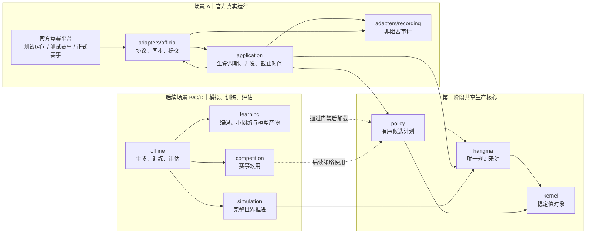
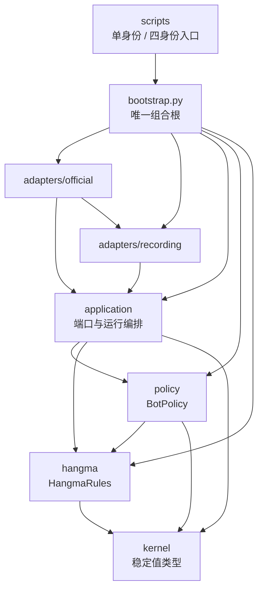
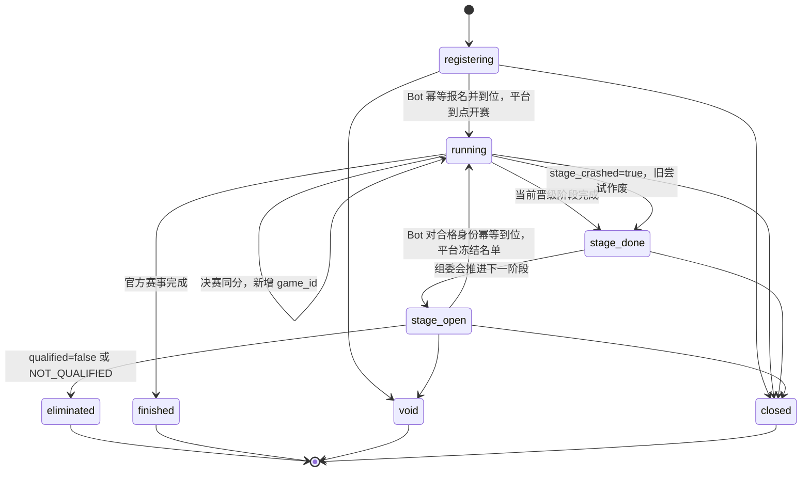
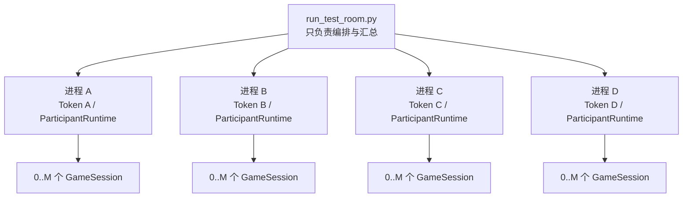
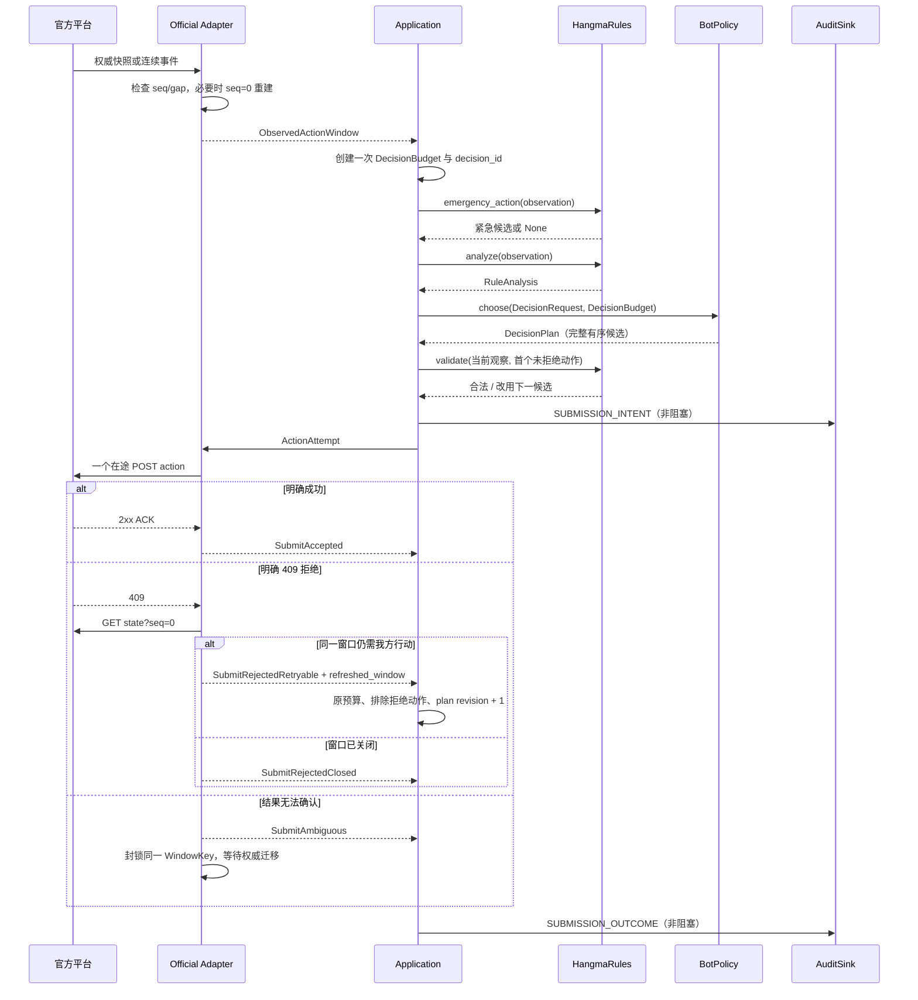
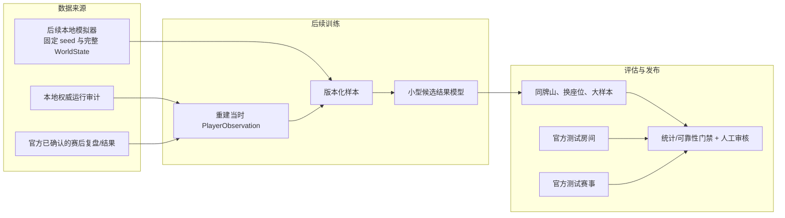

# 杭麻 AI Bot 架构与运行流程

## 2026-09-30 VIP 联合启发式实施更新

**当前实施依据为[固定框架合同](../review/vip-route-2026-09-30/FIXED-FRAMEWORK-CONTRACT.md)。**后文旧 P3 积分校准要求是历史研发路径，本更新取消该前置，不追改旧证据。

`hangma.route_structure` 负责白板用途约束的自然牌缺口；条件转移继续负责资格和结算。新 `VipRouteScoringView` 只投影这些规则事实与牌局上下文，候选通过 `score_actions` 联合排名全部动作。赛事压力仅留外层审计，不进入新视图；完整模拟世界只属于离线评估。候选执行复用现有受限执行器的新精确类型入口，不改变旧 `/4` 合同。

`hangma.route_hu_witness`提供只判局部给定摸牌胡资格的窄入口，复用手牌成胡、动作族、爆头生命周期及结算，省去无关进张与公开历史重扫。策略不自行实现胡法，原完整见证继续作为对照；仅胡入口不产生可推进后态。事实图保留全合法根与全部相容补牌分支，提速不通过删分支完成。

严格研究包装显式暴露异常／弃权／超量，不能吞成合法保底后记新策略成绩。研发机械缺口仍需修复；有界局部未来见证标范围，不冒充完整公开事件链。线上配置与保底维持原样，部署门另过。与[技术方案](hangma-ai-bot-technical-plan.md)同步。
离线进化现有独立 `vip-route-eoh/1` 生成档：i1初始化、e1/e2多父探索、m1逻辑修改、m2数值常量修改；论文m3尚未接通，不混称论文全部演化算子。生成思想、机制声明与受限评分源码，装载不代表准入。`offline.vip_eoh_probe` 从封存的行动前观察分层抽取开发窗口，给所有候选共享同一事实图；只按完整比较中的真实首选变化留行为信用，保留失败分母。`offline.vip_route_development` 冻结新H/M池与同墙四换座A/C完整8局，固定物理起庄0，逐动作核验C自己完整评分；行动前当前胡机会与已发生公开结算分账，不用赛后胜负倒填机会。完整反事实机会题与独立确认仍是下一门，逻辑时钟不证明官方时限。入口及审查见[T3开发预登记](../review/vip-route-2026-09-30/T3-NATURAL-DEVELOPMENT-1.md)与[独立审核](../review/vip-route-2026-09-30/T3-DEVELOPMENT-INDEPENDENT-REVIEW.md)。


2026-09-29 规则事实绑定修订：吃／碰后继分支事实使 `hangma` 完整源码摘要变化，原 R18 v2 冻结包在当前主线拒绝装配。组合根现在为同一 R18 v2 评分源码装配独立的当前规则绑定包，并要求运行配置显式填写新包 ID；旧包及旧 ID 保持历史身份，旧 `r18_integrated_positive_v1` 包在当前规则下继续失败关闭。32 对同牌山完整桌的旧／新规则逐位对账与 1,048 条官方胡／番金例见[G194 绑定审查](../review/freematch-deep-dive-20260925/G194-R18-V2-RULE-BINDING-RESULT-2026-09-29.md)。本地装配成功仍需实网时限、SSE、测试房与测试赛事验收。

2026-09-25 测试房与测试赛事新运行模板统一使用 SSE 通知＋直接 `seq=0` 权威快照；
新局无事件的 `settled` 边界单独挂一次旧游标长轮询，
并关闭普通弃牌缓发；测试房多策略战役的四身份共享同一接线配置，测试赛事沿用
`run_participant.py` 的单身份配置解析和组合根。此前两轮 SSE 实网验收只覆盖
`weighted_heuristic_v2`；R18 v2 已完成一轮四席测试房，测试赛事门禁仍须另做。流程与身份见
[运行指引](operations.md)和[后续执行清单](../review/r18-four-arm-evaluation-2026-09-23/NEXT-STAGE-2026-09-25.md)。

新测试房的赛后链为 `official/events.json` → `offline.postgame` →
`datasets/derived/<pool>/official/<room>/official/` 与单局分片 → `datamart/build.py`。
入库时按官方 `seats.user_id` 关联身份、按冻结策略映射关联本方策略；官方身份晚于单局分片到达时，
仅回填原先未知的座位，保留已有归因和结算。数据集源摘要同时涵盖座位、策略映射与排行榜标签，避免测量修正未被 `--check` 察觉。已结束的 `week.prev.top` 前四独立登记为“上周榜”，与实时“周榜”分开。

2026-09-23 R18 累计机会能力候选完成第二版接线。`r18_integrated_positive_v1` 保留既有测试房、
测试赛事与自由赛冻结包；用户另行批准 `r18_integrated_positive_v2` 接入测试房、测试赛事、自由赛与正式赛事。
两个发布策略各有独立包 ID，组合根在构造时核对内嵌候选源码、完整 `hangma` 规则源和分值分析依赖摘要，
将候选身份、规则范围、允许模式及证据摘要写入 `RUN_MANIFEST.policy_release`；记录端为该受控子树的严格
SHA-256 保留原文。每份 R18 真实网络配置必须显式写入与策略匹配的 `expected_policy_release_id`；
测试房启动器只向使用该包的四个隔离身份透传。缺失、旧摘要、混用两个包或普通策略误带该字段均拒绝启动。
最低已适配官方指南为 v34，房间规则必须是 `hangma-mvp-v10-public-counts`、底分 1、
`YouCaiBiKao=false`，不符即停止该候选会话。`action_value:*` 离线研究名仍不能进入网络入口，默认策略不变。
此次接线不改变规则计算、合法动作、提交或降级数据流。P73 对 v2 的四模式配置完成无网络装配，
并对 409 个冻结请求核对发布包与研究父代的完整计划。真实测试房、测试赛事与正式赛事运行结果仍须逐项审核；
配置可选不等于已验证真实赛事效果。
P74 的真实测试房尝试发现 macOS 系统代理使 `httpx` 对官方内网的 `guide/version` 握手超时；
官方适配器现对 `insecure_hosts` 中的固定内网主机直连，其他主机仍遵循原有代理环境。
直连后平台明确返回旧测试房 `TOURNAMENT_NOT_FOUND`；这属于目标房失效，尚无 v2 测试房牌局结果。

2026-09-17 坐隐完整动作评分与进化框架 v4（**工程骨架已落地；行为合同经完成度评审判定有 9 项 P1 缺口待修**，见 review/llm-guided-heuristic-route-2026-09-15/REVIEW-V4-COMPLETION-2026-09-17.md 与 R0—R7 修复计划）：新候选由固定骨架调用单一 `score_actions`，拥有最终动作分数；V2 仅为冻结对照，旧增量接缝保留历史用途。`hangma` 生产有界规则事实与合法后续分支，`policy` 消费可见事实/参考代理形成完整排序，应用层继续负责保底、原截止与提交。离线 R-E 的 I1/M1 生成代码；合法前缀条件阶段与正常开局阶段分别评估真实终端目标，结果进入整体/专长/探索档案，确认集与搜索隔离。AIVAT 仅独立旁路，R-F 可选；不新增训练模块或第二套规则。新类型、阶段中途续打和分析配置接线尚待落码；线上四个外部端口不变。现行合同、图和迁移顺序见[实施方案](../review/llm-guided-heuristic-route-2026-09-15/SEARCH-SPACE-REDESIGN-2026-09-16.md)，历史说明仅适用于各自版本。

2026-09-16 坐隐第三阶段评估设计修正（待实施）：规则覆盖指导路径评分和定向实验；离线驱动通过共享模拟器生成合法场景、相容隐藏世界并配对续打，条件效果参与开发候选留存，自然完整桌赛与阶段评估检验整体目标。四价值族补路径进展、组合及兑现代价，规则事实仍由 `hangma` 唯一生产，`policy` 只消费玩家可见信息；研究执行范围与全局准入/发布资格分开。线上端口尚无新增改动，LLM 仍仅离线使用。详见[新评估合同](../review/llm-guided-heuristic-route-2026-09-15/PHASE3-RULE-AWARE-EVALUATION-2026-09-16.md)。

2026-09-15 候选装载接缝与评分上下文规则状态：`policy/heuristics/` 下的候选经**静态字面量注册表**装载（无自动扫描、不是插件系统、不是给 LLM 的自动上线通道），适配器在 V2 评分之后追加有界分项且不复制决策管线；`EvaluationContext` 追加 `chain_count`/`baotou`/`wealth_count`/`chain_piao` 四个**带默认值**字段（纯接入、无新增规则计算）。候选身份 = 模块 + 有效参数 + 源码指纹，实验产物另落 `sitin-candidate-manifest/1`；**身份里不含语料**，因此准入记录另写 `corpus.sha256` 且评估入口必须声明并比对语料，离线执行任意候选代码须有墙钟上限与进程组终止。四个外部端口与默认策略名不变，V0/V1 评分行为不变，线上不含 LLM 调用；详见[接口增补](implementation/interface-contracts.md#48-候选装载接缝与评分上下文规则状态2026-09-15)。

2026-09-15 坐隐第三阶段规划修订（待实施）：离线生成先用 I1/M1 与反馈构成最小闭环，规则前后事实和阶段评估合同可同时推进；桌赛均值只作开发代理，最终按完整阶段目标筛选。候选装载/构造/执行统一受监管，确认信息与搜索隔离；势差仅作结构约定，不代表单步评分器策略不变。`faeac8de` 的第二阶段修复先核验再扩大执行；默认策略和现有外部端口保持现状。详见[第三阶段详细规划](../review/llm-guided-heuristic-route-2026-09-15/PLAN-REVISION-2026-09-15.md)。

2026-09-14 吃供牌修复：官方 `chi.tile` 经解析与投影进入 `PublicEvent.claimed_tile`，随玩家观察、单局封存及审计编解码保存；模拟和离线转换使用同一可选字段。唯一规则模块优先读取该明确供牌，缺字段仍按连续历史或唯一牌河交集判断。局部缺史不再丢掉已收到吃事件中的证据；未知或冲突仍保守降级。字段不含暗牌，不增加网络请求或新模块；同步基线、动作预算和学习特征布局保持原契约。详见[接口增补](implementation/interface-contracts.md)和[契约回归](../tests/contracts/test_chi_claimed_tile.py)。

2026-09-30 模拟终局公开投影修复：模拟器仍单独持有 `WorldState`，策略只读本座 `PlayerObservation`；模拟 `round_ended` 与 `game_ended` 已有的公开结算字段现在经 `public_history_for` 进入 `PublicEvent.result_*`／`final_scores`。这使离线条件路线能消费已发生的他座胡结果核对终局，而不读取他家暗牌推测未来胡。字段合同见[接口增补](implementation/interface-contracts.md)，回归见[模拟信息权限测试](../tests/simulation/test_info_permission.py)。

分牌型事实进一步包含各自有效牌集合，经原 `CandidateFacts` 和审计通路交付；新增集合缺证据只做局部降级，禁止影响稳定V2的综合事实。计算仍在同一规则循环内，详见[分牌型推进契约](implementation/pattern-progress-v2.md)。

2026-09-09 大牌路线实验：`hangma → CandidateFacts → policy` 的现有通路增加同一等待手牌的普通型、七对分牌型向听，审计编解码同步保存，旧记录缺字段仍为未知。没有新增牌型算法或跨层依赖。独立候选仅在正式赛 `YouCaiBiKao=false` 下研究早期路线取舍，默认策略不变；见[目标与阶段计划](implementation/big-hand-policy-plan.md)。

2026-09-09网络预算修订：应用层从有效窗口先扣固定100毫秒POST网络余量，再分配计算；官方出口及查询倒推共享该默认常量，以截止取最小值避免重复扣除。409、队列等待和弃牌缓发不能延长最迟发送。四入口默认接线，审计保存预算版本；外部接口和策略评分不变。两端钟差及state限频问题仍待独立修复，本项不代表实网验收通过，详见[方案与验证](../review/fixed-network-budget-2026-09-09/README.md)。

2026-09-09 当前修订：本地规则为 `hangma-mvp-v10-public-counts`，指南仍为 v27。`hangma.public_tile_counts` 从玩家观察的牌河、副露与公开历史去除同张重叠；供牌无法证明时，沿用逐候选 `ANALYSIS_FAILED`，不伪造剩余张数。模拟投影保留吃的完整组合和事件类别，与官方投影提供相同证据。公开接口形状及 V2 权重不变；快照中的旧“无圈”也须推进连续后缀，不能忽略之后新弃白。验证与单批测试房配置见[修复记录](../review/public-tile-counts-2026-09-09/README.md)。

**2026-09-18 口径修订**：平台自 2026-09-14 前后起**不再**把被吃/碰/明杠领走的弃牌留在快照牌河中（2026-09-10 之前的快照仍保留；官方指南更新日志 v1—v34 **没有**这条记录）。因此公开计数改为「**逐副露实证 + 牌张守恒守卫**」：只有当供牌被证明仍在供牌者牌河中（官方 `chi` 的 `claimed_tile`，或「紧邻弃牌→鸣牌」的事件配对）才扣一次重叠；守恒等式 `Σ手牌+Σ牌河+Σ副露+牌墙−136` 判定为「已移除」时整批否决扣除；**无证据不再降级为未知，改为不扣重叠的保守数值**（公开可能多算 1、剩余少估 1）；只有输入自相矛盾（同码副露超物理上限、实证重叠超过河中实存张数、同一快照内证据互相矛盾）才返回 `None` 并沿用 `ANALYSIS_FAILED`。合法动作、立即胡与紧急候选都不读这份计数。证据链见 `review/test-tournament-20260917/probes/discard-river-accounting-evidence.md`；`ruleset_version` 字符串暂未变更（是否升号影响离线产物绑定，待定）。

2026-09-09 v9 规则对齐：官方适配器把 v26 新增的 `god.god_discarder_seat` 转为 `RulePublicState.catch_play_owner_seat`，以 `snapshot_seq` 为事实锚点；`hangma.catch_play` 统一处理当前权限、连续后缀的换主与关圈，旧报文缺字段时保留有证据的恢复路径。规则、保底、提交复核与策略共用这一事实，模拟器通过唯一推进器给圈主开放吃碰明杠，恢复后不沿用旧圈主权限。v24 跳过整个圈内响应的兼容行为已被官方 v26 修复替代。类型编解码、消费者和测试同步见[接口增补](implementation/interface-contracts.md#官方圈主事实与v26响应修订2026-09-09)及[对齐记录](../review/catch-owner-v26-2026-09-09/README.md)。

2026-09-07 制品更新：运行审计推荐定位到 `artifacts/sessions/<session>/audit/`，四身份仍各自拥有记录器。完赛后 `audit_tool.py postgame` 调用 `offline.postgame` 封存证据、转换数据集，并复用唯一规则模块核验终局及观察转移，不进入线上主循环。下载归 `adapters.official.archive_download`，公开客户端由 `bootstrap` 装配；本机归并和旧布局恢复归 `offline.artifact_store`。冻结接口不变，缺失信息不补写到历史 `PlayerObservation`。路径和完整性边界见 [操作指引](operations.md)。

> 状态：当前目标架构 v0.5；第一阶段接口基线 v1.1（2026-09-04 集成阶段契约收口：`SubmitRejectedNoRefresh`、候选牌效事实 `CandidateFacts`、kernel 裁决与审计词表，见接口协议 §4.1/§5/§7.1/§10.1）  
> 更新日期：2026-09-04  
> 适用范围：官方测试房间、测试赛事、正式赛事，以及后续模拟、训练与评估  
> 关联资料：[接口协议](./implementation/interface-contracts.md)、[第一阶段验收](./implementation/mvp-acceptance.md)、[统一术语表](../UBIQUITOUS_LANGUAGE.md)、[官方赛事流程](./official-tournament-flow-2026-09-03.md)

## 1. 结论与图例

海选首版设计修订（2026-09-07，提案未实现）：采用晋级压力与目标分值驱动的启发式策略，不训练海选概率模型，桌赛重采样与后缀迁移退出首版。规则能确定给定结算后的排名；参考追分参数与路线取舍通过可控实验验证，不宣称真实海选概率已校准。详见[首版方案与算法依据](./implementation/qualifier-utility-v1.md)。

拟议运行数据流：`adapters/application` 提供榜单、进度、身份与记账依据；`hangma` 提供合法候选、立即结算和有界成胡路线；`policy` 调用具体 `competition` 生成压力及判断结果达标，最后由同一个 `BotPolicy.choose` 输出计划。`competition` 不读手牌、网络或磁盘，`hangma` 不读榜单；记录器保存事实、目标与选择证据。`offline` 使用模拟器公开接口注入明确标记的赛事情景，以测试房间和自由赛检验运行。首版实际交付新的候选策略；只有最后机会证据完整时才允许改变立即胡优先级，缺失则参考追分或基线降级。类型扩展尚未冻结，默认策略未切换，图与接口需求见[方案 §4—5](./implementation/qualifier-utility-v1.md#4-模块结构与依赖需求)。

本方案实施先走离线最小路径：固定目标配置 → 规则路线与新策略 → 现有模拟器完整续打，由薄 `offline` 驱动评估；这一层不等待官方适配、真实进度或完整全榜。再接人工赛事事实 → competition → 同一策略，最后接运行事实与审计。新增功能在独立分支/工作区开发，基础策略可继续迭代，每批实验固定所消费版本；新策略的赛事调整生效时接管旧桌内名次风格，关闭/未知则恢复原计划。增量契约、合入顺序与限制见[方案 §8.1—8.4](./implementation/qualifier-utility-v1.md#81-最小评测先分两层不等待线上赛事适配)。

2026-09-08 字段核对：首轮只给规则候选补一个条件分值/路线载荷，规则分析补有界工作量选项，新策略消费模式、目标净增积分、压力档位这 3 项目标输入；离线驱动接出模拟器已有的单局番数与结算。模拟器、模型和 choose 公开接口不扩展。榜单闭环再补 CompetitionContext 的本人身份、可靠剩余单局数、榜单可用性 3 项，以及规则侧的参考积分尺度；来源、嵌套字段和未知语义见[逐字段清单](./implementation/qualifier-utility-v1.md#54-从实际决策反推的字段增量与数据来源)。实时最后机会所需的身份映射、记账边界和其他结果封闭仍待实际数据证明，不能用新增字段代替事实。

2026-09-08 并行开发补充：新增跨线接触面先通过共享契约提交收口，再由规则、模型、策略与赛事评估分别实现。模型提供明确终点/基准下的结果估计，启发式提供战术评价，competition 提供目标条件，policy 统一选择；确定规则、条件路线、预测和启发式分不能混为同一种收益。policy 内部评分接缝不增加第二个线上入口，模型仍是海选首版的可选后续能力。契约版本与实验实现组合分别固定，详见[公共契约清单](./implementation/qualifier-utility-v1.md#85-多条工作线并行前的公共契约)。

公共改动先按[接入清单与冲突图](./implementation/qualifier-utility-v1.md#86-公共接入冻结清单与并行冲突图)指定唯一集成人：类型、编解码、规则入口、应用预算和装配、离线公共驱动集中修改，路线/目标/新策略/实验指标实现各线独立维护。增强受原窗口预算约束，应用候选修复保留仍有效的新事实；模拟器与 HTTP 限流不因赛事功能新建协议。现有类型和旧策略继续受兼容约束，未完成真实样例与契约用例的部分不标记为已冻结。

第一阶段把复杂度集中在六个确有必要的模块：稳定值类型、唯一杭麻规则、启发式策略、赛事运行编排、官方适配器和审计记录。模拟、训练、小型模型和复杂赛事效用保留为后续目标，但当前不创建空接口或让其进入线上依赖。

- 实线箭头表示运行时调用或数据传递，方向从调用方/来源指向被调用方/去向。
- 虚线箭头表示后续阶段的离线产物发布，不属于第一阶段或每次决策的必经路径。
- `adapters` 隔离网络和磁盘副作用；`hangma` 与 `policy` 不直接访问官方 HTTP。
- 真实运行只给策略[玩家观察（PlayerObservation）](../UBIQUITOUS_LANGUAGE.md#状态与信息权限)，不得给他家手牌、未来牌墙或赛后结果。

## 2. 场景边界与共享核心

箭头表示各场景使用同一生产核心；“后续”节点没有进入第一阶段代码路径。



### 2.1 三类官方环境

| 运行方式 | 身份与并发 | 第一阶段用途 | 不能替代 |
| --- | --- | --- | --- |
| 官方测试房间 | 一次 4 个 Token；每个身份按 `active_games` 运行最多 `config.M` 场 | API、杭麻规则差异、1/3 秒窗口、并发、恢复和赛后数据 | 完整多阶段生命周期或固定牌山策略 A/B |
| 官方测试赛事 | 赛事方提供测试身份；外显协议待实测固化 | 报名、到位、海选、阶段切换、淘汰/候补、重赛和终态 | 大样本策略显著性评估 |
| 正式赛事 | 一个正式 Token；同样按 `active_games` 运行最多 `M` 场 | 只运行通过门禁的稳定版本 | 训练或高风险实验 |

官方测试赛事已经提供，因此是第一阶段发布门禁。官方只确认赛后复盘能力时，本地运行审计是实时决策证据的主要来源；不能预设正式赛事存在未确认的牌谱下载端点。

## 3. 模块边界与依赖方向

箭头表示“调用方依赖被调用方”。适配器实现应用层定义的端口，因此源代码依赖方向从适配器指向应用契约；运行时数据仍从平台流向应用。



### 3.1 第一阶段模块表

| 模块 | 公开面 | 隐藏的复杂度 | 禁止承担 |
| --- | --- | --- | --- |
| `kernel` | 动作、窗口、观察、已观察赛事上下文、不可变配置 | 类型约束和稳定动作键 | 网络、规则算法、策略、完整世界 |
| `hangma` | `HangmaRules` | 合法动作、胡牌、向听、有效牌、财神和结算；独立紧急路径 | HTTP、磁盘、时钟、模型 |
| `policy` | `BotPolicy.choose()` | 启发式评分、有序候选和超时降级 | 声明动作合法、提交 HTTP、读取 `WorldState` |
| `application` | `ParticipantRuntime`；赛事/场次/审计端口 | 报名到位、参赛者终态、最多 `M` 场监督、预算和明确拒绝降级循环 | HTTP DTO、动作门、牌型算法 |
| `adapters/official` | 实现赛事和场次端口 | 已审查指南 v15（快照 2026-09-05；v13 在线分桌审查结论见 `doc/official-tournament-flow-2026-09-03.md` §6.6，v15 自动匹配零影响见 §6.7）、每 Token 传输/限速（state 轮询 16/s 每用户聚合）、状态投影、序号恢复（含 v10 跨局 gap 快照吸收）、动作门 | 组装决策请求、策略评分、赛事何时退出 |
| `adapters/recording` | 实现 `AuditSink` | 队列、JSONL、脱敏、汇总和验证 | 业务判断、重试和阻塞动作 |
| （上游依赖边） | `adapters/official → adapters/recording` | RAW_PROTOCOL_STATE 原始事件经 build_state_response_payload / build_action_response_payload 落审计（2026-09-05 起，errors.raw_text 载体语义见接口协议 §7.1） | — |
| `bootstrap.py` | 组装函数 | 具体实现选择和配置注入 | 规则、生命周期或协议逻辑 |

### 3.2 四个冻结接缝

只冻结：

1. `TournamentSessionPort`：官方会话与生命周期 Fake；
2. `GameSessionPort`：官方场次与保存响应驱动 Fake；
3. `BotPolicy`：加权启发式与紧急保底；
4. `AuditSink`：JSONL 与内存测试记录器。

`HangmaRules` 当前只有一个真实实现，不人为增加 Protocol。`OfficialTransport`、请求调度器、限速器、`ProtocolSyncState`、`ActionGate` 和 `StateProjector` 都是适配器内部细节。接口类型和兼容规则见[第一阶段接口协议](./implementation/interface-contracts.md)。

### 3.3 后续模块边界

MVP 后按实际任务创建目标模块。2026-09-05 的[并行契约](./implementation/parallel-contracts.md)已启动 simulation/offline 设计，详见[施工导航](./implementation/parallel-workstreams.md)；competition/learning 待具体能力进入时实现：

- `simulation` 拥有 `WorldState`，每一步调用 `hangma`，禁止第二套规则；
- `competition` 只把结构化阶段事实和可能结果转换为赛事效用，不读取 HTTP；
- `learning` 统一训练/推理编码、网络、校准和模型兼容性；候选结果模型预测单局四家联合积分结果，阶段续局模型预测固定四人小组的阶段最终联合排序，两者分别训练与验收。`competition` 分别处理海选全榜目标、16 强/8 强组内前 2 和决赛名次，不由一个目标条件策略网络代替两个模型；
- `offline` 可以调用生产核心，线上代码不能反向依赖训练任务；
- 若线上确需模拟结果，只向策略提供深的 `OutcomeEstimator`，不得暴露 `WorldState` 或让策略直接操纵模拟器。

本批具体调用与文件契约见[parallel-v1](./implementation/parallel-contracts.md)。审计拥有原文整理与统一牌谱 codec；模拟拥有不透明 WorldState 和具体 SimulationEngine；评估只读文件并调用公开 frame/advance，策略仍仅消费 DecisionRequest。历史 check_hand 与完整世界 from_replay 分开；缺牌墙的官方记录不自动成为可分叉世界。

启发式后续施工按[三个候选版本计划](./implementation/policy-iteration-plan.md)：先可靠排序，再由 hangma 补齐 Pass 等待牌效，最后有限调参。V0/V1 源码保持冻结，线上默认 V0；hangma 已按本地语义 `hangma-mvp-v2-pass-progress` 提供响应 Pass 等待事实。组合根与离线装配使用显式旧视图保持 V0/claim_if_legal 的正常评分，审计仍记录原事实，V1 已兼容可信新事实。V2 以 `weighted_heuristic_v2` 接入原策略配置，复用 V1 非 Pass 评分并统一响应等待基准；策略接口和数据格式不扩展，策略不依赖离线评估器或模拟器。边界见接口协议 §4.3–4.4。

### 3.4 自动匹配入口（待实施）

用户已确认 `/api/match`。新增 OfficialAutoMatchSession 作为 TournamentSessionPort 的第二个真实实现，application 用专用自动房生命周期复用现有 GameTask/SSE/动作门。显式 AUTO_MATCH 初始化可有一次入席副作用；旧模式保持发现与 Token 作用域检查。匹配操作内协议重试归适配器，是否开始会话、运行场次、终局收尾归应用层，默认只完成一个自动房。详见[自由赛指南](./implementation/free-match-start.md)，不能把这段流程只归到可观测模块。

## 4. 赛事生命周期与终态

箭头表示官方赛事状态变化；组委会推进下一阶段属于平台外部行为，不是我方程序的人工参与。



必须区分两个概念：

- 赛事终态只有官方 `finished/closed/void`；
- 参赛者终态还包括当前身份被淘汰、认证失败、未知破坏性指南版本或目标赛事错配。

因此 `stage_open + qualified=false` 正常结束当前身份，但不宣称整场赛事已经结束。`active_games=[]`、`stage_done` 和 `stage_open` 都不是自动退出条件。每次进入 `running` 都重新发现 `active_games`；动态降档、重赛和决赛加赛可能出现新 `game_id`。

`stage_crashed=true` 时关闭旧场次任务，以 `stage_attempt_id` 标记作废记录，等待新尝试。旧尝试默认不进入训练标签或赛事效果统计。

## 5. 测试房间四身份与 `M` 场并发

箭头表示启动器创建子进程；每个子进程内部再按当前身份的 `active_games` 创建场次任务。



`M` 不增加 Token 数。第一阶段固定采用四个进程，复用正式单身份入口；不做同进程多租户、共享模型或复杂资源编排。每个Token独立拥有HTTP连接池和身份审计目录；同一用户的各场共用state发送账，`/state` 429只让被拒查询按原预算退避重排；各场及赛事控制通道分别拥有HTTP槽和OTHER冷却，每场另有动作门。具体额度见第7节。

## 6. 一次真实动作窗口

箭头表示调用；409 分支可以在原截止时间内回到规则/策略，但任意时刻只有一个在途 POST。



安全语义不是“每个窗口只发一次”，而是：

1. 同一场任意时刻最多一个在途动作 POST；
2. 只有官方明确确认未执行，并刷新确认同窗仍开放，才能换下一候选；
3. 409 后复用原预算，不能重新获得完整窗口；
4. 网络结果不确定时不追加动作；
5. 到保底截止时间使用已经准备的紧急候选，到最晚发送时间后不再 POST。

紧急路径为：响应窗口过；抓打圈内非圈主或归属未知时打刚摸牌（包括白板）；圈主及普通出牌从右优先选择非财神，没有非财神才打白。单列摸牌按手牌数量识别并视为右端，官方已含摸牌的手牌保留原序。该保财偏好是本地策略选择；紧急路径只扫描牌序与必要的归属证据，不计算飘或牌型。

2026-09-08 抓打圈修订使用 `hangma-mvp-v7-catch-owner`：`hangma.catch_play` 根据连续可见弃牌，或与当前权威牌河全部弃白的完整对账，统一确认最新圈主及开圈 seq。规则、保底与官方提交出口调用同一解析；全局原始标记不改写。模拟弃白原子换主，其他家弃非白保持、当前圈主弃非白结束，摸牌和杠补不结束。公开历史保留他家摸牌事件的序号但隐藏牌值。圈主吃碰须已有响应窗口，模拟开窗时序仍待对拍。全部语义与证据边界见接口协议 §4.6。

2026-09-08 增加可选 `weighted_heuristic_v2_white_guard`：组合根将 `WhiteDiscardGuardPolicy` 包在原 V2 外，只在本人出牌、`baotou=False` 且存在未拒绝的合法非财神弃牌时，向 V2 提供过滤普通弃白后的输入副本。原始规则分析仍用于审计和最终复核；可飘状态及白板唯一可用时保留弃白。共享保底行为以本地版本 `hangma-mvp-v6-white-guard` 区分，V0/V1/V2 评分源码和默认策略名保持原样。行为与兼容退路见接口协议 §4.5。

同日新增测试房专用 `catch_play_probe`：沿用完整规则与提交路径，只将 V2 计划中的合法弃白、响应鸣牌优先级提高，用于主动制造抓打圈并验证圈主权限。四身份仍是四个隔离进程，配置仅允许 `test_room`；正常策略不自动加载探针。使用既有审计记录分开核验开窗与动作裁决，不将规则诊断样本当作策略强度证据。见接口协议 §4.7。

2026-09-08 v24 测试房收口：在圈主确有碰牌形的两个时点，官方仍于下一序号直接摸牌。`hangma-mvp-v8-catch-windows` 因此在弃牌后抓打标记仍生效时跳过模拟响应窗口；圈主弃非白关圈后恢复普通响应。线上仍消费实际官方窗口，不主动合成窗口或发送无窗口吃碰。该修订属于推进时序，不改变财飘计番；普通圈实测与财飘组合的未覆盖边界见[实测报告](../review/piao-window-alignment-2026-09-08/live-t_fee4ab73c089.md)。

## 7. 状态同步与请求资源

**2026-09-24 当前 SSE 验证模式：**运行配置显式设置 `sse_enabled=true` 后，两个组合根均接通 `/notify`；同场不挂 `/state` 长轮询，运行清单记 `official_sync_mode=sse_only`。SSE 帧只提供已观察水位，`last_seq` 仍只随 `/state` 权威响应推进。已消费普通弃牌后的 `seq +3` 碰窗走满组、已接受的本人普通弃牌回显，以及已确认吃窗走满后可确定的他家摸牌，可暂缓读取；普通弃牌是否可暂缓以提交前当前观察判断，不能依赖可能停在旧吃窗的快照。紧跟已甄别 `+3` 走满组的 `+2`，仅当固定流程可确定下一摸牌者是对手时，按“吃窗走满＋他家摸牌”暂缓读取；其他 `+2` 与单独的碰/吃位帧立即读取。**需读取的帧和本人动作自唤醒直接取一笔 `seq=0` 权威快照**，不再先取增量再按条件补快照；初始建局、边界、通知沉默探针、缺口与 409 恢复同样取快照。快照重建当前合法动作所需的牌面、阶段、官方 `god.baotou` 与 `god.chain_count`；连续运行中的精确链内飘白数由已确认本人动作和相邻快照核对，不以补史 GET 作为当前决策前置条件。快照不保证附带已跳帧的事件明细，因此此前“下一次查询逐事件核对”的能力在直接快照路径下仅于报文附带相应事件时成立；缺少明细要记为不可核对，不能记作已验证。局间 5 秒固定停顿后的静默探针错开到 5.25 秒。第三、四轮实网表明 SSE 帧、自唤醒及静默探针排队可超过 1 秒；这些可能发现动作窗的查询按恢复优先级调度，但单纯提权仍有 11 个规则确认的合法漏窗。第五轮将完整吃搭用于保守暗牌超集的鸣牌兴趣预过滤，并在三条碰窗超时已权威确认、下一摸牌者为对手时暂缓同一周期的 `+2` 吃窗走满＋摸牌帧。四席 M=10 复测结果见实网复盘。通知流终局返回可恢复故障，不在本场切回长轮询；长轮询保底待本轮 SSE 实测后设计。未显式开启的旧配置保持 `state` 路径，避免修改既有运行记录的语义。该模式仍是验证模式，不能仅凭一轮成功认定已通过 M=10 可靠性门禁；详见[容量与文法依据](../review/r18-four-arm-evaluation-2026-09-23/SSE-HYBRID-QPS-DESIGN-2026-09-24.md)和[实网复盘](../review/r18-four-arm-evaluation-2026-09-23/SSE-LIVE-M10-2026-09-24.md)。

**2026-09-25 局间修订：**上述“同场不挂长轮询”和“5.25 秒探针”是旧实现。新 R18 v2 自由赛的 20 个我方新局首打窗口中有 5 次被官方超时模切；新局发牌没有 SSE 帧，低优先级探针在十桌共享额度下未及时发出。收到 `settled` 后，现在从已消费游标挂跨局长轮询，由官方 v31 新局发牌唤醒并返回 `gap` 全量快照；如果旧游标尚欠结算事实，先对齐旧状态，再继续挂起，故一次边界可能有两笔 GET。观察到本人为公开庄座时用 `DRAW_WATCH` 优先级，其他座位仍为 `POLL`。其他 SSE 活跃阶段继续直接 `seq=0`，运行清单的 `sse_only` 表示通知主模式，不表示没有局间长轮询。此修订须以新 M=10 房的官方牌谱验证本人跨局首打超时为零，并同时检查 429、其他一秒窗口和请求队列。

**2026-09-25 自由赛再修订：**上一段的 `DRAW_WATCH` 只代表已实测的旧版。四席独立 Token 测试房经更正检查器复算仍为 70 个跨局首弃牌窗/0 超时，但单 Token 十桌真实对手自由赛有 1/14 超时：结算态已确认本人为下一局庄家，持续高优先级状态请求使该场长轮询在发牌前未获准发送。当前源码把这种**本人庄家**局间查询提为 `RECOVERY`；他家庄家仍为 `POLL`，16/1.05 秒硬限额不变。检查器现按同局事件合并并关联非紧邻弃牌超时，避免官方先记他家摸牌造成假阴性。提权仅通过本地回归，**尚无实网复测**，不能据测试房一例宣布接线发布门通过。[自由赛复核与移交](../review/r18-four-arm-evaluation-2026-09-23/R18-V2-SSE-FREE-VALIDATION-2026-09-25.md)。

**2026-09-29 响应窗查询排序修订（待实网验证）：**自由赛原始审计确认，权威碰窗过了最迟安全取态时刻后，新 SSE 水位触发的 `current_state_sync` 原先没有发起截止，与其它无期限 `RECOVERY` 请求同档竞争；两次父代首选非 `pass` 的碰/吃窗口均在约 0.31–0.35 秒排队、`/state` 429 与局部退避后失窗。若已见的官方碰窗截止、座位关系及保守鸣牌兴趣表明**下一吃窗可能涉及本人**，只为原本就需发送的一笔权威 `seq=0` 查询预留由旧碰窗截止推得的最迟安全发起时刻，使调度器先于无期限查询服务它；更早的真实截止仍优先。SSE 帧仅有序号，不能作为新阶段或合法动作事实。若该期限被 429 或排队耗尽，立即取消预留并继续无期限现状同步，因为新帧也可能是另一张弃牌的新碰窗，不能等待假定的吃窗结束。共享 `/state` 硬额度、单场在途限制、权威快照、缺口重建和动作门不变；此改动不增加基础查询数，也不能单靠本地测试保证消除服务端 429。[逐笔诊断与回归](../review/freematch-deep-dive-20260925/G272-SSE-RESPONSE-STATE-PRIORITY-2026-09-29.md)。

**2026-09-29 SSE 静默恢复修订（本地回归通过、实网待验）：**自由赛 `a_920ebd847493` 的赛后核对发现，八个官方有合法非 `pass` 候选的超时窗没有同阶段原始帧或权威快照；其中六个是 R18 首选非 `pass`。19:18:14—29 多桌 `/state` 同时出现 `UncertainTransportError`，通知流约 75 秒后才因读超时重连；查询恢复后，原本 2 秒静默探针仍跨过两个 1 秒碰窗。这是当前观察，不能据此断定断点在本机网络还是平台。场次适配器现以真实 SSE 新水位和当前权威快照判断活跃流健康：权威水位领先且距最后一次通知序号前进至少 2 秒时，后台释放旧流后主动换流；同一已证实落后故障最多两次、至少相隔 5 秒，仍落后则上交可恢复故障。若两边水位相等，8 秒无序号前进只预防性换流一次，同水位健康暂停即使超过 30 秒也不耗尽重连额度或上交故障；重复旧帧不能重置已证实落后的时钟。历史事件批次和终局不触发换流。仅当 `/state` 出现不确定传输结果且故障后 SSE 未追上权威水位时，临时以 0.75 秒静默探针补查；从首次故障起最多 20 秒，连续失败与重复旧帧不续期也不提前取消。所有查询仍通过原共享调度器服从指南 v34 的 16 次/秒/用户额度；十桌假传输回归的 1.05 秒滚动最大发起数为 16、服务器 429 为 0，真实房的零漏窗门禁仍待验证。

第五轮每身份 `/state` 已降到 8.60–9.04 次/秒，但两次合法首张弃牌碰窗仍未进入策略；审计追到 `ready` 后每 2 秒发现新场次的启动空档。测试房到位后及自动匹配入席后，在首批活动场次出现前，每 0.25 秒查一次 `/api/me`；房间详情仍按原 2 秒间隔检查，发现场次即恢复常规节奏。另有一处甄别修正：已权威确认三条碰窗超时后，即使旧快照阶段已过期，也允许在明确下一摸牌者是对手时暂缓同周期 `+2`；后续仍从已消费游标逐事件核验。这两项须经后续完整桌赛验证，不能由第五轮结果直接宣称可靠性达标。

第六轮扩大 `+2` 甄别后四席每身份 8.43–9.30 次 `/state`/秒，但 1.05 秒入队峰值仍达 20–21 笔，独立确认 7 个合法吃碰窗口未进入策略；第七轮开局 40 个“身份×桌”首次状态均在 `seq=0/1`，证实本房场次发现修复，稳态仍确认 3 个漏窗、峰值 21–22 笔。逐笔峰值分析发现，十桌共同贡献基础流量，少数桌在一秒内连续跨越多阶段；另有每身份 1,679–1,814 笔候选碰窗走满查询，被可能过期的观察阶段守卫挡住。第八轮以已消费弃牌事件和本地弃牌周期双重锚定 `+3`，每身份暂缓 683–1,328 组且官方逐帧核对无不符；但入队峰值仍为 20–22 笔，3 个合法吃窗仍因共享额度排队约 1.06–1.15 秒未进入策略。赛后把新锚点收紧为必须明确普通弃牌，尚未实网复测。未有锚点的首帧仍须读取，后续逐事件核验；该模式尚未通过零漏窗门禁。详见[峰值逐笔拆解](../review/r18-four-arm-evaluation-2026-09-23/SSE-PEAK-TRACE-R6-2026-09-24.md)。

2026-09-24 状态 429 恢复修订：长轮询 R4 完整房有 2,639 笔 `/state` 排队至少一秒，其中 1,637 笔未与 429 后停发相交；SSE R8 降到 63 笔，全部与停发相交。故 `/state` 被拒后不再默认冻结同身份全部桌：被拒查询释放本场槽，按有效 `Retry-After` 与本地退避取较长者后重新入队，其他桌仍按共享发送账领取额度；实际发送过的 429 仍记本地额度账，原始动作期限不延长。此改动尚未经完整桌实网复测，SSE 发布门禁仍关闭。逐笔来源见[队列根因复盘](../review/r18-four-arm-evaluation-2026-09-23/SSE-R8-QUEUE-ROOT-CAUSE-2026-09-24.md)。

2026-09-24 SSE 保底修订：活动阶段独立维护“最后一个推进水位的通知帧或成功状态查询后 2 秒”与“最后一次成功取得当前权威状态后 5 秒”两只时钟；重复帧和 keepalive 不重置前者，可跳过的新水位只重置前者。先到的时钟只安排一笔 `seq=0` 快照，成功后两只时钟重新起算。局间 `phase=settled` 不用 2 秒规则，沿用固定停顿后的 5.25 秒探针。普通保底以 `POLL` 低优先级排队；若新帧或本人自唤醒先到，未发送的保底撤销并由紧急帧查询接手，已发出的快照先消费，若其水位仍落后新帧再补增量。已知动作链短探针和响应边界仍用 `RECOVERY`。SSE 模式继续不挂长轮询；该修订只有本地回归，尚未取得新的四席 M=10 实网容量与零合法漏窗证据。

弃牌缓发与 SSE 是两个独立运行配置。`discard_pacing_enabled` 缺省仍为 `true`，显式设 `false` 可用于测试房、正式赛和自由赛；开启 SSE 不会自动改写它。`fixed_1000` 缺省档与测试房专用的 `quota_half_200_500` 档保持原语义，非测试房仍禁止实验档和额外长轮询重挂间隔。两个生产组合根均将缓发开关传到场次会话，并在运行清单记录实际选择。

2026-09-06 历史修订：两个生产组合根当时固定使用 `state` 长轮询与阶段边界查询，SSE 暂不接入。应用层单场主循环驱动同步、规则分析、策略选择和串行提交，不新增后台同步任务。低层 SSE 客户端保留供以后评估，运行 manifest 记录 `official_sync_mode=state`、`sse_requested` 和 `sse_effective=false`；当前可按上段显式开启 SSE。

每场适配器独立维护权威快照、`last_seq`、当前单局可见历史、当前窗口和动作门。快照更新牌面但保留已收历史；只有快照之后的事件更新牌面。`current_observation()` 是快照/增量投递及提交复核共用的观察入口。增量摸牌通过 `hangma` 按既有爆头和本次补牌来源推进生命周期；缺完整前态或来源会影响结果而未知时恢复快照。普通他家弃牌的连续增量可以直接交付碰窗口；副露、抓打和不能完整推导的响应资格仍由权威快照确认。

2026-09-08 用户共享state调度：同一user_id的所有game_id共用滚动一秒最多16次的实际发送账及state 429冷却，撤销每场2/s或1/s静态份额。每场仍最多2个在途HTTP，其中state最多1个，动作POST另由ActionGate保证串行；各场和赛事控制通道的HTTP槽、OTHER冷却独立。state最早在新建用户账一秒后发起，以跨过旧进程计数窗口；控制请求与POST不等。重新打开场次不重置用户账或重启等待。连接池按Token共享，默认64连接、48保活连接；不同用户的账本和冷却隔离。依据为2026-09-08抓取的指南v25，服务器内部计次算法仍未公开。

`hangma` 拥有同一套动作生命周期：吃碰继承爆头但不新增链，杠加一次链并继承爆头，杠补牌可继承或新进入；弃牌先用旧状态判飘，再更新听牌态，其他弃牌清链。v23 起四白同样按任意听判定，可与四白加番叠加。模拟、牌谱和官方增量调用这套规则；官方快照中的 god 原样交付策略，规则核验只报告分歧。详细证据边界见[规则清单](../src/hangma_bot/hangma/RULES_EVIDENCE.md)。

- `seq <= last_seq`：载荷相同的已保存事件幂等忽略；同序号载荷冲突恢复，迟到旧快照不得让水位回退；
- 序号缺口或 `gap=true`：不应用部分增量，`seq=0` 整体重建；
- 兼容未知事件：记录后继续；
- 未知关键事件：阻断决策并整体重建；
- POST 409：明确拒绝后整体重建，再分类是否可重新规划；
- POST 超时/断连/结果不明：进入 `AMBIGUOUS`，不得传输层重放。

未知类型不会因一次恢复自动变成可忽略。跨单局/阶段可没有新序号，进展判断同时检查 `round_no/phase`。轮询与边界同时完成时先消费已返回事件，不能由计时器丢弃它。响应表态绑定触发弃牌；新弃牌即使通过快照直接进入响应阶段，也不能继承旧 pass。

`PlayerObservation` 保存快照基线 `snapshot_seq`、已消费水位 `consumed_seq`、历史完整性及可空的 `chain_piao/gang_draw`。链未知不填零，杠补来源未知不当普通摸牌。规则模块核验有完整前态的简单 god 转移，输出 `god_mismatch` 或 `not_checked`；当前事实仍服从官方快照。v26 的公开圈主字段已补齐四座位权限依据；碰阶段显式 pass 对后续吃资格仍保留原有边界查询与实际响应身份复核。

窗口将官方 Unix 毫秒截止转换为单调时钟截止；同一窗口只能收紧。应用预算扣留发送余量，409 新快照也只能收紧原预算。仅有增量事件时不得借用旧响应阶段截止，估计时间明确标记。部署时钟偏差和真实网络尾延迟仍需线上测量。

修订策略及评审：[观察完整性修复策略](../review/official-adapter/repair-plan-2026-09-06.md)。离线 `observation_check.compare_observations` 比较已独立对齐的观察和参考，分别报告状态/历史差异及未检查项；线上不依赖该工具。

动作POST不等待state额度；有明确窗口的state请求按最迟安全发起时刻排序，未知事件发现按场公平服务。赛事控制请求使用独立资源域。调度仅属于官方适配器，应用层负责决策预算和任务监督；所有挂起请求均可取消。

2026-09-23 响应阶段延迟修订：生产组合根继续强制关闭 SSE。有鸣牌兴趣、且已确认进入响应阶段的场次，把等待下一阶段标记事件的 `/state` 长轮询标记为 `response_progress`，在无明确发起截止的查询中先于普通轮询领取同用户额度；同级仍按场公平。关闭 SSE 的完整续轮显示排队 p95 仍约 1.03 秒，单靠重排不足。第三轮曾试验在非紧急增量事件后等待最多 80 毫秒，但仍发生两次本地规则判合法的鸣牌漏发，已撤回这段等待。官方指南 v34（当日核对）的 16 次/秒/用户上限与 M=10 的实际查询需求仍冲突；时限门禁未通过。见[优先级续轮](../review/r18-four-arm-evaluation-2026-09-23/STATE-PRIORITY.md)与[短等待撤回依据](../review/r18-four-arm-evaluation-2026-09-23/STATE-COALESCE.md)。

同日继续定位：两处已确认漏发前，同用户 16 笔状态查询各在 177–219 毫秒内集中发出，此后 834–875 毫秒无许可；用于发现他家首次弃牌的请求仍以普通 `state_sync` 排队 936–954 毫秒。生产入口现最多即刻发放四笔状态许可，之后按 16 次/秒补充。新 M=10 房首批完整桌赛进一步证实：只在看见他家摸牌后保护查询仍会漏掉“过牌后摸打”与“无关弃牌后他家鸣打”，普通查询排队可达 1.0–1.6 秒。因此他家弃牌、响应标记、摸牌和副露之后，以及本人动作交付后的首个增量查询，都按 `discard_watch` 调度；已经出现新摸牌时，不再为旧响应快照安排边界查询。已知窗口请求的明确截止仍排在最前，动作 POST 不消耗状态额度。边界短路不再把令牌补充间隔误认为实际排队时间。此改动不增添 GET，SSE 继续关闭；[逐笔根因、实网失败窗口与待验证门禁](../review/r18-four-arm-evaluation-2026-09-23/STATE-BURST-ROOT-CAUSE.md)已记录。

同房第三批显示，上述优先级覆盖仍会让普通场次长时间排队：四席合计 195 次状态查询 429；按物理弃牌周期去掉 771 个旧快照重复窗后，规则可重建的非过候选漏窗仍有 21 个，朱雀审计还缺一桌，验收失败。重复窗源于本人已摸打后旧响应快照仍可重新投递，现已增加同步状态机守卫。当前第四批将所有活跃场的未知事件长轮询同级公平调度，并在首次 16 笔许可后加约 69 毫秒的同身份最小许可间距，以缓解持续突发和普通场饥饿；运行清单记录 `burst4-fair-paced-v1` 与 `state_min_spacing_sec`。已知响应截止与恢复请求优先级不变。四席完整实网门禁仍待核验，SSE 保持关闭；逐批原始证据见[根因报告](../review/r18-four-arm-evaluation-2026-09-23/STATE-BURST-ROOT-CAUSE.md)。

第四批四席各 10 桌、审计完整，429 降到 52 次，但仍有 22 个可重建的非过候选未进入策略，状态排队 p95 约 1.13–1.20 秒；M=10 门禁失败。带旧快照守卫的 M=6 对照房四席各 6 桌、审计完整，状态排队 p95 约 0.34 秒、可重建非过漏窗为零，但不能替代 M=10 验收。SSE 保持关闭。官方自动匹配默认 M=10，显式更小上限会返回 `NO_ROOM_AVAILABLE`；若坚持无 SSE，须进一步减少每局事件所需状态 GET，或由平台提供更高 `/state` 配额／较低并发配置，再按同口径复测。见[完整诊断](../review/r18-four-arm-evaluation-2026-09-23/STATE-BURST-ROOT-CAUSE.md)。

同日新房续测：期限保护已纳入真实令牌、发放间距和滚动账；对整秒估算过早的潜在鸣牌窗有条件补查官方截止。完整修复版四席各 10 桌仍有 12 个可重建合法非过候选未进入决策。广泛提高 `discard_watch` 的第三轮仍有 17 个漏窗；第四轮窄幅提高摸牌监听仍有 11 个，且普通 `POLL` 排队 p95 达约 15—16 秒。第五轮未完成即按用户要求中止；退回旧公平轮转版触发七个十桌并发回归失败，工作树暂存通过回归的第五轮试验实现，不视为已验收。完整桌审计显示十桌活跃需求约 13.9 GET/s，贴近本地 14.5/s 平滑上限，事件驱动查询几乎没有空回复；必须先按请求链重排并降低我方正常弃牌产生的圈速。M=10 门禁未通过，SSE 关闭。[根因与重排方案](../review/r18-four-arm-evaluation-2026-09-23/QPS-ROOT-CAUSE.md)。

### 2026-09-08 查询目的与额度生命周期

**共享调度不改变四个外部端口，也不把限频状态传给策略。**官方适配器用截止优先调度（`EarliestDeadlineFirst`，先发最早失去安全行动机会的查询）安排已知需求，并通过可取消的未来边界提示保留必要查询机会。提示不能提前发GET；同场过期目的被撤销并审计，随后只保留必要的现状或下阶段同步。普通新事件仍须查询发现，未来对手行为不能被预知。

state许可先预占，真正进入传输前才转为单调时钟发送记录。未发取消退预占，已发后的失败、超时和取消不退计次；本地发送时刻不等于服务器收包时刻。最迟查询发起与HTTP响应完成预算分开，后者仍受原始动作期限约束。peng→chi边界到点时取消并等待旧长轮询回收，已同时收到的权威结果优先消费，不让旧挂起请求占住唯一state槽。

2026-09-09已接入普通弃牌缓发（`DiscardPacing`，在查询繁忙时利用我方宽裕弃牌时间短暂等待）。默认对正常摸牌增量生效：同用户滚动state用量达到10次，且本机保守起点后1秒尚未到达、原预算仍有余量时，补足剩余时间；策略计算时间已经计入。快照恢复、重试、白板及特殊动作链跳过。等待不占HTTP槽或state额度，醒后复核窗口和收紧的发送截止。时间依据来自前次已确认状态的查询发起时刻，不要求快照有毫秒截止，也不依赖服务端钟差。SSE继续关闭。实现、取消契约及32个新模型场景见[缓发验证](../review/adapter-rate-identity-2026-09-08/discard-pacing-2026-09-09/README.md)；本地结果不等于实网收益。

2026-09-24 测试房实验可显式关闭普通弃牌提交缓发，同时给同一场连续的普通增量长轮询设置 50 毫秒最短“上次响应完成至下次发起”间隔。查询仍立即进入共享调度器，最早发起时刻与原有队列等待重叠；`seq=0` 快照、已知期限查询、他家摸牌后的高优先级监听和恢复查询不加此底档。默认间隔为 0，正式赛事与自由赛拒绝实验配置。审计运行清单记录生效参数，单次查询记录最早发起时刻；实网效果仍待测试房核验，见[试验记录](../review/r18-four-arm-evaluation-2026-09-23/LIVE-R7-LONGPOLL-50MS-2026-09-24.md)。

2026-09-24 综合房实验修订：50/120 毫秒两房均完赛但仍有合法鸣牌漏窗，不能将长轮询底档当作容量修复。新房四席统一使用 60 毫秒普通长轮询底档，并在 `timeout/pass` 响应或动作提交后豁免首次重挂。正常首答弃牌按首次见窗至提交的年龄等待至少 200 毫秒；同身份近 1.05 秒状态发送账达到 8/16 时至少 500 毫秒，原动作预算不足时跳过缓发。这些等待不占 HTTP 槽或状态额度，且不改变策略选牌。综合房四席各完成 10 桌、审计违规 0；排队 p95 降至约 1.01 秒，但状态 429 增至 22 次，仍有 2 个合法鸣牌机会漏窗，未通过自由赛门禁。实验参数仅允许测试房；自由赛和正式赛仍用稳定配置。见[综合房报告](../review/r18-four-arm-evaluation-2026-09-23/LIVE-R9-COMBINED-60-200-500-2026-09-24.md)。

2026-09-23 实验版改为按本机首次看见正常弃牌动作窗计时：至少等待至观察后 500 毫秒；共享状态查询队列拥堵时，目标最多延至观察后 1 秒。仅首次普通弃牌适用；重试、白板、补杠摸牌和其他特殊动作链直接提交。截止余量不足时退回 500 毫秒或立即提交，等待后重新校验窗口，绝不延长原截止。该节奏尚未完成实网完整桌赛验证，也未加入随机错峰；SSE 继续关闭。见[换机接续说明](../review/r18-four-arm-evaluation-2026-09-23/HANDOFF-2026-09-23.md)。

## 8. 审计边界

MVP 后续增强设计见[审计增强实施方案](./implementation/audit-enhancement.md)（2026-09-05 修订，新增部分待实施）。保持 v1 信封、现行 raw 留存与 AuditSink 签名，以 profile 补齐完整决策输入、候选复核、结束证据和构造失败持久化。实际生成的候选/评分必须留存，不用修复后的规则重算值覆盖历史事实。

审计不是普通调试日志，而是第一阶段正式产物。应用层记录生命周期、规则分析、策略计划、提交 intent/outcome 和最终结果；官方适配器记录协议同步与恢复事实。双方只发送已脱敏的 `AuditRecord`。

原始事件全量保留（2026-09-05 起）：adapter 层全部协议原文（/state 响应、动作提交响应与 409/429 拒绝体）经低优先级 `RAW_PROTOCOL_STATE` 路由到按场分文件的 `raw/*.jsonl`（可选 gzip 分段，只分段不抽样）；决策计划（`DECISION_PLANNED`）携带观察快照（我方手牌/摸牌/相位/目标弃牌），任何被拒动作可本地复盘。词表与对账检查见接口协议 §7.1。摸牌窗口自当日起由增量事件直达（不再逐批全量刷新），口径见 doc/implementation/notes/cursor-discipline.md。

```text
runs/{run_id}/
  manifest.json
  lifecycle.jsonl
  participants/{participant_id}/
    decisions.jsonl
    games/{game_id}.jsonl
    summary.json
  summary.json
```

高优先级动作信封不设计为正常丢弃；磁盘问题导致缺失时运行必须标记 `audit_degraded`，不能继续声称完整可审计。低优先级协议原文可以在队列压力下计数丢弃。Token 和 `Authorization` 在进入记录器前移除，记录器再次防御性脱敏。

本批复用现有独有原文 RAW_PROTOCOL_STATE，低优先级背压丢失仍需计数，不能宣称原文完整。应用层提供决策编解码；官方适配器留存协议并映射赛后格式；记录模块负责文件、共用读取器、校验与封存；离线模块负责具体统一牌谱转换，线上不依赖离线模块。只读监控使用记录中的牌桌快照和决策，不维护第二套协议状态机或规则。

证据包包含互不改写的各进程运行目录、可取得的官方赛后原文和文件哈希。统一牌谱写入独立派生目录；测试房间完整事件流与测试赛事/自由赛玩家观察按数据能力区分。缺少未来牌墙时只声明完整历史轨迹，不声明完整世界或反事实分叉能力。实时排名按实际环境采集，缺失保留未知。

## 9. 模拟、训练与评估的后续边界

以下为长期数据边界。第一阶段已经完成，本批 simulation/offline 的具体接口和验收以 parallel-v1 为准；训练模块仍待相应阶段。箭头表示数据消费方向，教师和学生的信息权限不同：



本地模拟回答策略比较和训练数据问题；测试房间回答真实协议、规则、时限和并发问题；测试赛事回答完整生命周期问题。随机官方牌山不能替代同牌山严格 A/B，模拟器也不能证明官方协议兼容。

2026-09-20 离线性能研究决定：允许在独立冻结的有界研究配置中评估超过默认评分计数额度的候选，研究结果与可发布候选分开。现已接入默认100,000和显式研究200,000两种配置：准入、计时、真实输入回放、条件/自然评分、独立读取与反馈绑定实际额度；不同额度不能复用候选身份或混入反馈。研究自然入口须提供同源码同配置的受控研究准入记录。自动档案循环仍只支持默认配置，遇研究配置在建目录和预留作者费用前拒绝；研究机制由监督者另行留存，不伪装自动晋升。线上接缝、默认额度、合法保底和真实截止时间不变；优化后的部署产物另做效果与运行验收。详见[性能研究与发布裁定](../review/llm-guided-heuristic-route-2026-09-15/R10-PERFORMANCE-RESEARCH-AND-RELEASE-2026-09-20.md)。

2026-09-20 接线进展：正式自然桌入口已将驱动公开窗口记录汇总为独立评分诊断，绑定实际座位策略、诊断版本及摘要到完整桌赛结果，再保留到阶段和面板。独立核验器与确认执行原型恢复时重核诊断；历史缺失标未知，不从驱动fallbacks补零。前序32个真实工程桌赛验收通过，0模型/0确认，见[正式自然审计验收](../review/llm-guided-heuristic-route-2026-09-15/evidence/r10-supervised-evolution/formal-execution-audit-20260920/README.md)。本批再接入条件续打：当前桌仅统计截取后决策，余下桌统计全部决策，独立绑定场次、物理座位策略和实际额度；不伪造完整MatchResult。逐窗口操作数全量落盘、自动研究档案及其恢复尚待接线，不是当前保证范围。

2026-09-19 离线启发式行为诊断补充：自然面板可用 `decision_observer` 观察焦点策略的原始 `DecisionRequest`，经现有审计 codec 保存和还原，再由 `build_scoring_view` 投影、受限评分器执行及生产排序复核。该链路仅位于离线工具，不读取 `WorldState`；候选只收到投影后的合法可见事实。观察器失败使诊断阶段不可用，额外耗时不进入线上时限验收。真实开发窗口面板用于检出行为差异，不能代替完整阶段效果或独立确认。实施与覆盖范围见 [R10 监督进化方案](../review/llm-guided-heuristic-route-2026-09-15/R10-SUPERVISED-EVOLUTION-2026-09-19.md)。

独立确认的纯分析原型暂存在 R10 证据目录，复用 C2 根级聚合并校验固定样本与来源声明；尚未接入确认执行器、原始桌赛核验和持久消费账本，所有结果均不能批准发布。它不属于当前 M1 冻结调用闭包，正式接线须在新运行身份下完成。

已有自然面板的桌赛摘要现可离线对账至阶段积分、名次分、目标识别区间和根级统计；但原始 `MatchResult` 未进入旧面板产物，完整单局数和执行轨迹不能仅凭摘要核验。新执行版本从 batch05 起在自然面板每桌保留实际 MatchResult，新增只读核验器核对单局完成数、座位/配对身份、规则摘要、积分与运行计数。旧记录不回填、不升级为确认数据。MatchResult仍是终端结果而非逐动作结算日志，独立确认的持久来源及显著性账本、实际赛事门禁尚待接线。

2026-09-22 R18 机会能力评估接入 `offline.opportunity_capability`。题目生成器仍调用 `hangma` 取得全部合法动作及动作事实，评估器只把已冻结的 `DecisionRequest` 送入正式 `BotPolicy.choose`，不直调候选评分函数，也不接触 `WorldState`。每个基础场景可展开财神数、链深和 horizon 变体；统计先在 `base_scenario_id` 内聚合，再对基础场景等权，逐机会家族报告配对 regret 及误差区间。任一合法动作缺少同口径 oracle 值时整题退出能力计分。机会题库用于生成和保留专长，完整同墙换座桌赛继续负责退化安全与最终强度确认；题库不能签发线上或发布资格。受控合同和阶段计划见 [R18 机会优先演化方案](../review/llm-guided-heuristic-route-2026-09-15/R18-OPPORTUNITY-FIRST-EVOLUTION-PLAN-2026-09-22.md)。

2026-09-22 R18 P9 增加离线教师专用的公开状态一致隐藏分配。`SimulationEngine.resample_public_consistent_hidden_world` 只允许在焦点座位自己的摸牌决策窗口调用：固定焦点 `PlayerObservation`、公开历史、各区域张数和物理牌张多重集，把三家暗手与未消费牌墙（含保留区）共同重排，并在返回前逐字段核对焦点观察不变。候选与续打策略仍只经正式 `BotPolicy` 接缝读取玩家观察，不能读取 `WorldState`。该抽样未使用历史动作似然，只用于离线稳健性教师；它不是对手行为条件后验、不能进入线上动作闭环，也不能单独签发候选准入或发布资格。重排后的 `WorldState.history_consistent=false`，导出入口拒绝生成 `full_world` 牌谱，防止把当前状态稳健性样本伪装成可重放的历史事实。首个消费方及边界见 [P9 中后盘七对教师结果](../review/llm-guided-heuristic-route-2026-09-15/R18-P9-MIDGAME-HIDDEN-WORLD-TEACHER-RESULT-2026-09-22.md)。

2026-09-28 同单局双分支研究新增模拟器结算专用出口 `SimulationEngine.export_hand_settlement`：只接受已完成单局，返回座位 0–3 的起止积分和分差、赢家、番数与结算说明，不含牌墙、暗手或事件。它可读取公开状态一致重采样后标记为 `history_consistent=false` 的离线世界，用于同隐藏样本下比较两种合法动作；原 `export_hand` 对这种世界的 `full_world` 拒绝保持不变。分支结算是教师诊断，不是完整桌赛适应度或正式牌谱，也不进入 `BotPolicy` 输入。

2026-09-28 杠后隐藏世界重采样守恒修复：真实未知牌墙是当前可摸区 `wall[wall_front:wall_back]` 与原始末尾 20 张保留区 `wall[round_start_wall_back:]`，两者之间的牌已作为杠上补牌被取走，虽仍留在不可变底层元组中，不得再次进入隐藏池。旧实现使用 `wall[wall_front:]`，在发生杠后会把已摸补牌重新洗进三家暗手或墙，改变真实牌码多重集；只校验 `PlayerObservation` 相等不足以发现它。修复保留已消费间隙、只重排真实未知池，并以杠后完整 136 张金例核对。此前调用该入口的离线教师结果如包含杠后截取窗，须按修复后源码重测；既有结果不得直接升级为确认依据。

2026-09-22 R18 P10 在离线教师中给正式 `BotPolicy.choose` 接缝增加只读轨迹包装器。包装器只记录当时 `DecisionRequest` 中的公开观察、规则事实和策略返回计划，用于生成“本人先胡、他家先胡、无胡终止”及分牌型进展标签；它不改变计划、不读取 `WorldState`，也不进入生产组合根。轨迹消费方必须用截取窗口的 `round_no` 隔离当前局，后续局只允许作执行对账，禁止混入当前机会的终止或向听标签。完整世界终态的赢家、番数与支付只能在后续离线教师侧作为监督标签读取，禁止回流为候选输入。结果和字段边界见 [P10 七对多步生存轨迹结果](../review/llm-guided-heuristic-route-2026-09-15/R18-P10-MULTISTEP-SURVIVAL-TRACE-RESULT-2026-09-22.md)。

2026-09-22 R18 P11 在离线组合处用透明模拟器包装器捕获非历史一致续打中新完成的截取局 `RoundRecord`，只用于把完整剩余桌分差拆成当前局直接结算与后续局级联。包装器不改变 `start/frame/advance` 语义，不调用被禁止的 `full_world` 导出；赢家、番数、结算明细和四家分差均为教师标签，禁止进入 `BotPolicy` 输入。机会题库消费当前局机制标签，完整桌消费总结果并继续承担非劣安全门，两种统计口径不得互相替代。结果见 [P11 截取局结算与后续局级联结果](../review/llm-guided-heuristic-route-2026-09-15/R18-P11-SETTLEMENT-CASCADE-RESULT-2026-09-22.md)。

2026-09-22 R18 P12 建立结果盲自然状态入口：P5 在全新来源根运行，离线观察器只从正式 `DecisionRequest` 和规则动作事实筛选门清七对/普通型竞争窗口。开发/隐藏在运行前按来源根分组，同一来源单元最多冻结一个状态；筛选与冻结不读取任何反事实结果。隐藏请求可以冻结和校验身份，但在候选及门禁定稿前不得生成教师标签。详见 [P12 全新自然七对竞争前沿](../review/llm-guided-heuristic-route-2026-09-15/R18-P12-NATURAL-SEVEN-PAIRS-FRONTIER-2026-09-22.md)。

2026-09-22 R18 机会精英档案接入 `offline.opportunity_archive`。它只读取已冻结的隐藏能力聚合与完整桌安全摘要，不读取隐藏题面、不调用策略，也不进入线上依赖。每个家族分层保持独立 `conservative_gain` 和绝对 regret；缺测不补零，Pareto 不跨目标求总均分，Lexicase 让每个目标轮流成为首筛条件。候选须先有隐藏专长准入且没有完整桌实质伤害，才进入研究父代池；作者成本和自然触发数只作诊断。档案只决定离线保留与下一代父代，不签发确认或发布资格，首轮结果见 [R18 机会优先档案](../review/llm-guided-heuristic-route-2026-09-15/R18-OPPORTUNITY-ARCHIVE-01-RESULT-2026-09-22.md)。

2026-09-22 R18 将动作后爆头事实纳入 `sitin-scoring-view/4`。唯一规则源仍是 `hangma.progression.baotou_after_action`，计算结果随 `CandidateFacts.baotou_after` 进入审计编解码，再由 `policy` 原样投影为 `actions[].baotou_after`；策略层不得重建手牌或另写爆头判定。胡牌终局、未运行分值/进展分析和不能确定的规则转移均为 `None`。该变化用于降低机会专长作者的推导负担，不改变默认策略排序、线上动作接口或合法动作生成。

2026-09-22 R18 P37 将首个通过隐藏机会门与 1,024 桌研究安全门的双财神保爆头候选登记为活动研究父代。规范化源码随 `policy.research_candidates` 静态打包，由唯一组合根通过 `build_research_policy("action_value:r18_two_wealth_baotou_v1")` 装配；装载仍经过源码摘要核对、受限执行器和默认 100,000 次工作量上限。它不在 `AVAILABLE_STRATEGIES`，所有真实网络模式继续拒绝 `action_value:*`，因此此次接线不改变默认线上策略或发布资格。稳定 P5 继续作为演化对照，机会题库负责专长选择，完整桌负责非劣与可靠性安全。

面板重评使用完整 `ActionValuePolicy.choose` 计划，记录拒绝过滤后的首选和后续候选、紧急标记与修订号；失败降级计划留作诊断，不能被判为等行为。主搜索按授权的面板路径/摘要和监督备注冻结运行身份，内容变化拒绝恢复，不可判定在效果评价之前停止；档案仅接收可判定的新行为证据。生成输入/输出 token 预留使用同锁内单次原子落盘，避免中断留下新半笔预留。

## 10. 第一阶段目录

```text
src/hangma_bot/
  kernel/                 # 冻结值类型
  hangma/                 # 唯一规则深模块
  policy/                 # BotPolicy 与两个启发式实现
  application/            # 端口、ParticipantRuntime 和场次任务
  adapters/
    official/             # 官方会话实现（已审查指南 v15）
    recording/            # AuditSink、汇总和验证器
  bootstrap.py            # 唯一组合根

scripts/
  run_participant.py      # 单 Token 正式路径
  run_test_room.py        # 四 Token、四进程测试路径

tests/
  contracts/
  fixtures/official/     # v8 快照 + v9（fan-calc 金例）+ v11/v14/v15（指南版本）
```

实施分工、各模块约束和验收入口见[第一阶段实施导航](./implementation/README.md)。

## 2026-09-06 实测后的同步修正

2026-09-14修订：完整快照立即建立当前状态基线，`consumed_seq` 随快照和已验证的新事件前进；历史查询游标独立跟踪当前单局尚缺的原事件。下一次正常轮询可使用最早可补缺口之前的非零序号，先用 `merge_history` 归档不晚于快照的事件，再核对已消费增量的重复，只将晚于当前状态水位的新事件交给正常同步。快照吸收不等于原事件已收到，补史不能重复更新牌河、手牌或动作窗口。当前动作仍先交付，不追加100ms串行补领或独立补史循环；边界刷新与409仍用 `seq=0`，共享额度、取消和原始截止保持。缺口、未知前缀与无法补领事实保留在历史完整性和单局封存中，不猜供牌。

普通他家摸牌、明确catch_play=false的弃牌及pass，在连续后缀且本人手牌/god未变化时直接投影碰窗口；抓打标记不明、本人改牌、副露、超时和跨单局等不可完整推导的情况继续查询权威快照。peng→chi无事件切换仍按边界查快照；若剩余时间不足以安排增量和边界两次额度，则只在边界查一次，避免先发注定取消的长轮询。增量截止使用事件整秒时间与上次已知水位查询开始时刻提供的保守下界，并保持同窗截止只收紧。

2026-09-23 M=10 拥堵修订：若可鸣牌的增量碰窗因整秒时间早界已经没有安全动作预算，会话先补一次 `seq=0` 权威快照，取得 `window_deadline_ms` 后再交付；尚未交付窗口的暂定截止可被权威值纠正，已交付预算仍只能收紧。事件时间的晚界只限制这次 GET，不授权 POST 延长。其余仍直接投影。每身份调度器预演未来已知查询时同步计入滚动发送账、令牌桶、最小发送间距和未发送预占，避免普通查询抢走下一次已知期限所需许可。SSE 保持关闭；完整桌实网门禁仍待复测。证据与局部容量分析见[限频设计](../review/r18-four-arm-evaluation-2026-09-23/RATE-SCHEDULING-DESIGN.md)。

碰阶段的策略 pass 在适配器内转为等待，不发送官方 POST；真实吃窗口到达后由应用层重新决策。公开摸牌来源、抓打标记、超时阶段和终局结算字段完整进入玩家观察（`PlayerObservation`），规则模块只做有依据的推导与核验。完整世界状态（`WorldState`）仍归模拟模块所有，观察完整不意味着获知他家手牌或未来牌墙。字段、恢复边界与牌谱一致性检查见[接口契约](./implementation/interface-contracts.md#实测事件与恢复契约增补2026-09-06)。

## 延后补史与单局封存（2026-09-06）

2026-09-14修订：完整快照立即建立当前状态基线，`consumed_seq` 随快照和已验证的新事件前进；历史查询游标独立跟踪当前单局尚缺的原事件。下一次正常轮询可使用最早可补缺口之前的非零序号，先用 `merge_history` 归档不晚于快照的事件，再核对已消费增量的重复，只将晚于当前状态水位的新事件交给正常同步。快照吸收不等于原事件已收到，补史不能重复更新牌河、手牌或动作窗口。当前动作仍先交付，不追加100ms串行补领或独立补史循环；边界刷新与409仍用 `seq=0`，共享额度、取消和原始截止保持。缺口、未知前缀与无法补领事实保留在历史完整性和单局封存中，不猜供牌。

单局切换与结束产生独立高优先级历史封存记录，包含未知前缀、缺口和已收到终局事实。新单局响应附带旧手尾事件时，先构造旧手记录，待新快照验证成功后提交；不能把跨手不明事件塞入当前观察。详细字段和预算见[延后补史契约](./implementation/interface-contracts.md#延后补史与单局收尾契约2026-09-06)。


### 单局封存完整性补充（2026-09-06）

`history_closure.closure_issues` 记录附带旧尾中的未知事件、关键字段缺失、违规他家摸牌，以及未收到 `round_ended` / 场次终态未收到 `game_ended` 的原因。封存 `history_complete=true` 除要求起点、序号及原有观察完整外，还要求这些原因为空。`missing_ranges` 仅覆盖已知 `history_through_seq`，缺少更晚的尾事件不能只靠此区间表判断；不从积分或新快照捏造终局事件。该检查只影响赛后封存，不重新推进牌面、创建动作窗口或改变策略输入。

## 完赛复核修订：链事实衔接与统计口径（2026-09-07）

每场同步状态保存最近观察和一个本人已明确成功的动作前态。新观察经 `hangma.reconcile_observation` 核对同场、同座位、同单局、水位、本人牌面变化及官方链计数后，才补充精确飘次数和本次杠补来源。三种杠、吃碰、弃牌复用既有纯规则推进；拒绝、结果不确定或核对不符不提供成功证明。跨单局清理事实；当前摸牌来源不能继承到无法证明的后续摸牌。

此衔接不产生 HTTP，不改变分场额度与游标，不补造事件或改写官方 `god`。原始历史完整性和当前规则事实仍分别表达。依据指南v20及2026-09-07实测的10个成功明杠后空事件快照，见[原报文回归](../tests/fixtures/official/v20/README.md)。

审计验证器按动作尝试关联键合并应用层和适配器记录，另外保留原始条数；结果冲突明确报告。规则降级取决策输入中的规则完整性，计划兼容提示单列。线上记录接口不变，验证报告的新旧口径见[记录模块](./implementation/modules/recording.md#2026-09-07-汇总口径修正)。

## M=4 赛后修复（2026-09-07）

单局切换和结束仍独立封存已知历史、未知前缀、缺失区间及终局事件是否实际收到；不为补历史再发请求，也不伪造终局事件或重新打开已结束场次。赛后完整下载是独立证据，不回写当时策略观察。

所有生产HTTP调用均记录HTTP_REQUEST开始/终结元数据，以request_id关联原始响应；成功、拒绝、超时、取消、赛事发现/报名/到位、自动匹配和SSE连接均覆盖。短元数据走高优先级，正文仍走RAW_PROTOCOL_STATE。state/action原来源兼容保留，新增http_response及notify_response；取消无响应时raw为空并记录outcome=cancelled。仅保存Date、Retry-After、Content-Type和请求/限流诊断白名单头，Token及Authorization不落盘。验证器逐请求核对开始、终结和正文，即使旧成功计数连续也能查出取消漏记或正文丢失。赛后公共下载另写http-requests.jsonl并保留非200正文为*.http-error。

原始state与动作响应增加进程内单调时钟的排队、许可、传输开始和完成时间，state 429另外记录已解析的Retry-After秒数。可区分排队与传输耗时，不能直接当作服务端收包时间。证据与验证见[M=4修复说明](../review/official-adapter/m4-live-2026-09-07/repair.md)。

## 2026-09-07 有财必拷响与特殊胡牌对齐

2026-09-07 修订时的本地默认规则版本为 `hangma-mvp-v4-youcai-baotou`，官方指南为v18；当前版本见下方 v23 修订。实际赛事返回的 `YouCaiBiKao` 经官方适配器严格布尔解析、投影和赛事初始化，绑定到该赛事的 `HangmaRules`；测试房、测试赛事、正式赛事和自由赛共用此配置路径，不固定开关值。

开关开启且胡后手中有财神时必须爆头，杠补不能豁免；开关关闭或手中无财神时仍按成牌与自摸窗口判断。候选生成和提交前复核共用规则函数。正常排除的原因进入候选证据，分析仍为完整；规则计算异常才降级，紧急动作独立保留。

官方 `fan-calc` 对拍成胡、静态爆头、番数、明细和庄闲结算，再叠加房规资格；线上权威持续爆头状态继续保留。结算入口只处理已确认胡牌事实。吃碰保持动作链，因此完整连续后缀可以跨吃碰恢复链内飘次数；缺史仍保持未知。模块边界及公共接口不变。


## 2026-09-07 分组手牌数学与可选 C 扩展

标准型缺牌数在 `hangma` 内按万、筒、条、字牌分组，局部完整枚举财神与自然虚牌分配，再合成面子、将和财神资源。修复旧搜索过早消耗财神而高估向听的反例；每种自然牌的进张配额从 `4−初始持有数` 连续扣减，零配额不恢复。七对、成牌证据和特殊胡牌资格继续通过原规则入口处理。

`HangmaRules`、玩家观察、候选事实和策略接口不变。数学语义标签为 `hangma-standard-grouped-v1`，现有有财胡牌/动作链规则版本继续保留；此次是数学实现修复，不是官方指南变更。规则源哈希增加 `.c/.h`，实际实现和二进制摘要另记在启动审计及评估清单的 `hand_math`，历史基线不重写。

Hatch 在安装期构建可选 CPython 扩展，wheel 标明平台和 Python 二进制接口（Application Binary Interface，ABI，决定解释器能否加载扩展）；源码可编辑安装将扩展放在同一 `hangma` 包中。模块导入时校验数学语义，加载失败使用修正后的 Python 分组实现，动作窗口不编译。组合根启动时生成实现元数据，读文件仅发生在已有产物工具层。C 缓存固定约5.25 MiB，由每个模块/解释器独立拥有并随其销毁，调用保持解释器锁；Python 缓存同样有上限。独立紧急动作不依赖这两套数学实现。

实现和本地验收结果见[分组数学集成记录](../review/grouped-dp-integration-2026-09-07/README.md)。正式策略仍按独立效果与发布门禁晋级，不因本次加速自动切换。

## 2026-09-21 公开自摸后继规则边界

启发式演化需要的一步公开前瞻进入 `hangma` 唯一规则深模块。调用方以当前玩家观察调用 `HangmaRules.analyze_public_self_draw_successors()`；规则模块内部重新生成同源合法弃牌根，再按公开容量枚举所有 34 牌码中的正容量普通下一摸。它不接收外部 `RuleAnalysis`，防止旧窗口分析串用；不生成未来玩家观察、不模拟对手，也不读取未来牌墙顺序。

每条根—摸牌边返回两个条件包络：抓打受限的摸切包络和不受限的全弃包络。两者复用动作族判断胡／杠／弃牌，复用手牌数学计算综合、普通型、七对向听与有效牌公开支持；内部流式检查全部合法弃牌，只物化确定性 Pareto 前沿。跨根手牌摘要和最终公开计数缓存仅存在于单次调用，返回后释放。七对逐牌进张在 `hand_analysis` 共享核心内用基础对子／单张数做 O(1) 奇偶增量，普通 `analyse_hand()` 的输出语义不变；轻量批量入口不形成第二套数学。

首版边界是保守的：响应窗口显式不可用并回退稳定 V2；有财必拷响开启时，未来爆头资格没有权威观察，整项不可用；官方最后 20 张保留不摸，当前墙余 20 的弃牌根因此是零容量完整空图，固定归约保持 V2；当前墙余 21 时尚有一次普通摸牌，但摸后不可能仍大于 20，不产生未来杠，只有当前墙余大于 21 才保留“未来实际仍大于 20”的条件杠。公开容量只表示未见物理张数，不作为概率。

该接口尚不直接改变线上 `BotPolicy.choose()`。2026-09-21 的 226 个冻结真实窗口六遍生产准入已经通过摘要等价、默认循环 GC 性能、确定性和独立对象增长门；它现在只获准作为 R17 离线候选的规则事实生产者。候选仍须先通过叶视图／固定归约合同，再通过桌赛效果与发布门禁。

R17 候选侧使用后继叶视图（`LeafView`，一次只含一个后继弃牌／条件杠及其公开规则事实）。终局胡、未来墙余能否杠、抓打受限／不受限双包络、全部容量边聚合与 V2 退路均由 `policy.public_successor_search` 固定拥有。根用条件胡净分支撑量、保守下界和宽松上界做 Pareto 分层，同层保持 V2 顺序；保留区的完整空图形成全零同层。候选不能自行删边或选择较好包络。候选源码复用既有受限执行器，每叶、每窗操作和叶数均有固定上限；叶数上限 17,136 来自完整图结构，真实成本仍受每叶 2,048、整窗 500,000 个计费操作和发布时限门约束。任一缺口整窗回退 V2。

2026-09-28 增补吃碰后无摸弃牌的分支事实：`hangma` 以当前玩家观察和生产规则，对每个合法吃/碰后继弃牌独立计算弃后爆头及飘链状态，连同当时四白资格写入 `FollowupBranchFacts`；审计编解码保留已知字段、旧记录缺失仍为未知。`policy` 沿原有 `ScoringView.followup_branches` 读取，不在策略层复制规则。此项仅补事实，不改变 R18 v2 源码或默认接线；候选效果仍须通过完整桌赛与发布门。规则边界与复盘动机见[接口契约](implementation/interface-contracts.md)和[G184 审查](../review/freematch-deep-dive-20260925/G184-CLASSIC-HIGHHAND-OPPORTUNITY-AUDIT-2026-09-28.md)。


## 2026-09-07 预编译规则制品分发

安装期优先选择仓库中与当前平台、Python、系统下限和数学源码摘要匹配的 C 制品，并核对二进制摘要；标准包只携带所选库，可编辑安装复制到源码包。当前提供 macOS 11+、arm64、CPython 3.11 的制品，同类 Mac 可以免编译安装。没有匹配制品时，默认沿用源码构建及同语义 Python 退路；HANGMA_NATIVE=prebuilt 可要求严格免编译。规则导入和动作窗口不读取制品清单，公共规则与策略接口不变。

制品范围、安装命令和维护责任见[预编译制品说明](../prebuilt/hangma/README.md)。新进程通过共用规则入口生效，已运行进程需重启；保留历史规则结果的决策评估不重新计算。

## 终局收集与优雅停止（2026-09-07）

`active_games` 只决定哪些场次仍可行动。普通退场、赛事 finished、正常淘汰或进程取消时，application 先取消并等待原动作消费者退出，再在同一个 `GameSessionPort` 上只读收集 `GameFinished`，最后调用 `aclose`。每场默认从停止动作起等待最多5秒，收尾与其他场次行动并行；进入赛事终态不会续期。所有场次收尾结束后，ParticipantRuntime 才关闭共享传输并冲刷审计。

阶段作废只取消对应尝试的收尾；身份鉴权/永久错误及赛事 closed/void 不新增旧场请求。跨阶段的迟到成绩使用开场时固定的 stage_attempt_id。接口没有新增方法：官方适配器继续负责序号、请求额度、原文与终局解析；GameTask 的只读消费模式不进入策略和规则分析。GameFinished 与资源关闭分开审计，超时或读取失败记录终局缺失。详见[收尾契约](./implementation/interface-contracts.md#终局收集与关闭契约2026-09-07)。


## 2026-09-08 四白规则对齐（官方 v23）

此项修订当时的本地规则版本为 `hangma-mvp-v5-four-white`；当前版本见 2026-09-09 v26 对齐。官方指南 v23 §1.2 与本日 `fan-calc` 实测允许四白任意听计爆头，并与四白加番叠加；七对中的四白只有未补落单、其余牌全为自然对子时另计一组豪华。文档计番表尚留“四白除外”旧字样，本次以实际接口返回为准；[固定输入、原始响应与版本信息](../tests/fixtures/official/v23/fan-calc/README.md)保留可核对证据。

修正统一落在 `hangma` 的手牌分解、爆头状态推进、配置资格与结算中。`YouCaiBiKao` 仍按实际赛事绑定；有财无爆头仍受开关限制，有效四白爆头可通过。线上权威 `god.baotou` 保持原值，来源未知且会影响继承时仍恢复快照。外部接口、观察编码、策略配置与标准型 `c_grouped` 数学语义不变；本地规则语义版本和源码摘要区分新产物，模拟产物的规则依据版本同步记录为 v23、采集日期 2026-09-08；这不改变官方适配器对未知 API 破坏性变更的审查门槛。新进程加载修复，既有进程内代码不会自动替换，历史审计和官方结算不重写。

[修复与验证记录](../review/four-white-rule-fix-2026-09-08/README.md)分别记录静态官方对拍、合成状态转移和运行回归，合成链参数不等于真实可达动作轨迹。

2026-09-09 M10实测后的发送边界修复：生产state发送账与HTTP审计使用同一次单调采样；两个参赛入口默认将16笔记账保留1.05秒，其中50ms是本机调用到服务端计次的到达波动余量。当时允许16份共享突发，理论持续上限约15.24/s，不恢复每场固定间隔；2026-09-23 将即刻突发上限收为四笔，滚动账仍为16笔。过期查询撤销、动作独立、取消计次、共享429冷却保持。state用量含此释放余量，普通弃牌缓发据此判断。动作固定100ms网络预算不变；HTTP Date显示的约80ms钟差尚未自动校准，不以取得官方额外答复为前置条件；阶段时序原型因果覆盖仅14.7%，保留离线，先用现有修正进行受控M10诊断。未来期限映射用于提交与下阶段探测时应使用区间不同端点。证据、实现与待确认契约见[时钟与限频诊断](../review/clock-rate-diagnosis-2026-09-09/README.md)。


## 2026-09-09 期限区间校准与验收收敛

官方适配器在每用户共享调度域内维护 `snapshot-interval-v1` 期限映射，只吸收已验证的当前阶段快照与GET单调起止时刻，不增加请求。阶段长度给映射上下界；样本足够时提交用早界、阶段等待用晚界，原动作预算只收紧。最多256条、60秒有效、区间宽度不超过100ms；冲突失效，样本不足保持原估计并审计。固定100ms POST网络预算和50ms state到达余量仍独立生效。四个外部端口不变，策略不读取时钟账。详见仓库 `review/adapter-acceptance-2026-09-09/README.md`；测试房连续验收不替代官方多阶段测试赛事。

## 2026-09-09 可选等胡自由赛实验

显式选择 `v2_hu_upgrade_v1` 时，组合根向自由赛/测试房运行时提供一次摸牌分值预算；规则模块生产条件结算，策略只消费事实，应用层继续负责原始截止、保底与提交。新增可选分值编码进入审计，四个外部端口、HTTP和调度边界不变。

自由赛取得实际规则后核对 `value_rules_scope`，匹配才将 `value_limits` 传入决策循环；不匹配传None，完整沿用V2并完成已入席房间。测试房继续严格校验范围。默认不启用分值，主线不含两摸线上搜索。新增类型及运行参数见[接入说明](implementation/v2-hu-upgrade-experimental.md)，与[主技术方案](hangma-ai-bot-technical-plan.md)同步。

## 2026-09-11 模型与赛事目标最小接入（已实现）

当前新增 `learning.outcome_model`、`competition.outcome_utility` 和 `policy.outcome_policy`，具体范围与调用图见 [outcome-v1](./implementation/model-competition-contract-v1.md)。这是进入模型阶段的实际最小实现，优先于前文第一阶段“尚不创建学习/赛事模块”的历史状态；尚未交付网络训练、自动晋级目标或阶段续局模型。

`learning` 接收可见观察与合法候选，产生带版本的条件均值或联合积分分布；`competition` 纯计算给定单局目标下的效用；`policy` 汇总两者，输出原 `DecisionPlan` 及可选 `outcome_trace`。稳定结果值对象与纯 codec 在 `kernel`，模型制品及基线由 `bootstrap.build_outcome_policy` 显式注入。训练任务归 `offline`，不会从线上调用。

现有默认策略不接入新能力。两个运行入口复用生产计划 codec；字段缺失兼容旧记录。应用保底、原窗口预算和动作提交门保持原责任。自动赛事事实和公共驱动的后续增量仍按真实生产者收口，不由共享类型推测生成。


## 正常轮询补领验证（2026-09-14）

当前牌面与历史接收进度已分开：例如快照从372推进到376，下一次正常查询仍可请求372，归档373—376而不重放牌面，再继续处理376之后的新事件。当前动作先交付，下一次查询沿用原调度与截止；补领失败或跨单局不明时保留缺史，按协议恢复，不猜供牌。服务端能力已用同一玩家的真实请求验证，原始样本、失败退出边界和回归结果见[修复报告](../review/history-cursor-2026-09-14/README.md)。

## 2026-09-14 官方快照作为正常模型输入

官方适配器按指南v34的“权威快照＋后续连续增量”交付玩家观察；首次接入和跨单局快照是正常路径。`learning`沿同一观察构造当前摘要、实际已收事件和合法候选；`policy`在原预算内使用已有序列权重排序。本地原始事件覆盖不再作为整条模型路径的禁用条件，适配器也不再将快照前未归档的事件登记为观察异常。

训练与推理共享的特征数值、维度和网络不变，原权重沿用；新准入版本`official-snapshot-events-v1`进入模型评分理由。模型使用的输入仍限本人依法可见信息，不补造平台事件，不依赖赛后数据。当前状态矛盾、快照后真实断序和模型失败保留保底路径。离线核对区分状态一致性与事件记录覆盖，不将正常快照覆盖的历史片段差异当作状态错误。

对应[接口契约](implementation/interface-contracts.md#官方快照输入与序列模型准入2026-09-14)、[主技术方案](hangma-ai-bot-technical-plan.md#官方快照输入与原序列模型适配2026-09-14)及[验证报告](../review/model-fallback-2026-09-14/README.md)。


## 2026-09-20 离线作者反馈的可选前缀摘要

离线作者正文与审计原件分开渲染。授权可声明 `author_feedback_mode=compact_prefix_v1`，缺省仍为 `full_v1`；模式进入迭代计划及冻结身份，恢复时更改模式会拒绝。压缩正文仍先经过原有父代、来源摘要、准入身份和根用途消费检查，仅将可与结构化证据逐字对账的长动作前缀改成步数、动作族计数、有序前缀摘要与来源定位；两臂截取动作、未知/缺失提示、关联结果和机制段保留。原始反馈与轨迹不改写，正文明确说明完整轨迹未随提示传递。

正文与证据不一致时停止发题并记输入缺口，不回退到未声明的提示，也不计作模型失败。该变化只影响离线发题，不改评分视图、麻将规则、线上策略或效果判据；新运行使用新的工具依赖身份，历史结果不得重贴为新身份。字符减量尚不证明模型质量不退或算法增强，见[实现与验证记录](../review/llm-guided-heuristic-route-2026-09-15/evidence/r10-supervised-evolution/prompt-cost-audit-20260920/REVIEW.md)。

## 2026-09-20 独立确认赛程原型的同牌山四换座

离线证据目录新增纯赛程原型，固定每桌seed与scenario_id，让焦点与三家对手整体轮换四个物理座位；两臂共用计划，牌山身份不进入线上评分视图。真实发牌器的64个根/桌/手组合、256次重建逐项一致，相关67项检查通过。它没有接入当前开发执行器，未运行正式确认，也未替代发布门禁；持久曝光/显著性账本、完整结果核验及真实赛事验收仍待完成。详见[赛程验证记录](../review/llm-guided-heuristic-route-2026-09-15/evidence/r10-supervised-evolution/confirmation-pairing-check-20260920/README.md)。

确认登记现已补充持久账本原型：来源消费与单次显著性槽在同一事务中占用，同身份恢复幂等，已曝光根和已用槽拒绝重用；保存消费前快照供分析器核对。三组件共86项检查通过，磁盘演示仅使用开发种子与合成结果，正式确认根和误报额度消费均为0。全项目曝光历史、唯一正式库路径、真实执行与完整结果接线仍待完成。详见[登记验证记录](../review/llm-guided-heuristic-route-2026-09-15/evidence/r10-supervised-evolution/confirmation-registry-check-20260920/README.md)。

确认执行接线已用已曝光开发种子完成32个真实完整桌赛，16份双桌产物恢复核验不重跑、不重复计费，相关四组件92项测试通过。复核发现原探针未逐次重算完整模拟器依赖；新增独立身份检查器复用生产冻结清单并核对当前发牌/赛程源码，6项针对检查通过。原探针证据保留，不追认新身份；正式登记、身份与执行仍待合并，正式确认根及显著性额度消费均为0。详见[执行接线验收](../review/llm-guided-heuristic-route-2026-09-15/evidence/r10-supervised-evolution/confirmation-execution-check-20260920/README.md)。

## 2026-09-22 七对机会开发教师

离线演化新增结果盲自然竞争前沿与共同隐藏世界教师。候选动作仍通过正式 `BotPolicy.choose` 接缝；教师固定焦点玩家可见状态和公开历史，只重分配三家暗手与未消费牌墙。两臂在同一目标窗口分别强制稳定 P5 动作和七对前沿动作，随后均恢复 P5。目标局的焦点和牌、条件番值、对手和牌、流局和局结算作为机会学习标签；完整剩余桌得分只进入安全诊断与发布门，不反向替代局内标签。

开发/隐藏先按自然来源根冻结。当前只打开 28 个开发状态，28 个隐藏状态仍无标签；任何候选必须在源码和作用域冻结后才能运行隐藏教师。该流程属于 `offline`，不改变 `hangma` 规则事实、线上 `BotPolicy` 接口、动作预算或提交路径。结果与限制见 [P13 七对教师](../review/llm-guided-heuristic-route-2026-09-15/R18-P13-DEVELOPMENT-SEVEN-PAIRS-TEACHER-RESULT-2026-09-22.md)。

## 2026-09-30 独立路线策略的研发数据流

当前新路线仍是 P1 研究纵切面：`hangma` 在原 `analyze` 调用中可选地把同次合法动作、一次条件胡结算和公开自摸后继拼成条件路线前沿。`policy` 只通过 `DecisionRequest.rules.route_frontier` 读取规则事实，并独立估计动作值；它不自行判断胡牌、番数或未来摸牌。`offline` 显式开启 `route_limits` 和 `strict_policy` 后驱动研究策略，机械缺口使整桌未完成，完整性核验器不把幸存桌平均分冒充总体。现行线上默认装配和紧急动作路径不变。

这条研发数据流只涵盖本人普通摸牌后的单次条件边。吃、碰、过及三类杠的连续转移、杠补后再决策、抓打圈主变化仍是 P2 正常机械待办；它们完成并对拍前，研究策略称 `C_proto`，不能称 `C_alg` 或参与完整新算法强度结论。阶段号与离线桌序已拆开；第一版赛事上下文仅记录供赛后评价，不改变动作排序。完整实施门与双账统计见[路线实施方案](../review/NEXT-GENERATION-ROUTE-HEURISTIC-IMPLEMENTATION-ASTRA-2026-09-30.md)和[评测合同](../review/vip-route-2026-09-30/EVALUATION-CONTRACT.md)。

P2 内部研发量具现从同次规则候选投影本人条件状态；`hangma.public_tile_counts` 抽出公开牌视图与逐码证据，旧观察入口保留，`hangma.progression` 抽出公开响应裁决、圈主转移及零支付流局结果供模拟与条件路径共用。规则分析与条件根投影都调用同一可见事实富集，避免合法动作与链内飘白/杠补来源不同步。条件根用 `pending_condition` 表示下一待给定公开事件，实际机械或输入投影故障才进入 `gap_kind`；根投影无故障不等于后续条件闭包已验收。条件状态不造未来 `PlayerObservation` 或官方 `seq`，只在已声明的给定事件组合核验动作。给定本人摸牌后的合法弃牌与吃碰获裁决后的合法弃牌共用物理和公开状态转移；给定他座明/暗/补杠只移动四座公开张数，不读取或补造他家暗牌，且强制区分普通摸与杠补摸。精确墙余 20 张、响应全过后的条件流局，以及给定本人摸牌后的已证合法胡，都可进入保留四座结算和原官方水位的条件终局。官方 v18 吃→暗杠→补牌，以及 v35 本座明杠补摸胡、补杠→补摸→跟打已作有限自然轨迹对拍，其中补杠跟打沿同一条件分支执行；他座明/暗/补杠各有一条本座 v35 自然片段公开后态对拍；流局另有一条墙余 `21→20` 的 v35 本座自然片段对拍。完整公开事件投影及逐格资格仍未接通，P2 门未过；范围和缺口见[P2 机械矩阵](../review/vip-route-2026-09-30/P2-MECHANICAL-MATRIX.md)。

显式研究分析现在把 P2 条件根按同次合法动作顺序放进 `RuleAnalysis.conditional_roots`；离线驱动逐窗口传给策略，生产运行入口默认不请求。公开未见容量仅是物理上限，条件状态不含他家暗牌或未来牌墙。研究载荷目前没有无损审计 JSON 编解码，编码器会拒绝该输入；因此离线研究必须另存可复算根身份与量具版本，不能把普通决策审计当成完整路线输入记录。此接线只扩大规则事实的可读范围，不改变紧急动作或线上策略装配。

P3 的全动作教师在 `offline` 侧按当前玩家观察选根，用模拟器完整世界只做相关隐藏世界的反事实标签；每条合法动作分别记录首次竞争事件与真实单局四座结算。吃碰获裁决后的无摸牌跟打单列为鸣牌后本人行动，不混入普通摸牌事件。模拟器同观察隐藏世界重采样已支持本人摸牌或当前本人吃碰响应窗口，并由焦点观察逐字段相等与牌张守恒守卫；重采样并非历史动作似然后验，不能直接当作已校准事件概率。教师数据不进入线上动作闭环，策略仍只消费 `DecisionRequest` 中依法可见事实。

当前合法胡根和给定本人摸牌后的合法胡现在共用同一条件终局转换，结果来自同次生产规则结算，保留四座积分顺序 0—3；给定摸牌分析核对本人座位和庄家座位，吃碰暂态分析核对本人座位，防止调用方将条件牌形映射到错误座位。v35 明杠补摸胡对拍根终局仅覆盖该自然样本，不使 P2 自动过门。

P2 条件状态现固定根观察的庄家座位，所有给定事件沿链继承，胡牌结算调用参数必须与之相同。给定已公开的他座自摸终局事件可凭官方番数、明细与四座积分结束当前条件链；由于本座无他家暗牌，此入口只消费权威结果，不推导或预测他座胡牌资格。v35 他座暗杠补摸胡自然片段对拍该边，其他给定事件与牌形组合仍待验收。

条件分支身份还保存建立根时的规则版本；本人给定摸牌与吃碰暂态重算合法动作时，传入版本须与根一致。手工构造的公开前缀仍可用于局部状态试验，但没有规则版本的前缀不能进入完整本人资格计算。

旧一次摸牌入口 `given_next_normal_draw` 只产生显式标记的局部见证；历史上出现过响应裁决，不证明当前新响应已裁决。物理完整路径必须让当前响应与全部中间公开事件推进到 `NORMAL_DRAW`，再用 `apply_given_draw` 接本人摸牌，防止跨窗口误跳过他家碰杠。

P3 离线教师的基础续打动作现由 `offline.vip_reference` 在每个模拟决策边界只读当前 `PlayerObservation` 和 `HangmaRules` 合法事实产生；`first_discard` 与 `shape` 模式不调用 R18，另有 `r18_frozen` 模式仅供离线续打敏感性对照。三者均不访问 `WorldState`。模拟器只在测试侧重采样同观察隐藏世界、强制一手和取得真实单局结算。另一路结果盲扫描在离线层读取冻结 R18 评分作**选根对照**，并读取 `hangma` 的一步条件胡前沿；这些来源不进入新 VIP 的线上 `policy.choose`，也不把公开容量改名为真实牌墙概率。量具与限制见[P3 价值预检](../review/vip-route-2026-09-30/P3-VALUE-BOOTSTRAP.md)。

离线教师另增 `shape_white_hold` 负控续打者：只读本人实持白板、官方可见墙余、同源当前胡结算及动作后向听，在双白且仍有自然摸牌空间时有条件延后低番胡。它不接入 `policy.choose`；新根对照显示高番标签增加同时普通胡大量损失、他座先胡和流局增加。`scripts.vip_p3_competing_tail_audit` 按同观察根、同隐藏世界和全合法动作核互斥终局与积分差方向，证明首次事件键相同也可有不同后继价值。数值及相关样本限制见[新根复核](../review/vip-route-2026-09-30/evidence/p3-white-hold-new-roots-20260930/README.md)。

P3 又增加**仅离线**的低番当前胡选根、同世界反事实教师和价值可学性探针：`scripts.vip_p3_hu_wait_root_scan` 只用行动前 `PlayerObservation` 与 `HangmaRules` 即时结算固定可胡／继续根；`scripts.vip_p3_all_action_teacher` 分别由 `shape`、冻结 R18 在同编号重采样世界续打，`scripts.vip_p3_hu_wait_audit` 逐根核当前胡真分与继续的四座终局。`scripts.vip_p3_value_fit_probe` 由同源规则事实提取可见特征，固定当前胡积分、仅拟合非胡末端；`scripts.vip_p3_tail_oracle_probe` 明确把**未来首次事件**当作不可上线的诊断上界。开发半区发现条件路线等待信号，模型文件在未读留出结果前冻结；这些训练、世界重采样和未来事件都不进入 `policy.choose`。证据见[当前胡开发账](../review/vip-route-2026-09-30/evidence/p3-hu-wait-teacher-20260930/README.md)。

留出评分由 `scripts.vip_p3_hu_wait_predict` 只沿冻结 `shape` 走到目标行动前窗口即停止，以当前 `PlayerObservation`、同源规则事实及已冻结系数输出全合法动作分和首选；输出文件先于留出反事实结局绑定摘要。该脚本不把模拟器的 `WorldState` 传给价值特征，也不在到达目标窗口后续打；它是离线验证锁定器，不是生产策略入口。

`policy.route_vip_draft` 新增研究策略 `C_draft_M0`：离线驱动显式请求 P2 同次全合法条件根，策略逐根检查机械缺口，再对当前胡使用规则真实本座净积分，对普通弃牌使用 P1 一摸代理，对其余合法动作使用动作后牌效的未校准末端代理。赛事阶段与排名只进入候选审计，不影响排序；模拟器和完整世界仍只在 `offline`，R18 不进入该策略。`strict_policy=True` 已使四桌各八局在逻辑时钟下由新策略全窗口完成；逐窗审计发现并修复了浮点尾差导致的两次假弃胡，修后 5,508 个动作窗口和第一桌 1,197 份计划另行重跑冻结。该代理不是通用预期积分，也没有证明 P2 全部组合闭包、生产审计序列化或官方窗口时限。范围和逐窗证据见[机械纵切面](../review/vip-route-2026-09-30/evidence/p3-draft-m0-mechanical-20260930/README.md)。
