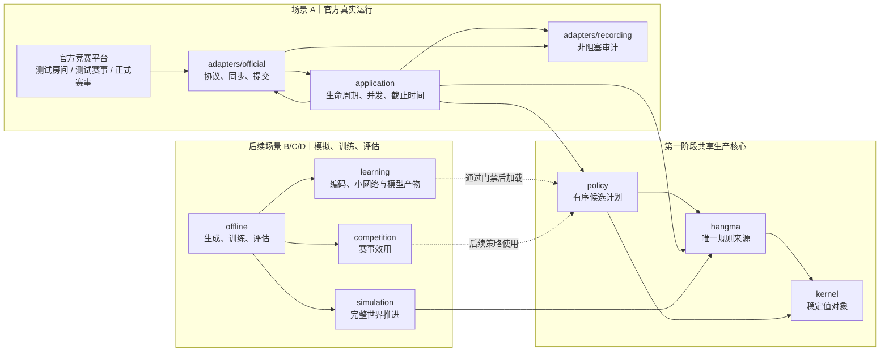
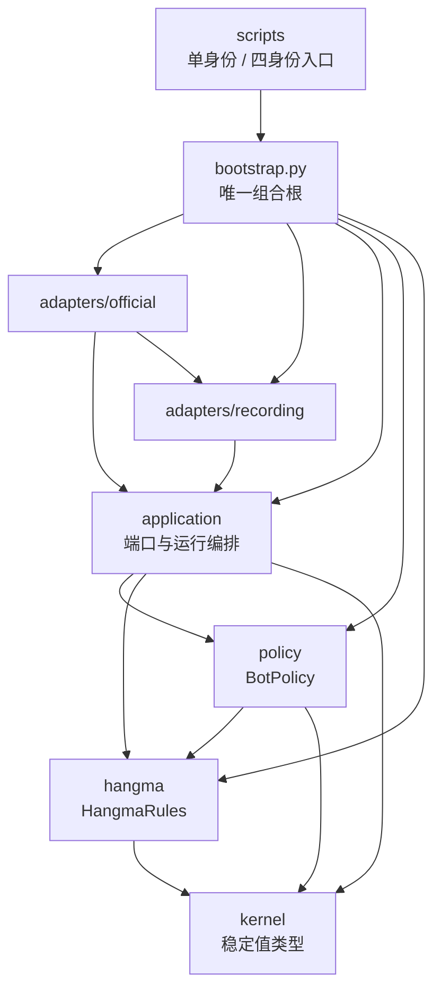
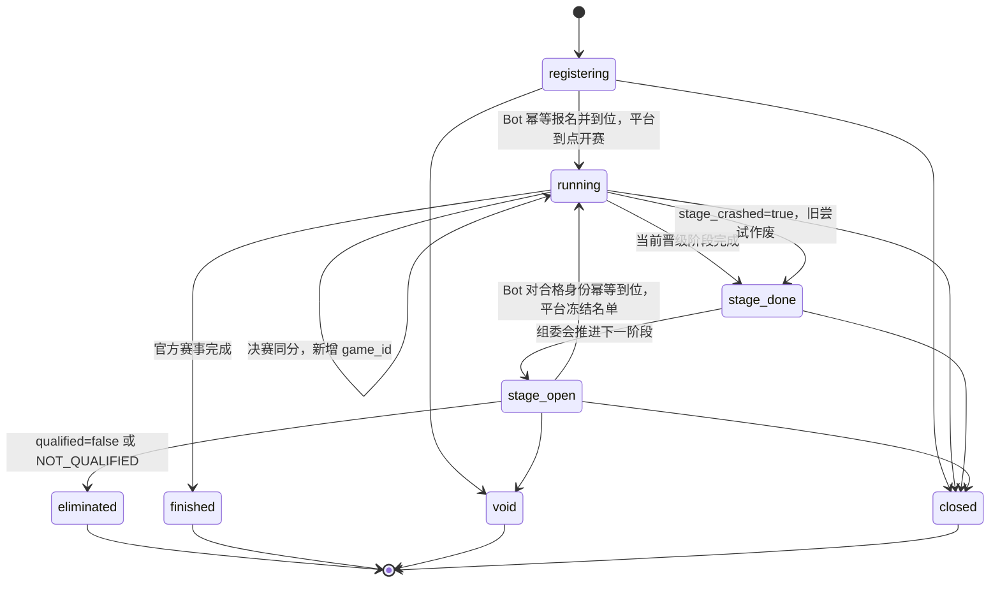
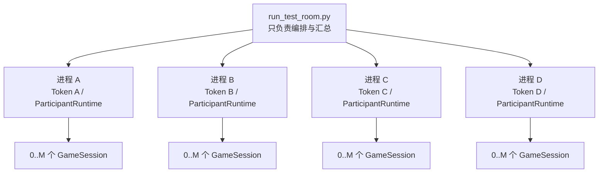
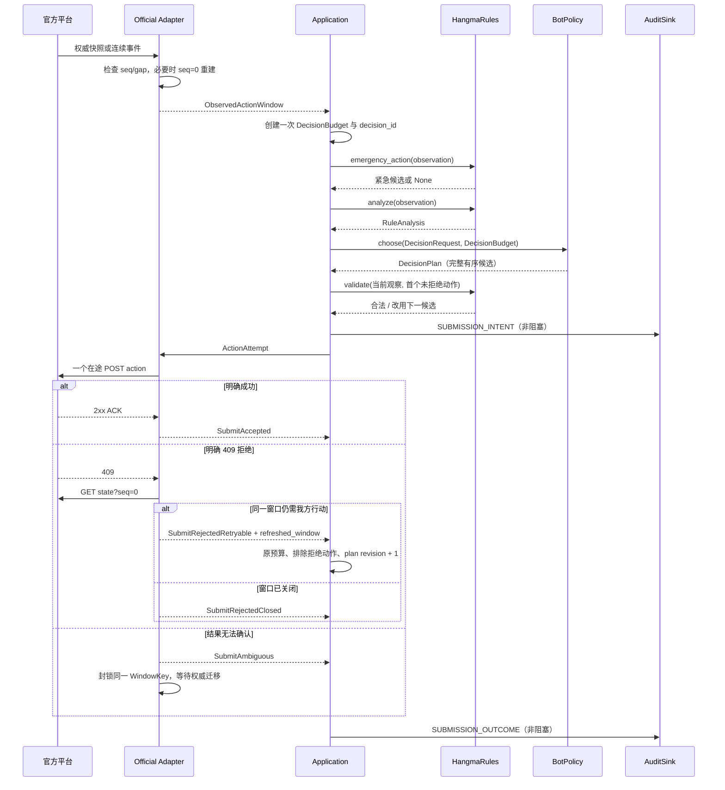
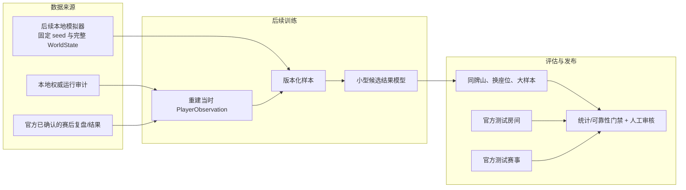

# 杭麻 AI Bot 架构与运行流程

> 状态：当前目标架构 v0.5；第一阶段接口基线 v1.1（2026-09-04 集成阶段契约收口：`SubmitRejectedNoRefresh`、候选牌效事实 `CandidateFacts`、kernel 裁决与审计词表，见接口协议 §4.1/§5/§7.1/§10.1）  
> 更新日期：2026-09-04  
> 适用范围：官方测试房间、测试赛事、正式赛事，以及后续模拟、训练与评估  
> 关联资料：[接口协议](./implementation/interface-contracts.md)、[第一阶段验收](./implementation/mvp-acceptance.md)、[统一术语表](../UBIQUITOUS_LANGUAGE.md)、[官方赛事流程](./official-tournament-flow-2026-09-03.md)

## 1. 结论与图例

第一阶段把复杂度集中在六个确有必要的模块：稳定值类型、唯一杭麻规则、启发式策略、赛事运行编排、官方适配器和审计记录。模拟、训练、小型模型和复杂赛事效用保留为后续目标，但当前不创建空接口或让其进入线上依赖。

- 实线箭头表示运行时调用或数据传递，方向从调用方/来源指向被调用方/去向。
- 虚线箭头表示后续阶段的离线产物发布，不属于第一阶段或每次决策的必经路径。
- `adapters` 隔离网络和磁盘副作用；`hangma` 与 `policy` 不直接访问官方 HTTP。
- 真实运行只给策略[玩家观察（PlayerObservation）](../UBIQUITOUS_LANGUAGE.md#状态与信息权限)，不得给他家手牌、未来牌墙或赛后结果。

## 2. 场景边界与共享核心

箭头表示各场景使用同一生产核心；“后续”节点没有进入第一阶段代码路径。



### 2.1 三类官方环境

| 运行方式 | 身份与并发 | 第一阶段用途 | 不能替代 |
| --- | --- | --- | --- |
| 官方测试房间 | 一次 4 个 Token；每个身份按 `active_games` 运行最多 `config.M` 场 | API、杭麻规则差异、1/3 秒窗口、并发、恢复和赛后数据 | 完整多阶段生命周期或固定牌山策略 A/B |
| 官方测试赛事 | 赛事方提供测试身份；外显协议待实测固化 | 报名、到位、海选、阶段切换、淘汰/候补、重赛和终态 | 大样本策略显著性评估 |
| 正式赛事 | 一个正式 Token；同样按 `active_games` 运行最多 `M` 场 | 只运行通过门禁的稳定版本 | 训练或高风险实验 |

官方测试赛事已经提供，因此是第一阶段发布门禁。官方只确认赛后复盘能力时，本地运行审计是实时决策证据的主要来源；不能预设正式赛事存在未确认的牌谱下载端点。

## 3. 模块边界与依赖方向

箭头表示“调用方依赖被调用方”。适配器实现应用层定义的端口，因此源代码依赖方向从适配器指向应用契约；运行时数据仍从平台流向应用。



### 3.1 第一阶段模块表

| 模块 | 公开面 | 隐藏的复杂度 | 禁止承担 |
| --- | --- | --- | --- |
| `kernel` | 动作、窗口、观察、已观察赛事上下文、不可变配置 | 类型约束和稳定动作键 | 网络、规则算法、策略、完整世界 |
| `hangma` | `HangmaRules` | 合法动作、胡牌、向听、有效牌、财神和结算；独立紧急路径 | HTTP、磁盘、时钟、模型 |
| `policy` | `BotPolicy.choose()` | 启发式评分、有序候选和超时降级 | 声明动作合法、提交 HTTP、读取 `WorldState` |
| `application` | `ParticipantRuntime`；赛事/场次/审计端口 | 报名到位、参赛者终态、最多 `M` 场监督、预算和明确拒绝降级循环 | HTTP DTO、动作门、牌型算法 |
| `adapters/official` | 实现赛事和场次端口 | 已审查指南 v15（快照 2026-09-05；v13 在线分桌审查结论见 `doc/official-tournament-flow-2026-09-03.md` §6.6，v15 自动匹配零影响见 §6.7）、每 Token 传输/限速（state 轮询 16/s 每用户聚合）、状态投影、序号恢复（含 v10 跨局 gap 快照吸收）、动作门 | 组装决策请求、策略评分、赛事何时退出 |
| `adapters/recording` | 实现 `AuditSink` | 队列、JSONL、脱敏、汇总和验证 | 业务判断、重试和阻塞动作 |
| （上游依赖边） | `adapters/official → adapters/recording` | RAW_PROTOCOL_STATE 原始事件经 build_state_response_payload / build_action_response_payload 落审计（2026-09-05 起，errors.raw_text 载体语义见接口协议 §7.1） | — |
| `bootstrap.py` | 组装函数 | 具体实现选择和配置注入 | 规则、生命周期或协议逻辑 |

### 3.2 四个冻结接缝

只冻结：

1. `TournamentSessionPort`：官方会话与生命周期 Fake；
2. `GameSessionPort`：官方场次与保存响应驱动 Fake；
3. `BotPolicy`：加权启发式与紧急保底；
4. `AuditSink`：JSONL 与内存测试记录器。

`HangmaRules` 当前只有一个真实实现，不人为增加 Protocol。`OfficialTransport`、请求调度器、限速器、`ProtocolSyncState`、`ActionGate` 和 `StateProjector` 都是适配器内部细节。接口类型和兼容规则见[第一阶段接口协议](./implementation/interface-contracts.md)。

### 3.3 后续模块边界

MVP 通过后再创建 `simulation`、`competition`、`learning` 和 `offline`：

- `simulation` 拥有 `WorldState`，每一步调用 `hangma`，禁止第二套规则；
- `competition` 只把结构化阶段事实和可能结果转换为赛事效用，不读取 HTTP；
- `learning` 统一训练/推理编码、网络、校准和模型兼容性；
- `offline` 可以调用生产核心，线上代码不能反向依赖训练任务；
- 若线上确需模拟结果，只向策略提供深的 `OutcomeEstimator`，不得暴露 `WorldState` 或让策略直接操纵模拟器。

## 4. 赛事生命周期与终态

箭头表示官方赛事状态变化；组委会推进下一阶段属于平台外部行为，不是我方程序的人工参与。



必须区分两个概念：

- 赛事终态只有官方 `finished/closed/void`；
- 参赛者终态还包括当前身份被淘汰、认证失败、未知破坏性指南版本或目标赛事错配。

因此 `stage_open + qualified=false` 正常结束当前身份，但不宣称整场赛事已经结束。`active_games=[]`、`stage_done` 和 `stage_open` 都不是自动退出条件。每次进入 `running` 都重新发现 `active_games`；动态降档、重赛和决赛加赛可能出现新 `game_id`。

`stage_crashed=true` 时关闭旧场次任务，以 `stage_attempt_id` 标记作废记录，等待新尝试。旧尝试默认不进入训练标签或赛事效果统计。

## 5. 测试房间四身份与 `M` 场并发

箭头表示启动器创建子进程；每个子进程内部再按当前身份的 `active_games` 创建场次任务。



`M` 不增加 Token 数。第一阶段固定采用四个进程，复用正式单身份入口；不做同进程多租户、共享模型或复杂资源编排。每个 Token 独立拥有 HTTP 连接池、请求调度器、限速器、动作门状态和身份审计目录。同一 Token 的赛事请求和最多 `M` 个场次共享其传输资源。

## 6. 一次真实动作窗口

箭头表示调用；409 分支可以在原截止时间内回到规则/策略，但任意时刻只有一个在途 POST。



安全语义不是“每个窗口只发一次”，而是：

1. 同一场任意时刻最多一个在途动作 POST；
2. 只有官方明确确认未执行，并刷新确认同窗仍开放，才能换下一候选；
3. 409 后复用原预算，不能重新获得完整窗口；
4. 网络结果不确定时不追加动作；
5. 到保底截止时间使用已经准备的紧急候选，到最晚发送时间后不再 POST。

紧急路径为：响应窗口过；抓打圈打刚摸牌；普通出牌按官方保留顺序打最右一张。它是最终兜底，不代替第一阶段完整规则引擎。

## 7. 状态同步与请求资源

每场适配器独立维护权威快照、`last_seq`、当前窗口和动作门：

- `seq <= last_seq`：幂等忽略重复事件；
- 序号缺口或 `gap=true`：不应用部分增量，`seq=0` 整体重建；
- 兼容未知事件：记录后继续；
- 未知关键事件：阻断决策并整体重建；
- POST 409：明确拒绝后整体重建，再分类是否可重新规划；
- POST 超时/断连/结果不明：进入 `AMBIGUOUS`，不得传输层重放。

每 Token 请求优先级：动作 POST > 同步/提交确认恢复 > 场次长轮询 > 排名刷新。这个调度器只在官方适配器存在；应用层只负责决策预算和任务监督。长轮询最长 30 秒，阶段切换、场次消失或退出时必须可取消。

## 8. 审计边界

审计不是普通调试日志，而是第一阶段正式产物。应用层记录生命周期、规则分析、策略计划、提交 intent/outcome 和最终结果；官方适配器记录协议同步与恢复事实。双方只发送已脱敏的 `AuditRecord`。

原始事件全量保留（2026-09-05 起）：adapter 层全部协议原文（/state 响应、动作提交响应与 409/429 拒绝体）经低优先级 `RAW_PROTOCOL_STATE` 路由到按场分文件的 `raw/*.jsonl`（可选 gzip 分段，只分段不抽样）；决策计划（`DECISION_PLANNED`）携带观察快照（我方手牌/摸牌/相位/目标弃牌），任何被拒动作可本地复盘。词表与对账检查见接口协议 §7.1。摸牌窗口自当日起由增量事件直达（不再逐批全量刷新），口径见 doc/implementation/notes/cursor-discipline.md。

```text
runs/{run_id}/
  manifest.json
  lifecycle.jsonl
  participants/{participant_id}/
    decisions.jsonl
    games/{game_id}.jsonl
    summary.json
  summary.json
```

高优先级动作信封不设计为正常丢弃；磁盘问题导致缺失时运行必须标记 `audit_degraded`，不能继续声称完整可审计。低优先级重复原始快照可以在队列压力下计数丢弃。Token 和 `Authorization` 在进入记录器前移除，记录器再次防御性脱敏。

## 9. 模拟、训练与评估的后续边界

第一阶段不实现这些模块，但现在确定以下方向以避免返工：



本地模拟回答策略比较和训练数据问题；测试房间回答真实协议、规则、时限和并发问题；测试赛事回答完整生命周期问题。随机官方牌山不能替代同牌山严格 A/B，模拟器也不能证明官方协议兼容。

## 10. 第一阶段目录

```text
src/hangma_bot/
  kernel/                 # 冻结值类型
  hangma/                 # 唯一规则深模块
  policy/                 # BotPolicy 与两个启发式实现
  application/            # 端口、ParticipantRuntime 和场次任务
  adapters/
    official/             # 官方会话实现（已审查指南 v15）
    recording/            # AuditSink、汇总和验证器
  bootstrap.py            # 唯一组合根

scripts/
  run_participant.py      # 单 Token 正式路径
  run_test_room.py        # 四 Token、四进程测试路径

tests/
  contracts/
  fixtures/official/     # v8 快照 + v9（fan-calc 金例）+ v11/v14/v15（指南版本）
```

实施分工、各模块约束和验收入口见[第一阶段实施导航](./implementation/README.md)。
