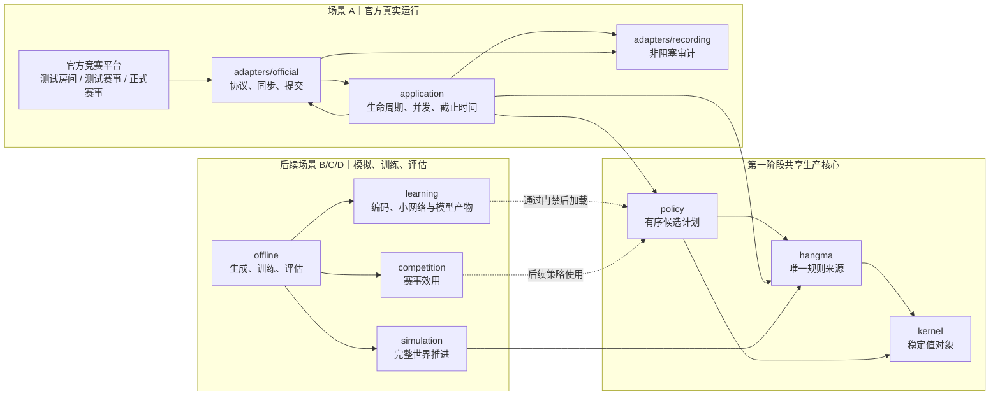
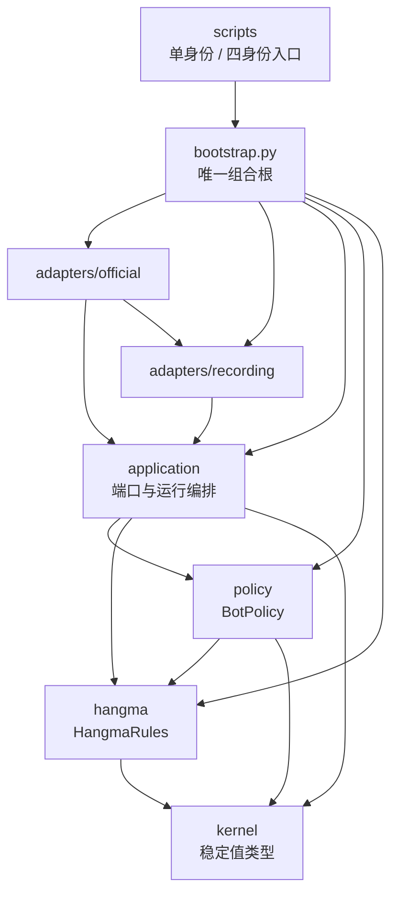
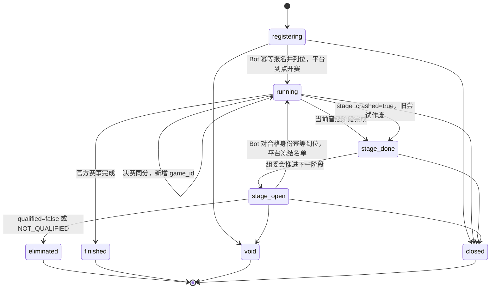
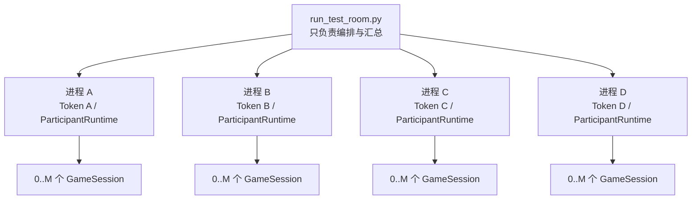
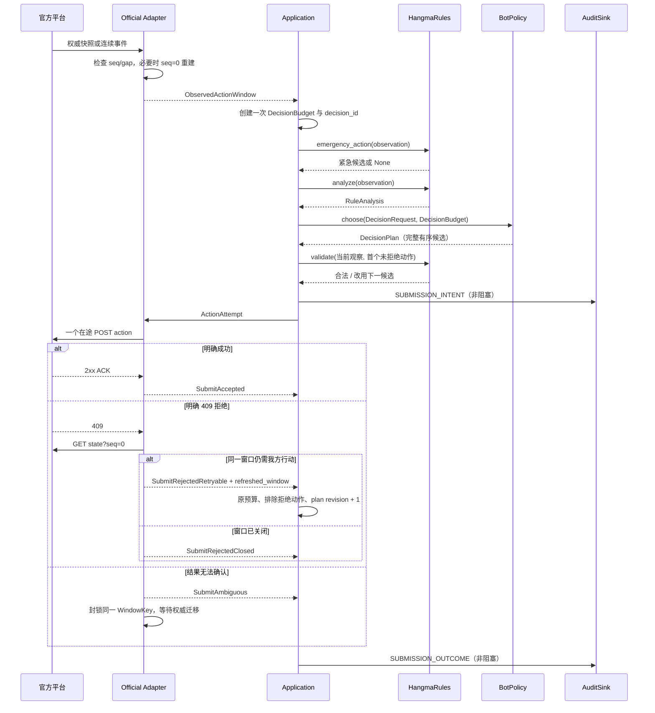
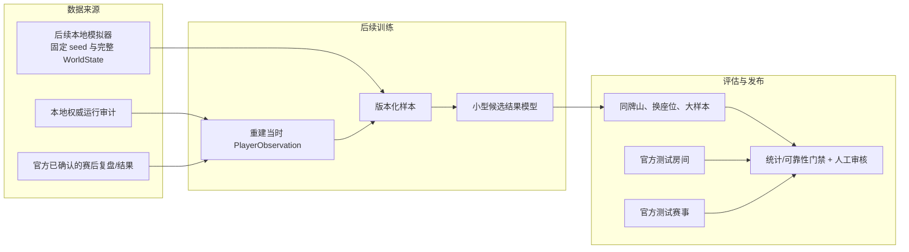
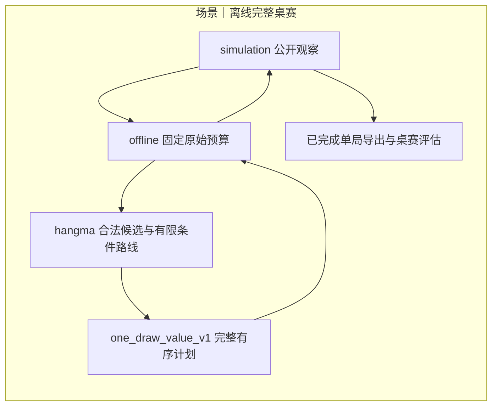

# 杭麻 AI Bot 架构与运行流程

2026-09-09网络预算修订：应用层从有效窗口先扣固定100毫秒POST网络余量，再分配计算；官方出口及查询倒推共享该默认常量，以截止取最小值避免重复扣除。409、队列等待和弃牌缓发不能延长最迟发送。四入口默认接线，审计保存预算版本；外部接口和策略评分不变。两端钟差及state限频问题仍待独立修复，本项不代表实网验收通过，详见[方案与验证](../review/fixed-network-budget-2026-09-09/README.md)。

2026-09-09 当前修订：本地规则为 `hangma-mvp-v10-public-counts`，指南仍为 v27。`hangma.public_tile_counts` 从玩家观察的牌河、副露与公开历史去除同张重叠；供牌无法证明时，沿用逐候选 `ANALYSIS_FAILED`，不伪造剩余张数。模拟投影保留吃的完整组合和事件类别，与官方投影提供相同证据。公开接口形状及 V2 权重不变；快照中的旧“无圈”也须推进连续后缀，不能忽略之后新弃白。验证与单批测试房配置见[修复记录](../review/public-tile-counts-2026-09-09/README.md)。

2026-09-09 v9 规则对齐：官方适配器把 v26 新增的 `god.god_discarder_seat` 转为 `RulePublicState.catch_play_owner_seat`，以 `snapshot_seq` 为事实锚点；`hangma.catch_play` 统一处理当前权限、连续后缀的换主与关圈，旧报文缺字段时保留有证据的恢复路径。规则、保底、提交复核与策略共用这一事实，模拟器通过唯一推进器给圈主开放吃碰明杠，恢复后不沿用旧圈主权限。v24 跳过整个圈内响应的兼容行为已被官方 v26 修复替代。类型编解码、消费者和测试同步见[接口增补](implementation/interface-contracts.md#官方圈主事实与v26响应修订2026-09-09)及[对齐记录](../review/catch-owner-v26-2026-09-09/README.md)。

2026-09-07 制品更新：运行审计推荐定位到 `artifacts/sessions/<session>/audit/`，四身份仍各自拥有记录器。完赛后 `audit_tool.py postgame` 调用 `offline.postgame` 封存证据、转换数据集，并复用唯一规则模块核验终局及观察转移，不进入线上主循环。下载归 `adapters.official.archive_download`，公开客户端由 `bootstrap` 装配；本机归并和旧布局恢复归 `offline.artifact_store`。冻结接口不变，缺失信息不补写到历史 `PlayerObservation`。路径和完整性边界见 [操作指引](operations.md)。

> 状态：当前目标架构 v0.5；第一阶段接口基线 v1.1（2026-09-04 集成阶段契约收口：`SubmitRejectedNoRefresh`、候选牌效事实 `CandidateFacts`、kernel 裁决与审计词表，见接口协议 §4.1/§5/§7.1/§10.1）  
> 更新日期：2026-09-04  
> 适用范围：官方测试房间、测试赛事、正式赛事，以及后续模拟、训练与评估  
> 关联资料：[接口协议](./implementation/interface-contracts.md)、[第一阶段验收](./implementation/mvp-acceptance.md)、[统一术语表](../UBIQUITOUS_LANGUAGE.md)、[官方赛事流程](./official-tournament-flow-2026-09-03.md)

## 1. 结论与图例

海选首版设计修订（2026-09-07，提案未实现）：采用晋级压力与目标分值驱动的启发式策略，不训练海选概率模型，桌赛重采样与后缀迁移退出首版。规则能确定给定结算后的排名；参考追分参数与路线取舍通过可控实验验证，不宣称真实海选概率已校准。详见[首版方案与算法依据](./implementation/qualifier-utility-v1.md)。

拟议运行数据流：`adapters/application` 提供榜单、进度、身份与记账依据；`hangma` 提供合法候选、立即结算和有界成胡路线；`policy` 调用具体 `competition` 生成压力及判断结果达标，最后由同一个 `BotPolicy.choose` 输出计划。`competition` 不读手牌、网络或磁盘，`hangma` 不读榜单；记录器保存事实、目标与选择证据。`offline` 使用模拟器公开接口注入明确标记的赛事情景，以测试房间和自由赛检验运行。首版实际交付新的候选策略；只有最后机会证据完整时才允许改变立即胡优先级，缺失则参考追分或基线降级。类型扩展尚未冻结，默认策略未切换，图与接口需求见[方案 §4—5](./implementation/qualifier-utility-v1.md#4-模块结构与依赖需求)。

本方案实施先走离线最小路径：固定目标配置 → 规则路线与新策略 → 现有模拟器完整续打，由薄 `offline` 驱动评估；这一层不等待官方适配、真实进度或完整全榜。再接人工赛事事实 → competition → 同一策略，最后接运行事实与审计。新增功能在独立分支/工作区开发，基础策略可继续迭代，每批实验固定所消费版本；新策略的赛事调整生效时接管旧桌内名次风格，关闭/未知则恢复原计划。增量契约、合入顺序与限制见[方案 §8.1—8.4](./implementation/qualifier-utility-v1.md#81-最小评测先分两层不等待线上赛事适配)。

第一阶段把复杂度集中在六个确有必要的模块：稳定值类型、唯一杭麻规则、启发式策略、赛事运行编排、官方适配器和审计记录。模拟、训练、小型模型和复杂赛事效用保留为后续目标，但当前不创建空接口或让其进入线上依赖。

- 实线箭头表示运行时调用或数据传递，方向从调用方/来源指向被调用方/去向。
- 虚线箭头表示后续阶段的离线产物发布，不属于第一阶段或每次决策的必经路径。
- `adapters` 隔离网络和磁盘副作用；`hangma` 与 `policy` 不直接访问官方 HTTP。
- 真实运行只给策略[玩家观察（PlayerObservation）](../UBIQUITOUS_LANGUAGE.md#状态与信息权限)，不得给他家手牌、未来牌墙或赛后结果。

## 2. 场景边界与共享核心

箭头表示各场景使用同一生产核心；“后续”节点没有进入第一阶段代码路径。



### 2.1 三类官方环境

| 运行方式 | 身份与并发 | 第一阶段用途 | 不能替代 |
| --- | --- | --- | --- |
| 官方测试房间 | 一次 4 个 Token；每个身份按 `active_games` 运行最多 `config.M` 场 | API、杭麻规则差异、1/3 秒窗口、并发、恢复和赛后数据 | 完整多阶段生命周期或固定牌山策略 A/B |
| 官方测试赛事 | 赛事方提供测试身份；外显协议待实测固化 | 报名、到位、海选、阶段切换、淘汰/候补、重赛和终态 | 大样本策略显著性评估 |
| 正式赛事 | 一个正式 Token；同样按 `active_games` 运行最多 `M` 场 | 只运行通过门禁的稳定版本 | 训练或高风险实验 |

官方测试赛事已经提供，因此是第一阶段发布门禁。官方只确认赛后复盘能力时，本地运行审计是实时决策证据的主要来源；不能预设正式赛事存在未确认的牌谱下载端点。

## 3. 模块边界与依赖方向

箭头表示“调用方依赖被调用方”。适配器实现应用层定义的端口，因此源代码依赖方向从适配器指向应用契约；运行时数据仍从平台流向应用。



### 3.1 第一阶段模块表

| 模块 | 公开面 | 隐藏的复杂度 | 禁止承担 |
| --- | --- | --- | --- |
| `kernel` | 动作、窗口、观察、已观察赛事上下文、不可变配置 | 类型约束和稳定动作键 | 网络、规则算法、策略、完整世界 |
| `hangma` | `HangmaRules` | 合法动作、胡牌、向听、有效牌、财神和结算；独立紧急路径 | HTTP、磁盘、时钟、模型 |
| `policy` | `BotPolicy.choose()` | 启发式评分、有序候选和超时降级 | 声明动作合法、提交 HTTP、读取 `WorldState` |
| `application` | `ParticipantRuntime`；赛事/场次/审计端口 | 报名到位、参赛者终态、最多 `M` 场监督、预算和明确拒绝降级循环 | HTTP DTO、动作门、牌型算法 |
| `adapters/official` | 实现赛事和场次端口 | 已审查指南 v15（快照 2026-09-05；v13 在线分桌审查结论见 `doc/official-tournament-flow-2026-09-03.md` §6.6，v15 自动匹配零影响见 §6.7）、每 Token 传输/限速（state 轮询 16/s 每用户聚合）、状态投影、序号恢复（含 v10 跨局 gap 快照吸收）、动作门 | 组装决策请求、策略评分、赛事何时退出 |
| `adapters/recording` | 实现 `AuditSink` | 队列、JSONL、脱敏、汇总和验证 | 业务判断、重试和阻塞动作 |
| （上游依赖边） | `adapters/official → adapters/recording` | RAW_PROTOCOL_STATE 原始事件经 build_state_response_payload / build_action_response_payload 落审计（2026-09-05 起，errors.raw_text 载体语义见接口协议 §7.1） | — |
| `bootstrap.py` | 组装函数 | 具体实现选择和配置注入 | 规则、生命周期或协议逻辑 |

### 3.2 四个冻结接缝

只冻结：

1. `TournamentSessionPort`：官方会话与生命周期 Fake；
2. `GameSessionPort`：官方场次与保存响应驱动 Fake；
3. `BotPolicy`：加权启发式与紧急保底；
4. `AuditSink`：JSONL 与内存测试记录器。

`HangmaRules` 当前只有一个真实实现，不人为增加 Protocol。`OfficialTransport`、请求调度器、限速器、`ProtocolSyncState`、`ActionGate` 和 `StateProjector` 都是适配器内部细节。接口类型和兼容规则见[第一阶段接口协议](./implementation/interface-contracts.md)。

### 3.3 后续模块边界

MVP 后按实际任务创建目标模块。2026-09-05 的[并行契约](./implementation/parallel-contracts.md)已启动 simulation/offline 设计，详见[施工导航](./implementation/parallel-workstreams.md)；competition/learning 待具体能力进入时实现：

- `simulation` 拥有 `WorldState`，每一步调用 `hangma`，禁止第二套规则；
- `competition` 只把结构化阶段事实和可能结果转换为赛事效用，不读取 HTTP；
- `learning` 统一训练/推理编码、网络、校准和模型兼容性；候选结果模型预测单局四家联合积分结果，阶段续局模型预测固定四人小组的阶段最终联合排序，两者分别训练与验收。`competition` 分别处理海选全榜目标、16 强/8 强组内前 2 和决赛名次，不由一个目标条件策略网络代替两个模型；
- `offline` 可以调用生产核心，线上代码不能反向依赖训练任务；
- 若线上确需模拟结果，只向策略提供深的 `OutcomeEstimator`，不得暴露 `WorldState` 或让策略直接操纵模拟器。

本批具体调用与文件契约见[parallel-v1](./implementation/parallel-contracts.md)。审计拥有原文整理与统一牌谱 codec；模拟拥有不透明 WorldState 和具体 SimulationEngine；评估只读文件并调用公开 frame/advance，策略仍仅消费 DecisionRequest。历史 check_hand 与完整世界 from_replay 分开；缺牌墙的官方记录不自动成为可分叉世界。

启发式后续施工按[三个候选版本计划](./implementation/policy-iteration-plan.md)：先可靠排序，再由 hangma 补齐 Pass 等待牌效，最后有限调参。V0/V1 源码保持冻结，线上默认 V0；hangma 已按本地语义 `hangma-mvp-v2-pass-progress` 提供响应 Pass 等待事实。组合根与离线装配使用显式旧视图保持 V0/claim_if_legal 的正常评分，审计仍记录原事实，V1 已兼容可信新事实。V2 以 `weighted_heuristic_v2` 接入原策略配置，复用 V1 非 Pass 评分并统一响应等待基准；策略接口和数据格式不扩展，策略不依赖离线评估器或模拟器。边界见接口协议 §4.3–4.4。

### 3.4 自动匹配入口（待实施）

用户已确认 `/api/match`。新增 OfficialAutoMatchSession 作为 TournamentSessionPort 的第二个真实实现，application 用专用自动房生命周期复用现有 GameTask/SSE/动作门。显式 AUTO_MATCH 初始化可有一次入席副作用；旧模式保持发现与 Token 作用域检查。匹配操作内协议重试归适配器，是否开始会话、运行场次、终局收尾归应用层，默认只完成一个自动房。详见[自由赛指南](./implementation/free-match-start.md)，不能把这段流程只归到可观测模块。

## 4. 赛事生命周期与终态

箭头表示官方赛事状态变化；组委会推进下一阶段属于平台外部行为，不是我方程序的人工参与。



必须区分两个概念：

- 赛事终态只有官方 `finished/closed/void`；
- 参赛者终态还包括当前身份被淘汰、认证失败、未知破坏性指南版本或目标赛事错配。

因此 `stage_open + qualified=false` 正常结束当前身份，但不宣称整场赛事已经结束。`active_games=[]`、`stage_done` 和 `stage_open` 都不是自动退出条件。每次进入 `running` 都重新发现 `active_games`；动态降档、重赛和决赛加赛可能出现新 `game_id`。

`stage_crashed=true` 时关闭旧场次任务，以 `stage_attempt_id` 标记作废记录，等待新尝试。旧尝试默认不进入训练标签或赛事效果统计。

## 5. 测试房间四身份与 `M` 场并发

箭头表示启动器创建子进程；每个子进程内部再按当前身份的 `active_games` 创建场次任务。



`M` 不增加 Token 数。第一阶段固定采用四个进程，复用正式单身份入口；不做同进程多租户、共享模型或复杂资源编排。每个Token独立拥有HTTP连接池和身份审计目录；同一用户的各场共用state发送账与state 429冷却，各场及赛事控制通道分别拥有HTTP槽和OTHER冷却，每场另有动作门。具体额度见第7节。

## 6. 一次真实动作窗口

箭头表示调用；409 分支可以在原截止时间内回到规则/策略，但任意时刻只有一个在途 POST。



安全语义不是“每个窗口只发一次”，而是：

1. 同一场任意时刻最多一个在途动作 POST；
2. 只有官方明确确认未执行，并刷新确认同窗仍开放，才能换下一候选；
3. 409 后复用原预算，不能重新获得完整窗口；
4. 网络结果不确定时不追加动作；
5. 到保底截止时间使用已经准备的紧急候选，到最晚发送时间后不再 POST。

紧急路径为：响应窗口过；抓打圈内非圈主或归属未知时打刚摸牌（包括白板）；圈主及普通出牌从右优先选择非财神，没有非财神才打白。单列摸牌按手牌数量识别并视为右端，官方已含摸牌的手牌保留原序。该保财偏好是本地策略选择；紧急路径只扫描牌序与必要的归属证据，不计算飘或牌型。

2026-09-08 抓打圈修订使用 `hangma-mvp-v7-catch-owner`：`hangma.catch_play` 根据连续可见弃牌，或与当前权威牌河全部弃白的完整对账，统一确认最新圈主及开圈 seq。规则、保底与官方提交出口调用同一解析；全局原始标记不改写。模拟弃白原子换主，其他家弃非白保持、当前圈主弃非白结束，摸牌和杠补不结束。公开历史保留他家摸牌事件的序号但隐藏牌值。圈主吃碰须已有响应窗口，模拟开窗时序仍待对拍。全部语义与证据边界见接口协议 §4.6。

2026-09-08 增加可选 `weighted_heuristic_v2_white_guard`：组合根将 `WhiteDiscardGuardPolicy` 包在原 V2 外，只在本人出牌、`baotou=False` 且存在未拒绝的合法非财神弃牌时，向 V2 提供过滤普通弃白后的输入副本。原始规则分析仍用于审计和最终复核；可飘状态及白板唯一可用时保留弃白。共享保底行为以本地版本 `hangma-mvp-v6-white-guard` 区分，V0/V1/V2 评分源码和默认策略名保持原样。行为与兼容退路见接口协议 §4.5。

同日新增测试房专用 `catch_play_probe`：沿用完整规则与提交路径，只将 V2 计划中的合法弃白、响应鸣牌优先级提高，用于主动制造抓打圈并验证圈主权限。四身份仍是四个隔离进程，配置仅允许 `test_room`；正常策略不自动加载探针。使用既有审计记录分开核验开窗与动作裁决，不将规则诊断样本当作策略强度证据。见接口协议 §4.7。

2026-09-08 v24 测试房收口：在圈主确有碰牌形的两个时点，官方仍于下一序号直接摸牌。`hangma-mvp-v8-catch-windows` 因此在弃牌后抓打标记仍生效时跳过模拟响应窗口；圈主弃非白关圈后恢复普通响应。线上仍消费实际官方窗口，不主动合成窗口或发送无窗口吃碰。该修订属于推进时序，不改变财飘计番；普通圈实测与财飘组合的未覆盖边界见[实测报告](../review/piao-window-alignment-2026-09-08/live-t_fee4ab73c089.md)。

## 7. 状态同步与请求资源

2026-09-06 修订：两个生产组合根固定使用 `state` 长轮询与阶段边界查询，SSE 暂不接入。应用层单场主循环驱动同步、规则分析、策略选择和串行提交，不新增后台同步任务。低层 SSE 客户端保留供以后评估，运行 manifest 记录 `official_sync_mode=state`、`sse_requested` 和 `sse_effective=false`。

每场适配器独立维护权威快照、`last_seq`、当前单局可见历史、当前窗口和动作门。快照更新牌面但保留已收历史；只有快照之后的事件更新牌面。`current_observation()` 是快照/增量投递及提交复核共用的观察入口。增量摸牌通过 `hangma` 按既有爆头和本次补牌来源推进生命周期；缺完整前态或来源会影响结果而未知时恢复快照。普通他家弃牌的连续增量可以直接交付碰窗口；副露、抓打和不能完整推导的响应资格仍由权威快照确认。

2026-09-08 用户共享state调度：同一user_id的所有game_id共用滚动一秒最多16次的实际发送账及state 429冷却，撤销每场2/s或1/s静态份额。每场仍最多2个在途HTTP，其中state最多1个，动作POST另由ActionGate保证串行；各场和赛事控制通道的HTTP槽、OTHER冷却独立。state最早在新建用户账一秒后发起，以跨过旧进程计数窗口；控制请求与POST不等。重新打开场次不重置用户账或重启等待。连接池按Token共享，默认64连接、48保活连接；不同用户的账本和冷却隔离。依据为2026-09-08抓取的指南v25，服务器内部计次算法仍未公开。

`hangma` 拥有同一套动作生命周期：吃碰继承爆头但不新增链，杠加一次链并继承爆头，杠补牌可继承或新进入；弃牌先用旧状态判飘，再更新听牌态，其他弃牌清链。v23 起四白同样按任意听判定，可与四白加番叠加。模拟、牌谱和官方增量调用这套规则；官方快照中的 god 原样交付策略，规则核验只报告分歧。详细证据边界见[规则清单](../src/hangma_bot/hangma/RULES_EVIDENCE.md)。

- `seq <= last_seq`：载荷相同的已保存事件幂等忽略；同序号载荷冲突恢复，迟到旧快照不得让水位回退；
- 序号缺口或 `gap=true`：不应用部分增量，`seq=0` 整体重建；
- 兼容未知事件：记录后继续；
- 未知关键事件：阻断决策并整体重建；
- POST 409：明确拒绝后整体重建，再分类是否可重新规划；
- POST 超时/断连/结果不明：进入 `AMBIGUOUS`，不得传输层重放。

未知类型不会因一次恢复自动变成可忽略。跨单局/阶段可没有新序号，进展判断同时检查 `round_no/phase`。轮询与边界同时完成时先消费已返回事件，不能由计时器丢弃它。响应表态绑定触发弃牌；新弃牌即使通过快照直接进入响应阶段，也不能继承旧 pass。

`PlayerObservation` 保存快照基线 `snapshot_seq`、已消费水位 `consumed_seq`、历史完整性及可空的 `chain_piao/gang_draw`。链未知不填零，杠补来源未知不当普通摸牌。规则模块核验有完整前态的简单 god 转移，输出 `god_mismatch` 或 `not_checked`；当前事实仍服从官方快照。v26 的公开圈主字段已补齐四座位权限依据；碰阶段显式 pass 对后续吃资格仍保留原有边界查询与实际响应身份复核。

窗口将官方 Unix 毫秒截止转换为单调时钟截止；同一窗口只能收紧。应用预算扣留发送余量，409 新快照也只能收紧原预算。仅有增量事件时不得借用旧响应阶段截止，估计时间明确标记。部署时钟偏差和真实网络尾延迟仍需线上测量。

修订策略及评审：[观察完整性修复策略](../review/official-adapter/repair-plan-2026-09-06.md)。离线 `observation_check.compare_observations` 比较已独立对齐的观察和参考，分别报告状态/历史差异及未检查项；线上不依赖该工具。

动作POST不等待state额度；有明确窗口的state请求按最迟安全发起时刻排序，未知事件发现按场公平服务。赛事控制请求使用独立资源域。调度仅属于官方适配器，应用层负责决策预算和任务监督；所有挂起请求均可取消。

### 2026-09-08 查询目的与额度生命周期

**共享调度不改变四个外部端口，也不把限频状态传给策略。**官方适配器用截止优先调度（`EarliestDeadlineFirst`，先发最早失去安全行动机会的查询）安排已知需求，并通过可取消的未来边界提示保留必要查询机会。提示不能提前发GET；同场过期目的被撤销并审计，随后只保留必要的现状或下阶段同步。普通新事件仍须查询发现，未来对手行为不能被预知。

state许可先预占，真正进入传输前才转为单调时钟发送记录。未发取消退预占，已发后的失败、超时和取消不退计次；本地发送时刻不等于服务器收包时刻。最迟查询发起与HTTP响应完成预算分开，后者仍受原始动作期限约束。peng→chi边界到点时取消并等待旧长轮询回收，已同时收到的权威结果优先消费，不让旧挂起请求占住唯一state槽。

2026-09-09已接入普通弃牌缓发（`DiscardPacing`，在查询繁忙时利用我方宽裕弃牌时间短暂等待）。默认对正常摸牌增量生效：同用户滚动state用量达到10次，且本机保守起点后1秒尚未到达、原预算仍有余量时，补足剩余时间；策略计算时间已经计入。快照恢复、重试、白板及特殊动作链跳过。等待不占HTTP槽或state额度，醒后复核窗口和收紧的发送截止。时间依据来自前次已确认状态的查询发起时刻，不要求快照有毫秒截止，也不依赖服务端钟差。SSE继续关闭。实现、取消契约及32个新模型场景见[缓发验证](../review/adapter-rate-identity-2026-09-08/discard-pacing-2026-09-09/README.md)；本地结果不等于实网收益。

## 8. 审计边界

MVP 后续增强设计见[审计增强实施方案](./implementation/audit-enhancement.md)（2026-09-05 修订，新增部分待实施）。保持 v1 信封、现行 raw 留存与 AuditSink 签名，以 profile 补齐完整决策输入、候选复核、结束证据和构造失败持久化。实际生成的候选/评分必须留存，不用修复后的规则重算值覆盖历史事实。

审计不是普通调试日志，而是第一阶段正式产物。应用层记录生命周期、规则分析、策略计划、提交 intent/outcome 和最终结果；官方适配器记录协议同步与恢复事实。双方只发送已脱敏的 `AuditRecord`。

原始事件全量保留（2026-09-05 起）：adapter 层全部协议原文（/state 响应、动作提交响应与 409/429 拒绝体）经低优先级 `RAW_PROTOCOL_STATE` 路由到按场分文件的 `raw/*.jsonl`（可选 gzip 分段，只分段不抽样）；决策计划（`DECISION_PLANNED`）携带观察快照（我方手牌/摸牌/相位/目标弃牌），任何被拒动作可本地复盘。词表与对账检查见接口协议 §7.1。摸牌窗口自当日起由增量事件直达（不再逐批全量刷新），口径见 doc/implementation/notes/cursor-discipline.md。

```text
runs/{run_id}/
  manifest.json
  lifecycle.jsonl
  participants/{participant_id}/
    decisions.jsonl
    games/{game_id}.jsonl
    summary.json
  summary.json
```

高优先级动作信封不设计为正常丢弃；磁盘问题导致缺失时运行必须标记 `audit_degraded`，不能继续声称完整可审计。低优先级协议原文可以在队列压力下计数丢弃。Token 和 `Authorization` 在进入记录器前移除，记录器再次防御性脱敏。

本批复用现有独有原文 RAW_PROTOCOL_STATE，低优先级背压丢失仍需计数，不能宣称原文完整。应用层提供决策编解码；官方适配器留存协议并映射赛后格式；记录模块负责文件、共用读取器、校验与封存；离线模块负责具体统一牌谱转换，线上不依赖离线模块。只读监控使用记录中的牌桌快照和决策，不维护第二套协议状态机或规则。

证据包包含互不改写的各进程运行目录、可取得的官方赛后原文和文件哈希。统一牌谱写入独立派生目录；测试房间完整事件流与测试赛事/自由赛玩家观察按数据能力区分。缺少未来牌墙时只声明完整历史轨迹，不声明完整世界或反事实分叉能力。实时排名按实际环境采集，缺失保留未知。

## 9. 模拟、训练与评估的后续边界

以下为长期数据边界。第一阶段已经完成，本批 simulation/offline 的具体接口和验收以 parallel-v1 为准；训练模块仍待相应阶段。箭头表示数据消费方向，教师和学生的信息权限不同：



本地模拟回答策略比较和训练数据问题；测试房间回答真实协议、规则、时限和并发问题；测试赛事回答完整生命周期问题。随机官方牌山不能替代同牌山严格 A/B，模拟器也不能证明官方协议兼容。

## 10. 第一阶段目录

```text
src/hangma_bot/
  kernel/                 # 冻结值类型
  hangma/                 # 唯一规则深模块
  policy/                 # BotPolicy 与两个启发式实现
  application/            # 端口、ParticipantRuntime 和场次任务
  adapters/
    official/             # 官方会话实现（已审查指南 v15）
    recording/            # AuditSink、汇总和验证器
  bootstrap.py            # 唯一组合根

scripts/
  run_participant.py      # 单 Token 正式路径
  run_test_room.py        # 四 Token、四进程测试路径

tests/
  contracts/
  fixtures/official/     # v8 快照 + v9（fan-calc 金例）+ v11/v14/v15（指南版本）
```

实施分工、各模块约束和验收入口见[第一阶段实施导航](./implementation/README.md)。

## 2026-09-06 实测后的同步修正

完整快照直接建立当前状态基线，下一次增量查询使用该快照水位N，接收N之后的事件；seq=0返回水位1的快照同样有效。已收到的原事件仍保留且不重复应用到牌河或手牌。线上移除100ms串行补领与三次延后补史，不回退游标追逐已被快照覆盖的原事件；历史缺口单独进入history_complete和单局封存，不再仅因history_gap_snapshot将当前规则分析整体降级。新收到的增量有gap、序号缺口、冲突重复或未知关键事件时仍必须用seq=0恢复；409仍按原始截止刷新。

普通他家摸牌、明确catch_play=false的弃牌及pass，在连续后缀且本人手牌/god未变化时直接投影碰窗口；抓打标记不明、本人改牌、副露、超时和跨单局等不可完整推导的情况继续查询权威快照。peng→chi无事件切换仍按边界查快照；若剩余时间不足以安排增量和边界两次额度，则只在边界查一次，避免先发注定取消的长轮询。增量截止使用事件整秒时间与上次已知水位查询开始时刻提供的保守下界，并保持同窗截止只收紧。

碰阶段的策略 pass 在适配器内转为等待，不发送官方 POST；真实吃窗口到达后由应用层重新决策。公开摸牌来源、抓打标记、超时阶段和终局结算字段完整进入玩家观察（`PlayerObservation`），规则模块只做有依据的推导与核验。完整世界状态（`WorldState`）仍归模拟模块所有，观察完整不意味着获知他家手牌或未来牌墙。字段、恢复边界与牌谱一致性检查见[接口契约](./implementation/interface-contracts.md#实测事件与恢复契约增补2026-09-06)。

## 延后补史与单局封存（2026-09-06）

完整快照直接建立当前状态基线，下一次增量查询使用该快照水位N，接收N之后的事件；seq=0返回水位1的快照同样有效。已收到的原事件仍保留且不重复应用到牌河或手牌。线上移除100ms串行补领与三次延后补史，不回退游标追逐已被快照覆盖的原事件；历史缺口单独进入history_complete和单局封存，不再仅因history_gap_snapshot将当前规则分析整体降级。新收到的增量有gap、序号缺口、冲突重复或未知关键事件时仍必须用seq=0恢复；409仍按原始截止刷新。

单局切换与结束产生独立高优先级历史封存记录，包含未知前缀、缺口和已收到终局事实。新单局响应附带旧手尾事件时，先构造旧手记录，待新快照验证成功后提交；不能把跨手不明事件塞入当前观察。详细字段和预算见[延后补史契约](./implementation/interface-contracts.md#延后补史与单局收尾契约2026-09-06)。


### 单局封存完整性补充（2026-09-06）

`history_closure.closure_issues` 记录附带旧尾中的未知事件、关键字段缺失、违规他家摸牌，以及未收到 `round_ended` / 场次终态未收到 `game_ended` 的原因。封存 `history_complete=true` 除要求起点、序号及原有观察完整外，还要求这些原因为空。`missing_ranges` 仅覆盖已知 `history_through_seq`，缺少更晚的尾事件不能只靠此区间表判断；不从积分或新快照捏造终局事件。该检查只影响赛后封存，不重新推进牌面、创建动作窗口或改变策略输入。

## 完赛复核修订：链事实衔接与统计口径（2026-09-07）

每场同步状态保存最近观察和一个本人已明确成功的动作前态。新观察经 `hangma.reconcile_observation` 核对同场、同座位、同单局、水位、本人牌面变化及官方链计数后，才补充精确飘次数和本次杠补来源。三种杠、吃碰、弃牌复用既有纯规则推进；拒绝、结果不确定或核对不符不提供成功证明。跨单局清理事实；当前摸牌来源不能继承到无法证明的后续摸牌。

此衔接不产生 HTTP，不改变分场额度与游标，不补造事件或改写官方 `god`。原始历史完整性和当前规则事实仍分别表达。依据指南v20及2026-09-07实测的10个成功明杠后空事件快照，见[原报文回归](../tests/fixtures/official/v20/README.md)。

审计验证器按动作尝试关联键合并应用层和适配器记录，另外保留原始条数；结果冲突明确报告。规则降级取决策输入中的规则完整性，计划兼容提示单列。线上记录接口不变，验证报告的新旧口径见[记录模块](./implementation/modules/recording.md#2026-09-07-汇总口径修正)。

## M=4 赛后修复（2026-09-07）

单局切换和结束仍独立封存已知历史、未知前缀、缺失区间及终局事件是否实际收到；不为补历史再发请求，也不伪造终局事件或重新打开已结束场次。赛后完整下载是独立证据，不回写当时策略观察。

所有生产HTTP调用均记录HTTP_REQUEST开始/终结元数据，以request_id关联原始响应；成功、拒绝、超时、取消、赛事发现/报名/到位、自动匹配和SSE连接均覆盖。短元数据走高优先级，正文仍走RAW_PROTOCOL_STATE。state/action原来源兼容保留，新增http_response及notify_response；取消无响应时raw为空并记录outcome=cancelled。仅保存Date、Retry-After、Content-Type和请求/限流诊断白名单头，Token及Authorization不落盘。验证器逐请求核对开始、终结和正文，即使旧成功计数连续也能查出取消漏记或正文丢失。赛后公共下载另写http-requests.jsonl并保留非200正文为*.http-error。

原始state与动作响应增加进程内单调时钟的排队、许可、传输开始和完成时间，state 429另外记录已解析的Retry-After秒数。可区分排队与传输耗时，不能直接当作服务端收包时间。证据与验证见[M=4修复说明](../review/official-adapter/m4-live-2026-09-07/repair.md)。

## 2026-09-07 有财必拷响与特殊胡牌对齐

2026-09-07 修订时的本地默认规则版本为 `hangma-mvp-v4-youcai-baotou`，官方指南为v18；当前版本见下方 v23 修订。实际赛事返回的 `YouCaiBiKao` 经官方适配器严格布尔解析、投影和赛事初始化，绑定到该赛事的 `HangmaRules`；测试房、测试赛事、正式赛事和自由赛共用此配置路径，不固定开关值。

开关开启且胡后手中有财神时必须爆头，杠补不能豁免；开关关闭或手中无财神时仍按成牌与自摸窗口判断。候选生成和提交前复核共用规则函数。正常排除的原因进入候选证据，分析仍为完整；规则计算异常才降级，紧急动作独立保留。

官方 `fan-calc` 对拍成胡、静态爆头、番数、明细和庄闲结算，再叠加房规资格；线上权威持续爆头状态继续保留。结算入口只处理已确认胡牌事实。吃碰保持动作链，因此完整连续后缀可以跨吃碰恢复链内飘次数；缺史仍保持未知。模块边界及公共接口不变。


## 2026-09-07 分组手牌数学与可选 C 扩展

标准型缺牌数在 `hangma` 内按万、筒、条、字牌分组，局部完整枚举财神与自然虚牌分配，再合成面子、将和财神资源。修复旧搜索过早消耗财神而高估向听的反例；每种自然牌的进张配额从 `4−初始持有数` 连续扣减，零配额不恢复。七对、成牌证据和特殊胡牌资格继续通过原规则入口处理。

`HangmaRules`、玩家观察、候选事实和策略接口不变。数学语义标签为 `hangma-standard-grouped-v1`，现有有财胡牌/动作链规则版本继续保留；此次是数学实现修复，不是官方指南变更。规则源哈希增加 `.c/.h`，实际实现和二进制摘要另记在启动审计及评估清单的 `hand_math`，历史基线不重写。

Hatch 在安装期构建可选 CPython 扩展，wheel 标明平台和 Python 二进制接口（Application Binary Interface，ABI，决定解释器能否加载扩展）；源码可编辑安装将扩展放在同一 `hangma` 包中。模块导入时校验数学语义，加载失败使用修正后的 Python 分组实现，动作窗口不编译。组合根启动时生成实现元数据，读文件仅发生在已有产物工具层。C 缓存固定约5.25 MiB，由每个模块/解释器独立拥有并随其销毁，调用保持解释器锁；Python 缓存同样有上限。独立紧急动作不依赖这两套数学实现。

实现和本地验收结果见[分组数学集成记录](../review/grouped-dp-integration-2026-09-07/README.md)。正式策略仍按独立效果与发布门禁晋级，不因本次加速自动切换。


## 2026-09-07 预编译规则制品分发

安装期优先选择仓库中与当前平台、Python、系统下限和数学源码摘要匹配的 C 制品，并核对二进制摘要；标准包只携带所选库，可编辑安装复制到源码包。当前提供 macOS 11+、arm64、CPython 3.11 的制品，同类 Mac 可以免编译安装。没有匹配制品时，默认沿用源码构建及同语义 Python 退路；HANGMA_NATIVE=prebuilt 可要求严格免编译。规则导入和动作窗口不读取制品清单，公共规则与策略接口不变。

制品范围、安装命令和维护责任见[预编译制品说明](../prebuilt/hangma/README.md)。新进程通过共用规则入口生效，已运行进程需重启；保留历史规则结果的决策评估不重新计算。

## 终局收集与优雅停止（2026-09-07）

`active_games` 只决定哪些场次仍可行动。普通退场、赛事 finished、正常淘汰或进程取消时，application 先取消并等待原动作消费者退出，再在同一个 `GameSessionPort` 上只读收集 `GameFinished`，最后调用 `aclose`。每场默认从停止动作起等待最多5秒，收尾与其他场次行动并行；进入赛事终态不会续期。所有场次收尾结束后，ParticipantRuntime 才关闭共享传输并冲刷审计。

阶段作废只取消对应尝试的收尾；身份鉴权/永久错误及赛事 closed/void 不新增旧场请求。跨阶段的迟到成绩使用开场时固定的 stage_attempt_id。接口没有新增方法：官方适配器继续负责序号、请求额度、原文与终局解析；GameTask 的只读消费模式不进入策略和规则分析。GameFinished 与资源关闭分开审计，超时或读取失败记录终局缺失。详见[收尾契约](./implementation/interface-contracts.md#终局收集与关闭契约2026-09-07)。


## 2026-09-08 四白规则对齐（官方 v23）

此项修订当时的本地规则版本为 `hangma-mvp-v5-four-white`；当前版本见 2026-09-09 v26 对齐。官方指南 v23 §1.2 与本日 `fan-calc` 实测允许四白任意听计爆头，并与四白加番叠加；七对中的四白只有未补落单、其余牌全为自然对子时另计一组豪华。文档计番表尚留“四白除外”旧字样，本次以实际接口返回为准；[固定输入、原始响应与版本信息](../tests/fixtures/official/v23/fan-calc/README.md)保留可核对证据。

修正统一落在 `hangma` 的手牌分解、爆头状态推进、配置资格与结算中。`YouCaiBiKao` 仍按实际赛事绑定；有财无爆头仍受开关限制，有效四白爆头可通过。线上权威 `god.baotou` 保持原值，来源未知且会影响继承时仍恢复快照。外部接口、观察编码、策略配置与标准型 `c_grouped` 数学语义不变；本地规则语义版本和源码摘要区分新产物，模拟产物的规则依据版本同步记录为 v23、采集日期 2026-09-08；这不改变官方适配器对未知 API 破坏性变更的审查门槛。新进程加载修复，既有进程内代码不会自动替换，历史审计和官方结算不重写。

[修复与验证记录](../review/four-white-rule-fix-2026-09-08/README.md)分别记录静态官方对拍、合成状态转移和运行回归，合成链参数不等于真实可达动作轨迹。

## 一次摸牌分值离线候选（2026-09-08）

已增加默认关闭的 `HangmaRules.analyze(value_limits=...)` 和 `RuleCandidate.value_facts`。`hangma` 独占条件路线与结算，`policy.OneDrawValuePolicy` 仅消费事实，对 V2 普通等待的同向听候选排序；立即胡优先、杠位置及线上默认装配保持既有行为。观察与策略接口不变，没有新增 `competition` 或模型依赖。

箭头表示离线运行时的数据提供方向；赛后完整结果只能进入评估产物。



审计 codec 保留原观察下的动作、条件、积分和覆盖状态；旧记录缺字段仍为未知。离线计时纳入规则分析，超过最晚发送时间即运行失败，不能迟交紧急动作再宣称按时完成。工作量、范围、字段与开发门禁见[一次摸牌分值候选](implementation/one-draw-value-v1.md)；没有切换真实比赛策略。

## 有界等胡升级离线候选（2026-09-08）

`hu_upgrade_v1` 在完整一次摸牌候选计划上增加立即胡与下一摸爆头的风险比较。`hangma` 仍是条件结算与爆头证明的唯一来源；没有修改规则、观察或策略公开载荷。离线组合入口显式注入冻结 `UpgradeRiskCell` 参数，`HuUpgradePolicy` 只从 `DecisionRequest` 读取可见分组并排序，不访问模拟器、隐藏世界、网络或磁盘。

离线校准脚本通过 `SimulationEngine.start/frame/advance/export_hand` 分叉同一不透明世界；原桌赛仍由 V2 完成，分支仅执行一次等待，并将后续真实结果标为离线标签。标签汇总为风险参数后再冻结到下一阶段；它们不进入同次策略调用。效果运行器用旁路审计检查保持等待及下一摸可胡分值，最终强度仍来自完整桌赛结算。

校准、开发、主确认和消融确认使用互不相交的根种子。现有 V2 和一次摸牌候选均保留，线上默认不切换。字段语义、适用范围及实验门禁见[有界等胡升级方案](implementation/hu-upgrade-v1.md)，与[主技术方案增补](hangma-ai-bot-technical-plan.md#有界等胡升级候选增补2026-09-08)保持一致。

### V2 底座的独立验证

`v2_hu_upgrade_v1` 复用同一有界增强器与冻结风险表，把本实例的完整底座选择为 V2。普通非等胡决策及关闭模式精确返回 V2，原 `one_draw_value_v1` 和 `hu_upgrade_v1` 实例行为保留。离线清单显式记录 `base_policy`，增强失败的审计原因对应实际底座；其他依赖、规则与公开载荷不变。独立新种子方案见 [V2 等胡候选](implementation/v2-hu-upgrade-v1.md)。

### V2 等胡测试房接入

`bootstrap` 仅在 `mode=test_room` 显式选择 `v2_hu_upgrade_v1` 时装配冻结候选与 `ValueAnalysisLimits(2048, 128)`。`ParticipantRuntime` 将可选工作量传入内部 `RuntimeServices`；决策循环先固定原预算、取得独立紧急动作，再调用唯一规则模块。增强截止已过则不附加分值，409 刷新也不续期。旧策略和 `AutoMatchRuntime` 保持原路径，四个外部端口及 `BotPolicy.choose` 契约不变。

组合根按初始化返回的实际 `RuleConfig` 检查 BaseScore=1、`YouCaiBiKao=false` 及当前 v5 规则版本；候选身份在不匹配时于报名/到位之前终止，不改变官方配置。运行清单记录实际开关、分值工作量和冻结风险参数；决定输入沿用既有可选分值 codec。首轮一候选、三 V2，四进程各管十场、每场八单局；具体入口与门禁见[运行核验](../review/v2-hu-upgrade-runtime-2026-09-08/README.md)。

同日新增抓打圈核验已在候选源码复现模拟权限差异，原风险表和配对结果只能代表旧模拟语义。当前测试房用途是协议、动作权限和预算诊断；修正权限并重新校准及独立评估后才能审核发布。这一限制同步记录在[主技术方案](hangma-ai-bot-technical-plan.md#v2-等胡测试房接入)。

2026-09-08 实房启动前发现指南 v24。适配器仅对强制 scoped 的参赛入口标记 v24 breaking 已审查，并在阶段边界按实际令牌作用域使用同一判据；全局自动匹配、未来 breaking 和畸形版本条目仍保持门禁。只扩展适配器内部版本解析参数和审计说明，生产端口及规则数据流不变。[官方快照与审查范围](references/official-guide-v24-review.md)说明依据。

2026-09-09 M10实测后的发送边界修复：生产state发送账与HTTP审计使用同一次单调采样；两个参赛入口默认将16笔记账保留1.05秒，其中50ms是本机调用到服务端计次的到达波动余量。仍允许16份共享突发，理论持续上限约15.24/s，不恢复每场固定间隔。过期查询撤销、动作独立、取消计次、共享429冷却保持。state用量含此释放余量，普通弃牌缓发据此判断。动作固定100ms网络预算不变；HTTP Date显示的约80ms钟差尚未自动校准，不以取得官方额外答复为前置条件；阶段时序原型因果覆盖仅14.7%，保留离线，先用现有修正进行受控M10诊断。未来期限映射用于提交与下阶段探测时应使用区间不同端点。证据、实现与待确认契约见[时钟与限频诊断](../review/clock-rate-diagnosis-2026-09-09/README.md)。


## 2026-09-09 期限区间校准与验收收敛

官方适配器在每用户共享调度域内维护 `snapshot-interval-v1` 期限映射，只吸收已验证的当前阶段快照与GET单调起止时刻，不增加请求。阶段长度给映射上下界；样本足够时提交用早界、阶段等待用晚界，原动作预算只收紧。最多256条、60秒有效、区间宽度不超过100ms；冲突失效，样本不足保持原估计并审计。固定100ms POST网络预算和50ms state到达余量仍独立生效。四个外部端口不变，策略不读取时钟账。详见仓库 `review/adapter-acceptance-2026-09-09/README.md`；测试房连续验收不替代官方多阶段测试赛事。

### 等胡候选接入 v10（2026-09-09）

独立策略分支已合入上述主线修复。可选分值分析消费同一去重公开计数：无关未知牌种不污染已知成胡路线，实际成胡进张数量未知时仍明确不可用；合法候选与紧急动作保持原样。圈主吃碰后续飘、断链及明杠/补杠条件值已与模拟器实际短前缀核对。风险表以 `RISK_RULESET_VERSION` 显式绑定适用规则，不能随默认规则升级自动扩大适用范围；重新校准与完整桌赛复验见[本批记录](../review/v2-hu-upgrade-v10-2026-09-09/README.md)。
