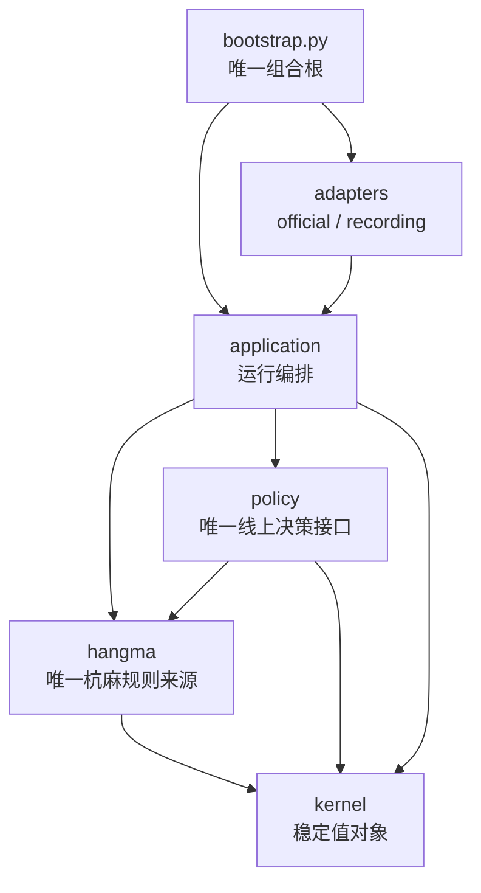

# 杭麻 AI Bot 技术方案与一个月实施计划

2026-09-29 R18 v2 当前规则发布绑定：旧 R18 v2 冻结包因上述吃碰分支事实引发的完整规则源码摘要变化而正确拒绝装配；旧包不修改，当前主线用独立包 ID 绑定同一候选源码和新规则摘要。H/M 两池 32 对同牌山完整桌及 10,851 次焦点评分决策的旧／新规则对账逐位一致（除发布与研究包装的诊断身份），官方胡／番金例 1,048／1,048 一致；这些是本地兼容性证据，真实动作时限与官方接线仍需验收。详见[G194](../review/freematch-deep-dive-20260925/G194-R18-V2-RULE-BINDING-RESULT-2026-09-29.md)。

2026-09-28 大牌复盘后的事实接线：生产规则模块按每个合法吃/碰后继弃牌，输出弃后爆头、连续飘/杠次数、链内飘白数及当时四白资格；候选级吃碰暂态爆头不冒充后继弃牌状态。旧审计缺字段保持未知，策略只读取规则事实；默认 R18 v2 评分源码不变。经典大牌题只作规则和局部路线压力题，效果必须经新牌山完整桌赛检验。详见[接口契约](implementation/interface-contracts.md)、[架构](architecture.md)与[G184 审查](../review/freematch-deep-dive-20260925/G184-CLASSIC-HIGHHAND-OPPORTUNITY-AUDIT-2026-09-28.md)。

2026-09-16 坐隐完整动作评分与进化框架 v4（**待实施**）：新候选由固定骨架调用单一 `score_actions`，拥有最终动作分数；V2 仅为冻结对照，旧增量接缝保留历史用途。`hangma` 生产有界规则事实与合法后续分支，`policy` 消费可见事实/参考代理形成完整排序，应用层继续负责保底、原截止与提交。离线 R-E 的 I1/M1 生成代码；合法前缀条件阶段与正常开局阶段分别评估真实终端目标，结果进入整体/专长/探索档案，确认集与搜索隔离。AIVAT 仅独立旁路，R-F 可选；不新增训练模块或第二套规则。新类型、阶段中途续打和分析配置接线尚待落码；线上四个外部端口不变。现行合同、图和迁移顺序见[实施方案](../review/llm-guided-heuristic-route-2026-09-15/SEARCH-SPACE-REDESIGN-2026-09-16.md)，历史说明仅适用于各自版本。

2026-09-16 坐隐第三阶段评估设计修正（待实施）：按规则覆盖大牌路径及合法组合，受控场景配对续打的条件效果用于生成反馈、开发排序和场景专长留存；自然完整桌赛/实际阶段评估及独立确认负责整体效果。四个即时同权 log 分项保留作结构对照，评分空间补路径进展、非线性交互与兑现代价。实验继续复用唯一规则和模拟器，线上只读玩家观察；新研究入口须绑定范围和身份，不改变旧准入记录。详细方法、依赖及证据边界见[评估修正合同](../review/llm-guided-heuristic-route-2026-09-15/PHASE3-RULE-AWARE-EVALUATION-2026-09-16.md)，与[架构](architecture.md)同步。

2026-09-14 吃供牌修复：用可选 `PublicEvent.claimed_tile` 保留官方 `chi.tile`，区分明确供牌与三张吃组合。字段贯穿官方解析、玩家观察、审计编解码和模拟/离线转换，由唯一规则模块用于公开牌去重。旧字段缺失时继续按原证据降级，不修改历史原文或猜补供牌。此项修复数据传递，不恢复线上补史、不增加请求，也不改变动作截止时间和学习特征宽度；依赖方向与[架构](architecture.md)、[接口协议](implementation/interface-contracts.md)同步。真实旧输入对照与验证记录见[修复报告](../review/chi-claimed-tile-2026-09-14/README.md)。

分牌型推进补充：复用既有进张循环提供普通型/七对各自的有效牌，先做逐进张取舍与持续路线评价；新集合的未知计数不能使旧规则事实整体降级。类型、审计和后续评估边界见[契约](implementation/pattern-progress-v2.md)。

2026-09-09 大牌路线研究按“合法案例 → 完整条件续打 → 单项候选 → 独立完整桌赛”推进，统一以正式赛 `YouCaiBiKao=false` 为目标。规则侧透出已经计算的普通型/七对分牌型向听，经既有事实接口和审计进入独立候选；不在策略复制规则，不改默认。细则与停止门槛见[迭代计划](implementation/big-hand-policy-plan.md)。

2026-09-09固定网络预算修订：默认预留100毫秒动作网络时间，替换剩余时间15%的做法。预算不足直接结束旧窗口；查询、计算、提交和主动缓发使用一致的截止，刷新不重复扣费或延长。依据实际RTT与动作机会损失共同取值，接受少量长尾；时钟校正和大量429根因仍未解决。详见[方案与验证](../review/fixed-network-budget-2026-09-09/README.md)，架构和接口协议同步更新。

2026-09-09 当前修订：规则版本为 `hangma-mvp-v10-public-counts`，指南仍为 v27。唯一规则模块按公开供牌证据去掉牌河与副露的同张重叠；无法证明的吃供牌仅使受影响候选的牌效明确失败，合法集、立即胡与独立保底保留。模拟公开历史补齐吃的三张组合和事件类别；公开接口形状及 V2 权重保持。快照原为无圈但后续已弃白时，以连续增量更新归属。先用一批 M=10、每场2局（共20单局）的测试房核验规则、共享查询额度与普通弃牌缓发，详细配置及证据见[修复记录](../review/public-tile-counts-2026-09-09/README.md)。

**2026-09-18 口径修订**：平台自 2026-09-14 前后起**不再**把被吃/碰/明杠领走的弃牌留在快照牌河中（2026-09-10 之前的快照仍保留；官方指南更新日志 v1—v34 **没有**这条记录）。因此公开计数改为「**逐副露实证 + 牌张守恒守卫**」：只有当供牌被证明仍在供牌者牌河中（官方 `chi` 的 `claimed_tile`，或「紧邻弃牌→鸣牌」的事件配对）才扣一次重叠；守恒等式 `Σ手牌+Σ牌河+Σ副露+牌墙−136` 判定为「已移除」时整批否决扣除；**无证据不再降级为未知，改为不扣重叠的保守数值**（公开可能多算 1、剩余少估 1）；只有输入自相矛盾（同码副露超物理上限、实证重叠超过河中实存张数、同一快照内证据互相矛盾）才返回 `None` 并沿用 `ANALYSIS_FAILED`。合法动作、立即胡与紧急候选都不读这份计数。证据链见 `review/test-tournament-20260917/probes/discard-river-accounting-evidence.md`；`ruleset_version` 字符串暂未变更（是否升号影响离线产物绑定，待定）。

2026-09-09 v9 修订：官方指南已同步 v27；`hangma-mvp-v9-catch-owner-v26` 替代下文历史 v8 的圈内跳窗兼容。官方公开圈主经适配器进入稳定观察，以快照序号约束有效期，唯一规则模块处理继承、换主与关圈，策略消费新合法候选，模拟器恢复圈主响应；冻结 V0/V1/V2 评分不变。七对豪华组与四白爆头沿用已验证修正。下一项策略实验优先复用逐进张真实结算，再单列吃碰后无立即胡的续飘缺项，不把合法性修复称为强度提升。接口与实际验收见[规则对齐记录](../review/catch-owner-v26-2026-09-09/README.md)。

2026-09-07 常规制品修订：启动、观测、封存、牌谱下载及重分析收口为 [固定操作命令](operations.md)，新输出统一到 `artifacts/`。测试房间支持 `--once` 和 `max_completed_batches`，正常完成指定批次数后停止创建注册进程。赛后生成数据集、规则和观察复核，保存输入哈希与分析源码；未知配置、摘要冲突和缺原始报文仍明确未检查或失败，不把产物生成成功等同于训练准入。架构同步见 [架构文档](architecture.md)。

> 状态：架构与第一阶段接口评审后草案 v0.5（2026-09-04 集成阶段更新：契约基线 v1.1——`SubmitRejectedNoRefresh`、候选牌效事实 `CandidateFacts`、kernel 裁决、审计词表；官方指南已审查基线 v15，2026-09-05 二次同步 v12–v15 含自动匹配机制）
> 日期：2026-09-04
> 目标日期：2026-09-30 前完成本地稳定运行并接入官方平台
> 关联资料：[架构与运行流程](./architecture.md)、[第一阶段实施导航](./implementation/README.md)、[冻结接口协议](./implementation/interface-contracts.md)、[MVP 验收标准](./implementation/mvp-acceptance.md)、[统一术语表](../UBIQUITOUS_LANGUAGE.md)、[官方赛事流程（2026-09-03）](./official-tournament-flow-2026-09-03.md)、[官方平台 API v8 记录](./official-platform-api-v2.md)、[当前 v7 多阶段最小 Bot Demo](./references/official_minimal_bot_v7.py)、[官方 v8 指南版本快照](./references/official-guide-version-v8.json)、[官方 v11 指南版本快照（2026-09-04，已审查基线）](./references/official-guide-version-v11.json)

## 1. 文档目标与范围

2026-09-06 官方适配修订：本轮生产入口固定 `state` 长轮询＋阶段边界查询，不接 SSE、不增加独立同步任务。适配器只维护一个当前观察，保留同单局已接收历史，区分快照基线与已消费水位；规则源补充链内飘次数、杠补牌来源并核对有完整依据的 god 转移，未知事实明确表示。原始事件的吃组合、杠/超时类别不能在投影中丢失。窗口及 409 预算只收紧，不因刷新重开时限。详见[修订策略与交叉评审](../review/official-adapter/repair-plan-2026-09-06.md)、[状态同步架构](./architecture.md#7-状态同步与请求资源)和[接口增补](./implementation/interface-contracts.md#观察完整性与截止契约增补2026-09-06)。本轮只做本地验证，官方测试房间或自由对局由后续验证阶段决定。

2026-09-06 实施补充：V1 已通过开发验收并冻结为 V2 的实验对照，线上默认仍为 V0。规则新增响应过牌等待事实，本地分析语义为 `hangma-mvp-v2-pass-progress`；组合根通过 `legacy_pass.py` 保持冻结 V0 的正常旧评分视图，原始审计事实不改写。V2 可选策略 `weighted_heuristic_v2` 已实现可比等待评分，复用 V1 权重与非 Pass 评分，不同时调参。类型和数据格式不扩展，边界与回归见[接口协议 §4.3–4.4](./implementation/interface-contracts.md#43-响应过牌的等待事实与冻结策略兼容2026-09-06)。完整桌赛强度与发布验收另行执行，不声称积分提高。

2026-09-08 保财补充：可选 `weighted_heuristic_v2_white_guard` 使用轻量包装器过滤有非白替代、且 `baotou=False` 的普通弃白；原 V2 评分保持。共享紧急路径改为普通窗口从右优先非财神，强制摸切白和无替代退路保留，不调用手牌搜索。本地版本升为 `hangma-mvp-v6-white-guard`，不改变官方合法集或指南版本。历史规则重算与原请求复现分开，完整抓打圈拥有者语义修复另行推进，详见[接口协议 §4.5](./implementation/interface-contracts.md#45-普通弃白保护与独立保底2026-09-08)。

2026-09-08 圈主修订：本地 `hangma-mvp-v7-catch-owner` 统一规则、保底、官方提交与模拟的圈主判断。任意弃白（含被迫摸切）更新当前圈主和开圈 seq；仅当前圈主弃非白结束，摸牌、杠补不提前结束。原始 god 标记与计番链独立保留；连续历史或全部弃白的权威牌河对账可证明归属，无法证明则保守降级。圈主吃碰只在现有权威响应身份内放行，并明示待官方执行核验，模拟开窗时序不作官方证据。见[接口协议 §4.6](./implementation/interface-contracts.md#46-抓打圈归属与接力2026-09-08)。

2026-09-08 定向验证：测试房可选 `catch_play_probe` 优先合法弃白及响应鸣牌，提高抓打圈覆盖；四身份可共同采用，只跑一批后自然退出。它保留原 V2 评分、规则约束与提交可靠性，禁止以赛事或自由赛模式启用。动作接受、拒绝和未观测窗口分别统计，普通弃白与财飘分开记录，详情见[测试方案](../review/piao-window-alignment-2026-09-08/probe-plan.md)及接口协议 §4.7。

2026-09-08 官方 v24 定向实测后，本地语义升为 `hangma-mvp-v8-catch-windows`：普通抓打圈中两次圈主具有碰牌形，官方仍直接推进下一摸牌。规则推进器按弃牌后的抓打标记决定是否跳过响应窗口，关圈后恢复正常响应；线上已有窗口内的候选复核继续保留。不得将未观测到的财飘后吃碰组合写成已验证收益路线，具体证据及局限见[实测报告](../review/piao-window-alignment-2026-09-08/live-t_fee4ab73c089.md)。

本文记录已经讨论和交叉评审过的：

1. 线上 Bot 与离线训练系统的架构、模块划分和依赖方向；
2. 各模块在未来一个月内可信的实现范围、核心算法和验证方式；
3. 已知赛事规则、官方接口、时间模型以及仍待确认的事项；
4. 2026-09-30 前的初步 roadmap。

本文按以下优先级控制范围：

- **P0 必须交付**：没有它就无法稳定参赛；
- **P1 应当交付**：对胜率或可迭代性有明确帮助；
- **P2 可选增强**：仅在 P0/P1 稳定后进入；
- **不进入本月范围**：短期收益不确定或工程成本明显超出一个月。

阅读提示：文中 `PlayerObservation`、`WorldState`、接缝（seam）、展开模拟（Rollout）、遗憾值（regret）等专业名词统一在[术语表](../UBIQUITOUS_LANGUAGE.md)中解释；“赛事阶段、官方场次、单局”按术语表区分，不再统称为“轮/局”。

### 1.1 本月明确不做

- 在线调用 LLM 决定打牌；
- 在线多 Agent 投票；
- 从零训练大型 Transformer 或完整纯自博弈 RL 系统；
- 在 1 秒吃碰窗口运行复杂搜索；
- 完整实现通用 ISMCTS/CFR 博弈求解器；
- 大规模适配日麻引擎或直接迁移日麻预训练权重；
- 自建观战 Web、牌桌 UI 等非参赛关键功能；
- 让 LLM 自动决定模型是否上线。

LLM 的定位是离线研发教练：协助编码、生成测试、分析牌谱和训练曲线、组织实验，但不进入线上行动闭环。

## 2. 核心结论

一个月内最可信的交付不是“先训练一个麻将大模型”，而是先交付一个**可参加官方测试赛事、全程自动运行、每个动作可追溯的 MVP（最小可用版本）**，再用牌谱和模拟逐步提高胜率：

1. 完成可靠的官方接入、状态同步、动作窗口状态机和 API 版本检查；
2. 以一个 Token 对应一个 `ParticipantRuntime`，按运行时 `config.M` 并发管理实际 `active_games`；
3. 第一阶段即建立覆盖全部动作族和已知特殊规则的杭麻规则核心；允许局部分支显式降级，但独立紧急路径必须随时可用；
4. 由 `TournamentSupervisor` 管理从报名/到位、逐阶段运行到终态退出的完整赛事生命周期；
5. 从第一版起保存非阻塞审计记录，使每次决策、动作尝试、恢复和最终结果都可关联；关键记录缺失时必须诚实标记审计降级；
6. MVP 验收后再完善模拟、赛事效用和小型候选结果模型；模型只有在完整 Policy 评测中显著胜出才启用。

线上决策链：

```text
官方事件
  → 可信玩家观察
  → 杭麻合法候选与确定性分析
  → 启发式保底动作
  → 可选：候选结果预测
  → 赛事晋级目标评估
  → 截止时间守卫与最终复核
  → 提交官方动作
```

离线迭代链：

```text
官方牌谱 / 本地模拟
  → 按当时信息重建 PlayerObservation
  → 隐藏世界采样和候选反事实模拟
  → 训练候选结果模型 / 轮次价值模型
  → 按官方配置完成桌赛/阶段/赛事、同牌山、换座位评测
  → 统计门禁
  → 人工审核后发布模型产物
```

## 3. 架构评审结论

早期方案把系统拆成 10 个线上模块和 4 个离线模块，职责方向基本正确，但交叉评审发现以下问题必须在编码前修正。

### 3.1 必须修正的问题

| 严重度 | 问题 | 修正决策 |
| --- | --- | --- |
| P0 | 一个 `GameState` 同时表达平台同步状态、玩家观察和模拟完整状态 | 拆为 `PlayerObservation`、`WorldState`、`DecisionRequest` |
| P0 | `rules.apply_action(GameState)` 在隐信息环境中语义不成立 | 线上规则只分析观察；只有模拟器推进完整世界 |
| P0 | 线上展开模拟依赖模拟器，但模拟器被放进纯离线目录 | 模拟引擎移入生产核心；离线代码只负责批量生成和训练 |
| P0 | 普通 Q 值、结果预测和赛事效用混用 | 明确 `CandidateOutcomeModel` 输出赛制无关的四家联合结果分布 |
| P0 | 隐藏牌和牌墙采样埋在展开模拟内部 | 增加显式 `BeliefSampler` 接缝 |
| P0 | 训练和线上可能各自实现编码 | 增加共享且版本化的 `learning` 模块 |
| P0 | 缺少动作命令状态机和非幂等 POST 处理 | 增加 `GameSession`、`ActionGate`、`DecisionBudget` |
| P0 | 运行壳默认一批场次结束即整赛结束 | 增加 `TournamentSupervisor`，只在 `finished/closed/void` 退出，并处理逐阶段确认和新增场次 |
| P0 | “一个窗口只提交一次”会阻止本地规则与官方不一致时安全降级 | 改为“任意时刻最多一个在途 POST”；明确 409 后刷新确认同窗仍开放，才可按原预算排除动作并重新规划 |
| P0 | 官方适配器直接产出 `DecisionRequest` 且接收 `DecisionProposal`，协议层耦合策略 | 适配器只产出 `ObservedActionWindow`、只接收 `ActionAttempt`；应用层组装规则和策略输入 |
| P0 | 赛事终态与当前身份淘汰混用 | 增加 `ParticipantTerminal`；淘汰只结束当前 Token 的运行，不宣称赛事终止 |
| P0 | 每 Token 请求调度与应用截止时间调度重叠 | 官方适配器唯一拥有每 Token 连接池、限速器和请求调度；应用层只拥有决策预算和任务监督 |
| P0 | 测试房间四 Token 和审计路径没有形成可验收方案 | 第一阶段使用四个隔离进程；审计路径加入 `participant_id` 并提供完整性验证器 |
| P1 | `heuristic/prediction/tournament/decision` 都暴露给启动入口 | 收口到一个深的 `policy` 模块，内部继续独立实现和测试 |
| P1 | `TournamentUtility` 混合官方规则和未来预测，且写死固定四阶段 | 拆为版本化阶段格式与确定性目标；海选首版使用晋级压力，固定四人阶段预测后续验证 |
| P1 | 评测只覆盖 Predictor | 正式评测完整 Policy、动态赛事流程和官方时间/恢复壳 |

### 3.2 设计原则

- **深模块**：复杂实现隐藏在小接口后，调用方不需要理解内部步骤；
- **接口即测试面**：调用方和测试通过同一个接缝（seam）；
- **只在真实变化处定义接缝**：例如官方/回放 Gateway、启发式/混合 Policy、神经/展开模拟结果估计器；
- **类型隔离信息权限**：线上 Policy 在类型层面不能读取完整 `WorldState`；
- **单一规则来源**：线上判定、模拟、数据生成和测试共享同一个杭麻规则核心；
- **训练/推理一致**：特征编码、动作编码、归一化和输出解释只能有一份实现；
- **副作用外置**：网络、时钟、并发和日志不进入规则与策略纯计算；
- **保底优先**：任何模型、搜索或日志异常都不得阻止合法动作按时提交；完整规则局部分支失败时由独立紧急路径兜底。
- **封闭提交结果**：只有明确拒绝可进入下一候选，结果不确定时同窗封锁，避免把网络失败误当成安全重试。

## 4. 最终模块划分

目标架构仍采用 8 个生产顶层模块和 4 个离线应用，但第一阶段只创建其中 6 个生产模块。它们是同一 Python 工程中的 package，不是微服务，也不需要独立部署。

```text
src/hangma_bot/
  kernel/                 # 极小稳定值对象
  hangma/                 # 确定性杭麻规则
  policy/                 # 唯一线上决策接缝
  application/            # 每 Token 参赛者运行时、跨阶段监督、多场调度和截止时间
  adapters/
    official/             # 官方平台适配器
    recording/            # 非阻塞审计记录适配器
  bootstrap.py            # 唯一组合根

scripts/
  run_participant.py      # 单 Token 正式路径
  run_test_room.py        # 四 Token、四进程测试路径
```

`simulation`、`competition`、`learning`、`offline` 与完整牌谱回放适配器在 MVP 之后按需求创建。第一阶段可以用保存响应驱动的轻量 Fake 验证端口，但不把它扩建成第二套模拟器或通用事件平台。

### 4.1 依赖方向

箭头明确表示“调用方依赖被调用方”。详细的场景边界、线上时序和训练评估数据流见[架构与运行流程](./architecture.md)。



严格禁止：

```text
hangma       → official / application / policy / learning
competition  → official / application
learning     → official / application
simulation   → 官方 HTTP 接口
policy输入    → WorldState
training     → application/runtime
CompetitionObjective → 实时 HTTP 查询
policy → WorldState / 官方 DTO
adapters/official → DecisionRequest / DecisionPlan
```

真正需要在运行入口稳定组装的角色只有：

```text
TournamentSessionPort + GameSessionPort + BotPolicy + AuditSink
```

四个接缝的签名、结果分类和兼容规则已经冻结在[第一阶段接口协议](./implementation/interface-contracts.md)。`HangmaRules` 当前只有一个真实实现，保持具体深模块；传输、限速、状态同步和动作门是官方适配器内部细节。

## 5. 核心数据类型与信息权限

### 5.1 `kernel`

只放长期稳定且跨模块共享的值对象：

```text
Tile         # 标准化牌值，不携带显示文本或协议差异
Seat         # 场次内座位编号 0—3
ScoreVector  # 四家积分向量，固定按座位 0—3 排列
RuleVersion  # 规则版本标识，用于回放和模型兼容性检查
Action       # 出牌、吃、碰、杠、胡、过的封闭联合类型
```

`Action` 应使用带类型的联合，而不是一个带大量可空字段的字典：

```python
# 所有内部动作的封闭联合；避免使用带大量可空字段的通用字典。
Action = Discard | Chi | Peng | Gang | Hu | Pass
```

内部动作身份至少考虑：

```text
canonical_action_id  # 内部规范动作标识，用于训练、评测和日志关联
gang_kind            # 杠的种类：暗杠、明杠或补杠
source_discard_seq   # 触发响应动作的官方弃牌事件序号
response_window_id   # 吃/碰响应窗口的唯一标识，用于防止重复提交
```

这些字段不一定发送到官方接口，但用于去重、日志、训练标签和回放。

### 5.2 `PlayerObservation`

线上策略唯一允许读取的麻将状态：

- 本人手牌和本人刚摸到的牌；
- 四家牌河、副露和剩余手牌张数；
- 当前牌局阶段、行动座位、可响应座位；
- 庄家、局号、剩余牌数、四家桌内积分；
- 财神、爆头、动作链、抓打圈等本人或公开状态；
- 已公开的公共行动历史。

不得包含：

- 他家真实手牌；
- 未公开牌墙；
- 未来事件；
- 赛后才知道的番型和结果。

赛事阶段、资格和排名不放进 `PlayerObservation`，由独立的 `CompetitionContext` 表达。这样桌内状态只有一个来源，测试时也不会把赛事缓存与牌局快照混合更新。

### 5.3 `WorldState`

只存在于 `simulation`：

- 四家完整手牌；
- 完整牌墙和随机数状态；
- 完整规则状态；
- 当前应行动玩家；
- 可用于结算的完整信息。

模拟内部的唯一可见信息投影如下；对外统一通过 SimulationEngine.frame 返回观察，不要求评估直接调用该内部函数：

```python
def observe(world: WorldState, seat: Seat) -> PlayerObservation:
    """只暴露指定座位当时可见的信息，绝不泄漏他家手牌或未来牌墙。"""
    ...
```

模拟器中的每个 Policy 也只能收到自己的 `PlayerObservation`。

### 5.4 `DecisionRequest`

线上动作窗口上下文由应用层构造，而不是由官方适配器直接返回：

```python
@dataclass(frozen=True)
class DecisionRequest:
    """策略在一个动作窗口内能够读取的全部输入。"""

    observation: PlayerObservation  # 当前座位可见的牌局信息，不含完整世界状态
    competition: CompetitionContext  # 已观察阶段和排名事实；桌内积分只在 observation
    rules: RuleAnalysis               # 本地合法候选、紧急动作、规则证据与降级信息
    decision_id: str                 # 同一 WindowKey 的重新规划保持不变
    trigger_seq: int                 # 触发本次决策的官方事件序号
    window_key: WindowKey            # 动作窗口唯一键，用于防止重复提交
    rejected_attempts: tuple[RejectedAttempt, ...]  # 官方已确认未执行的动作
```

时间限制由独立 `DecisionBudget` 表达，包含增强、保底和最晚发送三个单调时钟时间点。官方快照可提供 `window_deadline_ms`，适配器转换为单调截止；缺失时显式估计，时间准确性仍受两端钟差约束。应用层先扣固定100毫秒网络余量，再分配计算；同一窗口因409刷新后只收紧原预算，不重置或重复扣网络余量。

## 6. 各生产模块的关注点与实现思路

### 6.1 `hangma`：确定性杭麻规则（P0）

#### 接口

```python
class HangmaRules:
    """杭麻合法动作、牌型分析和结算的唯一确定性规则实现。"""

    def __init__(self, config: RuleConfig) -> None:
        """把不可变赛事规则绑定到实例；运行中不得替换。"""
        ...

    def analyze(self, observation: PlayerObservation) -> RuleAnalysis:
        """先构造紧急动作，再隔离分析各动作族并返回规则证据。"""
        ...

    def validate(self, observation: PlayerObservation, action: Action) -> ActionValidation:
        """提交前按当前观察复核动作；不访问官方 API。"""
        ...

    def emergency_action(self, observation: PlayerObservation) -> RuleCandidate | None:
        """走独立最小路径返回过、抓打牌或从右优先非财神的弃牌。"""
        ...

    def score(self, win: WinDescription) -> Settlement:
        """按官方规则配置计算四家结算结果，分数顺序固定为座位 0—3。"""
        ...
```

`RuleAnalysis` 一次返回：

- 所有合法动作；
- 每个动作的确定性牌型分析；
- 向听数、有效牌、结构类型；
- 财神、七对、爆头、动作链等规则标记；
- 可确定的胡牌分数和特殊分支。
- 独立构造的紧急候选、分析完整度和每个失败分支的 `RuleIssue`。

#### 实现思路

1. 使用花色分解动态规划或记忆化搜索计算面子、搭子、对子；
2. 普通型和七对分别计算向听，再结合财神数量取合法最优结果；
3. 有效牌按当前可见牌扣除后的剩余张数加权，不只计算牌种；
4. 吃碰杠后的牌型分析只返回确定性的行动后状态（afterstate），不伪造完整下一状态；
5. 胡牌和计分与官方 `fan-calc` 做金标准对拍；
6. 使用性质测试验证牌守恒、动作合法性和结算总分守恒。
7. 吃、碰、杠、胡等动作族分别隔离异常；任一复杂分支失败时仍保留其他成功候选和紧急动作。

#### 验证标准

- 官方规则金例全部通过；
- `fan-calc` 随机对拍无差异；
- 任意 `RuleAnalysis` 中不存在本地已经知道非法的动作；若仍因规则差异被服务端明确拒绝，应用层在原预算内排除该动作并降级；
- 规则计算在单次决策预算内稳定完成，不能访问网络。
- 第一阶段即覆盖全部动作族与已知特殊规则，不把“完整规则引擎”推迟到第二阶段。

### 6.2 `simulation`：完整环境与隐藏信息采样（P1）

#### 接口

2026-09-05 已由[parallel-v1 §6](./implementation/parallel-contracts.md#6-模拟模块接口-simulation-v1)取代早期 SimulationGame/reset/step 草案。唯一具体接口为 SimulationEngine.start/frame/advance/export_hand/from_replay；MatchSpec 使用完整 TournamentConfig，按 Rounds 完成桌赛；同帧响应统一裁决，advance 不修改原世界。实施见[模拟指南](./implementation/simulation-start.md)，历史路径另走 check_hand，评估不读 WorldState 字段。

2026-09-28 离线隐藏世界教师修正：杠上补牌会缩小可摸区的 `wall_back`，但底层不可变牌墙仍存放该已摸牌。公开状态一致重采样只能取当前 `wall_front:wall_back` 的可摸区和原始末尾 20 张保留区，不能把中间已消费的补牌再次加入三家暗手／牌墙隐藏池；修复后仍保持同一 `PlayerObservation`、各区域张数及牌码多重集。历史教师产物若含杠后截取窗，须按修复后的模拟器复核，不能直接当独立确认样本。

#### 实现要求

- 固定 seed 可完全重放；
- 状态转换不读取网络、文件和当前时间；
- 模拟不实现第二套杭麻规则；
- 状态可复制或持久化，支持候选反事实分叉；
- 首版优先多进程批量模拟，不要求本月完成 JAX/GPU 向量化。

#### `BeliefSampler`

以下是后续训练阶段的方向，不在本批 simulation-v1 首版交付范围；缺牌墙的官方记录先明确拒绝反事实导入，不能把采样能力当成已存在。

```python
class BeliefSampler(Protocol):
    """从玩家已知信息采样若干合法但不保证真实的完整世界。"""

    def sample_worlds(
        self,
        observation: PlayerObservation,  # 当前座位可见的状态
        history: PublicHistory,          # 截止当前时刻的公开动作历史
        count: int,                      # 需要生成的隐藏世界数量
        rng: RNG,                        # 显式随机源，用于实验复现
    ) -> tuple[WorldState, ...]:
        """返回与牌守恒、公开牌和剩余手牌张数一致的完整世界。"""
        ...
```

本月只要求 `UniformLegalSampler`：根据牌守恒、公开弃牌、副露和手牌张数生成合法隐藏世界。学习型 belief 属于 P2。

候选展开模拟应让所有动作共享同一批隐藏世界样本，降低比较方差。简单确定化可能存在策略融合偏差，因此其定位是启发式增强和离线教师，不宣称得到博弈均衡。

参考：[Information Set Monte Carlo Tree Search](https://eprints.whiterose.ac.uk/id/eprint/75048/1/CowlingPowleyWhitehouse2012.pdf)。

### 6.3 `competition`：阶段目标与海选晋级压力（P1）

2026-09-07 首版设计修订（提案未实现）：采用晋级压力（`QualificationPressure`，根据缺口和剩余机会生成的追分强度）与目标胡牌分值（`TargetWinScore`，希望一次胡牌取得的我方净增积分）驱动启发式。首版交付能改变动作的候选策略，不训练海选概率模型；桌赛重采样与后缀迁移退出实施主线。[完整方案](./implementation/qualifier-utility-v1.md)规定接口、数据、验收和证据边界，架构同步更新。

第一阶段只保留轻量 CompetitionContext 的基线仍成立；进入本次后续阶段时再创建具体 competition 实现，不预建通用预测接口。该模块只消费结构化赛事事实和可能积分结果，不读取 HTTP、文件、手牌或完整世界。

#### 阶段格式与确定性目标

晋级名额、三键顺序、阶段清零由已观察阶段事实与已审查官方流程派生，记录版本与依据，不解析自由文本。海选按实际到位与阶段计划取前 16/8/4，不能固定名额或把并发 M 当成完整剩余赛程。`games_played` 包含轮空的特殊计数，进度应独立核对。

赛事目标仍是海选直接晋级、16 强/8 强组内前 2、决赛最终名次；“最大化晋级概率”表达决策目的，不表示模块必须输出一个经过训练的概率。终态目标可按官方规则确定计算。三键不得相加，当前权威 rank 优先；假定结果必须同时更新受影响身份的成绩及未记账名次分。

#### 首版压力与结果判断

具体实现包含两项行为：

1. 根据榜单、本人身份、可靠剩余机会与事实质量生成目标意图（`QualificationIntent`，参考分值、压力档位或硬排名条件及其证据）。参考追分采用缺口/剩余机会的节奏尺度和有界参数，不声称已预测最终晋级线。
2. 对规则提供的四家结算判断目标达成。最后机会需要记账对齐、座位身份、相关结果封闭和并列依据；条件不足返回未定，不用桌分重复加榜单。

`hangma` 提供立即结算和成胡路线（`WinRoute`，未来条件成立时可得到什么结果及相应牌效），不读取赛事目标；`policy` 调用 competition，在基础启发式上加有界路线调整，足够分后不继续奖励多余番数。普通追分保留 Hu 优先；只有确定的最后机会、小胡不达标且存在合法达标路线见证时，新候选策略才允许例外。未知、超时或失败回到冻结基线。

`application/adapters` 补可选赛事事实和全榜记录；`offline` 补可更新人工情景，复用 simulation 公开接口做完整桌赛配对比较，再通过测试房间与自由赛检验运行与对手变化。完整官方海选样本是有限外部证据，不是首版训练或开发前提；真实硬目标能否启用仍取决于平台事实可见性。

实施前约束补充：第一层先固定目标/压力，用薄 offline 驱动、simulation、hangma、policy 验证战术取舍；第二层才接人工榜单到 competition 的闭环，真实运行适配最后做。冻结最小路线/意图契约后可以独立开发，现有基础权重迭代无需等待。当前桌内名次风格只是默认 +4/+2 的弃牌加分；新策略目标调整生效时通过不可变参数副本关闭旧风格，避免重复计权，增强关闭或无依据时返回完整原基线计划。独立工作区、版本组合及兼容门禁见[实施约束](./implementation/qualifier-utility-v1.md#81-最小评测先分两层不等待线上赛事适配)。

2026-09-08 最小字段增量：固定目标实验增加 RuleCandidate.value_facts（内部 4 项、每条路线 6 项）、一个可选规则分析工作量参数、新策略 3 项目标输入，以及离线分析配置/结算回调；模拟器、模型、choose 和 DecisionPlan 暂不扩展。榜单闭环再增加 CompetitionContext 的本人身份、可靠剩余单局数、榜单可用性 3 项，RuleAnalysis 的一个参考积分尺度，以及离线上下文工厂。已有三项榜单成绩继续复用，路线算法未实现与官方剩余赛程不明分别记录；详见[字段与生产者核对](./implementation/qualifier-utility-v1.md#54-从实际决策反推的字段增量与数据来源)。最后机会的精确事实及正式诊断载荷后续按真实样例收口，不把完整事实目录当成首批必填参数。

2026-09-08 并行契约补充：收益模型、比赛策略、启发式与赛事评估同时研发时，先按[公共契约清单](./implementation/qualifier-utility-v1.md#85-多条工作线并行前的公共契约)统一数据、单位、预测终点、续打条件、错误与版本，再分头实现新接触面。模型积分期望/结果分布、规则条件分值和启发式分分型，已有赛事价值不可再次套同一目标；各模块内部算法持续迭代，实验固定完整实现组合。契约兼容不等于升级后的策略效果已经通过，海选首版仍不等待模型训练。

本批公共接入的冻结范围和文件冲突按[方案 §8.6](./implementation/qualifier-utility-v1.md#86-公共接入冻结清单与并行冲突图)执行：先固定规则候选事实、赛事输入、目标与基础评分职责、原窗口预算、读写兼容和离线驱动；共享文件由唯一集成人落改动。候选修复不得丢弃仍有效的新字段，离线规则计算必须纳入完整耗时，两种正式运行入口在接入时统一消费赛事事实。冻结交付是可执行用例通过的共同提交；本次文档整理未产生该提交。

#### 后续固定四人阶段与概率研究

16 强以后可研究当前四家三键、剩余场次/单局与庄闲条件到阶段最终排序的分布；不得把单个桌赛排名直接当作多场累计的阶段排名。先验证规则化方法与经验数据的适用性，确有必要再训练模型，不属于本版依赖。海选截线预测器暂缓，不因完整赛事样本稀少而将不具代表性的自由赛频率包装成正式分布。

[Suphx](https://arxiv.org/html/2003.13590v2) 为跨单局最终目标提供研究背景，但不验证本项目的压力公式或参数。首版可靠性来自同源规则、明确的信息权限、成组边界测试、独立配对效果和时限门禁，详见[算法依据](./implementation/qualifier-utility-v1.md#10-算法依据与证据边界)。

### 6.4 `learning`：训练/推理共享实现（P2）

统一拥有：

```text
FeatureSchema       # 特征字段、顺序、形状和版本
ObservationEncoder  # 玩家观察到模型输入张量的唯一编码器
ActionEncoder       # 内部动作到模型动作编号的唯一编码器
NetworkDefinition   # 训练与线上推理共用的网络结构
Calibration         # 概率校准参数与方法版本
ModelArtifact       # 可发布的权重、配置和兼容性元数据
InferenceAdapter    # 批量推理及超时/异常转换实现
```

模型产物必须包含：

```text
guide_api_version        # 训练数据对应的官方指南版本
ruleset_hash             # 本地杭麻规则内容哈希
feature_schema_version   # 玩家观察特征定义版本
action_schema_version    # 动作编号与参数定义版本
engine_commit            # 生成数据时的模拟器代码提交
continuation_policy_id   # 展开模拟所用续打策略版本
opponent_pool_id         # 生成数据时的对手池版本
belief_sampler_version   # 隐藏世界采样算法版本
calibration_version      # 结果概率校准版本
training_data_id         # 可追溯的训练数据集标识
checkpoint_hash          # 权重文件内容哈希，用于完整性校验
```

关键版本不匹配时拒绝加载并自动使用启发式 Policy。

#### `CandidateOutcomeModel`

本项目不优先学习一个与赛制绑定的标量 Q 值，而是学习：

```text
PlayerObservation + CandidateAction
  → 本局结束时四家积分变化的联合分布
```

形式上可记为：

```text
Z^π(o, a)
```

其中 `π` 是动作后的 continuation policy 和 opponent pool，必须版本化记录。模型输出至少包括：

```python
class HandOutcomeDistribution:
    """一个候选动作对应的本局联合结果预测。"""

    joint_score_delta_samples: Array[N, 4]  # N 个四家积分变化样本；第二维按座位 0—3 排列
    winner_probs: Array[5]                  # 获胜/流局概率；顺序为座位 0—3、流局
    uncertainty: float                     # 模型不确定性标量；越大表示越应信任启发式保底
```

不能分别预测四个人的独立积分分布后再拼接，否则会丢失相关性。可参考 distributional RL 的收益分布思想，但本项目必须保持四家结果联合一致性。[QR-DQN](https://arxiv.org/abs/1710.10044)。

首版模型目标：1-3M 参数、CPU 毫秒级推理、一次批量评估全部合法动作。网络可采用小型 1D-CNN/ResNet 加全局标量特征和动作 embedding。

### 6.5 `policy`：唯一线上决策接缝（P0/P1/P2）

#### 外部接口

```python
class BotPolicy(Protocol):
    """在给定玩家可见信息和时间预算内产生有序候选计划。"""

    async def choose(
        self,
        request: DecisionRequest,  # 本次动作窗口的不可变输入
        budget: DecisionBudget,    # 使用单调时钟计算的软/硬时间预算
    ) -> DecisionPlan:
        """返回完整可审计候选顺序；不执行网络提交。"""
        ...
```

具体实现：

```text
WeightedHeuristicPolicy  # P0，完全不依赖模型
SafeFallbackPolicy       # P0，只保留规则紧急候选
TargetAwareHeuristicPolicy # P1 提案，海选压力 + 规则路线事实 + 冻结基础启发式
HybridPolicy      # P2，启发式 + CandidateOutcomeModel + competition
```

第一阶段由应用层先调用 `HangmaRules` 生成 `RuleAnalysis`，再把它放入 `DecisionRequest`；策略只排序规则候选，不能自行声明合法动作。`DecisionPlan` 返回完整有序候选、评分分解、规则/策略降级原因和计划版本。明确 409 后应用层使用同一 `decision_id`、原始预算和已拒绝动作重新调用策略。

本次拟议的 TargetAwareHeuristicPolicy 保留 choose 接口，消费扩展后的赛事事实和规则路线；首轮复用原计划的分项与原因，正式运行时再收口可选赛事诊断载荷，不以候选结果模型为前提。原基线保持冻结，跨模块载荷扩展及最后机会弃胡例外按[首版方案](./implementation/qualifier-utility-v1.md)单独验证。

后续依赖模型的 `HybridPolicy` 内部增加：

```text
RuleAnalysis          # 应用层已经生成的合法候选和确定性分析
SafeFallbackPolicy    # 在任何增强计算之前已生成的保底计划
OutcomeEstimator      # 估计候选动作的四家联合结果
CompetitionEvaluator  # 按当前赛事阶段把结果转换为效用
候选保留策略           # 保留特殊动作、高收益、低风险和高方差候选
不确定性处理           # 模型缺乏把握时偏向启发式保底
截止时间降级           # 剩余预算不足时取消增强计算
```

#### 启发式核心算法

2026-09-05 的近期施工范围以[启发式三个候选版本计划](./implementation/policy-iteration-plan.md)为准：V1 修可靠排序和真实时限验证，V2 统一 Pass 与吃碰的规则牌效基准，V3 只做有限参数试验。以下保留总体设计方向，不表示当前已实现严格分层、结果期望估计或对手概率模型。V1 已以独立实现保留在同一代码树，旧 weighted_heuristic 保持 V0；候选代码和效果验证分开交付，默认稳定策略不自动切换。

启发式优先使用分层排序，避免早期依赖大量拍脑袋权重：

```text
1. 胡牌和硬规则优先
2. 最低向听数
3. 最大加权有效牌数
4. 最大预期成牌收益
5. 最大手牌灵活度
6. 最小对手加速风险
```

杭麻没有点炮胡，因此对手风险重点不是放铳，而是：

- 弃牌被下家吃或其他玩家碰的概率；
- 吃碰后对手缩短了多少结构；
- 是否加速庄家或直接排名竞争者；
- 是否让对手进入爆头、飘、杠等高倍链。

模型很小时应评估全部合法动作；只有昂贵的展开模拟才筛选候选。胡、杠、爆头/飘特殊分支，以及最高收益、最低风险、最高方差候选不得被普通 Top-K 直接裁掉。

#### 线上展开模拟（Rollout）限制

- 吃/碰 1 秒窗口不运行展开模拟；
- 出牌 3 秒窗口只允许有界、可取消的少量搜索；
- 任何时候先算出 fallback，再启动模型或搜索；
- 模型/搜索未在软截止时间前返回，立即使用保底动作。

第一阶段不创建模拟或模型接缝。后续确有至少两个结果估计实现时，再在 `policy` 内引入深的 `OutcomeEstimator`；不得让策略直接读取或操纵 `WorldState`。

### 6.6 `application`：多场运行与资源调度（P0）

负责：

- `ParticipantRuntime` 绑定一个参赛 Token 和一个 Policy；正式赛事启动一个，测试房间的四个 Token 启动四个；
- 每个 `ParticipantRuntime` 读取运行时 `config.M` 作为容量上限，并以 `/api/me.active_games` 作为实际应运行场次的权威集合；
- `TournamentSupervisor` 持续轮询顶层 `status`，只在 `finished/closed/void` 退出；
- 在 `stage_open` 对晋级者或候补幂等确认到位，在 `stage_done` 等待组委会推进；
- 持续发现新增 `active_games`；
- 处理新阶段、动态降档和无上限决赛加赛产生的新 `game_id`；
- `active_games` 暂时为空时保持赛事监督，不误判终局；
- `stage_crashed=true` 时隔离旧阶段尝试并等待重新确认/重赛；
- 每场独立 Session，单场失败隔离；
- 每场独立可取消任务；单场异常不能取消其他场次，阶段切换和退出不能遗留最长 30 秒的旧长轮询；
- 决策增强、规则分析和截止时间监控；
- 优雅退出与永久错误隔离。

应用层的场次任务包装一个注入的 `GameSessionPort`，负责“取 `ObservedActionWindow` → 建立一次预算 → 规则分析 → 调用 Policy → 复核 → 记录 → 提交”的单场运行循环。`application` 决定**何时**报名/确认阶段、启动或回收场次、等待新阶段以及结束当前身份；官方适配器只提供协议能力，不能把这些赛事流程藏进 HTTP 客户端。

测试房间固定由 `run_test_room.py` 启动四个隔离子进程，每个子进程复用正式单 Token 入口。第一阶段不建设同进程多租户、共享模型或通用测试编排框架。

职责分配：

```text
OfficialRequestScheduler（官方适配器内部，每 Token 恰好一个）
  action POST > gap/409/模糊提交恢复 > 长轮询 > ranking refresh

DecisionBudget（应用层）
  增强截止 > 保底截止 > 最晚发送；同一窗口刷新不重置

TournamentSupervisor
  跨阶段等待/确认、动态发现比赛、启动/回收 Session、故障隔离

ParticipantRuntime
  一个 Token 的身份、赛事监督器、规则、Policy 和最多 M 个场次任务
```

官方连接池、限速器、请求优先级和 `ActionGate` 不属于应用层。简单外部进程守护可以有限次数重启单身份入口；重启后必须从 `/api/me` 和 `seq=0` 恢复，不能重放内存中的动作判断。

### 6.7 `adapters/official`：官方平台适配器（P0）

内部包含：

```text
OfficialTransport         # Bearer 认证、v8 HTTP 契约、限速和错误映射；类名不绑定易变版本号
TournamentClient          # 顶层状态、阶段、资格、排名和 ready 语义
OfficialGameSessionAdapter # 实现 GameSessionPort，封装单个 game_id 的长轮询和动作提交
StateProjector            # 官方快照/事件到内部玩家观察的纯转换
ProtocolSyncState         # 单个 game_id 的 seq、gap、全量重建和未知事件恢复
ActionGate                # 每场一个在途动作 POST、确认和模糊状态封锁
OfficialRequestScheduler  # 同用户state额度与截止调度；赛事控制和每场HTTP槽、OTHER冷却隔离
CompetitionContextCache   # 带更新时间的阶段格式、三键积分和排名缓存
```

2026-09-08 用户共享state调度：同一user_id的所有game_id共用滚动一秒最多16次的实际发送账及state 429冷却，撤销每场2/s或1/s静态份额。每场仍最多2个在途HTTP，其中state最多1个，动作POST另由ActionGate保证串行；各场和赛事控制通道的HTTP槽、OTHER冷却独立。state最早在新建用户账一秒后发起，以跨过旧进程计数窗口；控制请求与POST不等。重新打开场次不重置用户账或重启等待。连接池按Token共享，默认64连接、48保活连接；不同用户的账本和冷却隔离。依据为2026-09-08抓取的指南v25，服务器内部计次算法仍未公开。

一个月内不建设正式 CA 或证书签发流程。`OfficialTransport` 可以对**配置中明确列出的官方内网 `base_url`**关闭证书校验，以兼容当前自签名 HTTPS；不得全局修改 Python/操作系统的 TLS 行为，也不得让任意目标继承 `verify=false`。传输层仍验证目标主机与启动配置一致。

Token 管理保持简单：团队可以按约定集中放在私有仓库的运行配置中，但只能由组合根加载并注入 `ParticipantRuntime`；不得散落在源码、测试 fixture、错误对象和审计记录中，任何 `Authorization` 请求头在记录前必须删除或脱敏。启动时用 `/api/me` 和规则接口校验“运行模式、预期赛事、Token 身份、API/规则版本”，避免把测试 Token 误接正式赛事或反之。

`StateProjector` 是纯实现模块，可独立回放测试，但不需要作为 `bootstrap` 的顶层接缝。

#### 状态同步

- `seq <= last_seq`：**2026-09-18 修订**——仅当该 seq 确实已保存进历史才算「重复」并幂等忽略；水位被 `seq=0` 全量快照推高而本地从未保存过的事件按「未入库」归档进历史（不推进水位、不重放牌面），未知类型或他家私有摸牌不归档并登记观察异常；
- `seq != last_seq + 1`：不应用部分增量，立即全量重建；
- `gap=true`：全量重建；
- 全量快照整体替换，不做字段级 merge；
- `pending=true`：不修改状态和 seq；
- 未知事件先分类：已确认不影响关键状态的兼容新增事件只记录；未知关键事件才将状态标记为需要重建；
- 当前桌积分以权威 game snapshot 为准；
- 全场/组内榜单单独缓存并携带 `as_of` 时间和数据陈旧程度；
- `games_played` 只按当前阶段解释，阶段切换后丢弃旧进度派生值；
- `stage.total`、`rank` 和 `god_count` 直接接受平台权威值，不根据旧公告或事件流覆盖。

#### `ActionGate`

动作窗口状态机：

```text
OPEN                # 窗口开放，尚未选择提交者
  → SUBMITTING      # 一个 HTTP 动作请求正在发送
  → ACKED           # 官方已经明确响应成功
  → CONFIRMED_BY_EVENT  # 后续权威事件确认状态已经改变

明确拒绝：REJECTED_409 → seq=0 刷新 → 同窗 OPEN（允许下一候选）或 CLOSED
异常：AMBIGUOUS_TRANSPORT_FAILURE（同窗封锁）/ EXPIRED（窗口过期）
```

窗口键至少包含：

```text
game_id         # 官方场次标识
+ round_no      # 当前单局编号
+ trigger_seq     # 触发窗口的官方事件序号
+ phase         # response_peng 与 response_chi 必须区分
+ seat          # 当前拥有动作权的座位
```

同一弃牌的 `response_peng` 和 `response_chi` 是两个窗口，不能只按 `last_discard` 去重。

动作 POST 是非幂等操作。发生网络超时后不能盲目重试，因为服务端可能已经执行但响应丢失；必须转为 `AMBIGUOUS`，同一 `WindowKey` 不再接受动作，等待权威事件或全量快照证明窗口已经迁移。

这不等于整个窗口只能尝试一次。官方明确返回 409 后，适配器先用 `seq=0` 重建；只有确认动作未执行、同一 `WindowKey` 仍需我方行动时，才返回 `SubmitRejectedRetryable`。应用层随后在**原始**截止时间内排除该动作并选择下一候选。同一场任意时刻仍最多一个在途 POST。

#### 对外接缝

接口基线见 [`application/contracts.py`](../src/hangma_bot/application/contracts.py) 和[第一阶段接口协议](./implementation/interface-contracts.md)。关键边界是：

- `TournamentSessionPort` 完整提供 `initialize/register/ready/next_update/open_game/aclose`；
- `GameSessionPort` 返回 `ObservedActionWindow`，不返回策略专用 `DecisionRequest`；
- `submit()` 只接收 `ActionAttempt`，返回封闭的成功、明确拒绝可重规划、明确拒绝已关窗、结果不确定或未发送；
- `ActionGate` 完全隐藏在适配器内部；
- 第一阶段用保存响应驱动的 Fake 做确定性测试，不宣称已经实现完整牌谱回放或模拟器。

### 6.8 `adapters/recording`：非阻塞记录（P0）

2026-09-05 后续设计：按[审计增强实施方案](./implementation/audit-enhancement.md)和[parallel-v1](./implementation/parallel-contracts.md)实施（新增部分尚未实现）。保持 v1 信封和已经合入的原文留存/SSE，以 audit-plus-v1 profile 补齐完整输入、评分、复核、结束证据和生产端失败持久化；赛后以文件清单和哈希封存为可迁移证据包。实施分工见[并行施工导航](./implementation/parallel-workstreams.md)。

审计不是普通调试日志，而是 MVP 的正式输出。所有记录使用以下关联键串起“赛事生命周期 → 对局事件 → 决策 → 提交 → 结果”：

```text
run_id + tournament_id + participant_id + stage_attempt_id
       + game_id + round_no + trigger_seq + decision_id + attempt_no
```

其中 `participant_id` 是本地脱敏身份，不保存原始 Token。至少记录：

- 本次运行的指南/API 版本、配置快照、代码提交、Policy/规则/模型/特征版本；
- 赛事 `status`、`stage.no/role/total`、资格角色、到位结果和生命周期转换；
- 脱敏后的官方快照/事件或其不可歧义的引用，以及规范化 `PlayerObservation`；
- 合法候选、规则证据、启发式分项和候选排序；
- 该环境实际提供的阶段/排名快照；模型预测、晋级效用和不确定性在对应能力启用后记录；测试房间不强求赛事排名；
- 选择原因、fallback 原因、决策预算、各步骤耗时和最终动作；
- 动作提交结果、409、序号缺口、重建、断线重连和进程恢复；
- 阶段尝试是否作废及原因、每场最终积分、阶段排名和赛事终态。

建议每次运行生成以下可整体归档的目录：

```text
runs/{run_id}/
  manifest.json                 # 版本、配置、脱敏身份和启动检查
  lifecycle.jsonl              # 顶层状态、到位、场次发现和恢复过程
  participants/{participant_id}/
    decisions.jsonl            # 候选、评分、选择、时延和提交结果
    games/{game_id}.jsonl      # 该身份在该场的脱敏事件/快照与规范观察
    summary.json                # 该身份积分、错误、超时和降级统计
  summary.json                  # 运行级汇总
```

写入必须经过有界后台队列；磁盘慢、磁盘满或序列化失败不能阻塞合法动作。低优先级协议原文在背压下可以计数丢弃；提交 intent/outcome 等高优先级信封缺失时必须把运行标记为 `audit_degraded`，不得继续宣称完整可审计。`SUBMISSION_INTENT` 在调用 `submit()` 前入队，结果返回后入队 `SUBMISSION_OUTCOME`。运行结束时尽力刷新并由验证器检查悬空 `decision_id + attempt_no`。Token 必须在进入记录模块前移除，记录端再次防御性脱敏。

独有协议原文沿用低优先级 RAW_PROTOCOL_STATE，背压丢失必须如实计数；规范权威状态与决策证据保持高优先级，不重复建设协议存储。监控作为独立只读命令消费同一份记录，首版为终端/JSON，展示实际观察、候选和已有异常，不执行自动决策或新增平台轮询。

### 6.9 自动匹配生命周期（MVP 后，待实施）

用户已确认接入 `/api/match`，详见[开工指南](./implementation/free-match-start.md)。新增 OfficialAutoMatchSession 复用现有 TournamentSessionPort/GameSessionPort，application 的专用运行单元负责单自动房等待、最多实际 M 场并发和关闭前收尾；不调用 register/ready，不重写动作门或 SSE。仅显式 AUTO_MATCH 模式允许 initialize 有一次匹配入席副作用，旧模式保持发现与 Token 作用域约束。该受控例外及初始化重试安全见[接口协议 §6](./implementation/interface-contracts.md#6-赛事与参赛者终态)。v15 默认 M=10/Rounds=8，当前修复后的 M=2 测试房间验收不替代本入口的目标并发验收。

## 7. 离线模块与训练闭环

### 7.1 `offline/replay.py`：证据整理与统一牌谱（P1，待实施）

具体字段见[parallel-v1 §4—5](./implementation/parallel-contracts.md#4-数据身份来源及版本)，采集和命令见[审计方案](./implementation/audit-enhancement.md)。本批具体开发 simulation 与 offline，评估通过公开 SimulationEngine 驱动完整桌赛；各线指南和文件所有权见[施工导航](./implementation/parallel-workstreams.md)。不预建训练空接口。职责：

- 消费已封存证据包，保留不可变的原始审计和可取得的官方牌谱；
- 优先从保存的决策输入恢复当时的 `PlayerObservation`、原始规则候选及实际行为；新规则重算另存为实验，不覆盖历史；
- 导出统一牌谱并区分 `observed/full_history/full_world`，即玩家观察、完整历史轨迹和具备完整世界初始数据；缺少未摸牌墙时不能宣称可精确反事实分叉；
- 保存最终结算，但不把未来信息放入输入特征；
- 保存实际存在的赛事、阶段和阶段尝试标识，以及实际取得的 `total_score/place_points/god_count/rank`；测试房间无对应赛事信息时保留缺失；
- 将 `stage_crashed` 后被平台清空的旧阶段尝试标为作废，默认排除训练标签和正式成绩；
- 按共同契约 split_group_id 划分训练集和验证集；四身份和重启视角共享稳定 hand_id，不能按本地阶段尝试 UUID 切分同一单局。

自动泄漏测试：改变未公开手牌和未来牌墙、保持 `PlayerObservation` 不变，线上特征编码和模型输出必须完全一致。

官方赛后完整四家手牌可用于类似 Suphx oracle guiding 的教师标签，但学生模型输入始终只能是 `PlayerObservation`。[Suphx](https://arxiv.org/abs/2003.13590)。

### 7.2 `offline/generate.py`（P1/P2）

```text
PlayerObservation
  → BeliefSampler
  → 同一批 WorldState
  → 多候选动作分叉
  → 版本化续打策略和对手池继续行动
  → 四家联合积分结果
```

每条数据记录：

```text
continuation_policy_id  # 候选动作之后使用的续打策略版本
opponent_pool_id        # 对手策略集合版本
belief_sampler_version  # 隐藏世界采样算法版本
ruleset_hash            # 生成标签时的杭麻规则内容哈希
random_seed             # 复现本次采样和模拟的随机种子
```

首轮不对所有状态做昂贵反事实模拟，只选择：

- 启发式前两名分数接近的状态；
- 吃/碰/杠/过等结构性决策；
- 最后一两局的高方差晋级决策；
- 模型高不确定或历史上遗憾值较高的状态。

### 7.3 `offline/train.py`（P2）

本月仅考虑两个小模型：

1. `CandidateOutcomeModel`：候选动作到本局四家联合结果；
2. `StageContinuationModel`：固定四人小组的阶段账本、各场进度、剩余机会与阶段格式，到本阶段结束时四人联合排序分布；不是单个桌赛的终分排序。16 强/8 强累计本阶段全部场次取组内前 2，决赛另按累计总得分和加赛规则处理。

两个模型分别训练与验收：第一模型预测单局结果，第二模型预测这些结果进入剩余阶段后的排序；`competition` 按海选、组内晋级或决赛选择效用，`policy` 统一选择动作。不用一个输入赛事目标的策略网络替代这两个职责。结果预测始终记录续打策略与对手池版本；阶段账本保留三键和未入账边界，不能把本人平均分直接换算为晋级概率。

海选首版使用实时榜单、可靠进度和有界追分参数，不训练 `QualificationCutoffEstimator`；本节模型均不属于该首版依赖。未来重启截线研究需独立证明数据适用性。任何后续阶段模型仍须包含阶段格式和三键账本，不能将三键相加成“综合分”。

训练一旦不能在单张常规 GPU 上数小时级迭代，应缩小模型和数据，不扩大基础设施。

参考项目：

- [Mortal](https://github.com/Equim-chan/Mortal)：规则引擎、局部 DQN、全局 GRP 分离，legal mask 与小型 GRP；
- [RLCard](https://github.com/datamllab/rlcard)：环境、合法动作、智能体和训练循环接口，但其麻将规则过于简化，不能复用规则或权重；
- [MahJax](https://github.com/nissymori/mahjax)：`init/step/observe`、批量模拟和 BC/PPO 示例，本月只借鉴环境接口和可重放思想；
- [Suphx](https://arxiv.org/abs/2003.13590)：global reward prediction、oracle guiding、run-time policy adaptation；
- [QR-DQN](https://arxiv.org/abs/1710.10044)：收益分布学习思想。

### 7.4 `offline/evaluate.py`（P0/P1/P2）

评测分四层：

1. **规则一致性**：官方金例、`fan-calc` 对拍、牌守恒和结算守恒；
2. **局部策略**：固定困难状态、候选遗憾值、结果分布校准；
3. **完整赛事**：按 `config.Rounds` 完成桌赛，并覆盖海选前 16/8/4、组内前 2、候补递补、阶段降档和决赛加赛；
4. **运行可靠性**：1 秒/3 秒动作截止时间、并发、409、序号缺口、阶段间空转、逐阶段确认、中断重赛、限速、模糊提交和模型降级。

桌内策略比较仍使用同牌山和换座位；赛事指标再以完整阶段或完整赛事 seed 聚类 Bootstrap。不能把同一场的上百个决策或同一赛事内多个阶段当作独立样本。

评测程序只输出报告和置信区间；模型晋级由独立门禁规则和人工审核决定。

### 7.5 三类验证环境的边界

| 环境 | 主要回答的问题 | 不应承担的任务 |
| --- | --- | --- |
| 本地模拟器 | 策略 A/B、固定随机种子、同牌山换座位、批量生成反事实数据和长期回归 | 不能证明官方协议、限速和阶段流程兼容 |
| 官方测试房间 | 真实协议、杭麻规则差异、动作时限、同一组四个 Token 与 `M` 个并发场次、官方赛后数据 | 当前公开契约下是单阶段，不等价于完整正式赛事 |
| 官方测试赛事 | 报名/到位、逐阶段确认、晋级/候补/降档/重赛、终态退出等全生命周期 | 不替代大样本策略统计；具体外部启动协议待 MVP 后实测固化 |

正式赛事只用于最终运行和有限的线上验证，不承担训练。测试房间的四个 Token 表示四个参赛身份，而不是每个并发场次各需要四个新 Token；当设置 `M` 时，`run_test_room.py` 启动四个隔离进程，各自运行一个 `ParticipantRuntime`，每个运行时分别管理平台返回的最多 `M` 个 `active_games`。

## 8. 已知赛事信息

### 8.1 参赛形式

- 早期命题说明把第一至第三轮称为远程联赛；当前平台已改用海选、16 强、8 强和决赛等动态阶段名，详细流程以 §8.2 为准；
- 决赛在官方指定场所，继续接入命题方提供的杭麻竞赛平台；
- 全程由 AI 自动决策，人不得手动参与；
- 2026-09-30 前须保证程序本地稳定运行并可接入平台。

### 8.2 晋级流程

- 当前官方赛事流程页为 2026-09-03 版，完整摘录和分析见[官方赛事流程与多阶段晋级规则](./official-tournament-flow-2026-09-03.md)。
- 阶段结构按开赛时实际到位人数自动生成：17 人及以上走海选→16 强→8 强→决赛；9—16 人走海选→8 强→决赛；5—8 人走海选→决赛；4 人直接决赛；少于 4 人作废。
- 海选按批随机同桌并产生全场排名，目标分别为前 16、前 8 或前 4；无法凑桌者该批轮空并记 0 分。
- 16 强和 8 强都是 4 人组内循环，每组前 2 晋级；分组采用名次种子蛇形，并尽量避免上一阶段同组者过早重逢。
- 每个新阶段前，晋级者和候补都要重新确认；未确认的晋级者会被已确认的高顺位候补替代。确认人数不足时可能动态降档。
- 晋级轮按 `total_score → place_points → god_count` 三键排序，三个键不相加；每阶段分数清零。
- 决赛只看 `total_score`，任何同分都会让四人继续加赛并并账，直到 1—4 名两两不同，加赛无场次上限。
- 旧赛事公告写“每轮 8 局”；当前平台把每场单局数作为 `config.Rounds` 配置。程序和评估均以运行时配置为准，正式赛是否固定为 8 仍待赛程创建后确认。

由此确定数据化赛事目标：

```text
海选：最大化 P(全场排名 ≤ G)，G ∈ {16, 8, 4}
16 强 / 8 强：最大化 P(组内排名 ≤ 2)
决赛：最大化最终名次效用，并对同分后的继续加赛建模
```

### 8.3 当前调研得到的杭麻规则

以下规则需要继续用官方规则页、测试房间和 `fan-calc` 固化为金例：

- 136 张牌，不含花牌；
- 白板为财神，可作为万能牌使用；
- 财神牌本身不用于吃、碰、杠等公开组合，可主动打出；
- 以自摸胡为主，当前规则记录未包含点炮胡；
- 支持普通牌型和七对；
- 吃牌次数最多 2 次，碰/杠次数不限；
- 不允许抢杠；
- 牌墙最后 20 张保留；
- 存在爆头、飘、杠等动作链和倍数；
- `YouCaiBiKao` 为锦标赛可变参数；
- 每次打出财神都开启或接管抓打圈：最新弃白者可手切及在合法窗口吃、碰、明杠、补杠；其他玩家只能摸切，仍可暗杠和自摸胡。白板本身不能被吃碰杠；圈主弃非白才关圈（v26）；
- 庄闲结算不对称，精确分值必须以本地规则和官方 `fan-calc` 对拍为准。

## 9. 已知官方接口与时间模型

当前记录基于 2026-09-03 的官方指南 v8；多阶段破坏性协议在 v7 引入。平台仍在迭代，启动和阶段边界必须检查版本。

### 9.1 关键接口

| 用途 | 接口 | 备注 |
| --- | --- | --- |
| 身份与活跃比赛 | `GET /api/me` | 返回 `tournament_id`、`active_games` |
| 当前锦标赛规则 | `GET /api/tournaments/me/rules` | 读取 `Rounds`、底分和时间窗口等 |
| 报名/逐阶段到位 | `POST /api/tournaments/{id}/register`、`ready` | 幂等；`stage_open` 中 `ready` 只允许晋级者/候补 |
| 锦标赛状态和实时排名 | `GET /api/tournaments/{id}` | 包含阶段、资格、`my_games` 和三键 `ranking` |
| 对局长轮询 | `GET /api/games/{id}/state?seq=N` | `seq=0` 为权威快照 |
| 提交动作 | `POST /api/games/{id}/action` | 非幂等；非法/过期返回 409 |
| 指南版本 | `GET /portal/api/guide/version` | 新 breaking 版本阻止进入新赛事 |
| 官方计分校验 | `POST /portal/api/tools/fan-calc` | 仅用于测试和离线校验 |
| 测试房间赛后数据 | `/api/test-rooms/{id}/games/{batch}/events` | 完赛后含四家起手牌和各局结果 |

Portal Cookie 接口不属于稳定 Bot 契约，线上 Bot 不依赖。

### 9.2 v7/v8 关键变化

- 顶层新增 `stage_open/stage_done`，`finished/closed/void` 才是终态；
- `ready` 增加逐阶段确认语义和 `NOT_QUALIFIED` 错误；
- 新增 `stage/stage_status/stage_crashed/qualified/qualify_role`；
- `ranking` 新增 `place_points/god_count`，`games_played` 改为每阶段归零并按单局累计；
- 决赛同分会在 `running` 状态追加新 `game_id`，不能等待一个固定场次集合；
- v8 增加可在任意阶段修改的 `Description/description`；
- v2 的客户端自研动作判定、`seat` 和指定吃牌组合仍是现行契约。

### 9.3 时间与并发

| 项目 | 当前值/限制 |
| --- | --- |
| 碰/明杠窗口 | 默认 1 秒，固定走满 |
| 吃窗口 | 默认 1 秒，固定走满 |
| 出牌窗口 | 默认 3 秒；可胡时超时自动胡，否则打最右一张 |
| 长轮询无事件挂起 | 最多 30 秒 |
| 状态轮询频率 | `/state` 最多 16 次/秒/用户，跨场次共享，长轮询也计次；v18，2026-09-06 核对 |
| 并发挂起轮询 | 最多 32 个/用户 |
| 同时比赛 | 最多 16 场，且受锦标赛 `M` 限制 |

正式赛事和测试房间都按各自 `config.M` 限制同一参赛身份的同时场数。`M` 是容量上限，不是必须预创建的固定任务数；运行时始终以 `/api/me.active_games` 动态发现和回收实际 `game_id`。测试房间返回的四个 Token 分别代表同桌四个身份，每个身份都可能同时出现在这 `M` 场中。

当前采用同用户共享state额度、各场独立HTTP槽与OTHER冷却。`/state` 429 后只让被拒查询按预算退避重排，其他桌继续按共享额度发送；此项还需完整桌实网验证，具体见[队列根因复盘](../review/r18-four-arm-evaluation-2026-09-23/SSE-R8-QUEUE-ROOT-CAUSE-2026-09-24.md)及[架构第7节](./architecture.md#7-状态同步与请求资源)。

规则版本 `hangma-mvp-v3-action-chain` 将静态任意听与持续爆头分开：吃碰继承，杠继承并加链，杠补牌可继承或形成新爆头，四白例外已在后续 v23 修订中取消。弃牌先按旧爆头判是否飘，再更新弃后听牌态；其他弃牌清链不代表必然退出爆头。`hangma` 拥有共同纯转移，模拟、牌谱和官方增量复用；官方快照 god 保持权威。官方明文、用户确认的动作语义和已有轨迹证据分列于[规则清单](../src/hangma_bot/hangma/RULES_EVIDENCE.md)，不能把尚未对拍的组合称为官方全覆盖。

建议默认内部预算：

- 1 秒吃碰窗口：只使用预计算、启发式或快速神经网络，目标 200-300ms 内提交；
- 3 秒出牌窗口：先算 fallback，再运行快速模型；至少预留约 700ms 用于网络、校验和恢复；
- 排名刷新不进入动作关键路径，只读取缓存；
- HTTP 长轮询超时与动作思考时间完全分离。

## 10. 待确认信息

### 10.1 影响赛事效用的 P0 问题

1. 正式赛事创建时实际采用的到位人数档位、`M`、`Rounds`、底分和各阶段开赛时间是什么？
2. 旧公告“每轮 8 局”是否仍是本次正式赛事的硬约束，还是只以 `config.Rounds` 为准？
3. 决赛完整名次的业务奖励向量是什么？平台已明确如何产生唯一排名，但尚未说明第 1—4 名对策略效用的相对价值。
4. 海选实时榜单和 `games_played` 的刷新延迟、批次进度及 `as_of` 如何获得？
5. 桌赛内座位、庄家和发牌安排如何跨官方场次变化？

### 10.2 影响平台可靠性的 P0/P1 问题

1. 是否会提供服务端绝对 `deadline_at` 或服务器时钟同步方式？
2. 动作 POST 是否计划支持幂等键或请求 ID？
3. 锦标赛正式牌谱是否也能通过与测试房间相似的接口下载？中断重赛前旧牌谱保留多久？
4. 官方“测试赛事”的创建、Token 发放、阶段推进和结果下载是否与正式赛事完全同协议？公开指南目前没有独立的 `test_tournament` 类型。
5. 是否会提供结构化的阶段计划/目标人数，而不只依赖当前 `stage` 和到位人数推断？
6. 决赛现场的硬件、网络、进程和模型大小限制是什么？

### 10.3 需要继续固化的规则问题

- 财神在所有普通型、七对和特殊分支中的替代边界；
- 爆头、飘、杠动作链的完整断链条件和倍数；
- 庄闲精确结算；
- 抓打圈所有允许/禁止动作；
- 最后 20 张保留与流局处理；
- 同时满足多个番型时的叠加规则；
- 超时自动胡和弃胡后的后续行为。

## 11. Roadmap（2026-09-03 至 2026-09-30）

路线以“先参加测试赛事并留下完整证据，再增加牌力”为原则。阶段 1 是第一个可发布里程碑；后续阶段不得破坏它的协议兼容、截止时间和审计能力。时间不足时先砍模型与复杂搜索，不砍 P0 运行可靠性。

### 阶段 1：9 月 3-10 日，可审计的测试赛事 MVP（P0）

#### 目标

单身份进程可用一个范围已确定的赛事/测试房间 Token 自动运行；测试启动器用测试房间的四个 Token 启动四个隔离进程。程序能够管理每个身份最多 `M` 个实际 `active_games`，跨过完整赛事生命周期，并为赛后定位和策略迭代保存足够证据。全局 Token 不是第一阶段承诺。

#### 交付

- 冻结 `ObservedActionWindow → RuleAnalysis → DecisionRequest/DecisionPlan → ActionAttempt/SubmitOutcome` 核心类型、四个端口、官方 v8 DTO fixture、指南版本快照和依赖方向；
- `OfficialTransport`：Bearer 注入、错误分类和响应头白名单和固定官方内网地址的 `tls_verify=false`，不建设 CA/证书系统；
- 简单集中式运行配置：`mode/expected_tournament_id/tokens/policy`；启动时用 `/api/me`、规则和指南版本核对目标，所有日志删除 `Authorization`；
- `ParticipantRuntime`、`TournamentSupervisor` 和每场可取消任务；`run_test_room.py` 只启动/汇总四个正式单身份入口，不建设通用 `TestMatchRunner` 框架；
- 报名/到位、`registering/running/stage_done/stage_open`、晋级者/候补确认、中断重赛和 `finished/closed/void` 退出；
- seq/gap/未知关键事件全量重建，兼容未知事件记录，进程重启从 `/api/me` 和 `seq=0` 恢复；
- 第一阶段完整规则入口：出牌、吃、碰、各类杠、胡、过、财神、有财必拷响、抓打圈、爆头/飘链和结算均在唯一规则模块；允许动作族局部显式降级；
- 独立紧急路径：响应窗口过、抓打圈内非圈主或归属未知时打摸牌（含白板）、圈主及普通出牌从右优先非财神，无非财神才弃白；主规则/策略失败时降级到该路径；
- `ActionGate` 和每场动作优先调度位于官方适配器；应用层建立增强/保底/最晚发送三个截止时间；
- 明确 409 后 `seq=0` 刷新，确认同窗仍开放时在原预算内排除已拒绝动作并尝试下一候选；模糊提交封锁同窗；
- §6.8 定义的运行清单、生命周期、逐身份/逐场、逐决策和汇总审计；提供验证器并诚实统计高优先级缺失；
- GET 超时/5xx/429 有界恢复、POST 模糊结果、401 永久错误、单场任务隔离和简单外部进程守护；
- 单元测试、保存响应驱动的 Fake、故障注入，以及测试房间从 `M=1/Rounds=1` 到接近正式 `M/Rounds` 的递进联调；至少完成一次官方测试赛事全生命周期验证。

#### 退出标准

- 除组委会/admin 在平台侧推进阶段外，从启动到参赛者终态无需我方人工选牌、确认、重启或继续；
- 官方测试房间四个身份全自动完赛，且官方测试赛事完成至少一次全生命周期验证；Fake 只作为前置测试，不能替代二者；
- 实际返回的最多 `M` 个场次可以并发推进，没有串行轮询造成的饥饿；本地决策不导致 1 秒/3 秒动作超时；
- 同一场任意时刻最多一个在途 POST；明确 409 可按原预算安全降级，模糊结果同窗追加提交为 0；
- 本地规则候选若被官方判非法，审计可以关联规则证据、拒绝动作、权威刷新和后续候选；不能把可恢复规则差异伪装成零错误；
- 杀进程后重启能够重新发现赛事和场次，不重复执行已确认动作；
- `stage_crashed` 的旧尝试不会混入有效成绩；阶段间空窗和决赛新增场次不会触发误退出；
- 每个动作尝试都能由 `decision_id + attempt_no` 追溯到当时观察、合法候选、选择/fallback 理由、耗时、提交结果和最终积分；官方赛后复盘可用时再关联，不能假设未确认的正式赛事牌谱端点；
- 审计故障不影响出牌，但高优先级记录缺失时验证报告明确 `audit_degraded`；
- API/指南出现未知破坏性版本时拒绝进入新赛事，并留下明确诊断。

### 阶段 2：9 月 11-15 日，规则加固与完整启发式版本（P0/P1）

#### 交付

- 修复第一阶段测试暴露的杭麻规则差异，扩大普通型/七对、财神、抓打圈、爆头/飘/杠链和结算金例；持续用 `fan-calc` 对拍；
- `HeuristicPolicy` 的向听数、加权有效牌、成牌收益、结构灵活度和喂牌风险分层排序；
- 完成吃/碰/杠/过的机会成本比较，以及按桌内积分、剩余局数和当前名次切换牌效/防守/方差偏好；
- 审计中保存每个候选的评分分解；生成第一版赛后决策报告和异常时间线；
- `M=16` 或平台允许上限下的 1 秒/3 秒压力与断线、429、409、慢盘故障测试。

#### 退出标准

- 规则金例、性质测试和官方对拍通过；所有实际动作均先经过本地合法性复核；
- 每类动作都至少有可复现的正反例，启发式决策能由分项证据解释；
- API、模型关闭、磁盘变慢和单场异常时，其余场次仍能使用确定性 fallback 按时运行；
- 形成可以随时冻结参赛的“稳定启发式版”。

### 阶段 3：9 月 16-21 日，模拟器与可比较评测（P1）

#### 交付

- 与线上规则同源、可固定随机种子的 `SimulationEngine`；`UniformLegalSampler` 在后续训练阶段有具体需求时实现，不属于 parallel-v1 首版；
- 数据化 `CompetitionFormat/CompetitionObjective`，覆盖海选前 16/8/4、组内前 2、候补/降档和决赛加赛；
- 固定牌山、换座位、对手池版本化和完整赛事 seed 的 A/B 评测；
- 官方测试房间重复赛统计，以及官方测试赛事的生命周期回归；
- 牌谱导入、观察重建、反事实数据生成和 Bootstrap 置信区间报告。

#### 退出标准

- 模拟结算与线上规则同源；相同 seed 可复现，牌张和积分守恒；
- 改变隐藏牌但保持观察不变时，Policy 输入不变；
- 两个启发式版本可按平均积分、名次分布、阶段晋级率、超时/非法率和置信区间比较；
- 本地模拟、官方测试房间和测试赛事的结果分别标注，不把协议验证误当作策略显著性证据。

### 阶段 4：9 月 22-25 日，可选的小型结果模型（P2）

#### 交付

- 从困难决策和反事实模拟构建训练集；共用 `FeatureSchema`、动作编码和 `ModelArtifact`；
- 第一版 `CandidateOutcomeModel`；数据足够时再考虑 `StageContinuationModel`；
- 概率校准、CPU 推理基准和 `HybridPolicy`，所有预测写入审计并可回退启发式。

#### 退出标准

- 模型、规则、特征和动作编码版本不兼容时拒绝加载；
- 模型不会阻塞动作软截止时间；
- 完整 Policy 在未参与训练的赛事 seed 上通过预设晋级门禁；没有显著收益则不上线。

### 阶段 5：9 月 26-30 日，冻结与正式赛事稳定性（P0）

#### 交付

- 冻结官方契约、规则、Policy 和模型产物，保留兼容性修复窗口；
- 长时间稳定性测试、多场并发、进程重启、网络抖动、磁盘异常和模型故障注入；
- 正式配置预演、版本自检、目标赛事/Token 检查、启动与回滚说明；
- 用官方测试赛事完成最终全流程彩排；若其外部协议仍未公开，则记录实测契约并补齐 fixture；
- 固化赛中监控面板和赛后审计包生成流程。

#### 退出标准

- 连续运行无内存、任务或文件句柄泄漏，多场同时出现动作窗口时优先级正确；
- 网络、模型、CPU 和磁盘故障均可隔离或降级，进程重启可恢复；
- 从干净环境用一条受控启动命令运行，明确显示目标赛事、脱敏身份、版本和 Policy；
- 发布候选仅保留“启发式稳定版”和可选的“通过门禁混合版”，可快速切回前者。

## 12. 交付优先级总结

### P0 第一周形成可跑版本，9 月中旬前稳定

- 官方 v8 `OfficialTransport`、`TournamentClient`、`ParticipantRuntime`、`TournamentSupervisor`、`GameSession`、`ActionGate`；
- 四个冻结接缝和封闭提交结果；适配器只交付观察窗口，应用层组装规则与策略请求；
- 一个 Token 对应一个参赛者运行时，按 `active_games` 管理最多 `M` 场；测试房间以四个隔离进程运行四个身份；
- 覆盖全部动作族和已知特殊规则的单一杭麻规则核心、局部降级和独立确定性紧急路径；
- 多阶段确认、多场并发、动态加赛发现、动作截止时间、断线/重启恢复；
- 明确 409 后按原预算选择下一候选，模糊提交同窗封锁；
- 可按身份与动作尝试关联到观察、候选、理由、提交和最终结果的非阻塞审计与完整性验证；
- Fake、四 Token 官方测试房间和官方测试赛事三层门禁。

### P1 应在冻结前完成

- 同规则 SimulationEngine（接口以 parallel-v1 为准）；
- UniformLegalSampler；
- 数据化赛事目标和完整阶段/赛事评测；
- 海选榜单缓存和保守降级；
- 测试房间统计、测试赛事生命周期回归和可用赛后数据分析；
- 候选根节点离线/有限线上展开模拟。

### P2 只有通过评测才上线

- CandidateOutcomeModel；
- StageContinuationModel；
- HybridPolicy；
- 学习型 belief 或更复杂搜索不作为本月承诺。

## 13. 参考资料

### 官方资料

- [官方赛事流程与多阶段晋级规则（2026-09-03）](./official-tournament-flow-2026-09-03.md)
- [官方平台 API 与时间模型 v8](./official-platform-api-v2.md)
- [官方当前多阶段最小 Bot Demo（v7 协议）](./references/official_minimal_bot_v7.py)
- [官方指南版本 v8 快照](./references/official-guide-version-v8.json)
- [官方最小 Bot Demo v2 历史副本](./references/official_minimal_bot_v2.py)
- [官方指南版本 v2 历史快照](./references/official-guide-version-v2.json)

### 研究和开源实现

- Junjie Li et al., [Suphx: Mastering Mahjong with Deep Reinforcement Learning](https://arxiv.org/abs/2003.13590)：global reward prediction、oracle guiding、run-time policy adaptation；
- [Mortal](https://github.com/Equim-chan/Mortal) 与 [模型实现](https://github.com/Equim-chan/Mortal/blob/main/mortal/model.py)：规则引擎与模型分离、Dueling DQN、legal mask、GRP；
- [RLCard](https://github.com/datamllab/rlcard)：环境、合法动作、Agent 和训练循环的接口设计；
- [MahJax](https://github.com/nissymori/mahjax)：`init/step/observe`、可重放状态和批量模拟；
- Peter Cowling et al., [Information Set Monte Carlo Tree Search](https://eprints.whiterose.ac.uk/id/eprint/75048/1/CowlingPowleyWhitehouse2012.pdf)：信息集搜索、determinization 与 strategy fusion；
- Will Dabney et al., [Distributional Reinforcement Learning with Quantile Regression](https://arxiv.org/abs/1710.10044)：收益分布建模与分位数回归。

上述项目用于借鉴模块接缝、算法思想和训练目标，不直接复用其日麻规则或预训练权重。Mortal 代码采用 AGPL-3.0，若未来直接复用代码必须单独审查许可证；本方案优先自行实现小型模型和杭麻规则。

## 2026-09-06 测试房实测后的修正

2026-09-14修订：完整快照立即建立当前状态基线，`consumed_seq` 随快照和已验证的新事件前进；历史查询游标独立跟踪当前单局尚缺的原事件。下一次正常轮询可使用最早可补缺口之前的非零序号，先用 `merge_history` 归档不晚于快照的事件，再核对已消费增量的重复，只将晚于当前状态水位的新事件交给正常同步。快照吸收不等于原事件已收到，补史不能重复更新牌河、手牌或动作窗口。当前动作仍先交付，不追加100ms串行补领或独立补史循环；边界刷新与409仍用 `seq=0`，共享额度、取消和原始截止保持。缺口、未知前缀与无法补领事实保留在历史完整性和单局封存中，不猜供牌。

普通他家摸牌、明确catch_play=false的弃牌及pass，在连续后缀且本人手牌/god未变化时直接投影碰窗口；抓打标记不明、本人改牌、副露、超时和跨单局等不可完整推导的情况继续查询权威快照。peng→chi无事件切换仍按边界查快照；若剩余时间不足以安排增量和边界两次额度，则只在边界查一次，避免先发注定取消的长轮询。增量截止使用事件整秒时间与上次已知水位查询开始时刻提供的保守下界，并保持同窗截止只收紧。

2026-09-23 M=10 修订：增量可投影、我方可能鸣牌、但整秒时间早界已无安全动作预算时，追加一次 `seq=0` 取官方 `window_deadline_ms`，再由应用层按原预算决定是否行动；尚未交付窗口可用权威截止纠正暂定估算，已交付预算仍只收紧。宽松时间上界只控制 GET 等待，不用于 POST。共享限频的未来期限保护已模拟真实令牌、间距和滚动账。完整修复版四席各 10 桌仍有 12 个可重建合法非过候选未进入决策；两种监听提权试验分别仍有 17、11 个漏窗，后一种造成普通查询约 15—16 秒排队长尾。第五轮在完整桌前中止；旧公平轮转版出现七个十桌并发回归失败，工作树保留通过回归但尚无完整桌证据的第五轮试验实现。十桌活跃时估算约需 13.9 GET/s，接近本地 14.5/s 平滑上限；后续先做请求链排程与正常弃牌节奏控制的离线可行性分析。SSE 关闭，M=10 门禁未通过。[根因、公式与复算](../review/r18-four-arm-evaluation-2026-09-23/QPS-ROOT-CAUSE.md)。

碰阶段选择 pass 时暂不发送 POST，等待官方真正进入吃阶段；应用层继续独立处理后续窗口。公开事件增加抓打、杠补牌、超时阶段和已公布结算字段，沿玩家观察与审计传递；未知抓打范围不编造为确定规则。赛后单局结果取块内`round_ended`，顶层摘要差异单独记录；事件自身矛盾仍拒绝导入，全部原始证据保留。详见[架构](./architecture.md#2026-09-06-实测后的同步修正)和[受控契约](./implementation/interface-contracts.md#实测事件与恢复契约增补2026-09-06)。本地回归通过不替代下一批官方测试。

## 延后补史实施修订（2026-09-06）

2026-09-07已移除即时和延后补史；2026-09-14改为正常查询顺带补领，不在当前动作之前补史。单局切换和结束仍独立封存已知历史、未知前缀、缺失区间及终局事件是否实际收到；不为补历史再发请求，也不伪造终局事件或重新打开已结束场次。赛后完整下载是独立证据，不回写当时策略观察。

单局收尾独立封存可见历史及缺口，即使没有下一次策略决策也留下可核对记录。官方首尾事件可重领能力仍受接口语义约束，不能把赛后下载补写成当时策略已知。架构与接口同步见[架构](./architecture.md#延后补史与单局封存2026-09-06)和[契约](./implementation/interface-contracts.md#延后补史与单局收尾契约2026-09-06)。


### 单局封存完整性补充（2026-09-06）

`history_closure.closure_issues` 记录附带旧尾中的未知事件、关键字段缺失、违规他家摸牌，以及未收到 `round_ended` / 场次终态未收到 `game_ended` 的原因。封存 `history_complete=true` 除要求起点、序号及原有观察完整外，还要求这些原因为空。`missing_ranges` 仅覆盖已知 `history_through_seq`，缺少更晚的尾事件不能只靠此区间表判断；不从积分或新快照捏造终局事件。该检查只影响赛后封存，不重新推进牌面、创建动作窗口或改变策略输入。

## M=4 实测可靠性修订（2026-09-07）

本节保留2026-09-07实测修订记录；当前state额度及state冷却已改为同用户共享，各场HTTP槽与OTHER冷却仍独立，具体配置见[架构第7节](./architecture.md#7-状态同步与请求资源)。

所有生产HTTP调用均记录HTTP_REQUEST开始/终结元数据，以request_id关联原始响应；成功、拒绝、超时、取消、赛事发现/报名/到位、自动匹配和SSE连接均覆盖。短元数据走高优先级，正文仍走RAW_PROTOCOL_STATE。state/action原来源兼容保留，新增http_response及notify_response；取消无响应时raw为空并记录outcome=cancelled。仅保存Date、Retry-After、Content-Type和请求/限流诊断白名单头，Token及Authorization不落盘。验证器逐请求核对开始、终结和正文，即使旧成功计数连续也能查出取消漏记或正文丢失。赛后公共下载另写http-requests.jsonl并保留非200正文为*.http-error。

官方上限与实际请求余量分开记录。规则、分场调度、游标消费和逐请求审计已完成本地修复；是否消除实网429及窗口遗漏需要新测试房验收。旧原文缺失的响应头不能事后补造。最新进展见[修复完成报告](../review/official-deep-diagnosis-2026-09-07/repair-completion.md)，此前过程见[原修复说明](../review/official-adapter/m4-live-2026-09-07/repair.md)。

## 2026-09-07 有财必拷响与特殊胡牌对齐

2026-09-07 修订时的本地默认规则版本为 `hangma-mvp-v4-youcai-baotou`，官方指南为v18；当前版本见下方 v23 修订。实际赛事返回的 `YouCaiBiKao` 经官方适配器严格布尔解析、投影和赛事初始化，绑定到该赛事的 `HangmaRules`；测试房、测试赛事、正式赛事和自由赛共用此配置路径，不固定开关值。

开关开启且胡后手中有财神时必须爆头，杠补不能豁免；开关关闭或手中无财神时仍按成牌与自摸窗口判断。候选生成和提交前复核共用规则函数。正常排除的原因进入候选证据，分析仍为完整；规则计算异常才降级，紧急动作独立保留。

官方 `fan-calc` 对拍成胡、静态爆头、番数、明细和庄闲结算，再叠加房规资格；线上权威持续爆头状态继续保留。结算入口只处理已确认胡牌事实。吃碰保持动作链，因此完整连续后缀可以跨吃碰恢复链内飘次数；缺史仍保持未知。模块边界及公共接口不变。

## 完赛复核修订：链事实衔接与统计口径（2026-09-07）

成功动作与新快照之间衔接已知链事实，避免当前牌面正确却丢失精确飘次数和杠补来源。适配器只保留本场成功回执及动作前态，`hangma.reconcile_observation` 负责核对同单局、水位、手牌、副露、牌河和链计数；证据不足保留未知。复用原有链推进规则，不追加查询，也不把成功回执补写成官方事件。架构与边界见[架构说明](./architecture.md#完赛复核修订链事实衔接与统计口径2026-09-07)。

官方指南在实测启动时已更新到v20；本次是状态衔接和审计实现修复，不改变有财胡牌资格或本地规则版本，以源码哈希区分运行制品。10个实际明杠前后原始响应及来源哈希已固化，拒绝和结果不确定的注入用例只改变动作响应，不借赛后事件推进线上状态。

审计摘要的成功次数按实际动作尝试计数，原始双层记录条数另列；规则降级按 `decision_input.request.rules` 统计，兼容提示与缺少输入的历史记录分别表达。已封存的运行数据不覆盖，四份旧审计用新验证器另行复核。修复验证和后续false房规验收见[完成记录](../review/official-live-b684-2026-09-07/followup-diagnosis/repair-completion.md)。


## 2026-09-07 分组手牌数学与可选 C 扩展

标准型缺牌数在 `hangma` 内按万、筒、条、字牌分组，局部完整枚举财神与自然虚牌分配，再合成面子、将和财神资源。修复旧搜索过早消耗财神而高估向听的反例；每种自然牌的进张配额从 `4−初始持有数` 连续扣减，零配额不恢复。七对、成牌证据和特殊胡牌资格继续通过原规则入口处理。

`HangmaRules`、玩家观察、候选事实和策略接口不变。数学语义标签为 `hangma-standard-grouped-v1`，现有有财胡牌/动作链规则版本继续保留；此次是数学实现修复，不是官方指南变更。规则源哈希增加 `.c/.h`，实际实现和二进制摘要另记在启动审计及评估清单的 `hand_math`，历史基线不重写。

Hatch 在安装期构建可选 CPython 扩展，wheel 标明平台和 Python 二进制接口（Application Binary Interface，ABI，决定解释器能否加载扩展）；源码可编辑安装将扩展放在同一 `hangma` 包中。模块导入时校验数学语义，加载失败使用修正后的 Python 分组实现，动作窗口不编译。组合根启动时生成实现元数据，读文件仅发生在已有产物工具层。C 缓存固定约5.25 MiB，由每个模块/解释器独立拥有并随其销毁，调用保持解释器锁；Python 缓存同样有上限。独立紧急动作不依赖这两套数学实现。

实现和本地验收结果见[分组数学集成记录](../review/grouped-dp-integration-2026-09-07/README.md)。正式策略仍按独立效果与发布门禁晋级，不因本次加速自动切换。


## 2026-09-07 预编译规则制品分发

安装期优先选择仓库中与当前平台、Python、系统下限和数学源码摘要匹配的 C 制品，并核对二进制摘要；标准包只携带所选库，可编辑安装复制到源码包。当前提供 macOS 11+、arm64、CPython 3.11 的制品，同类 Mac 可以免编译安装。没有匹配制品时，默认沿用源码构建及同语义 Python 退路；HANGMA_NATIVE=prebuilt 可要求严格免编译。规则导入和动作窗口不读取制品清单，公共规则与策略接口不变。

制品范围、安装命令和维护责任见[预编译制品说明](../prebuilt/hangma/README.md)。新进程通过共用规则入口生效，已运行进程需重启；保留历史规则结果的决策评估不重新计算。

## 终局收集实施补充（2026-09-07）

场次移出 active_games 不等于最终成绩已被我方读取。应用层先停止动作消费者，再复用原 GameSessionPort 只读收集 GameFinished，默认截止为停止动作时的单调时钟加5秒。不同场次并行收尾，不阻塞仍在进行的场次，也不因赛事 finished 延长旧截止；拿到成绩或预算耗尽后关闭场次，全部收尾后才释放共享传输并冲刷审计。

普通退场、赛事 finished、淘汰及进程取消均可收集迟到终局；阶段作废仅取消对应尝试的收尾，鉴权/永久错误及 closed/void 不发新增旧场请求。在途 POST 取消仍按模糊结果记录，收尾期间只允许读取，不重放动作。验证器按已开场次核对最终成绩或明确退出原因，收尾超时/读取失败仍判审计不完整。架构与字段口径同步见[架构](./architecture.md#终局收集与优雅停止2026-09-07)和[接口契约](./implementation/interface-contracts.md#终局收集与关闭契约2026-09-07)。


## 2026-09-08 四白规则对齐（官方 v23）

此项修订当时的本地规则版本为 `hangma-mvp-v5-four-white`；当前版本见 2026-09-09 v26 对齐。官方指南 v23 §1.2 与本日 `fan-calc` 实测允许四白任意听计爆头，并与四白加番叠加；七对中的四白只有未补落单、其余牌全为自然对子时另计一组豪华。文档计番表尚留“四白除外”旧字样，本次以实际接口返回为准；[固定输入、原始响应与版本信息](../tests/fixtures/official/v23/fan-calc/README.md)保留可核对证据。

修正统一落在 `hangma` 的手牌分解、爆头状态推进、配置资格与结算中。`YouCaiBiKao` 仍按实际赛事绑定；有财无爆头仍受开关限制，有效四白爆头可通过。线上权威 `god.baotou` 保持原值，来源未知且会影响继承时仍恢复快照。外部接口、观察编码、策略配置与标准型 `c_grouped` 数学语义不变；本地规则语义版本和源码摘要区分新产物，模拟产物的规则依据版本同步记录为 v23、采集日期 2026-09-08；这不改变官方适配器对未知 API 破坏性变更的审查门槛。新进程加载修复，既有进程内代码不会自动替换，历史审计和官方结算不重写。

[修复与验证记录](../review/four-white-rule-fix-2026-09-08/README.md)分别记录静态官方对拍、合成状态转移和运行回归，合成链参数不等于真实可达动作轨迹。

## 2026-09-08 用户共享查询额度与截止调度

**2026-09-24 接入 SSE 验证模式。**显式 `sse_enabled=true` 时，组合根使用 SSE 通知水位驱动短 `/state`；原增量长轮询在本模式停用。碰窗固定走满 `+3`、已确认本人普通弃牌回显及可确定的他家摸牌可以暂缓状态读取。需读取的帧及本人动作自唤醒直接取一次 `seq=0` 权威快照；不再串行执行“增量判断→条件快照”，也不为当前决策常规补领历史。普通弃牌回显以提交前当前观察甄别，避免旧快照阶段造成多余自唤醒；普通弃牌后的 `+3` 以已消费弃牌周期和当前观察甄别。紧跟已甄别走满组的 `+2` 仅在下一摸牌者确定是他家时暂缓，其他 `+2` 立即查。阶段边界、通知沉默、本人特殊动作和失步恢复取短快照；局间 5 秒停顿后的静默探针错峰至 5.25 秒。快照可恢复当前决策牌面和官方爆头、链数；本场连续运行时，精确链内飘白数仍由已确认本人动作跨快照核对。快照未附带事件明细时，已跳帧的事件类型无法逐条核对，审计记为不可核对而非验证通过。第三轮四席 M=10 实网赛后复核仍有 9 个规则确认的合法吃碰窗口没进策略，主要因为 SSE 帧或本人动作自唤醒查询排队超过 1 秒。第四轮将未跳过的 SSE 帧、自唤醒及静默保底查询按恢复优先级排队，仍有 11 个规则确认的合法漏窗，证明仅重排不够。第五轮在已权威确认三条碰窗走满、且下一摸牌者确定是对手时，暂缓同周期原子 `+2` 吃窗走满＋摸牌帧；吃牌兴趣预过滤改查保守暗牌超集里的完整两张吃搭，减少假兴趣快照。该两处只减少可证明无我方动作权的信息请求，须继续以完整桌赛核对峰值、429 和合法漏窗。流失效上交可恢复故障，不自动回退长轮询。本模式是验证性接线，须以完整 M=10 桌赛审计确认每身份平均/峰值请求、429、排队和非过动作漏窗；单次实测不代表 SSE 永不漏推送。未显式开启的旧配置沿用 `state` 路径。见[状态同步架构](./architecture.md#7-状态同步与请求资源)、[设计依据](../review/r18-four-arm-evaluation-2026-09-23/SSE-HYBRID-QPS-DESIGN-2026-09-24.md)和[实网复盘](../review/r18-four-arm-evaluation-2026-09-23/SSE-LIVE-M10-2026-09-24.md)。

第五轮完整桌赛每身份平均 8.60–9.04 次 `/state`/秒、状态 429 为 0–5 次，但仍有两次规则确认的首张弃牌合法碰窗未进入策略。根因是到位后新场次沿用 2 秒赛事发现间隔，导致该身份晚于首张弃牌的 1 秒碰窗连接通知流。测试房到位和自动匹配入席后，首批场次出现前仅将 `/api/me` 发现间隔缩到 0.25 秒；详情仍按原间隔读取，出现活动场次后恢复常规节奏。下一轮甄别也允许权威确认过三条碰窗走满后暂缓同周期确定的他家摸牌 `+2`，即使旧快照阶段已变化；逐事件补领与失配停用不变。两项改动须通过完整实网桌赛的零合法漏窗与官方帧对齐门禁。

第六轮独立确认 7 个稳态合法漏窗；第七轮 40 个身份与场次组合首次状态均在 `seq=0/1`，但仍有 3 个稳态合法漏窗。两轮平均频率已低于 10/s，滚动 1.05 秒入队峰值仍为 20–22 笔。第 1–6 轮已知前置弃牌的 14,745 个 SSE `+3` 帧与官方牌谱全部对应三条 `timeout(peng)`；旧观察阶段守卫却使第六轮每身份约 1,679–1,814 笔无鸣牌兴趣的 `+3` 查询仍被发送。第八轮以最新已消费弃牌事件和本地弃牌周期双重锚定放宽守卫，每身份实际暂缓 683–1,328 组，官方逐帧核对无不符；但短时峰值仍为 20–22 笔，3 个合法吃窗仍未进入策略。赛后将新锚点加严为弃牌事件必须明确 `catch_play=false`，已通过局部测试，尚未实网复测。无前置锚点的 `+3` 仍读取，跳过后继续从已消费游标补领核验。[峰值证据与请求链](../review/r18-four-arm-evaluation-2026-09-23/SSE-PEAK-TRACE-R6-2026-09-24.md)还记录第八轮每身份 706–755 组增量后 500 毫秒内补全量的两笔链；直接改为一笔全量须先验证历史完整性和动作窗口身份，不能把这一静态机会当作已取得的容量收益。

**撤销每场固定500／1000毫秒查询间隔，使空闲场的额度可以用于正在变化的场。**同用户仍受滚动一秒16次实际state发送约束，state 429冷却所有所属场；动作POST不消费这份额度。各场独立HTTP槽、动作门和OTHER冷却保留，四个外部端口及 `ActionAttempt` 字段不变。

已知窗口使用截止优先调度（`EarliestDeadlineFirst`，先发最早失去安全行动机会的查询）；未知事件发现按场公平，不能从未来对手行为推导虚构期限。未来边界先登记保护提示，到最早可发时刻后才发送。state许可先预占，进入传输前才记录单调发送时刻；未发取消退预占，已发取消仍计次。同场只保留当前必要查询，过期旧目的撤销并审计。

2026-09-23 响应阶段修订：SSE 保持关闭。已确认有鸣牌兴趣的响应周期，在长轮询等待碰→吃进度标记时使用 `RECOVERY` 优先级和 `response_progress` 查询目的；无明确截止时优先于其他场的普通轮询，同级仍按场公平。关闭 SSE 的完整续轮排队 p95 仍约 1.03 秒。随后尝试的非紧急增量事件 80 毫秒合并等待未降低整轮状态请求量，也发生两次本地规则判合法的鸣牌漏发，已撤回。现有优先级修订不能宣称满足 M=10 的动作时限；需在 16 次/秒/用户额度下继续减少状态需求，或调整官方额度/并发条件。见[优先级续轮](../review/r18-four-arm-evaluation-2026-09-23/STATE-PRIORITY.md)与[短等待撤回依据](../review/r18-four-arm-evaluation-2026-09-23/STATE-COALESCE.md)。

同日进一步定位与修复：两次本地合法鸣牌漏发前，16 笔状态查询在 177–219 毫秒内集中领取，随后出现 834–875 毫秒的本地许可空档；首个用于发现他家弃牌的查询尚未进入已知响应周期，因而普通优先级无法及时发出。生产参赛入口把即刻突发收至四笔，其余按 16 次/秒补充。新 M=10 房首批各席 10 桌完整实测仍有五个未进入策略的碰牌候选漏响应；逐窗发现普通轮询在对手过牌后摸打、无关弃牌后他家鸣打时排队 1.0–1.6 秒。现将这些活跃转换后的长轮询统一标记 `discard_watch`，并在已观察新摸牌时废弃旧响应边界看门狗。边界判断不再以令牌补充间隔代替实际排队时间。SSE 仍关闭，不增加状态请求；本地回归已通过，下一批实网零漏发门禁尚待完成。见[根因报告](../review/r18-four-arm-evaluation-2026-09-23/STATE-BURST-ROOT-CAUSE.md)。

同房第二、三批实测继续出现未进入策略的合法吃碰候选，第三批普遍提权还使 429 增至四席合计 195 次；按物理弃牌周期去掉旧快照重复窗后，真正不同的非过候选漏窗为 21 个。本人增量摸打后旧响应快照重复投递的状态机缺陷已单独修复。因此第四批在首次 16 笔许可后施加约 69 毫秒同身份最小间距，并让所有活跃场普通增量长轮询同级公平竞争；运行清单以 `burst4-fair-paced-v1` 和 `state_min_spacing_sec` 标识。已知窗口的截止优先、独立动作 POST 与 SSE 关闭保持。只有四席完整桌赛、完整审计和零可重建非过漏窗都满足，才能认为 M=10 基础设施通过，详见[逐批根因报告](../review/r18-four-arm-evaluation-2026-09-23/STATE-BURST-ROOT-CAUSE.md)。

第四批四席各 10 桌完整实测仍有 22 个可重建非过候选未进入策略，状态排队 p95 约 1.13–1.20 秒，M=10 发布门禁继续关闭。M=6 对照房四席各 6 桌、审计完整，旧快照守卫生效后零可重建非过漏窗、排队 p95 约 0.34 秒，证明较低并发显著缓解本轮容量压力，但它不能代替官方默认 M=10 的自由赛。关闭 SSE 的约束保持；后续先取得能减少每事件 GET 的权威协议能力、提高每身份状态额度或调整官方默认并发，再进行同口径 M=10 完整桌复测。策略强度迭代不以当前失败桌赛作为发布依据，见[根因报告](../review/r18-four-arm-evaluation-2026-09-23/STATE-BURST-ROOT-CAUSE.md)。

查询最迟发起与响应完成预算分别约束，409始终沿用原动作截止。peng→chi无事件边界到点时，取消并等待旧长轮询回收；同时收到权威结果则先消费，再判断是否需要边界快照。查询调度不包含牌型或策略判断，应用层继续分配动作预算。

2026-09-09已接入普通弃牌缓发（`DiscardPacing`，在查询繁忙时利用我方宽裕弃牌时间短暂等待）。默认对正常摸牌增量生效：同用户滚动state用量达到10次，且本机保守起点后1秒尚未到达、原预算仍有余量时，补足剩余时间；策略计算时间已经计入。快照恢复、重试、白板及特殊动作链跳过。等待不占HTTP槽或state额度，醒后复核窗口和收紧的发送截止。时间依据来自前次已确认状态的查询发起时刻，不要求快照有毫秒截止，也不依赖服务端钟差。SSE继续关闭。实现、取消契约及32个新模型场景见[缓发验证](../review/adapter-rate-identity-2026-09-08/discard-pacing-2026-09-09/README.md)；本地结果不等于实网收益。

2026-09-23 实验版按本机首次观察到正常弃牌动作窗计时，每次至少缓发至 500 毫秒；共享状态查询队列拥堵时最多延至 1 秒。动作窗剩余安全时间不足时退回短等待或立即提交，且不改变原始截止。重试、白板及特殊动作链跳过。先用完整桌赛验证状态查询峰值、排队和非过候选漏窗，再决定是否叠加 100—200 毫秒随机错峰；不得把缓发本身当作效果证明。SSE 保持关闭。[接续门禁](../review/r18-four-arm-evaluation-2026-09-23/HANDOFF-2026-09-23.md)。

2026-09-09 M10实测后的发送边界修复：生产state发送账与HTTP审计使用同一次单调采样；两个参赛入口默认将16笔记账保留1.05秒，其中50ms是本机调用到服务端计次的到达波动余量。当时允许16份共享突发，理论持续上限约15.24/s，不恢复每场固定间隔；2026-09-23 将即刻突发上限收至四笔，滚动账仍为16笔。过期查询撤销、动作独立、取消计次、共享429冷却保持。state用量含此释放余量，普通弃牌缓发据此判断。动作固定100ms网络预算不变；HTTP Date显示的约80ms钟差尚未自动校准，不以取得官方额外答复为前置条件；阶段时序原型因果覆盖仅14.7%，保留离线，先用现有修正进行受控M10诊断。未来期限映射用于提交与下阶段探测时应使用区间不同端点。证据、实现与待确认契约见[时钟与限频诊断](../review/clock-rate-diagnosis-2026-09-09/README.md)。

2026-09-24 后续修订：上述“共享 429 冷却保持”是历史状态。SSE 第八轮的 3 个确认合法吃窗漏送均由另一桌状态 429 后同身份固定停发 1–1.25 秒放大；长轮询完整房的持续拥堵则多数发生在 429 之外。当前 `/state` 429 只对被拒查询按有效 `Retry-After` 与本地指数退避重排，同身份其他桌仍受共享发送账约束而可继续服务；失败请求的实际发送不从本地计次账退款，截止仍按原动作预算。该修订尚未完成完整桌实网门禁，[统计及官方事件溯源](../review/r18-four-arm-evaluation-2026-09-23/SSE-R8-QUEUE-ROOT-CAUSE-2026-09-24.md)给出可复算数据。

2026-09-24 SSE 静默保底决策：活动阶段用新水位静默 2 秒和权威状态陈旧 5 秒两只独立时钟，任一到点只取一次 `seq=0` 当前快照；重复通知不延后静默钟，成功查询后两个时钟重启。局间固定暂停单列为 5.25 秒探针。普通保底按 `POLL` 排队，新 SSE 帧或本人动作唤醒可取消尚未发出的保底；已发出则先用其结果，水位不足才补帧查询。已知响应边界及动作链短探针保持 `RECOVERY`，不挂长轮询。按 10 桌估算，全部静默最多约 5 次保底 GET/秒；仅有可跳过事件持续流动时，权威状态陈旧钟最多约 2 次/秒。该估算不是短时峰值保证，尚须以四席完整桌赛审计请求频率、429、排队和合法漏窗。

2026-09-25 局间安全修订：上一段的 5.25 秒探针只代表旧实现。R18 v2 SSE 自由赛在 20 个我方跨局首弃牌窗中发生 5 次官方超时模切；新局发牌不产生 SSE 事件，晚发且低优先级的探针不能保证发现首打。现在 `phase=settled` 时从旧游标挂状态长轮询，依官方 v31 在新局发牌时返回 `gap` 全量快照；若旧游标尚欠结算事件，先对齐旧状态再挂下一笔。公开庄座是本人时用 `DRAW_WATCH`，否则用 `POLL`，仍服从同身份 16/s 额度。其他活跃阶段继续 SSE 通知与直接快照，不恢复常态长轮询。必须在新的十桌官方房核对跨局首弃牌零超时、其他动作窗、429 和队列后才能验收；旧房正分不能抵销漏动作。

2026-09-25 自由赛复核：上一段的 `DRAW_WATCH` 是已复测的旧实现。新一间单 Token 十桌自由赛经官方事件更正检查器确认跨局首弃牌超时 1/14，结算态本人庄家查询在高负载下未获准；另有 14 次 GET 429、4 条响应决策链未及形成输入。现将本人庄家局间长轮询提为 `RECOVERY`，其余维持 `POLL`，不改变服务端额度或 SSE 安全跳过条件。该提权**尚未经过实网验证**，接手者须在新的完整官方房核首弃牌、其他一秒动作窗、队列与 429 后才能验收。[证据与限制](../review/r18-four-arm-evaluation-2026-09-23/R18-V2-SSE-FREE-VALIDATION-2026-09-25.md)。

2026-09-29 响应窗续接修订（本地回归通过、实网待验）：官方碰窗过最迟安全取态时刻后，SSE 新水位所需的现状快照曾失去下一吃窗的已知时间约束；同身份十桌的无期限 `RECOVERY` 请求按场竞争，已观察两次父代非 `pass` 机会在排队、服务器 429 和本查询退避后失窗。现在仅在**权威碰窗有官方毫秒截止、本人为弃牌者下家、保守鸣牌兴趣成立、本人尚未表态**时，从原碰窗截止推导可能的吃窗取态期限，给原有唯一一笔 `seq=0` 权威查询登记额度预约与最迟发起时刻。新帧只有序号，不能据此产生合法动作；权威结果可能是吃、另一张弃牌的新碰或终局，均按实得快照处理。若推定期限耗尽，立即取消预约并继续一般现状同步，不等假定吃窗结束而漏掉新的碰窗。基础 GET 次数不增加，服务器 429 是否减少须以完整官方房和原始逐请求审计验证；发布包策略/规则摘要不因该适配器修订改变，运行清单以新 `state_scheduler_version` 区分。[时序复盘与故障注入](../review/freematch-deep-dive-20260925/G272-SSE-RESPONSE-STATE-PRIORITY-2026-09-29.md)。

2026-09-29 静默流与 GET 不确定结果续接修订（本地回归通过、实网待验）：自由赛原始审计中，多桌 GET 同时失联后，SSE 旧连接仍无新帧；恢复后的普通 2 秒探针跨过了 1 秒合法碰窗。适配器在当前权威快照证明流落后且距最后一次 SSE 序号前进已 2 秒时后台主动换流；同一已证实落后故障最多两次，仍落后才上交可恢复故障。权威与 SSE 水位相等但活动桌静默 8 秒时，只对该水位预防性换流一次；即使健康暂停超过 30 秒也不因此报错。重复旧水位帧不重置流落后计时，新帧高于故障前水位且追上权威后重新计算下一故障次数；历史批次不作为当前权威。GET 不确定且故障后 SSE 未追上权威时临时使用 0.75 秒探针，从首次失败起最多 20 秒，持续失败或重复旧帧既不续期也不提前取消；权威新帧或终局结束探针。十桌共享调度器仍执行 16 次/秒硬额度和发送间距；真实房的网络归因、服务器 429 与完整桌漏窗仍须赛后逐窗核对。运行清单 `state_scheduler_version=sse-stale-recovery-v8` 将此版与上一版隔离。

普通弃牌缓发独立于同步方式配置：默认仍开启 `fixed_1000`，需要关闭时显式设置 `discard_pacing_enabled=false`，SSE 不隐式启用或关闭它。正式赛与自由赛允许此独立开关，但 8/16 切换 200/500 毫秒的实验档及普通长轮询额外重挂间隔仍只允许测试房。自动匹配入口向场次透传开关，运行清单记录选择；旧的 10/16 到量补等 1 秒不是当前独立可选档。


## 2026-09-09 期限区间校准与验收收敛

官方适配器在每用户共享调度域内维护 `snapshot-interval-v1` 期限映射，只吸收已验证的当前阶段快照与GET单调起止时刻，不增加请求。阶段长度给映射上下界；样本足够时提交用早界、阶段等待用晚界，原动作预算只收紧。最多256条、60秒有效、区间宽度不超过100ms；冲突失效，样本不足保持原估计并审计。固定100ms POST网络预算和50ms state到达余量仍独立生效。四个外部端口不变，策略不读取时钟账。详见仓库 `review/adapter-acceptance-2026-09-09/README.md`；测试房连续验收不替代官方多阶段测试赛事。

## 2026-09-09 主线等胡实验实施范围

为用户显式选择的自由赛实验接入 `v2_hu_upgrade_v1`，保留稳定V2与现有默认值。只带入一次摸牌事实、有界等胡、审计及两个运行入口的必要接线；不合入其他研究候选或长视野搜索。

`RuleCandidate.value_facts`、规则分析可选固定工作量及审计读写已实现；此前海选提案的目标输入、榜单闭环等仍按原计划推进。自由赛实际规则不在底分1/关闭必拷/v10校准范围时，关闭分值、保持完整V2，避免入席后退出。类型、风险参数及验证依据见[接入说明](implementation/v2-hu-upgrade-experimental.md)，运行依赖方向同步于[架构](architecture.md)。

## 2026-09-11 执行修订：outcome-v1 共享提交

已实现两线的最小实际接触面，详见 [共享契约与验收](./implementation/model-competition-contract-v1.md)。`OutcomeQuery` 消费既有观察和规则候选；`OutcomeBatch` 区分 `MeanOutcome` 与 `JointOutcome`，预测终点固定为候选首动作前至当前单局结束。`OutcomeModelVersion` 冻结 12 项适用条件，不只使用规则名称判断兼容。

当前生产器为经验结果表，供逐候选样本复核和离线重放，不是神经网络。网络编码与训练由模型线继续；本版只实现单局期望净分与显式门槛目标计算，自动赛事目标由赛事线继续。前文候选结果模型示意中的胡家概率和不确定性字段尚未实现，不从本版均值或经验表冒充产生。

策略通过原 `choose` 消费结果与目标：增强之前建立保底/基线；未知、失效或超时恢复原候选顺序；生效时替换评分而非叠加不同量纲。共享 `DecisionPlan` 只新增可空 `outcome_trace`，生产 codec 兼容旧格式；代码入口显式装配，不改变现有默认策略。


## 正常轮询补领验证（2026-09-14）

当前牌面与历史接收进度已分开：例如快照从372推进到376，下一次正常查询仍可请求372，归档373—376而不重放牌面，再继续处理376之后的新事件。当前动作先交付，下一次查询沿用原调度与截止；补领失败或跨单局不明时保留缺史，按协议恢复，不猜供牌。服务端能力已用同一玩家的真实请求验证，原始样本、失败退出边界和回归结果见[修复报告](../review/history-cursor-2026-09-14/README.md)。

## 官方快照输入与原序列模型适配（2026-09-14）

以2026-09-14抓取的官方指南v34 §2.1为准，模型正常输入是权威快照建立的当前状态及其后连续增量，不要求本地归档从单局起点开始的每条事件。`history_complete`只保留为记录覆盖元信息，不作为协议状态异常或模型准入判断。

序列编码与策略包装接受这种正常输入，记录`official-snapshot-events-v1`准入版本。334维摘要、14维事件行和184维候选数值口径不变，复用三个原始部署权重；不改原始事件、合法候选或完整性标志。模型入口验证事件不越过当前水位、顺序不矛盾，并要求快照后的增量连续。模型运行、规则事实或真实状态问题仍各按明确原因回退，正常跨单局不因事件归档覆盖触发回退。

验收使用真实首次接入及跨单局响应贯通同步、规则和实际模型，并复核原测试赛全部非强制决策及一个有界官方测试房。模型参与率用于接入验收，不等于证明模型强度优于基线。原训练检查点及部署包保留，训练侧后续应覆盖官方正常快照输入形态。详见[架构](architecture.md#2026-09-14-官方快照作为正常模型输入)、[契约](implementation/interface-contracts.md#官方快照输入与序列模型准入2026-09-14)与[验证报告](../review/model-fallback-2026-09-14/README.md)。

## 2026-09-15 候选启发式装载接缝与坐隐路线

**结论先行：本次只增加一条**离线**的候选评分装载接缝与四个评分上下文只读字段，线上默认策略、外部端口、动作窗口与网络请求一律不变；LLM 仍只在离线生成端。**

`policy/heuristics/` 下的候选经静态字面量注册表装载，由 `policy/heuristic_adapter.py` 在 V2 评分之后追加一个**有界**分项。适配器不复制 V2 的过滤、可信层级、排序、紧急保底与截止时间检查——复制决策管线曾导致“把官方已拒绝的动作重新提交”，因此消融（`adjustments=()`）必须是**构造保证**的逐字节等价，而不是测试碰运气。候选不是插件系统，也**不是给 LLM 的自动上线通道**：新增候选 = 新增模块 + 注册表一行 + 契约测试 + 三道门禁 + 人工审核。

评分上下文 `EvaluationContext` 追加 `chain_count` / `baotou` / `wealth_count` / `chain_piao` 四个**带默认值**的只读字段，全部来自观察层已有事实，无新增规则计算。理由是**可表达性**：官方总番 = `1 × 分支因子 × 2^动作链次数 ×（4 白板 ×2）×（爆头 ×2）`（官方指南 v34 第 29 行），候选要写出涉及这些状态量的评分项就必须先能读到它们。接线只扩展可表达性；势函数无需涵盖全部价值量。奖励塑形定理针对累计奖励变换，当前直接修改单步启发式评分不自动获得策略不变保证；势差仅作声明形式的结构约定。

**产物与准入的可核验性**（本次一并收口，来源是阶段二独立复核）：

- 候选身份 = 模块名 + 拆分后的有效参数（`adj.` 前缀）+ **源码指纹**；参数或源码一改，原门禁通过记录与预算台账条目自动失效。
- `scripts/evaluate.py` 的实验清单为每个评分者记录生效基础权重、生效调整参数、候选身份与候选源码指纹；另记 `scoring_source`（评分源码 → sha256）与 `worktree`（提交号、是否脏、脏在哪些路径），未提交代码时再把实际源码写入产物目录的 `code_snapshot/`。**只写 `dirty=true` 说明不了差在哪里。**
- 门禁记录绑定**语料内容哈希**；调度器必须显式声明本次准入所依据的语料并逐字节比对，换语料即失效。

**坐隐路线的位置（2026-09-15—16 历史状态）**：这是[坐隐路线](../review/llm-guided-heuristic-route-2026-09-15/README.md)的离线研发接缝。第二阶段主流程和第三阶段部分功能已有实现，准入须绑定当前代码与语料。2026-09-16 的[规则场景评估合同](../review/llm-guided-heuristic-route-2026-09-15/PHASE3-RULE-AWARE-EVALUATION-2026-09-16.md)曾规划可靠评分器、条件续打和场景专长留存，再用自然桌赛与完整阶段检验。该历史实施状态由下方更新替代。

## 2026-09-19 监督进化与真实行为面板

2026-09-20 评分审计进展：自然桌、阶段及面板已保存按实际物理座位策略归属的评分成功/失败/未知计数，并绑定摘要到完整MatchResult。操作计数超额与其他资源约束、主动弃权分列；不改变驱动fallbacks含义。完整结果读取与确认执行原型恢复时重新核验，32个真实工程桌赛通过。条件续打同口径、可放宽的研究配置与自动选留资格仍待收口，不代表已完成正式确认或发布。见[验收证据](../review/llm-guided-heuristic-route-2026-09-15/evidence/r10-supervised-evolution/formal-execution-audit-20260920/README.md)。

2026-09-20 用户补充裁定：候选暂未满足默认计数额度，不直接否定研究价值；可在另行冻结的有界离线配置下评价效果，随后验证等价实现、编译优化或机制简化的可行性。不可部署的好机制可有限留存，供新提案重新评价。执行审计和研究配置尚待贯通准入、评测、反馈、档案及恢复，当前生产默认额度和历史结果不改写；正式确认与发布绑定最终部署产物，并满足原1秒/3秒窗口及并发门禁。与[架构](architecture.md)同步的细则见[性能研究与发布裁定](../review/llm-guided-heuristic-route-2026-09-15/R10-PERFORMANCE-RESEARCH-AND-RELEASE-2026-09-20.md)。

当前按 [v4 评分搜索合同](../review/llm-guided-heuristic-route-2026-09-15/SEARCH-SPACE-REDESIGN-2026-09-16.md)及 [R10 执行方案](../review/llm-guided-heuristic-route-2026-09-15/R10-SUPERVISED-EVOLUTION-2026-09-19.md)推进，目标为显著优于稳定 V2 并通过赛事发布门禁。真实生成—评价—反馈—修订已完成最小试运行，尚无可发布候选，独立确认执行仍待实现。

独立确认已补充纯分析原型，暂存 R10 证据目录，复用 C2 根级聚合并校验固定样本与来源声明。它尚未接入原始桌赛核验、确认执行器和持久消费账本，所有输出均标记不可发布；不改变当前 M1 冻结调用闭包，正式接线使用新运行身份。

已有自然面板的桌赛摘要可复算至阶段积分、名次分、目标识别区间和根级统计；历史四面板的 64 份摘要均对账一致。旧面板没有保存完整 `MatchResult`；新执行版本从 batch05 起保留每桌完整结果，并以只读核验器校验计划/实际单局数、座位映射、积分、规则摘要和运行计数。历史缺失结果不回填。完整结果核验仍不能替代逐动作结算对拍、独立确认的持久来源/显著性账本及官方赛事门禁。

离线诊断通过自然面板的可选观察器采集合法可见决策请求，复用审计 codec 和生产 `build_scoring_view` 还原受限评分输入；保存时和读取时均检查输入摘要，重放使用原受限执行器及 `ActionValuePolicy.choose` 的完整计划语义（含拒绝过滤、紧急候选和修订号）。面板身份、执行依赖和源码身份分别记录，未知/失败报告不可判定。第一版真实面板只覆盖已消费开发来源根，现通过授权中的显式声明接入主搜索冻结清单与行为去重；内容漂移拒绝恢复，不可判定停止提案且保留原档案。监督备注同样冻结并进入作者题面。该链路不重算历史规则，不将改选率当作适应度，也不改变线上策略接缝。数据边界同步见[架构 §9](architecture.md#9-模拟训练与评估的后续边界)。

## 2026-09-30 第一版独立路线策略实施边界

第一版 VIP 的目标是形成**独立完整策略**，用同一个完整桌净积分目标持续比较速胡、普通型、七对、爆头与高番机会，而不是在 R18 上继续加局部权重。实际建设分 P1 研究纵切面、P2 正常机械闭包、P3 全窗口独立选择、P4/P5 双账与独立确认、P6 上线包装；未过 P2/P3 不能用 R18 正常回退补成 `C_alg` 成绩。当前 P1 只覆盖来源已证实的本人普通自摸后下一次条件摸牌，尚不能宣称吃碰杠或响应窗口已完成。具体范围、故障分类、性能与抽样合同见[实施方案](../review/NEXT-GENERATION-ROUTE-HEURISTIC-IMPLEMENTATION-ASTRA-2026-09-30.md)及[接口协议 §4.11](implementation/interface-contracts.md#411-独立路线策略的-p1-研究接口2026-09-30)。

P2 已启动内部条件转移、公开牌计数与响应裁决的同源研发切片；吃后未摸仍可暗杠的官方 v18 自然轨迹已纳入对拍，禁止把吃碰后继写死为立即弃牌。v35 本座明杠补摸胡和补杠→补摸→跟打在给定条件下与官方本座前后快照对拍；跟打和合法胡终局现沿同一条件分支执行，链内飘白的可见事实富集在合法候选与条件根入口保持一致。公开牌计数逐码携带 `exact/conservative/unknown` 证据；公开响应裁决只消费公开窗口与给定选择，不读取他家暗牌。他座已给定明/暗/补杠的公开条件转移和杠补摸来源有构造场景测试；明/暗/补杠各有一条本座 v35 自然片段公开后态对拍；他座暗杠后的胡只作官方结果标签，不以隐藏牌复算。精确墙余 20 张、响应全过后的条件流局复用生产零支付结果，并有一条 v35 本座墙余 `21→20` 自然片段对拍；其他末墙组合未覆盖。条件状态及给定事件尚未作为跨模块受控接口冻结，他座杠补、局末和更长公开事件链尚未形成完整闭包，因此这些切片不能作为 `C_alg` 的强度或准入证据。当前状态见[VIP 进度](../review/vip-route-2026-09-30/PROGRESS.md)与[条件状态合同](../review/vip-route-2026-09-30/P2-CONDITIONAL-STATE-CONTRACT.md)。

`RuleAnalysis.conditional_roots` 已作为显式研发载荷接线：仅 `route_limits` 非空时按同窗合法动作顺序输出完整根列表，离线策略可逐窗口读取；线上入口默认不请求。根的下一待给定事件与机械缺口分别记录，公开容量不得解释成未来牌墙概率。生产审计编码器尚不能无损保存这些嵌套条件状态，会显式拒绝该研究载荷；上线前须完成无损审计、重建路径与时限验收，当前不可称独立策略已可部署。

P3 离线教师现按结果盲窗口属性取根，强制同一观察的全部合法动作，再分别记录首次互斥事件与完整单局四座结算。吃碰后的无摸牌跟打是独立事件，不计作普通摸牌；完整模拟世界只供离线标签，策略输入仍限玩家观察。模拟器重采样已覆盖当前本人摸牌和吃碰响应窗，所有合法动作共用同一批相关隐藏世界；它不按历史动作策略似然加权，因此不是对手真实后验。稀少的高番/他座先胡标签仍不足以训练已校准价值模型。具体分母见[全动作教师证据](../review/vip-route-2026-09-30/evidence/p3-all-action-teacher-20260930/README.md)。

为检验下一步模型是否会把高番频次误作积分增益，离线层增加不读取 R18/隐藏世界的 `shape_white_hold` 负控及互斥终局配对审计。新结果盲双白根上，两个参考者的首次事件键完全相同，但后继的普通胡、四番胡、他座先胡和流局分布大幅变化；该事实要求 P3 显式估计后继价值与竞争截尾，不能只用下一次摸牌牌码或高番宽度排序。它是相关动作世界的教师敏感性实验，不是 VIP 策略成绩；证据与分母见[新根复核](../review/vip-route-2026-09-30/evidence/p3-white-hold-new-roots-20260930/README.md)。

新低番当前胡批次沿行动前 `shape` 路径独立选取可胡且可弃根，同一根八个隐藏世界、全部合法臂分别交由 `shape` 与冻结 R18 后续，当前胡始终以 `HangmaRules` 精确结算核账。仅离线的根中心化回归探针在开发半区出现六根跨续打者同向的等待分歧，特征与系数已在读取后半区反事实结局前冻结；它仍缺首次事件概率、条件末端校准和独立新策略完整桌验证，不进入生产 `policy.choose`。不可把已知未来首次事件的诊断上界当作线上输入。见[开发账与留出门](../review/vip-route-2026-09-30/evidence/p3-hu-wait-teacher-20260930/README.md)。

P3 先形成 `C_draft_M0` 机械纵切面：同一 `BotPolicy.choose` 消费全部合法条件根，能在弃、吃、碰、过、杠、胡窗口独立排序；当前胡取规则真结算，非胡仍是未校准积分代理。逐窗审计发现两次浮点尾差造成的假弃胡，已按积分小数点后 8 位排序，同分优先确定胡，并重跑严格逻辑时钟模拟：4 桌 × 8 局均完成，5,508 窗口零回退/非法/超时，第一桌逐窗保存 1,197 份候选分项与来源。它仅证明所遇机械路径可持续运行，**不**是已校准统一预期积分、独立 `C_alg` 成绩或线上时限验收；P2 更多组合闭包及 P3 竞争事件/末端估值继续施工。证据见[全动作机械纵切面](../review/vip-route-2026-09-30/evidence/p3-draft-m0-mechanical-20260930/README.md)。

规则事实仍只有 `hangma` 生产：合法根、条件转移、爆头/链资格和四座结算在此计算；`policy` 使用玩家可见状态和声明的概率近似评价互斥终点，公开未见张数不等于实际牌墙概率；`offline` 以同牌山四换座、完整桌赛及稀有条件机会双账验收。第一版赛事上下文需要正确记录阶段身份、排名与阶段进度，动作排序暂采用统一的预期积分目标，不实现赛制压力调节；未来奖池公式尚无已核验合同，不能自行写入收益。默认线上策略、官方适配器及应用层紧急动作路径在研发阶段维持原有配置，最终上线另过 1 秒/3 秒、恢复和赛事发布门禁。


## 2026-09-20 离线作者反馈的可选前缀摘要

离线作者正文与审计原件分开渲染。授权可声明 `author_feedback_mode=compact_prefix_v1`，缺省仍为 `full_v1`；模式进入迭代计划及冻结身份，恢复时更改模式会拒绝。压缩正文仍先经过原有父代、来源摘要、准入身份和根用途消费检查，仅将可与结构化证据逐字对账的长动作前缀改成步数、动作族计数、有序前缀摘要与来源定位；两臂截取动作、未知/缺失提示、关联结果和机制段保留。原始反馈与轨迹不改写，正文明确说明完整轨迹未随提示传递。

正文与证据不一致时停止发题并记输入缺口，不回退到未声明的提示，也不计作模型失败。该变化只影响离线发题，不改评分视图、麻将规则、线上策略或效果判据；新运行使用新的工具依赖身份，历史结果不得重贴为新身份。字符减量尚不证明模型质量不退或算法增强，见[实现与验证记录](../review/llm-guided-heuristic-route-2026-09-15/evidence/r10-supervised-evolution/prompt-cost-audit-20260920/REVIEW.md)。

## 2026-09-20 独立确认赛程原型的同牌山四换座

离线证据目录新增纯赛程原型，固定每桌seed与scenario_id，让焦点与三家对手整体轮换四个物理座位；两臂共用计划，牌山身份不进入线上评分视图。真实发牌器的64个根/桌/手组合、256次重建逐项一致，相关67项检查通过。它没有接入当前开发执行器，未运行正式确认，也未替代发布门禁；持久曝光/显著性账本、完整结果核验及真实赛事验收仍待完成。详见[赛程验证记录](../review/llm-guided-heuristic-route-2026-09-15/evidence/r10-supervised-evolution/confirmation-pairing-check-20260920/README.md)。

确认登记现已补充持久账本原型：来源消费与单次显著性槽在同一事务中占用，同身份恢复幂等，已曝光根和已用槽拒绝重用；保存消费前快照供分析器核对。三组件共86项检查通过，磁盘演示仅使用开发种子与合成结果，正式确认根和误报额度消费均为0。全项目曝光历史、唯一正式库路径、真实执行与完整结果接线仍待完成。详见[登记验证记录](../review/llm-guided-heuristic-route-2026-09-15/evidence/r10-supervised-evolution/confirmation-registry-check-20260920/README.md)。

确认执行接线已用已曝光开发种子完成32个真实完整桌赛，16份双桌产物恢复核验不重跑、不重复计费，相关四组件92项测试通过。复核发现原探针未逐次重算完整模拟器依赖；新增独立身份检查器复用生产冻结清单并核对当前发牌/赛程源码，6项针对检查通过。原探针证据保留，不追认新身份；正式登记、身份与执行仍待合并，正式确认根及显著性额度消费均为0。详见[执行接线验收](../review/llm-guided-heuristic-route-2026-09-15/evidence/r10-supervised-evolution/confirmation-execution-check-20260920/README.md)。
