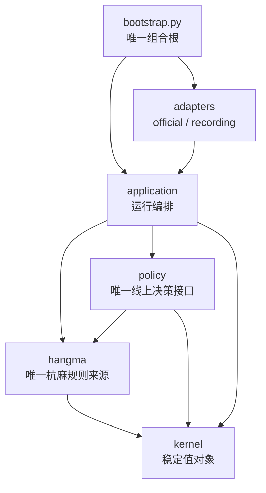

# 杭麻 AI Bot 技术方案与一个月实施计划

> 状态：架构与第一阶段接口评审后草案 v0.5（2026-09-04 集成阶段更新：契约基线 v1.1——`SubmitRejectedNoRefresh`、候选牌效事实 `CandidateFacts`、kernel 裁决、审计词表；官方指南已审查基线 v15，2026-09-05 二次同步 v12–v15 含自动匹配机制）
> 日期：2026-09-04
> 目标日期：2026-09-30 前完成本地稳定运行并接入官方平台
> 关联资料：[架构与运行流程](./architecture.md)、[第一阶段实施导航](./implementation/README.md)、[冻结接口协议](./implementation/interface-contracts.md)、[MVP 验收标准](./implementation/mvp-acceptance.md)、[统一术语表](../UBIQUITOUS_LANGUAGE.md)、[官方赛事流程（2026-09-03）](./official-tournament-flow-2026-09-03.md)、[官方平台 API v8 记录](./official-platform-api-v2.md)、[当前 v7 多阶段最小 Bot Demo](./references/official_minimal_bot_v7.py)、[官方 v8 指南版本快照](./references/official-guide-version-v8.json)、[官方 v11 指南版本快照（2026-09-04，已审查基线）](./references/official-guide-version-v11.json)

## 1. 文档目标与范围

2026-09-06 实施补充：V1 已通过开发验收并冻结为 V2 的实验对照，线上默认仍为 V0。规则新增响应过牌等待事实，本地分析语义为 `hangma-mvp-v2-pass-progress`；组合根通过 `legacy_pass.py` 保持冻结 V0 的正常旧评分视图，原始审计事实不改写。V2 可选策略 `weighted_heuristic_v2` 已实现可比等待评分，复用 V1 权重与非 Pass 评分，不同时调参。类型和数据格式不扩展，边界与回归见[接口协议 §4.3–4.4](./implementation/interface-contracts.md#43-响应过牌的等待事实与冻结策略兼容2026-09-06)。完整桌赛强度与发布验收另行执行，不声称积分提高。

本文记录已经讨论和交叉评审过的：

1. 线上 Bot 与离线训练系统的架构、模块划分和依赖方向；
2. 各模块在未来一个月内可信的实现范围、核心算法和验证方式；
3. 已知赛事规则、官方接口、时间模型以及仍待确认的事项；
4. 2026-09-30 前的初步 roadmap。

本文按以下优先级控制范围：

- **P0 必须交付**：没有它就无法稳定参赛；
- **P1 应当交付**：对胜率或可迭代性有明确帮助；
- **P2 可选增强**：仅在 P0/P1 稳定后进入；
- **不进入本月范围**：短期收益不确定或工程成本明显超出一个月。

阅读提示：文中 `PlayerObservation`、`WorldState`、接缝（seam）、展开模拟（Rollout）、遗憾值（regret）等专业名词统一在[术语表](../UBIQUITOUS_LANGUAGE.md)中解释；“赛事阶段、官方场次、单局”按术语表区分，不再统称为“轮/局”。

### 1.1 本月明确不做

- 在线调用 LLM 决定打牌；
- 在线多 Agent 投票；
- 从零训练大型 Transformer 或完整纯自博弈 RL 系统；
- 在 1 秒吃碰窗口运行复杂搜索；
- 完整实现通用 ISMCTS/CFR 博弈求解器；
- 大规模适配日麻引擎或直接迁移日麻预训练权重；
- 自建观战 Web、牌桌 UI 等非参赛关键功能；
- 让 LLM 自动决定模型是否上线。

LLM 的定位是离线研发教练：协助编码、生成测试、分析牌谱和训练曲线、组织实验，但不进入线上行动闭环。

## 2. 核心结论

一个月内最可信的交付不是“先训练一个麻将大模型”，而是先交付一个**可参加官方测试赛事、全程自动运行、每个动作可追溯的 MVP（最小可用版本）**，再用牌谱和模拟逐步提高胜率：

1. 完成可靠的官方接入、状态同步、动作窗口状态机和 API 版本检查；
2. 以一个 Token 对应一个 `ParticipantRuntime`，按运行时 `config.M` 并发管理实际 `active_games`；
3. 第一阶段即建立覆盖全部动作族和已知特殊规则的杭麻规则核心；允许局部分支显式降级，但独立紧急路径必须随时可用；
4. 由 `TournamentSupervisor` 管理从报名/到位、逐阶段运行到终态退出的完整赛事生命周期；
5. 从第一版起保存非阻塞审计记录，使每次决策、动作尝试、恢复和最终结果都可关联；关键记录缺失时必须诚实标记审计降级；
6. MVP 验收后再完善模拟、赛事效用和小型候选结果模型；模型只有在完整 Policy 评测中显著胜出才启用。

线上决策链：

```text
官方事件
  → 可信玩家观察
  → 杭麻合法候选与确定性分析
  → 启发式保底动作
  → 可选：候选结果预测
  → 赛事晋级目标评估
  → 截止时间守卫与最终复核
  → 提交官方动作
```

离线迭代链：

```text
官方牌谱 / 本地模拟
  → 按当时信息重建 PlayerObservation
  → 隐藏世界采样和候选反事实模拟
  → 训练候选结果模型 / 轮次价值模型
  → 按官方配置完成桌赛/阶段/赛事、同牌山、换座位评测
  → 统计门禁
  → 人工审核后发布模型产物
```

## 3. 架构评审结论

早期方案把系统拆成 10 个线上模块和 4 个离线模块，职责方向基本正确，但交叉评审发现以下问题必须在编码前修正。

### 3.1 必须修正的问题

| 严重度 | 问题 | 修正决策 |
| --- | --- | --- |
| P0 | 一个 `GameState` 同时表达平台同步状态、玩家观察和模拟完整状态 | 拆为 `PlayerObservation`、`WorldState`、`DecisionRequest` |
| P0 | `rules.apply_action(GameState)` 在隐信息环境中语义不成立 | 线上规则只分析观察；只有模拟器推进完整世界 |
| P0 | 线上展开模拟依赖模拟器，但模拟器被放进纯离线目录 | 模拟引擎移入生产核心；离线代码只负责批量生成和训练 |
| P0 | 普通 Q 值、结果预测和赛事效用混用 | 明确 `CandidateOutcomeModel` 输出赛制无关的四家联合结果分布 |
| P0 | 隐藏牌和牌墙采样埋在展开模拟内部 | 增加显式 `BeliefSampler` 接缝 |
| P0 | 训练和线上可能各自实现编码 | 增加共享且版本化的 `learning` 模块 |
| P0 | 缺少动作命令状态机和非幂等 POST 处理 | 增加 `GameSession`、`ActionGate`、`DecisionBudget` |
| P0 | 运行壳默认一批场次结束即整赛结束 | 增加 `TournamentSupervisor`，只在 `finished/closed/void` 退出，并处理逐阶段确认和新增场次 |
| P0 | “一个窗口只提交一次”会阻止本地规则与官方不一致时安全降级 | 改为“任意时刻最多一个在途 POST”；明确 409 后刷新确认同窗仍开放，才可按原预算排除动作并重新规划 |
| P0 | 官方适配器直接产出 `DecisionRequest` 且接收 `DecisionProposal`，协议层耦合策略 | 适配器只产出 `ObservedActionWindow`、只接收 `ActionAttempt`；应用层组装规则和策略输入 |
| P0 | 赛事终态与当前身份淘汰混用 | 增加 `ParticipantTerminal`；淘汰只结束当前 Token 的运行，不宣称赛事终止 |
| P0 | 每 Token 请求调度与应用截止时间调度重叠 | 官方适配器唯一拥有每 Token 连接池、限速器和请求调度；应用层只拥有决策预算和任务监督 |
| P0 | 测试房间四 Token 和审计路径没有形成可验收方案 | 第一阶段使用四个隔离进程；审计路径加入 `participant_id` 并提供完整性验证器 |
| P1 | `heuristic/prediction/tournament/decision` 都暴露给启动入口 | 收口到一个深的 `policy` 模块，内部继续独立实现和测试 |
| P1 | `TournamentUtility` 混合官方规则和未来预测，且写死固定四阶段 | 拆为数据化阶段格式、确定性赛事目标、剩余局估计和海选晋级线估计 |
| P1 | 评测只覆盖 Predictor | 正式评测完整 Policy、动态赛事流程和官方时间/恢复壳 |

### 3.2 设计原则

- **深模块**：复杂实现隐藏在小接口后，调用方不需要理解内部步骤；
- **接口即测试面**：调用方和测试通过同一个接缝（seam）；
- **只在真实变化处定义接缝**：例如官方/回放 Gateway、启发式/混合 Policy、神经/展开模拟结果估计器；
- **类型隔离信息权限**：线上 Policy 在类型层面不能读取完整 `WorldState`；
- **单一规则来源**：线上判定、模拟、数据生成和测试共享同一个杭麻规则核心；
- **训练/推理一致**：特征编码、动作编码、归一化和输出解释只能有一份实现；
- **副作用外置**：网络、时钟、并发和日志不进入规则与策略纯计算；
- **保底优先**：任何模型、搜索或日志异常都不得阻止合法动作按时提交；完整规则局部分支失败时由独立紧急路径兜底。
- **封闭提交结果**：只有明确拒绝可进入下一候选，结果不确定时同窗封锁，避免把网络失败误当成安全重试。

## 4. 最终模块划分

目标架构仍采用 8 个生产顶层模块和 4 个离线应用，但第一阶段只创建其中 6 个生产模块。它们是同一 Python 工程中的 package，不是微服务，也不需要独立部署。

```text
src/hangma_bot/
  kernel/                 # 极小稳定值对象
  hangma/                 # 确定性杭麻规则
  policy/                 # 唯一线上决策接缝
  application/            # 每 Token 参赛者运行时、跨阶段监督、多场调度和截止时间
  adapters/
    official/             # 官方平台适配器
    recording/            # 非阻塞审计记录适配器
  bootstrap.py            # 唯一组合根

scripts/
  run_participant.py      # 单 Token 正式路径
  run_test_room.py        # 四 Token、四进程测试路径
```

`simulation`、`competition`、`learning`、`offline` 与完整牌谱回放适配器在 MVP 之后按需求创建。第一阶段可以用保存响应驱动的轻量 Fake 验证端口，但不把它扩建成第二套模拟器或通用事件平台。

### 4.1 依赖方向

箭头明确表示“调用方依赖被调用方”。详细的场景边界、线上时序和训练评估数据流见[架构与运行流程](./architecture.md)。



严格禁止：

```text
hangma       → official / application / policy / learning
competition  → official / application
learning     → official / application
simulation   → 官方 HTTP 接口
policy输入    → WorldState
training     → application/runtime
CompetitionObjective → 实时 HTTP 查询
policy → WorldState / 官方 DTO
adapters/official → DecisionRequest / DecisionPlan
```

真正需要在运行入口稳定组装的角色只有：

```text
TournamentSessionPort + GameSessionPort + BotPolicy + AuditSink
```

四个接缝的签名、结果分类和兼容规则已经冻结在[第一阶段接口协议](./implementation/interface-contracts.md)。`HangmaRules` 当前只有一个真实实现，保持具体深模块；传输、限速、状态同步和动作门是官方适配器内部细节。

## 5. 核心数据类型与信息权限

### 5.1 `kernel`

只放长期稳定且跨模块共享的值对象：

```text
Tile         # 标准化牌值，不携带显示文本或协议差异
Seat         # 场次内座位编号 0—3
ScoreVector  # 四家积分向量，固定按座位 0—3 排列
RuleVersion  # 规则版本标识，用于回放和模型兼容性检查
Action       # 出牌、吃、碰、杠、胡、过的封闭联合类型
```

`Action` 应使用带类型的联合，而不是一个带大量可空字段的字典：

```python
# 所有内部动作的封闭联合；避免使用带大量可空字段的通用字典。
Action = Discard | Chi | Peng | Gang | Hu | Pass
```

内部动作身份至少考虑：

```text
canonical_action_id  # 内部规范动作标识，用于训练、评测和日志关联
gang_kind            # 杠的种类：暗杠、明杠或补杠
source_discard_seq   # 触发响应动作的官方弃牌事件序号
response_window_id   # 吃/碰响应窗口的唯一标识，用于防止重复提交
```

这些字段不一定发送到官方接口，但用于去重、日志、训练标签和回放。

### 5.2 `PlayerObservation`

线上策略唯一允许读取的麻将状态：

- 本人手牌和本人刚摸到的牌；
- 四家牌河、副露和剩余手牌张数；
- 当前牌局阶段、行动座位、可响应座位；
- 庄家、局号、剩余牌数、四家桌内积分；
- 财神、爆头、动作链、抓打圈等本人或公开状态；
- 已公开的公共行动历史。

不得包含：

- 他家真实手牌；
- 未公开牌墙；
- 未来事件；
- 赛后才知道的番型和结果。

赛事阶段、资格和排名不放进 `PlayerObservation`，由独立的 `CompetitionContext` 表达。这样桌内状态只有一个来源，测试时也不会把赛事缓存与牌局快照混合更新。

### 5.3 `WorldState`

只存在于 `simulation`：

- 四家完整手牌；
- 完整牌墙和随机数状态；
- 完整规则状态；
- 当前应行动玩家；
- 可用于结算的完整信息。

模拟内部的唯一可见信息投影如下；对外统一通过 SimulationEngine.frame 返回观察，不要求评估直接调用该内部函数：

```python
def observe(world: WorldState, seat: Seat) -> PlayerObservation:
    """只暴露指定座位当时可见的信息，绝不泄漏他家手牌或未来牌墙。"""
    ...
```

模拟器中的每个 Policy 也只能收到自己的 `PlayerObservation`。

### 5.4 `DecisionRequest`

线上动作窗口上下文由应用层构造，而不是由官方适配器直接返回：

```python
@dataclass(frozen=True)
class DecisionRequest:
    """策略在一个动作窗口内能够读取的全部输入。"""

    observation: PlayerObservation  # 当前座位可见的牌局信息，不含完整世界状态
    competition: CompetitionContext  # 已观察阶段和排名事实；桌内积分只在 observation
    rules: RuleAnalysis               # 本地合法候选、紧急动作、规则证据与降级信息
    decision_id: str                 # 同一 WindowKey 的重新规划保持不变
    trigger_seq: int                 # 触发本次决策的官方事件序号
    window_key: WindowKey            # 动作窗口唯一键，用于防止重复提交
    rejected_attempts: tuple[RejectedAttempt, ...]  # 官方已确认未执行的动作
```

时间限制由独立 `DecisionBudget` 表达，包含增强、保底和最晚发送三个单调时钟时间点。由于当前接口没有服务端绝对截止时间，它们都是客户端保守估计，不能理解为官方真实截止时间；同一窗口因 409 刷新后必须复用原预算。

## 6. 各生产模块的关注点与实现思路

### 6.1 `hangma`：确定性杭麻规则（P0）

#### 接口

```python
class HangmaRules:
    """杭麻合法动作、牌型分析和结算的唯一确定性规则实现。"""

    def __init__(self, config: RuleConfig) -> None:
        """把不可变赛事规则绑定到实例；运行中不得替换。"""
        ...

    def analyze(self, observation: PlayerObservation) -> RuleAnalysis:
        """先构造紧急动作，再隔离分析各动作族并返回规则证据。"""
        ...

    def validate(self, observation: PlayerObservation, action: Action) -> ActionValidation:
        """提交前按当前观察复核动作；不访问官方 API。"""
        ...

    def emergency_action(self, observation: PlayerObservation) -> RuleCandidate | None:
        """走独立最小路径返回过、抓打牌或最右弃牌。"""
        ...

    def score(self, win: WinDescription) -> Settlement:
        """按官方规则配置计算四家结算结果，分数顺序固定为座位 0—3。"""
        ...
```

`RuleAnalysis` 一次返回：

- 所有合法动作；
- 每个动作的确定性牌型分析；
- 向听数、有效牌、结构类型；
- 财神、七对、爆头、动作链等规则标记；
- 可确定的胡牌分数和特殊分支。
- 独立构造的紧急候选、分析完整度和每个失败分支的 `RuleIssue`。

#### 实现思路

1. 使用花色分解动态规划或记忆化搜索计算面子、搭子、对子；
2. 普通型和七对分别计算向听，再结合财神数量取合法最优结果；
3. 有效牌按当前可见牌扣除后的剩余张数加权，不只计算牌种；
4. 吃碰杠后的牌型分析只返回确定性的行动后状态（afterstate），不伪造完整下一状态；
5. 胡牌和计分与官方 `fan-calc` 做金标准对拍；
6. 使用性质测试验证牌守恒、动作合法性和结算总分守恒。
7. 吃、碰、杠、胡等动作族分别隔离异常；任一复杂分支失败时仍保留其他成功候选和紧急动作。

#### 验证标准

- 官方规则金例全部通过；
- `fan-calc` 随机对拍无差异；
- 任意 `RuleAnalysis` 中不存在本地已经知道非法的动作；若仍因规则差异被服务端明确拒绝，应用层在原预算内排除该动作并降级；
- 规则计算在单次决策预算内稳定完成，不能访问网络。
- 第一阶段即覆盖全部动作族与已知特殊规则，不把“完整规则引擎”推迟到第二阶段。

### 6.2 `simulation`：完整环境与隐藏信息采样（P1）

#### 接口

2026-09-05 已由[parallel-v1 §6](./implementation/parallel-contracts.md#6-模拟模块接口-simulation-v1)取代早期 SimulationGame/reset/step 草案。唯一具体接口为 SimulationEngine.start/frame/advance/export_hand/from_replay；MatchSpec 使用完整 TournamentConfig，按 Rounds 完成桌赛；同帧响应统一裁决，advance 不修改原世界。实施见[模拟指南](./implementation/simulation-start.md)，历史路径另走 check_hand，评估不读 WorldState 字段。

#### 实现要求

- 固定 seed 可完全重放；
- 状态转换不读取网络、文件和当前时间；
- 模拟不实现第二套杭麻规则；
- 状态可复制或持久化，支持候选反事实分叉；
- 首版优先多进程批量模拟，不要求本月完成 JAX/GPU 向量化。

#### `BeliefSampler`

以下是后续训练阶段的方向，不在本批 simulation-v1 首版交付范围；缺牌墙的官方记录先明确拒绝反事实导入，不能把采样能力当成已存在。

```python
class BeliefSampler(Protocol):
    """从玩家已知信息采样若干合法但不保证真实的完整世界。"""

    def sample_worlds(
        self,
        observation: PlayerObservation,  # 当前座位可见的状态
        history: PublicHistory,          # 截止当前时刻的公开动作历史
        count: int,                      # 需要生成的隐藏世界数量
        rng: RNG,                        # 显式随机源，用于实验复现
    ) -> tuple[WorldState, ...]:
        """返回与牌守恒、公开牌和剩余手牌张数一致的完整世界。"""
        ...
```

本月只要求 `UniformLegalSampler`：根据牌守恒、公开弃牌、副露和手牌张数生成合法隐藏世界。学习型 belief 属于 P2。

候选展开模拟应让所有动作共享同一批隐藏世界样本，降低比较方差。简单确定化可能存在策略融合偏差，因此其定位是启发式增强和离线教师，不宣称得到博弈均衡。

参考：[Information Set Monte Carlo Tree Search](https://eprints.whiterose.ac.uk/id/eprint/75048/1/CowlingPowleyWhitehouse2012.pdf)。

### 6.3 `competition`：阶段规则与晋级概率（P0/P1）

该后续模块不再写死“第一轮/第二轮/第三轮”。它消费官方适配器提供的已观察赛事事实，再由本地版本化流程规则派生 `CompetitionFormat`。第一阶段只保留轻量 `CompetitionContext` 给启发式使用，不创建独立 `competition` 包。

#### `CompetitionFormat`

表达由“当前已观察事实 + 已审查官方流程版本”得到的本地派生格式：

```text
stage_no / stage_role / stage_total
target_size             # 海选取前 16、8 或 4
group_advance           # 中间轮当前为组内前 2
ranking_keys            # 晋级轮为 total_score → place_points → god_count；决赛只有 total_score
score_resets            # 当前官方规则为每阶段独立计分
overtime_until_unique   # 决赛同分时为真
```

`stage.no/role/total`、权威 `rank` 等是 API 直接观察字段；`target_size/group_advance/ranking_keys/score_resets/overtime_until_unique` 不是 v8 响应的同名字段，而是根据 2026-09-03 官方流程形成的版本化本地规则。阶段结构可能降档，因此派生时必须结合当前 `stage.total`，不能按创建人数写死。`description` 是可变自由文本，只做留档，不能由策略临时解析来生成规则。

#### `CompetitionObjective`

纯函数，按阶段格式计算：

```text
海选：最大化 P(最终全场排名 ≤ G)，G ∈ {16, 8, 4}
16 强 / 8 强：最大化 P(当前组内排名 ≤ 2)
决赛：先最大化官方最终名次效用；总得分同分状态还要考虑后续加赛
```

晋级轮比较三键而不是相加：候选结果必须先更新总得分分布，再结合名次分和白板数的当前权威账本估计最终排序。平台返回的 `rank` 优先于客户端自行复算，尤其 `god_count` 无法从实时事件完整还原。

#### `StageContinuationEstimator`

输入当前四家三键账本、剩余官方场次/单局数、座位与庄家安排，输出阶段结束时的组内联合排序分布。首版使用规则化 Monte Carlo，并在这一层估计未来名次分和白板数；只有同分边界实验表明有稳定收益时才扩展局部候选结果模型。数据足够后再训练小型 MLP；只有证明历史轨迹本身提供额外信息时才考虑 GRU。

#### `QualificationCutoffEstimator`

原 `GlobalCutoffEstimator` 泛化为海选专用截线估计器：根据实时全场榜单、当阶段进度和历史模拟，估计第 `G` 名最终三键截线分布，其中 `G∈{16,8,4}`。榜单过旧、字段缺失或进度含义不明时，必须降级为保守的期望总得分目标，不能使用伪精确晋级概率。

本模块与 Suphx 的 global reward prediction、run-time policy adaptation，以及 Mortal 的 GRP 思路一致：单局战术预测与整轮排名价值分离。[Suphx](https://arxiv.org/abs/2003.13590)、[Mortal model](https://github.com/Equim-chan/Mortal/blob/main/mortal/model.py)。

### 6.4 `learning`：训练/推理共享实现（P2）

统一拥有：

```text
FeatureSchema       # 特征字段、顺序、形状和版本
ObservationEncoder  # 玩家观察到模型输入张量的唯一编码器
ActionEncoder       # 内部动作到模型动作编号的唯一编码器
NetworkDefinition   # 训练与线上推理共用的网络结构
Calibration         # 概率校准参数与方法版本
ModelArtifact       # 可发布的权重、配置和兼容性元数据
InferenceAdapter    # 批量推理及超时/异常转换实现
```

模型产物必须包含：

```text
guide_api_version        # 训练数据对应的官方指南版本
ruleset_hash             # 本地杭麻规则内容哈希
feature_schema_version   # 玩家观察特征定义版本
action_schema_version    # 动作编号与参数定义版本
engine_commit            # 生成数据时的模拟器代码提交
continuation_policy_id   # 展开模拟所用续打策略版本
opponent_pool_id         # 生成数据时的对手池版本
belief_sampler_version   # 隐藏世界采样算法版本
calibration_version      # 结果概率校准版本
training_data_id         # 可追溯的训练数据集标识
checkpoint_hash          # 权重文件内容哈希，用于完整性校验
```

关键版本不匹配时拒绝加载并自动使用启发式 Policy。

#### `CandidateOutcomeModel`

本项目不优先学习一个与赛制绑定的标量 Q 值，而是学习：

```text
PlayerObservation + CandidateAction
  → 本局结束时四家积分变化的联合分布
```

形式上可记为：

```text
Z^π(o, a)
```

其中 `π` 是动作后的 continuation policy 和 opponent pool，必须版本化记录。模型输出至少包括：

```python
class HandOutcomeDistribution:
    """一个候选动作对应的本局联合结果预测。"""

    joint_score_delta_samples: Array[N, 4]  # N 个四家积分变化样本；第二维按座位 0—3 排列
    winner_probs: Array[5]                  # 获胜/流局概率；顺序为座位 0—3、流局
    uncertainty: float                     # 模型不确定性标量；越大表示越应信任启发式保底
```

不能分别预测四个人的独立积分分布后再拼接，否则会丢失相关性。可参考 distributional RL 的收益分布思想，但本项目必须保持四家结果联合一致性。[QR-DQN](https://arxiv.org/abs/1710.10044)。

首版模型目标：1-3M 参数、CPU 毫秒级推理、一次批量评估全部合法动作。网络可采用小型 1D-CNN/ResNet 加全局标量特征和动作 embedding。

### 6.5 `policy`：唯一线上决策接缝（P0/P1/P2）

#### 外部接口

```python
class BotPolicy(Protocol):
    """在给定玩家可见信息和时间预算内产生有序候选计划。"""

    async def choose(
        self,
        request: DecisionRequest,  # 本次动作窗口的不可变输入
        budget: DecisionBudget,    # 使用单调时钟计算的软/硬时间预算
    ) -> DecisionPlan:
        """返回完整可审计候选顺序；不执行网络提交。"""
        ...
```

具体实现：

```text
WeightedHeuristicPolicy  # P0，完全不依赖模型
SafeFallbackPolicy       # P0，只保留规则紧急候选
HybridPolicy      # P2，启发式 + CandidateOutcomeModel + competition
```

第一阶段由应用层先调用 `HangmaRules` 生成 `RuleAnalysis`，再把它放入 `DecisionRequest`；策略只排序规则候选，不能自行声明合法动作。`DecisionPlan` 返回完整有序候选、评分分解、规则/策略降级原因和计划版本。明确 409 后应用层使用同一 `decision_id`、原始预算和已拒绝动作重新调用策略。

后续 `HybridPolicy` 内部才增加：

```text
RuleAnalysis          # 应用层已经生成的合法候选和确定性分析
SafeFallbackPolicy    # 在任何增强计算之前已生成的保底计划
OutcomeEstimator      # 估计候选动作的四家联合结果
CompetitionEvaluator  # 按当前赛事阶段把结果转换为效用
候选保留策略           # 保留特殊动作、高收益、低风险和高方差候选
不确定性处理           # 模型缺乏把握时偏向启发式保底
截止时间降级           # 剩余预算不足时取消增强计算
```

#### 启发式核心算法

2026-09-05 的近期施工范围以[启发式三个候选版本计划](./implementation/policy-iteration-plan.md)为准：V1 修可靠排序和真实时限验证，V2 统一 Pass 与吃碰的规则牌效基准，V3 只做有限参数试验。以下保留总体设计方向，不表示当前已实现严格分层、结果期望估计或对手概率模型。V1 已以独立实现保留在同一代码树，旧 weighted_heuristic 保持 V0；候选代码和效果验证分开交付，默认稳定策略不自动切换。

启发式优先使用分层排序，避免早期依赖大量拍脑袋权重：

```text
1. 胡牌和硬规则优先
2. 最低向听数
3. 最大加权有效牌数
4. 最大预期成牌收益
5. 最大手牌灵活度
6. 最小对手加速风险
```

杭麻没有点炮胡，因此对手风险重点不是放铳，而是：

- 弃牌被下家吃或其他玩家碰的概率；
- 吃碰后对手缩短了多少结构；
- 是否加速庄家或直接排名竞争者；
- 是否让对手进入爆头、飘、杠等高倍链。

模型很小时应评估全部合法动作；只有昂贵的展开模拟才筛选候选。胡、杠、爆头/飘特殊分支，以及最高收益、最低风险、最高方差候选不得被普通 Top-K 直接裁掉。

#### 线上展开模拟（Rollout）限制

- 吃/碰 1 秒窗口不运行展开模拟；
- 出牌 3 秒窗口只允许有界、可取消的少量搜索；
- 任何时候先算出 fallback，再启动模型或搜索；
- 模型/搜索未在软截止时间前返回，立即使用保底动作。

第一阶段不创建模拟或模型接缝。后续确有至少两个结果估计实现时，再在 `policy` 内引入深的 `OutcomeEstimator`；不得让策略直接读取或操纵 `WorldState`。

### 6.6 `application`：多场运行与资源调度（P0）

负责：

- `ParticipantRuntime` 绑定一个参赛 Token 和一个 Policy；正式赛事启动一个，测试房间的四个 Token 启动四个；
- 每个 `ParticipantRuntime` 读取运行时 `config.M` 作为容量上限，并以 `/api/me.active_games` 作为实际应运行场次的权威集合；
- `TournamentSupervisor` 持续轮询顶层 `status`，只在 `finished/closed/void` 退出；
- 在 `stage_open` 对晋级者或候补幂等确认到位，在 `stage_done` 等待组委会推进；
- 持续发现新增 `active_games`；
- 处理新阶段、动态降档和无上限决赛加赛产生的新 `game_id`；
- `active_games` 暂时为空时保持赛事监督，不误判终局；
- `stage_crashed=true` 时隔离旧阶段尝试并等待重新确认/重赛；
- 每场独立 Session，单场失败隔离；
- 每场独立可取消任务；单场异常不能取消其他场次，阶段切换和退出不能遗留最长 30 秒的旧长轮询；
- 决策增强、规则分析和截止时间监控；
- 优雅退出与永久错误隔离。

应用层的场次任务包装一个注入的 `GameSessionPort`，负责“取 `ObservedActionWindow` → 建立一次预算 → 规则分析 → 调用 Policy → 复核 → 记录 → 提交”的单场运行循环。`application` 决定**何时**报名/确认阶段、启动或回收场次、等待新阶段以及结束当前身份；官方适配器只提供协议能力，不能把这些赛事流程藏进 HTTP 客户端。

测试房间固定由 `run_test_room.py` 启动四个隔离子进程，每个子进程复用正式单 Token 入口。第一阶段不建设同进程多租户、共享模型或通用测试编排框架。

职责分配：

```text
OfficialRequestScheduler（官方适配器内部，每 Token 恰好一个）
  action POST > gap/409/模糊提交恢复 > 长轮询 > ranking refresh

DecisionBudget（应用层）
  增强截止 > 保底截止 > 最晚发送；同一窗口刷新不重置

TournamentSupervisor
  跨阶段等待/确认、动态发现比赛、启动/回收 Session、故障隔离

ParticipantRuntime
  一个 Token 的身份、赛事监督器、规则、Policy 和最多 M 个场次任务
```

官方连接池、限速器、请求优先级和 `ActionGate` 不属于应用层。简单外部进程守护可以有限次数重启单身份入口；重启后必须从 `/api/me` 和 `seq=0` 恢复，不能重放内存中的动作判断。

### 6.7 `adapters/official`：官方平台适配器（P0）

内部包含：

```text
OfficialTransport         # Bearer 认证、v8 HTTP 契约、限速和错误映射；类名不绑定易变版本号
TournamentClient          # 顶层状态、阶段、资格、排名和 ready 语义
OfficialGameSessionAdapter # 实现 GameSessionPort，封装单个 game_id 的长轮询和动作提交
StateProjector            # 官方快照/事件到内部玩家观察的纯转换
ProtocolSyncState         # 单个 game_id 的 seq、gap、全量重建和未知事件恢复
ActionGate                # 每场一个在途动作 POST、确认和模糊状态封锁
OfficialRequestScheduler  # 每 Token 唯一的多场请求优先级与限速
CompetitionContextCache   # 带更新时间的阶段格式、三键积分和排名缓存
```

一个 `TournamentSessionPort` 对应一个 Token，并创建该 Token 唯一的 `OfficialTransport`、连接池、请求调度器和限速器；由它打开的最多 `M` 个 `GameSessionPort` 共享这些资源。不同 Token 完全隔离，不能共享认证头、限速状态或动作门。

一个月内不建设正式 CA 或证书签发流程。`OfficialTransport` 可以对**配置中明确列出的官方内网 `base_url`**关闭证书校验，以兼容当前自签名 HTTPS；不得全局修改 Python/操作系统的 TLS 行为，也不得让任意目标继承 `verify=false`。传输层仍验证目标主机与启动配置一致。

Token 管理保持简单：团队可以按约定集中放在私有仓库的运行配置中，但只能由组合根加载并注入 `ParticipantRuntime`；不得散落在源码、测试 fixture、错误对象和审计记录中，任何 `Authorization` 请求头在记录前必须删除或脱敏。启动时用 `/api/me` 和规则接口校验“运行模式、预期赛事、Token 身份、API/规则版本”，避免把测试 Token 误接正式赛事或反之。

`StateProjector` 是纯实现模块，可独立回放测试，但不需要作为 `bootstrap` 的顶层接缝。

#### 状态同步

- `seq <= last_seq`：幂等忽略重复事件；
- `seq != last_seq + 1`：不应用部分增量，立即全量重建；
- `gap=true`：全量重建；
- 全量快照整体替换，不做字段级 merge；
- `pending=true`：不修改状态和 seq；
- 未知事件先分类：已确认不影响关键状态的兼容新增事件只记录；未知关键事件才将状态标记为需要重建；
- 当前桌积分以权威 game snapshot 为准；
- 全场/组内榜单单独缓存并携带 `as_of` 时间和数据陈旧程度；
- `games_played` 只按当前阶段解释，阶段切换后丢弃旧进度派生值；
- `stage.total`、`rank` 和 `god_count` 直接接受平台权威值，不根据旧公告或事件流覆盖。

#### `ActionGate`

动作窗口状态机：

```text
OPEN                # 窗口开放，尚未选择提交者
  → SUBMITTING      # 一个 HTTP 动作请求正在发送
  → ACKED           # 官方已经明确响应成功
  → CONFIRMED_BY_EVENT  # 后续权威事件确认状态已经改变

明确拒绝：REJECTED_409 → seq=0 刷新 → 同窗 OPEN（允许下一候选）或 CLOSED
异常：AMBIGUOUS_TRANSPORT_FAILURE（同窗封锁）/ EXPIRED（窗口过期）
```

窗口键至少包含：

```text
game_id         # 官方场次标识
+ round_no      # 当前单局编号
+ trigger_seq     # 触发窗口的官方事件序号
+ phase         # response_peng 与 response_chi 必须区分
+ seat          # 当前拥有动作权的座位
```

同一弃牌的 `response_peng` 和 `response_chi` 是两个窗口，不能只按 `last_discard` 去重。

动作 POST 是非幂等操作。发生网络超时后不能盲目重试，因为服务端可能已经执行但响应丢失；必须转为 `AMBIGUOUS`，同一 `WindowKey` 不再接受动作，等待权威事件或全量快照证明窗口已经迁移。

这不等于整个窗口只能尝试一次。官方明确返回 409 后，适配器先用 `seq=0` 重建；只有确认动作未执行、同一 `WindowKey` 仍需我方行动时，才返回 `SubmitRejectedRetryable`。应用层随后在**原始**截止时间内排除该动作并选择下一候选。同一场任意时刻仍最多一个在途 POST。

#### 对外接缝

接口基线见 [`application/contracts.py`](../src/hangma_bot/application/contracts.py) 和[第一阶段接口协议](./implementation/interface-contracts.md)。关键边界是：

- `TournamentSessionPort` 完整提供 `initialize/register/ready/next_update/open_game/aclose`；
- `GameSessionPort` 返回 `ObservedActionWindow`，不返回策略专用 `DecisionRequest`；
- `submit()` 只接收 `ActionAttempt`，返回封闭的成功、明确拒绝可重规划、明确拒绝已关窗、结果不确定或未发送；
- `ActionGate` 完全隐藏在适配器内部；
- 第一阶段用保存响应驱动的 Fake 做确定性测试，不宣称已经实现完整牌谱回放或模拟器。

### 6.8 `adapters/recording`：非阻塞记录（P0）

2026-09-05 后续设计：按[审计增强实施方案](./implementation/audit-enhancement.md)和[parallel-v1](./implementation/parallel-contracts.md)实施（新增部分尚未实现）。保持 v1 信封和已经合入的原文留存/SSE，以 audit-plus-v1 profile 补齐完整输入、评分、复核、结束证据和生产端失败持久化；赛后以文件清单和哈希封存为可迁移证据包。实施分工见[并行施工导航](./implementation/parallel-workstreams.md)。

审计不是普通调试日志，而是 MVP 的正式输出。所有记录使用以下关联键串起“赛事生命周期 → 对局事件 → 决策 → 提交 → 结果”：

```text
run_id + tournament_id + participant_id + stage_attempt_id
       + game_id + round_no + trigger_seq + decision_id + attempt_no
```

其中 `participant_id` 是本地脱敏身份，不保存原始 Token。至少记录：

- 本次运行的指南/API 版本、配置快照、代码提交、Policy/规则/模型/特征版本；
- 赛事 `status`、`stage.no/role/total`、资格角色、到位结果和生命周期转换；
- 脱敏后的官方快照/事件或其不可歧义的引用，以及规范化 `PlayerObservation`；
- 合法候选、规则证据、启发式分项和候选排序；
- 该环境实际提供的阶段/排名快照；模型预测、晋级效用和不确定性在对应能力启用后记录；测试房间不强求赛事排名；
- 选择原因、fallback 原因、决策预算、各步骤耗时和最终动作；
- 动作提交结果、409、序号缺口、重建、断线重连和进程恢复；
- 阶段尝试是否作废及原因、每场最终积分、阶段排名和赛事终态。

建议每次运行生成以下可整体归档的目录：

```text
runs/{run_id}/
  manifest.json                 # 版本、配置、脱敏身份和启动检查
  lifecycle.jsonl              # 顶层状态、到位、场次发现和恢复过程
  participants/{participant_id}/
    decisions.jsonl            # 候选、评分、选择、时延和提交结果
    games/{game_id}.jsonl      # 该身份在该场的脱敏事件/快照与规范观察
    summary.json                # 该身份积分、错误、超时和降级统计
  summary.json                  # 运行级汇总
```

写入必须经过有界后台队列；磁盘慢、磁盘满或序列化失败不能阻塞合法动作。低优先级协议原文在背压下可以计数丢弃；提交 intent/outcome 等高优先级信封缺失时必须把运行标记为 `audit_degraded`，不得继续宣称完整可审计。`SUBMISSION_INTENT` 在调用 `submit()` 前入队，结果返回后入队 `SUBMISSION_OUTCOME`。运行结束时尽力刷新并由验证器检查悬空 `decision_id + attempt_no`。Token 必须在进入记录模块前移除，记录端再次防御性脱敏。

独有协议原文沿用低优先级 RAW_PROTOCOL_STATE，背压丢失必须如实计数；规范权威状态与决策证据保持高优先级，不重复建设协议存储。监控作为独立只读命令消费同一份记录，首版为终端/JSON，展示实际观察、候选和已有异常，不执行自动决策或新增平台轮询。

### 6.9 自动匹配生命周期（MVP 后，待实施）

用户已确认接入 `/api/match`，详见[开工指南](./implementation/free-match-start.md)。新增 OfficialAutoMatchSession 复用现有 TournamentSessionPort/GameSessionPort，application 的专用运行单元负责单自动房等待、最多实际 M 场并发和关闭前收尾；不调用 register/ready，不重写动作门或 SSE。仅显式 AUTO_MATCH 模式允许 initialize 有一次匹配入席副作用，旧模式保持发现与 Token 作用域约束。该受控例外及初始化重试安全见[接口协议 §6](./implementation/interface-contracts.md#6-赛事与参赛者终态)。v15 默认 M=10/Rounds=8，当前修复后的 M=2 测试房间验收不替代本入口的目标并发验收。

## 7. 离线模块与训练闭环

### 7.1 `offline/replay.py`：证据整理与统一牌谱（P1，待实施）

具体字段见[parallel-v1 §4—5](./implementation/parallel-contracts.md#4-数据身份来源及版本)，采集和命令见[审计方案](./implementation/audit-enhancement.md)。本批具体开发 simulation 与 offline，评估通过公开 SimulationEngine 驱动完整桌赛；各线指南和文件所有权见[施工导航](./implementation/parallel-workstreams.md)。不预建训练空接口。职责：

- 消费已封存证据包，保留不可变的原始审计和可取得的官方牌谱；
- 优先从保存的决策输入恢复当时的 `PlayerObservation`、原始规则候选及实际行为；新规则重算另存为实验，不覆盖历史；
- 导出统一牌谱并区分 `observed/full_history/full_world`，即玩家观察、完整历史轨迹和具备完整世界初始数据；缺少未摸牌墙时不能宣称可精确反事实分叉；
- 保存最终结算，但不把未来信息放入输入特征；
- 保存实际存在的赛事、阶段和阶段尝试标识，以及实际取得的 `total_score/place_points/god_count/rank`；测试房间无对应赛事信息时保留缺失；
- 将 `stage_crashed` 后被平台清空的旧阶段尝试标为作废，默认排除训练标签和正式成绩；
- 按共同契约 split_group_id 划分训练集和验证集；四身份和重启视角共享稳定 hand_id，不能按本地阶段尝试 UUID 切分同一单局。

自动泄漏测试：改变未公开手牌和未来牌墙、保持 `PlayerObservation` 不变，线上特征编码和模型输出必须完全一致。

官方赛后完整四家手牌可用于类似 Suphx oracle guiding 的教师标签，但学生模型输入始终只能是 `PlayerObservation`。[Suphx](https://arxiv.org/abs/2003.13590)。

### 7.2 `offline/generate.py`（P1/P2）

```text
PlayerObservation
  → BeliefSampler
  → 同一批 WorldState
  → 多候选动作分叉
  → 版本化续打策略和对手池继续行动
  → 四家联合积分结果
```

每条数据记录：

```text
continuation_policy_id  # 候选动作之后使用的续打策略版本
opponent_pool_id        # 对手策略集合版本
belief_sampler_version  # 隐藏世界采样算法版本
ruleset_hash            # 生成标签时的杭麻规则内容哈希
random_seed             # 复现本次采样和模拟的随机种子
```

首轮不对所有状态做昂贵反事实模拟，只选择：

- 启发式前两名分数接近的状态；
- 吃/碰/杠/过等结构性决策；
- 最后一两局的高方差晋级决策；
- 模型高不确定或历史上遗憾值较高的状态。

### 7.3 `offline/train.py`（P2）

本月仅考虑两个小模型：

1. `CandidateOutcomeModel`：候选动作到本局四家联合结果；
2. `StageContinuationModel`：当前积分和剩余局数到最终桌内排名联合分布。

海选第 `G` 名截线优先使用实时榜单和规则化估计，其中 `G∈{16,8,4}`；数据足够后再训练 `QualificationCutoffEstimator`。训练特征必须包含阶段格式版本和当前三键账本，不能把三键先相加成一个“综合分”。

训练一旦不能在单张常规 GPU 上数小时级迭代，应缩小模型和数据，不扩大基础设施。

参考项目：

- [Mortal](https://github.com/Equim-chan/Mortal)：规则引擎、局部 DQN、全局 GRP 分离，legal mask 与小型 GRP；
- [RLCard](https://github.com/datamllab/rlcard)：环境、合法动作、智能体和训练循环接口，但其麻将规则过于简化，不能复用规则或权重；
- [MahJax](https://github.com/nissymori/mahjax)：`init/step/observe`、批量模拟和 BC/PPO 示例，本月只借鉴环境接口和可重放思想；
- [Suphx](https://arxiv.org/abs/2003.13590)：global reward prediction、oracle guiding、run-time policy adaptation；
- [QR-DQN](https://arxiv.org/abs/1710.10044)：收益分布学习思想。

### 7.4 `offline/evaluate.py`（P0/P1/P2）

评测分四层：

1. **规则一致性**：官方金例、`fan-calc` 对拍、牌守恒和结算守恒；
2. **局部策略**：固定困难状态、候选遗憾值、结果分布校准；
3. **完整赛事**：按 `config.Rounds` 完成桌赛，并覆盖海选前 16/8/4、组内前 2、候补递补、阶段降档和决赛加赛；
4. **运行可靠性**：1 秒/3 秒动作截止时间、并发、409、序号缺口、阶段间空转、逐阶段确认、中断重赛、限速、模糊提交和模型降级。

桌内策略比较仍使用同牌山和换座位；赛事指标再以完整阶段或完整赛事 seed 聚类 Bootstrap。不能把同一场的上百个决策或同一赛事内多个阶段当作独立样本。

评测程序只输出报告和置信区间；模型晋级由独立门禁规则和人工审核决定。

### 7.5 三类验证环境的边界

| 环境 | 主要回答的问题 | 不应承担的任务 |
| --- | --- | --- |
| 本地模拟器 | 策略 A/B、固定随机种子、同牌山换座位、批量生成反事实数据和长期回归 | 不能证明官方协议、限速和阶段流程兼容 |
| 官方测试房间 | 真实协议、杭麻规则差异、动作时限、同一组四个 Token 与 `M` 个并发场次、官方赛后数据 | 当前公开契约下是单阶段，不等价于完整正式赛事 |
| 官方测试赛事 | 报名/到位、逐阶段确认、晋级/候补/降档/重赛、终态退出等全生命周期 | 不替代大样本策略统计；具体外部启动协议待 MVP 后实测固化 |

正式赛事只用于最终运行和有限的线上验证，不承担训练。测试房间的四个 Token 表示四个参赛身份，而不是每个并发场次各需要四个新 Token；当设置 `M` 时，`run_test_room.py` 启动四个隔离进程，各自运行一个 `ParticipantRuntime`，每个运行时分别管理平台返回的最多 `M` 个 `active_games`。

## 8. 已知赛事信息

### 8.1 参赛形式

- 早期命题说明把第一至第三轮称为远程联赛；当前平台已改用海选、16 强、8 强和决赛等动态阶段名，详细流程以 §8.2 为准；
- 决赛在官方指定场所，继续接入命题方提供的杭麻竞赛平台；
- 全程由 AI 自动决策，人不得手动参与；
- 2026-09-30 前须保证程序本地稳定运行并可接入平台。

### 8.2 晋级流程

- 当前官方赛事流程页为 2026-09-03 版，完整摘录和分析见[官方赛事流程与多阶段晋级规则](./official-tournament-flow-2026-09-03.md)。
- 阶段结构按开赛时实际到位人数自动生成：17 人及以上走海选→16 强→8 强→决赛；9—16 人走海选→8 强→决赛；5—8 人走海选→决赛；4 人直接决赛；少于 4 人作废。
- 海选按批随机同桌并产生全场排名，目标分别为前 16、前 8 或前 4；无法凑桌者该批轮空并记 0 分。
- 16 强和 8 强都是 4 人组内循环，每组前 2 晋级；分组采用名次种子蛇形，并尽量避免上一阶段同组者过早重逢。
- 每个新阶段前，晋级者和候补都要重新确认；未确认的晋级者会被已确认的高顺位候补替代。确认人数不足时可能动态降档。
- 晋级轮按 `total_score → place_points → god_count` 三键排序，三个键不相加；每阶段分数清零。
- 决赛只看 `total_score`，任何同分都会让四人继续加赛并并账，直到 1—4 名两两不同，加赛无场次上限。
- 旧赛事公告写“每轮 8 局”；当前平台把每场单局数作为 `config.Rounds` 配置。程序和评估均以运行时配置为准，正式赛是否固定为 8 仍待赛程创建后确认。

由此确定数据化赛事目标：

```text
海选：最大化 P(全场排名 ≤ G)，G ∈ {16, 8, 4}
16 强 / 8 强：最大化 P(组内排名 ≤ 2)
决赛：最大化最终名次效用，并对同分后的继续加赛建模
```

### 8.3 当前调研得到的杭麻规则

以下规则需要继续用官方规则页、测试房间和 `fan-calc` 固化为金例：

- 136 张牌，不含花牌；
- 白板为财神，可作为万能牌使用；
- 财神牌本身不用于吃、碰、杠等公开组合，可主动打出；
- 以自摸胡为主，当前规则记录未包含点炮胡；
- 支持普通牌型和七对；
- 吃牌次数最多 2 次，碰/杠次数不限；
- 不允许抢杠；
- 牌墙最后 20 张保留；
- 存在爆头、飘、杠等动作链和倍数；
- `YouCaiBiKao` 为锦标赛可变参数；
- 打出财神后可能进入抓打圈：其他玩家不能吃、碰、明杠，本人只能打刚摸牌，仍可暗杠和自摸胡；
- 庄闲结算不对称，精确分值必须以本地规则和官方 `fan-calc` 对拍为准。

## 9. 已知官方接口与时间模型

当前记录基于 2026-09-03 的官方指南 v8；多阶段破坏性协议在 v7 引入。平台仍在迭代，启动和阶段边界必须检查版本。

### 9.1 关键接口

| 用途 | 接口 | 备注 |
| --- | --- | --- |
| 身份与活跃比赛 | `GET /api/me` | 返回 `tournament_id`、`active_games` |
| 当前锦标赛规则 | `GET /api/tournaments/me/rules` | 读取 `Rounds`、底分和时间窗口等 |
| 报名/逐阶段到位 | `POST /api/tournaments/{id}/register`、`ready` | 幂等；`stage_open` 中 `ready` 只允许晋级者/候补 |
| 锦标赛状态和实时排名 | `GET /api/tournaments/{id}` | 包含阶段、资格、`my_games` 和三键 `ranking` |
| 对局长轮询 | `GET /api/games/{id}/state?seq=N` | `seq=0` 为权威快照 |
| 提交动作 | `POST /api/games/{id}/action` | 非幂等；非法/过期返回 409 |
| 指南版本 | `GET /portal/api/guide/version` | 新 breaking 版本阻止进入新赛事 |
| 官方计分校验 | `POST /portal/api/tools/fan-calc` | 仅用于测试和离线校验 |
| 测试房间赛后数据 | `/api/test-rooms/{id}/games/{batch}/events` | 完赛后含四家起手牌和各局结果 |

Portal Cookie 接口不属于稳定 Bot 契约，线上 Bot 不依赖。

### 9.2 v7/v8 关键变化

- 顶层新增 `stage_open/stage_done`，`finished/closed/void` 才是终态；
- `ready` 增加逐阶段确认语义和 `NOT_QUALIFIED` 错误；
- 新增 `stage/stage_status/stage_crashed/qualified/qualify_role`；
- `ranking` 新增 `place_points/god_count`，`games_played` 改为每阶段归零并按单局累计；
- 决赛同分会在 `running` 状态追加新 `game_id`，不能等待一个固定场次集合；
- v8 增加可在任意阶段修改的 `Description/description`；
- v2 的客户端自研动作判定、`seat` 和指定吃牌组合仍是现行契约。

### 9.3 时间与并发

| 项目 | 当前值/限制 |
| --- | --- |
| 碰/明杠窗口 | 默认 1 秒，固定走满 |
| 吃窗口 | 默认 1 秒，固定走满 |
| 出牌窗口 | 默认 3 秒；可胡时超时自动胡，否则打最右一张 |
| 长轮询无事件挂起 | 最多 30 秒 |
| 状态轮询频率 | 最多 8 次/秒/用户 |
| 并发挂起轮询 | 最多 32 个/用户 |
| 同时比赛 | 最多 16 场，且受锦标赛 `M` 限制 |

正式赛事和测试房间都按各自 `config.M` 限制同一参赛身份的同时场数。`M` 是容量上限，不是必须预创建的固定任务数；运行时始终以 `/api/me.active_games` 动态发现和回收实际 `game_id`。测试房间返回的四个 Token 分别代表同桌四个身份，每个身份都可能同时出现在这 `M` 场中。

建议默认内部预算：

- 1 秒吃碰窗口：只使用预计算、启发式或快速神经网络，目标 200-300ms 内提交；
- 3 秒出牌窗口：先算 fallback，再运行快速模型；至少预留约 700ms 用于网络、校验和恢复；
- 排名刷新不进入动作关键路径，只读取缓存；
- HTTP 长轮询超时与动作思考时间完全分离。

## 10. 待确认信息

### 10.1 影响赛事效用的 P0 问题

1. 正式赛事创建时实际采用的到位人数档位、`M`、`Rounds`、底分和各阶段开赛时间是什么？
2. 旧公告“每轮 8 局”是否仍是本次正式赛事的硬约束，还是只以 `config.Rounds` 为准？
3. 决赛完整名次的业务奖励向量是什么？平台已明确如何产生唯一排名，但尚未说明第 1—4 名对策略效用的相对价值。
4. 海选实时榜单和 `games_played` 的刷新延迟、批次进度及 `as_of` 如何获得？
5. 桌赛内座位、庄家和发牌安排如何跨官方场次变化？

### 10.2 影响平台可靠性的 P0/P1 问题

1. 是否会提供服务端绝对 `deadline_at` 或服务器时钟同步方式？
2. 动作 POST 是否计划支持幂等键或请求 ID？
3. 锦标赛正式牌谱是否也能通过与测试房间相似的接口下载？中断重赛前旧牌谱保留多久？
4. 官方“测试赛事”的创建、Token 发放、阶段推进和结果下载是否与正式赛事完全同协议？公开指南目前没有独立的 `test_tournament` 类型。
5. 是否会提供结构化的阶段计划/目标人数，而不只依赖当前 `stage` 和到位人数推断？
6. 决赛现场的硬件、网络、进程和模型大小限制是什么？

### 10.3 需要继续固化的规则问题

- 财神在所有普通型、七对和特殊分支中的替代边界；
- 爆头、飘、杠动作链的完整断链条件和倍数；
- 庄闲精确结算；
- 抓打圈所有允许/禁止动作；
- 最后 20 张保留与流局处理；
- 同时满足多个番型时的叠加规则；
- 超时自动胡和弃胡后的后续行为。

## 11. Roadmap（2026-09-03 至 2026-09-30）

路线以“先参加测试赛事并留下完整证据，再增加牌力”为原则。阶段 1 是第一个可发布里程碑；后续阶段不得破坏它的协议兼容、截止时间和审计能力。时间不足时先砍模型与复杂搜索，不砍 P0 运行可靠性。

### 阶段 1：9 月 3-10 日，可审计的测试赛事 MVP（P0）

#### 目标

单身份进程可用一个范围已确定的赛事/测试房间 Token 自动运行；测试启动器用测试房间的四个 Token 启动四个隔离进程。程序能够管理每个身份最多 `M` 个实际 `active_games`，跨过完整赛事生命周期，并为赛后定位和策略迭代保存足够证据。全局 Token 不是第一阶段承诺。

#### 交付

- 冻结 `ObservedActionWindow → RuleAnalysis → DecisionRequest/DecisionPlan → ActionAttempt/SubmitOutcome` 核心类型、四个端口、官方 v8 DTO fixture、指南版本快照和依赖方向；
- `OfficialTransport`：Bearer 注入、每 Token 限速、错误分类和固定官方内网地址的 `tls_verify=false`，不建设 CA/证书系统；
- 简单集中式运行配置：`mode/expected_tournament_id/tokens/policy`；启动时用 `/api/me`、规则和指南版本核对目标，所有日志删除 `Authorization`；
- `ParticipantRuntime`、`TournamentSupervisor` 和每场可取消任务；`run_test_room.py` 只启动/汇总四个正式单身份入口，不建设通用 `TestMatchRunner` 框架；
- 报名/到位、`registering/running/stage_done/stage_open`、晋级者/候补确认、中断重赛和 `finished/closed/void` 退出；
- seq/gap/未知关键事件全量重建，兼容未知事件记录，进程重启从 `/api/me` 和 `seq=0` 恢复；
- 第一阶段完整规则入口：出牌、吃、碰、各类杠、胡、过、财神、有财必拷响、抓打圈、爆头/飘链和结算均在唯一规则模块；允许动作族局部显式降级；
- 独立紧急路径：响应窗口过、抓打圈打摸牌、普通出牌打官方顺序最右牌；主规则/策略失败时按候选权重降级到该路径；
- `ActionGate` 和每 Token 动作优先调度位于官方适配器；应用层建立增强/保底/最晚发送三个截止时间；
- 明确 409 后 `seq=0` 刷新，确认同窗仍开放时在原预算内排除已拒绝动作并尝试下一候选；模糊提交封锁同窗；
- §6.8 定义的运行清单、生命周期、逐身份/逐场、逐决策和汇总审计；提供验证器并诚实统计高优先级缺失；
- GET 超时/5xx/429 有界恢复、POST 模糊结果、401 永久错误、单场任务隔离和简单外部进程守护；
- 单元测试、保存响应驱动的 Fake、故障注入，以及测试房间从 `M=1/Rounds=1` 到接近正式 `M/Rounds` 的递进联调；至少完成一次官方测试赛事全生命周期验证。

#### 退出标准

- 除组委会/admin 在平台侧推进阶段外，从启动到参赛者终态无需我方人工选牌、确认、重启或继续；
- 官方测试房间四个身份全自动完赛，且官方测试赛事完成至少一次全生命周期验证；Fake 只作为前置测试，不能替代二者；
- 实际返回的最多 `M` 个场次可以并发推进，没有串行轮询造成的饥饿；本地决策不导致 1 秒/3 秒动作超时；
- 同一场任意时刻最多一个在途 POST；明确 409 可按原预算安全降级，模糊结果同窗追加提交为 0；
- 本地规则候选若被官方判非法，审计可以关联规则证据、拒绝动作、权威刷新和后续候选；不能把可恢复规则差异伪装成零错误；
- 杀进程后重启能够重新发现赛事和场次，不重复执行已确认动作；
- `stage_crashed` 的旧尝试不会混入有效成绩；阶段间空窗和决赛新增场次不会触发误退出；
- 每个动作尝试都能由 `decision_id + attempt_no` 追溯到当时观察、合法候选、选择/fallback 理由、耗时、提交结果和最终积分；官方赛后复盘可用时再关联，不能假设未确认的正式赛事牌谱端点；
- 审计故障不影响出牌，但高优先级记录缺失时验证报告明确 `audit_degraded`；
- API/指南出现未知破坏性版本时拒绝进入新赛事，并留下明确诊断。

### 阶段 2：9 月 11-15 日，规则加固与完整启发式版本（P0/P1）

#### 交付

- 修复第一阶段测试暴露的杭麻规则差异，扩大普通型/七对、财神、抓打圈、爆头/飘/杠链和结算金例；持续用 `fan-calc` 对拍；
- `HeuristicPolicy` 的向听数、加权有效牌、成牌收益、结构灵活度和喂牌风险分层排序；
- 完成吃/碰/杠/过的机会成本比较，以及按桌内积分、剩余局数和当前名次切换牌效/防守/方差偏好；
- 审计中保存每个候选的评分分解；生成第一版赛后决策报告和异常时间线；
- `M=16` 或平台允许上限下的 1 秒/3 秒压力与断线、429、409、慢盘故障测试。

#### 退出标准

- 规则金例、性质测试和官方对拍通过；所有实际动作均先经过本地合法性复核；
- 每类动作都至少有可复现的正反例，启发式决策能由分项证据解释；
- API、模型关闭、磁盘变慢和单场异常时，其余场次仍能使用确定性 fallback 按时运行；
- 形成可以随时冻结参赛的“稳定启发式版”。

### 阶段 3：9 月 16-21 日，模拟器与可比较评测（P1）

#### 交付

- 与线上规则同源、可固定随机种子的 `SimulationEngine`；`UniformLegalSampler` 在后续训练阶段有具体需求时实现，不属于 parallel-v1 首版；
- 数据化 `CompetitionFormat/CompetitionObjective`，覆盖海选前 16/8/4、组内前 2、候补/降档和决赛加赛；
- 固定牌山、换座位、对手池版本化和完整赛事 seed 的 A/B 评测；
- 官方测试房间重复赛统计，以及官方测试赛事的生命周期回归；
- 牌谱导入、观察重建、反事实数据生成和 Bootstrap 置信区间报告。

#### 退出标准

- 模拟结算与线上规则同源；相同 seed 可复现，牌张和积分守恒；
- 改变隐藏牌但保持观察不变时，Policy 输入不变；
- 两个启发式版本可按平均积分、名次分布、阶段晋级率、超时/非法率和置信区间比较；
- 本地模拟、官方测试房间和测试赛事的结果分别标注，不把协议验证误当作策略显著性证据。

### 阶段 4：9 月 22-25 日，可选的小型结果模型（P2）

#### 交付

- 从困难决策和反事实模拟构建训练集；共用 `FeatureSchema`、动作编码和 `ModelArtifact`；
- 第一版 `CandidateOutcomeModel`；数据足够时再考虑 `StageContinuationModel`；
- 概率校准、CPU 推理基准和 `HybridPolicy`，所有预测写入审计并可回退启发式。

#### 退出标准

- 模型、规则、特征和动作编码版本不兼容时拒绝加载；
- 模型不会阻塞动作软截止时间；
- 完整 Policy 在未参与训练的赛事 seed 上通过预设晋级门禁；没有显著收益则不上线。

### 阶段 5：9 月 26-30 日，冻结与正式赛事稳定性（P0）

#### 交付

- 冻结官方契约、规则、Policy 和模型产物，保留兼容性修复窗口；
- 长时间稳定性测试、多场并发、进程重启、网络抖动、磁盘异常和模型故障注入；
- 正式配置预演、版本自检、目标赛事/Token 检查、启动与回滚说明；
- 用官方测试赛事完成最终全流程彩排；若其外部协议仍未公开，则记录实测契约并补齐 fixture；
- 固化赛中监控面板和赛后审计包生成流程。

#### 退出标准

- 连续运行无内存、任务或文件句柄泄漏，多场同时出现动作窗口时优先级正确；
- 网络、模型、CPU 和磁盘故障均可隔离或降级，进程重启可恢复；
- 从干净环境用一条受控启动命令运行，明确显示目标赛事、脱敏身份、版本和 Policy；
- 发布候选仅保留“启发式稳定版”和可选的“通过门禁混合版”，可快速切回前者。

## 12. 交付优先级总结

### P0 第一周形成可跑版本，9 月中旬前稳定

- 官方 v8 `OfficialTransport`、`TournamentClient`、`ParticipantRuntime`、`TournamentSupervisor`、`GameSession`、`ActionGate`；
- 四个冻结接缝和封闭提交结果；适配器只交付观察窗口，应用层组装规则与策略请求；
- 一个 Token 对应一个参赛者运行时，按 `active_games` 管理最多 `M` 场；测试房间以四个隔离进程运行四个身份；
- 覆盖全部动作族和已知特殊规则的单一杭麻规则核心、局部降级和独立确定性紧急路径；
- 多阶段确认、多场并发、动态加赛发现、动作截止时间、断线/重启恢复；
- 明确 409 后按原预算选择下一候选，模糊提交同窗封锁；
- 可按身份与动作尝试关联到观察、候选、理由、提交和最终结果的非阻塞审计与完整性验证；
- Fake、四 Token 官方测试房间和官方测试赛事三层门禁。

### P1 应在冻结前完成

- 同规则 SimulationEngine（接口以 parallel-v1 为准）；
- UniformLegalSampler；
- 数据化赛事目标和完整阶段/赛事评测；
- 海选榜单缓存和保守降级；
- 测试房间统计、测试赛事生命周期回归和可用赛后数据分析；
- 候选根节点离线/有限线上展开模拟。

### P2 只有通过评测才上线

- CandidateOutcomeModel；
- StageContinuationModel；
- HybridPolicy；
- 学习型 belief 或更复杂搜索不作为本月承诺。

## 13. 参考资料

### 官方资料

- [官方赛事流程与多阶段晋级规则（2026-09-03）](./official-tournament-flow-2026-09-03.md)
- [官方平台 API 与时间模型 v8](./official-platform-api-v2.md)
- [官方当前多阶段最小 Bot Demo（v7 协议）](./references/official_minimal_bot_v7.py)
- [官方指南版本 v8 快照](./references/official-guide-version-v8.json)
- [官方最小 Bot Demo v2 历史副本](./references/official_minimal_bot_v2.py)
- [官方指南版本 v2 历史快照](./references/official-guide-version-v2.json)

### 研究和开源实现

- Junjie Li et al., [Suphx: Mastering Mahjong with Deep Reinforcement Learning](https://arxiv.org/abs/2003.13590)：global reward prediction、oracle guiding、run-time policy adaptation；
- [Mortal](https://github.com/Equim-chan/Mortal) 与 [模型实现](https://github.com/Equim-chan/Mortal/blob/main/mortal/model.py)：规则引擎与模型分离、Dueling DQN、legal mask、GRP；
- [RLCard](https://github.com/datamllab/rlcard)：环境、合法动作、Agent 和训练循环的接口设计；
- [MahJax](https://github.com/nissymori/mahjax)：`init/step/observe`、可重放状态和批量模拟；
- Peter Cowling et al., [Information Set Monte Carlo Tree Search](https://eprints.whiterose.ac.uk/id/eprint/75048/1/CowlingPowleyWhitehouse2012.pdf)：信息集搜索、determinization 与 strategy fusion；
- Will Dabney et al., [Distributional Reinforcement Learning with Quantile Regression](https://arxiv.org/abs/1710.10044)：收益分布建模与分位数回归。

上述项目用于借鉴模块接缝、算法思想和训练目标，不直接复用其日麻规则或预训练权重。Mortal 代码采用 AGPL-3.0，若未来直接复用代码必须单独审查许可证；本方案优先自行实现小型模型和杭麻规则。
