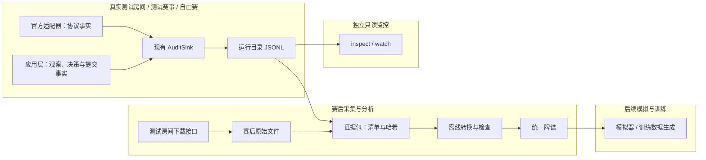

# 审计增强实施方案

> 状态：待实施设计；本文不表示生产代码已升级。日期：2026-09-05。  
> 优先级：可用于训练与模拟复盘的数据 → 赛后定位 → 附带的赛中监控。  
> 契约：现行审计 v1 保持可读；本方案定义拟实施的审计 v2、统一牌谱 v1。

## 1. 范围与完成目标

沿用审计接收器（`AuditSink`，非阻塞接收结构化事实的接口），补齐记录；一个离线命令入口完成检查、查看、转换和打包。线上不增加数据库、事件总线、订阅端口或监控服务。完整模拟器和训练器不属于本次交付。

交付后应能：

1. 从测试房间完整事件流生成经过检查的统一牌谱；资料足够时提供完整世界初始数据和历史动作，供后续模拟器读取。
2. 从任一环境的运行目录恢复一次决策的实际输入、候选、排序、复核、提交和结果，不连接官方平台也能定位漏胡等问题。
3. 用同一个只读命令持续查看多场状态、最近决策和已有异常；命令停止不影响 Bot。

**验收不以“完整世界导出率 100%”为目标。** 数据缺失时必须准确说明能做什么；不能把推测的隐藏手牌或未来牌墙写成官方事实。

### 1.1 环境能力与证据等级

以下“当前观察”来自项目负责人 2026-09-05 的说明，并非本次重新访问平台确认的接口承诺。旧版接口依据见 [API v8 §2.5](../official-platform-api-v2.md#25-测试房间赛后数据)（2026-09-03 快照）；实际采集需留存当时指南版本和响应样本。

| 环境 | 当前可依赖来源 | 不应假设 |
| --- | --- | --- |
| 测试房间 | 实时观察；赛后接口提供全量事件流，包含四家起手牌 | 存在正式赛事阶段排名；全量事件必然包含未摸牌墙顺序 |
| 测试赛事 | 运行时事件/快照；实际取得的阶段、积分和排名；赛后页面可供人工核对 | 存在可下载的全量牌谱 |
| 自由赛 | 运行时事件/快照和比赛实际提供的积分、阶段、排名 | 与测试房间拥有相同下载能力或与测试赛事拥有相同阶段格式 |
| 随机匹配房间 | 当前已接入的实时数据 | 牌谱下载能力，待确认 |

环境名称只写进运行元数据，不扩展官方字段或推断赛制。阶段/排名数据未提供时记录 `null` 或原始字段缺失，不伪造排名为 0。

## 2. 最小架构与职责

一份审计证据包（`AuditBundle`，可独立迁移的原始记录、版本清单与校验清单集合）是原始输入。统一牌谱（`CanonicalReplay`，从证据转换的版本化单局与决策数据）是可重新生成的派生产物，两者不混写。

箭头表示事实写入或只读消费方向；文件不是线上决策的输入。



| 所有者 | 本次职责 | 耦合约束 |
| --- | --- | --- |
| `application` | 序列化完整决策请求、计划、复核、预算和耗时；记录实际观察到的赛事上下文 | 不导入 `adapters/recording`；不向规则、策略注入记录器 |
| `adapters/official` | 记录脱敏协议原文；为测试房间赛后响应做格式转换 | 复用修复后的传输和 SSE 接收位置；不增加赛事轮询或状态推进逻辑 |
| `adapters/recording` | 编码、后台落盘、读取、验证、摘要与打包 | 不重新判胡，不自行生成策略候选，不访问官方平台 |
| `offline` | 首次进入具体的数据整理阶段：转换证据、核对单局、导出统一牌谱、命令编排 | 只有真实实现文件；不预建训练、模型、采样器或模拟器接口；线上禁止反向导入 |
| `bootstrap.py` | 注入同一个记录器、版本信息；组装赛后下载客户端 | 仍为唯一组合根；命令脚本只解析参数和调用 |

## 3. 线上接口：保留 AuditSink，只升级记录内容

`emit(record) -> AuditReceipt`、`aclose(timeout_seconds) -> AuditSummary` 的签名不变，四个生产接缝不增加。`BotPolicy`、`HangmaRules`、`DecisionRequest`、`GameSessionPort` 均不为审计增加参数。

### 3.1 审计信封 v2

下列为拟修改的公共类型示意；原类型和引用仍归 `application/contracts.py`。JSON 编码显式列字段，不用通用对象序列化代替长期格式。

```python
@dataclass(frozen=True)
class AuditRecord:
    """已脱敏的一次事实；emit 返回前记录器取得独立内容快照。"""

    schema_version: int  # 本次为 2；约束信封及各 kind 的 payload 词表
    kind: AuditKind
    context: AuditContext  # 沿用九个关联键；尚未知的场次/阶段键可空
    source: str  # application 或 official；明确事实生产方，不靠 payload 猜测
    wall_time_unix_ms: int  # 本进程观测时的墙上时钟，Unix 毫秒
    monotonic_ns: int  # 本进程单调时钟纳秒；跨 run 不直接相减
    payload: Mapping[str, object]  # 只含 JSON 值；权限由各 kind 约束
```

记录器在磁盘信封增加 `record_no: int`，每次 `emit` 尝试先分配一个从 1 递增的运行内编号，校验失败/队列满也消耗编号。记录唯一键为 `(run_id, record_no)`；调用方不等待、不读取这个编号。重启生成新 `run_id`，禁止多进程共写同一运行目录。磁盘写入顺序可能受优先级影响，不等同于 `record_no` 或官方 `seq` 顺序。

编号缺口需与关闭摘要中的低优先级丢弃、序列化失败及高优先级缺失分别对账，不把正常丢弃冗余记录直接判为决策链损坏。高优先级缺失或无关闭证明时，无法证明完整的范围仍明确标记。

关联规则：

- 决策输入和计划：`run_id + decision_id + plan_revision`。同窗刷新保持 `decision_id` 和原截止时间，但新输入必须单独记录。
- 提交：`run_id + decision_id + attempt_no`；应用层表示调用意图/调用结果，适配器表示实际协议动作。两个 `source` 各一份正常，同来源重复必须解释。
- 协议请求：`request_id` 为适配器生成的运行内唯一字符串；SSE 连接另有 `connection_id`，不可把 SSE 帧 id 直接当官方 `seq`。
- 场次聚合：以 `tournament_id/game_id/round_no` 加已确认的阶段尝试映射关联；`participant_id` 区分视角。不同节点的 `run_id` 永不改写。无法确认跨运行的阶段尝试映射时保留分离，报告未关联。
- 指南查询尚未识别身份时保留已有启动占位身份；不得把缺失官方字段猜出来。

现有 `AuditSummary` 返回类型保持不变；磁盘 `summary.json` 增加 `emit_attempted`、`last_record_no`、写失败计数和 `closed_cleanly`。正常关闭满足计数对账；强杀缺少关闭证明时，即使已存编号连续也不能宣称尾部完整。v2 的每条 `RUN_MANIFEST` 先追加到 `lifecycle.jsonl`，再原子更新 `manifest.json` 最新副本，避免旧 manifest 被覆盖造成假缺号。验证器按唯一键计数，manifest 副本不重复计入 written。最终状态以关闭摘要为准。

### 3.2 记录种类与最少字段

只新增三个种类，其余在现有种类中扩展。v2 必填校验由生产方样本与契约测试一起落地；v1 继续沿用旧校验，不能要求旧日志具备新字段。

| kind | 生产位置与时点 | v2 payload 必须保存 |
| --- | --- | --- |
| `RUN_MANIFEST` | 组合根提供版本；应用层启动/初始化后 | `run_id`、`environment`、代码版本/dirty 标记、构建文件哈希、Python/依赖版本、策略名/完整权重、本地规则版本、官方指南原响应、脱敏完整运行配置；未初始化部分为空并说明 |
| **`PROTOCOL_MESSAGE` 新增** | 官方传输调用 HTTP 前及收到响应、抛错前；SSE 每个完整业务帧进入状态解析前 | `request_id`、`connection_id`（非 SSE 为空）、`transport`（http/sse）、`direction=send/receive/error`、`endpoint`、`method`、允许留存的查询参数、`status`、`body_text`、接收时间、发送开始时间；缺失字段明确为空；异常类/取消原因 |
| `AUTHORITATIVE_STATE` | 已有状态投影完成后；赛事快照更新时 | `scope=game/tournament/guide`；场次保存不含公共历史的完整可见牌桌字段及 `seq`；赛事保存实际返回的阶段、排名和更新时间。相同序号且内容不变可省重复展示快照，原始业务事件仍记录 |
| **`DECISION_INPUT` 新增** | 规则分析完成、调用策略之前 | `plan_revision`、完整 `request`、原始 `budget`、窗口接收时间、规则起止时间、`competition_available`；重规划记录刷新后的实际输入 |
| `DECISION_PLANNED` | 策略返回并通过应用层清理后 | `plan_revision`、`returned_plan`（异常时为空）、`effective_candidates`、过滤/保底原因、策略起止时间、窗口键；保存完整动作、名次、分项及理由 |
| **`CANDIDATE_VALIDATED` 新增** | 每次最终复核结束或抛错时 | `plan_revision`、`action_key`、`legal`、`reason`、`validation_elapsed_ms`；复核异常为 `legal=null` 并记错误，不伪装成规则明确不合法 |
| `SUBMISSION_INTENT` | 应用层调用 submit 前；适配器发送 POST 前 | 完整 `action`、`action_key`、`plan_revision`、截止时间、调用/发送时间、`is_emergency`；适配器加 `request_id` |
| `SUBMISSION_OUTCOME` | submit 返回/失败/取消时 | 原七类结果、错误码、权威序号、耗时；取消只能记录实际已知事实，不合成 accepted 或 definite rejection |
| `LIFECYCLE_CHANGED` / `PROTOCOL_RECOVERED` | 原位置 | 保留原字段；作废阶段尝试及原因必须留存 |
| `GAME_FINISHED` / `PARTICIPANT_FINISHED` | 原位置 | 已确认的场次/身份结果、来源序号、是否权威终态；无法获得的积分为空并说明，不以零向量代替 |

`RAW_PROTOCOL_STATE` 继续只用于确实可由已存原文替代的冗余副本。`PROTOCOL_MESSAGE` 是高优先级，不能沿用原“原始快照可丢”的默认口径。SSE 心跳、无状态变化的重复 pending 响应可以仅计数，但携带 `gap`、错误、版本或业务事件的消息不能省略。省略范围写进 manifest，便于判断协议证据覆盖率。

`AUTHORITATIVE_STATE(scope=game)` 只服务观察和监控，不用于恢复 `DecisionRequest`；恢复决策直接读 `DECISION_INPUT`。因此监控不需要维护第二套协议状态机。紧急路径若在生成请求前退出，保留已收到观察及退出原因，该窗口标为“未生成决策输入”。

### 3.3 复用值对象，避免重复模型

新增 `application/audit_codec.py`，显式编码/解码 `DecisionRequest`、`DecisionPlan`、`DecisionBudget` 和它们包含的规则事实。直接复用 `kernel/serialization.py` 已有的观察、赛事上下文、动作和窗口编解码；`RuleAnalysis`、`RuleCandidate`、`CandidateFacts`、`RuleIssue` 等按当前公开类型逐字段映射，不再计算规则。

```python
def decision_request_to_json(request: DecisionRequest) -> dict[str, object]:
    """把实际请求转为独立 JSON 对象；保留手牌顺序和全部规则事实，不读时钟或文件。"""
    ...

def decision_request_from_json(data: Mapping[str, object]) -> DecisionRequest:
    """恢复请求；缺字段、未知破坏性版本或错误类型抛 ValueError，绝不补猜默认候选。"""
    ...

def decision_plan_to_json(plan: DecisionPlan) -> dict[str, object]:
    """保留完整候选顺序、动作、评分和理由；不决定哪个候选实际发送。"""
    ...
```

编码要点：保留 `observation.public_history`、全部规则候选与紧急候选、`facts=None`、规则证据、降级原因和已拒绝尝试。所有座位向量按 0—3，牌编码复用 `Tile.code`，手牌顺序不排序。评分不是桌内积分，不把 `total_score` 的策略评分混作比赛分数。`NaN/Infinity` 明确拒绝。

预算同时保存三个原始单调时钟截止时间（秒）、窗口接收单调时间（秒）和记录时剩余毫秒。离线重新运行策略时按固定基准平移整组时间；这属于新的实验，不能覆盖当时的选择或声称复现网络调度。

`DECISION_PLANNED` 保留策略原计划和清理后的候选，二者不一致属于可解释事实；若原计划含无法编码的畸形对象，`returned_plan=null` 并保存编码错误与过滤原因，仍独立记录有效候选。审计不能为复现错误对象而保存 Python pickle。

协议记录复用现有 `OfficialTransport`，内部 `request()` 增加 `audit_context: AuditContext | None = None` 与 `request_id: str | None = None` 参数。场次会话在每次实际调用前分配 request_id，同值进入官方层 intent 和传输记录；无动作关联的 GET 允许由传输自行分配。内部重试每次重新分配，不复用旧请求编号；它不是新增公共端口。在传输持有 Token 的位置精确脱敏，留存状态码与原响应文本后再做错误分类，避免 409/5xx 原文丢失。SSE 接收实现采用同一字段词表；具体文件以另一环境合入后的实现为准，本方案不改其恢复机制。

协议时点统一为 `send_started_monotonic_ns`、`received_monotonic_ns`（本进程纳秒，未发生时为空），SSE 额外保留帧的原始 `event/id/data`；`endpoint` 只存路径，不含认证查询串。记录 send 表示开始调用客户端，不证明报文已经到达服务器。下载限速、分页、块序号作用域与 `batch/game_id` 映射以版本 fixture 确认；清单同时保存真实来源标识，内部迁移包按私有比赛数据管理。

### 3.4 延迟和故障约束

继续使用现有有界队列与单写线程。入队快照/编码必须同步完成，磁盘、压缩、哈希、分析、看板和下载均在动作路径之外；`flush` 只表示交给操作系统，不宣称每条记录已耐受断电。

- 新增 codec 可能抛错，必须由应用层审计辅助函数捕获并标记降级；不能让构建 payload 的错误逃出 `emit()` 调用之前。
- 除条数上限外，队列增加字节上限（建议初值 64 MiB，配置留档）；超限整条拒收并计数，不截断手牌、候选或业务原文后仍宣称完整。
- 增大 payload 前先测最长观察历史、最大候选及目标 `M` 下的编码/入队耗时。建议初始门槛为单次决策审计总同步耗时 P99 不超过 10ms，并同时通过原动作截止时间门禁；该数值是工程目标，不是官方规则。
- 检查审计开/关的目标机器对照，分别报告 1 秒和 3 秒窗口的尾部耗时、服务端自动动作、余量和高优先级缺失。
- 不因监控、下载或打包创建额外实时请求。榜单沿用应用层已有缓存，记录真正交给策略的版本。

## 4. 数据产物与归档

一个进程的一次启动对应一个运行目录。测试房间四身份保留四个运行目录；同节点或跨节点收集时只加入证据包，不合并或改写原始 JSONL。

```text
audit-root/                         # 由部署配置指定；大文件不进 Git
  runs/{run_id}/                    # 线上写入，沿用现有布局
    manifest.json                  # AuditRecord(RUN_MANIFEST)；最终包含版本和配置
    lifecycle.jsonl
    participants/{participant_id}/
      decisions.jsonl              # 输入、计划、复核、提交记录
      protocol.jsonl               # 全部 PROTOCOL_MESSAGE；用 context 关联场次
      games/{game_id}.jsonl         # 可见状态、恢复与场次结果
      summary.json
    summary.json                   # 写入/缺失数量、last_record_no、关闭状态
  bundles/{bundle_id}/              # 赛后命令生成的新目录
    bundle.json                    # 清单、来源和文件哈希；不是 AuditRecord
    runs/{run_id}/...               # 已停止写入的运行目录副本
    official/{download_id}/
      source.json                  # 下载时间、指南版本、环境、room/batch/game 映射
      games.json                   # 脱敏后的官方场次列表原文
      events.json                  # 脱敏后的完整响应原文；失败不生成成功文件
    validation.json                # 记录完整性、损坏、结果关联和覆盖报告
  derived/{dataset_id}/             # 离线生成，不修改 bundles
    manifest.json                  # 输入 bundle_id、转换版本、规则版本、文件哈希
    decisions.jsonl                # 每个实际决策/规划修订一行
    hands.jsonl                    # 每个单局一行；全信息只在这里
    validation.json                # 每个单局的能力、缺失项及一致性检查
  exports/{bundle_id}.tar.gz        # 包含完整证据包及清单；压缩后可用现有传输工具
```

最小 `bundle.json` 字段：

| 字段 | 类型与语义 |
| --- | --- |
| `schema_version` / `bundle_id` | `int=1` / 唯一字符串；封存后不可变，补资料生成新包 |
| `created_at_unix_ms` | 打包节点墙上时钟 Unix 毫秒 |
| `run_ids` / `parent_bundle_ids` | 字符串数组；后者为空或指向补充包来源 |
| `files` | `{path: str, bytes: int, sha256: str}` 数组；path 是包内相对路径，字节单位为 byte；覆盖所有文件，清单自身除外 |
| `closed_cleanly_by_run` | `{run_id: bool}`；来自源目录关闭证据；为 false 不代表所有记录都不可用 |
| `source_notes` | 来源环境、操作人备注和已知缺失；不含 Token、认证头或完整配置凭证 |

代码重建信息至少包含 commit、dirty、实际源文件内容哈希、Python 与依赖版本和完整策略权重。正常采数尽量使用可取得的已提交版本；dirty=true 的数据仍保存，但另标代码不可精确恢复风险。包不复制整个工作区或私有配置，也不把 commit 存在误认为另一节点已经拥有该代码。

### 4.1 转移流程

1. Bot 关闭记录器后，复制所需 `runs`；下载测试房间数据到临时文件，检查响应/场次映射后原子改名。下载不成功保留错误报告，不伪造空事件流。
2. 命令检查原始目录，生成 `validation.json` 和文件 SHA-256 清单，最后创建归档；中断留下 `.partial`，不占用最终包名。正常包禁止原地追加；补采生成新包。
3. 用已有 `scp` 或 `rsync` 转移压缩包及 `.sha256`；目标端 `validate` 先校验外层 SHA-256，再安全解包至临时目录并核对清单。首版直接长期保存压缩包；inspect/convert 共用安全读取流程，无需维护另一套永久导入目录。
4. 解包拒绝绝对路径、`..`、符号/硬链接和同名覆盖；这是归档命令内部行为，不增加交互审批流程。相同包 id、相同哈希视为重复导入，不再复制；同 id 不同哈希报冲突。

进程异常退出的数据允许使用显式 `--allow-incomplete` 打包，必须先确认源进程已停止写入；尾部半行原样保留并报告，转换器不消费该半行。首版不支持封存仍在写入的目录。监控可以读取增长文件，但它不是封存包。

## 5. 统一牌谱 v1

统一的是字段含义和读取方式，不把局部信息伪装成全信息。统一牌谱的两种行结构如下；这些是离线数据结构，放在 `offline/replay.py`，不放进 `kernel`，不提前定义模拟器的 `WorldState` 类。

### 5.1 决策行

```python
@dataclass(frozen=True)
class ReplayDecision:
    """一次规划修订的实际输入与结果；用于决策复盘及后续学生样本提取。"""

    schema_version: int  # 统一牌谱版本，本次为 1
    context: AuditContext  # 明确 run、身份、场次、单局和 decision_id
    plan_revision: int  # 同窗重规划不能覆盖上一输入
    request: DecisionRequest  # 只来自当时 DECISION_INPUT，不用新规则替换旧候选
    budget: DecisionBudget  # 三个原始单调时钟秒值；跨进程不可直接使用
    timings_ms: Mapping[str, float | None]  # 规则、策略、submit 各阶段毫秒耗时；未观测到为空
    returned_plan: DecisionPlan | None  # 策略异常、取消或缺失时为空
    effective_candidates: tuple[RankedCandidate, ...]  # 应用层实际采用的候选顺序
    attempts: tuple[Mapping[str, object], ...]  # action、七类 outcome、request_id、权威确认引用
    input_refs: tuple[str, ...]  # bundle_id/run_id/record_no，指向全部原始依据
    decision_complete: bool  # 输入、计划或显式失败、复核、尝试结果关联是否完整
    voided: bool | None  # 阶段尝试是否作废；未确认时为空，训练默认排除
```

磁盘上 `request/returned_plan/action` 使用 §3.3 编码器；每个 attempt 还记录 `execution_status=confirmed/unresolved/not_executed` 与 `execution_event_ref: str | null`。只有平台权威事件或具有足够归属信息的快照能确认执行。200/accepted 不能自动补出执行序号；歧义无法消除时保留 unresolved。服务端自动动作单独存在于单局事件中，不能归功于策略。

最终积分标签通过单局键关联 `hands.jsonl`，不嵌入 `request`。这不是可直接送入模型的特征矩阵；后续训练仍用 `learning` 的共用编码。缺失记录、结果未确认、作废、同窗重规划和服务端自动动作都保留明确标记，由具体训练任务选择，默认不当作干净的行为监督样本。

### 5.2 单局行与完整世界初始数据

单局键必须包括赛事、已确认阶段尝试、官方场次、`round_no`；跨节点尝试键未完成映射时不合并。同一单局的四座位视角归属同一数据划分，不能分别进入训练与验证。

| `ReplayHand` 字段 | 类型、用途与缺失语义 |
| --- | --- |
| `schema_version` / `hand_id` | `int=1` / 离线稳定字符串；由上述单局键生成，不冒充官方字段 |
| `tournament_id/game_id/round_no/stage_attempt_id` | 原始关联字段；尝试未知时为空并降低关联能力 |
| `rule_config` / `guide_version` | 完整规则配置及其依据版本；缺失时不准生成 `full_world` |
| `coverage` | `observed` / `full_history` / `full_world`，定义见下表 |
| `start` | `ReplayStart \| null`，只接受官方证据或可核验的确定性重建；局中接入无法恢复开局时为空 |
| `events` | `ReplayEvent[]`，历史事件，包括已确认的自动动作；按官方版本规定的序号作用域排序 |
| `final_scores` | `int[4] \| null`，座位 0—3 的权威单局结束桌内累计积分；不是单局增量 |
| `score_delta` | `int[4] \| null`，结束减开始；任一端未知时为空 |
| `voided` / `result_confirmed` | `bool \| null` / `bool`；未知作废状态不作为有效训练标签 |
| `source_refs` / `missing_fields` | 原文件哈希和 JSON 路径/record 引用数组；缺失或冲突的字段名称数组 |

```python
@dataclass(frozen=True)
class ReplayStart:
    """发牌完成、首个玩家动作之前的官方世界种子；只允许离线消费。"""

    seq: int  # 该起点对应的官方序号，按采集版本解释
    dealer_seat: int  # 0—3
    turn_seat: int  # 起点当前行动座位，0—3
    phase: str  # 官方起点阶段；未知阶段不能导出 full_world
    hands: tuple[tuple[str, ...], ...]  # 外层座位 0—3；暗牌不含下列独立摸牌
    drawn_tiles: tuple[str | None, ...]  # 座位 0—3；起点已发/摸的额外牌，不重复计入 hands
    scores: tuple[int, int, int, int]  # 单局起点桌内累计积分，座位 0—3
    rule_state_by_seat: tuple[Mapping[str, object], ...]  # 四家起点规则状态；字段映射随规范版本登记
    wall: tuple[str, ...] | None  # 未使用牌的完整物理位置序列，包含保留牌；无法唯一恢复则空
    wall_layout_version: str | None  # 正常摸牌、补牌、保留区的索引规则版本；wall 空时可空
```

`ReplayStart` 只支持真正的开局点，副露和弃牌应为空；不设计任意局面快照。若官方 `start_hands` 已含庄家额外牌，必须由原始事件明确拆分 `hands/drawn_tiles`；不能随意取末张。无法拆分时保留原始数据和 `missing_fields`，不构造虚假种子。完整世界各牌区计数必须不重叠，总计 136、每种 4 张，配置与官方证据不符时失败。

`ReplayEvent` 字段固定为：`seq: int`、`type: str`（官方 type 原样保留）、`seat: int | null`、`action: Action | null`、`tiles: str[]`、`draw_kind: normal/replacement/null`、`wall_index: int | null`、`origin: submitted/automatic/unknown`、`source_ref: str`、`official_payload: JSON object`。摸牌与补牌的物理位置只有来源充分时填写。碰吃响应和实际生效动作分别保留，不把全部候选响应依次当作生效动作推进。

对每个已支持的官方事件 type，在 `adapters/official/replay.py` 内维护一个明确的字段映射；未知关键事件保留原文并令该单局转换不通过。不能复用 `PublicEvent` 丢掉完整牌谱隐藏字段，也不能让其进入线上观察。

| coverage | 可以证明什么 | 后续用途 |
| --- | --- | --- |
| `observed` | 存在一个或多个座位的当时观察、部分事件与决策；不声明四家完整状态 | 赛后定位；满足结果与权限要求的观察样本 |
| `full_history` | 四家起点手牌和全部已发生摸牌/动作/结算可核对；未发生牌墙顺序可能未知 | 固定历史轨迹复盘、教师数据整理；不声明可任意反事实分叉 |
| `full_world` | full_history 条件成立，完整初始牌墙、起点状态、摸补位置语义和规则配置也已核验 | 后续模拟器初始化真实完整世界并尝试分叉；模拟器本身仍须通过独立规则门禁 |

全量事件流不自动等于 `full_world`。若官方接口只给已摸的牌，导出 `full_history` 并列出缺少的牌墙信息。未来用信念采样补全时生成另一个带采样版本/随机种子的模拟数据集，不提升原牌谱 coverage。

### 5.3 转换与校验算法

转换从已封存证据包运行到新临时目录，成功后原子改名；同一输入哈希、转换版本和规则版本得到相同内容（运行时间等非内容元数据除外）。

1. 核对清单与审计版本，读取原始文件；相同官方事件跨身份/重连重复时，仅在身份可见范围、作用域及内容匹配后合并。相同序号但不同视角内容分别保留；全信息相互冲突则失败，不用“最后一个覆盖”。
2. 把 `DECISION_INPUT` 与相同规划修订的计划、复核、尝试连接；从官方执行事实关联结果。旧日志无输入时报告不可重建，不从最终状态补造。
3. 官方赛后格式转换归官方适配器；离线模块组装 `ReplayStart/ReplayEvent/ReplayHand`。源文件保持原样，不依赖读取器升级才能保留新增官方字段。
4. 做结构、事件完整性、座位/牌张、动作来源及结果检查；有完整起点和轨迹时检查已用牌的移动及计数。规则计算和结算核对只调用 `HangmaRules`；当前公开规则接口无法验证的推进语义，记录 `not_checked`，等待后续模拟器验证，不实现第二套动作规则。
5. 分别报告 `archive_integrity`、`decision_completeness`、`history_completeness`、`world_completeness`、`rules_agreement`（passed/failed/not_checked），以及每项证据。coverage 只表示数据能力，不等于规则正确或训练可用。
6. 导出合格与不完整单局并标记；训练默认筛除未确认结果、作废/未知作废状态、损坏及规则冲突，保留原数据用于诊断。同一单局及其重规划、四座位视角和后续分叉使用共同划分键。

缺少完整 request 的决策不生成 `ReplayDecision`，在 `validation.json` 中逐条列明标识和原因；其原始记录仍可 inspect。缺少结果但输入完整的决策可导出，`decision_complete=false`。完整性报告同时给出输入窗口数、导出行数和未导出原因计数，不能静默减少数据。

## 6. 离线入口与赛中监控

新增一个 `scripts/audit.py`，命令为拟实施接口，当前不可直接运行。脚本只解析参数；归档和读取在 recording，官方下载/格式映射在 official，转换与命令编排在 offline，客户端仍由组合根创建。

| 命令 | 输入与产物 | 错误/副作用 |
| --- | --- | --- |
| `validate PATH` | 运行目录、证据包目录或 tar.gz；输出结构化校验报告 | 只读；归档需安全解包到临时目录；沿用并扩展 `validate_run()` |
| `inspect PATH [--decision ID] [--watch] [--json]` | 目录或包；显示当前状态/指定决策；watch 跟随运行目录 | 只读、无官方请求；包不支持 watch；无数据时标记等待/陈旧 |
| `collect-room --config FILE --room ID --out DIR` | 保存场次列表、逐 batch 完整原始响应及来源清单 | 仅赛后 GET；进行中/404/限速按已确认协议报告，有限重试；不创建/删除房间、不调用 ready |
| `pack --run DIR ... [--official DIR ...] --out FILE [--allow-incomplete]` | 一个或多个已停写运行目录与下载目录；输出证据包 tar.gz 和外层 `.sha256` | 不覆盖同名不同内容；只读取源目录；不完整包必须显式标记 |
| `convert BUNDLE --out DIR` | 已校验的证据包；输出 §4 的统一牌谱目录 | 无网络；新目录写入；损坏或字段不足逐单局报告，不能悄悄跳过 |

退出码统一：`0` 操作完成且所请求检查通过，`1` 产生报告但存在不完整/冲突，`2` 参数、文件或不支持的破坏性版本错误。`--allow-incomplete` 允许产出诊断包，仍返回 1 提示质量问题；监控活动目录不因尚未关闭而直接退出。

命令调用以下具体函数即可，不新增可替换 Protocol。报告均为可序列化 JSON 对象，包含 `ok/findings/counts`；每条 finding 含 `code/detail/source_refs`。未知破坏性版本报错，未知可选字段保留或忽略但不改变已知字段语义。

```python
# adapters/recording/reader.py
def iter_records(run_dir: Path, *, follow: bool = False) -> Iterator[Mapping[str, object]]:
    """读取带原文件/行号/record_no 的记录；follow 在独立进程等待新行，可中断，不访问网络。

    文件错误或完整坏行抛带位置的读取异常；监控入口显示异常并继续读取可用文件，
    转换入口记录失败；末尾未完成行在 follow 中等待，静态读取中报告不完整。
    """
    ...

# adapters/recording/archive.py
def pack_bundle(run_dirs: tuple[Path, ...], official_dirs: tuple[Path, ...],
                output: Path, *, allow_incomplete: bool = False) -> dict[str, object]:
    """核验停止写入的来源并创建新归档及哈希；拒绝覆盖冲突，I/O 失败清晰报错，不修改来源。"""
    ...

# offline/replay.py
def convert_bundle(bundle_dir: Path, output_dir: Path) -> dict[str, object]:
    """把已安全展开且核验的包转为新牌谱目录；返回逐单局报告，不联网，不覆盖历史候选。"""
    ...
```

### 6.1 只读监控的具体范围

首版提供终端表格与 `--json` 两种输出，不做浏览器服务。人可以每秒刷新查看，LLM 教练可读取结构化摘要；两者均无出牌控制入口。

- 总览按 run/身份/game 展示：`round_no`、座位、阶段、最近状态接收时间、最新序号、最近动作、提交状态、降级原因。
- 单场详情展示：本人手牌/摸牌、四家弃牌/副露、庄家、桌内积分、最近候选和理由。赛事阶段/排名仅实际取得时显示，并注明更新时间。
- 数据从 `AUTHORITATIVE_STATE` 和决策记录直接读取，不复判胡，不维护第二套协议投影。界面显示“截至 seq / 接收时间”；有新协议事件尚无新展示快照时不假装状态已更新。
- 每文件记录字节偏移，只处理带换行的完整 JSONL；末尾半行等待下一次读取，完整坏行显示损坏；无需扫描历史全文件刷新界面。文件被截断/替换时显示重载提示，按新文件重读，不拼接旧尾部。
- 仅展示已有错误、规则降级、未确认提交、复核拒绝和记录缺失；“候选有 hu 而未选”可展示为行为提示，不自动判定策略错误。
- 文件路径加行号/record_no 可定位原文。watch 延迟目标 1 秒左右，配置写进命令输出；不承诺实时硬期限。

## 7. 文件修改清单

以下是实施阶段清单；本次仅提交方案及同步文档，不修改运行代码。

| 文件 | 修改内容 |
| --- | --- |
| `src/hangma_bot/application/contracts.py` | AuditRecord 加 source、审计版本常量统一放此处、AuditKind 加三个种类；端口签名不变 |
| `src/hangma_bot/application/audit.py` | source=application；安全编码辅助调用；payload 构建失败标记降级；复用唯一版本常量 |
| **新增** `src/hangma_bot/application/audit_codec.py` | 决策请求/规则事实/计划/预算显式编解码，复用 kernel 编解码 |
| `src/hangma_bot/application/decision_loop.py` | 输入、完整计划、逐候选复核、实际尝试与耗时记录；保留原预算与提交路径 |
| `src/hangma_bot/application/tournament_supervisor.py`、`participant_runtime.py`、`game_task.py` | 记录实际赛事上下文/排名、权威结果、作废、初始化失败与退出；补齐 manifest |
| `src/hangma_bot/adapters/official/transport.py`、`game.py`、`participant.py` | 原文在错误分类前留存、请求关联、source=official、状态展示快照；不改变同步规则 |
| 另一环境合入后的 SSE 接收文件 | 在完整业务帧解析前记录，覆盖重连/错误；复用同一记录器，保留独立 connection_id |
| **新增** `src/hangma_bot/adapters/official/replay.py` | 赛后 GET 下载和官方字段映射，支持版本以真实 fixture 为准；不实现牌型/状态推进 |
| `src/hangma_bot/adapters/recording/schema.py`、`jsonl_sink.py` | v2 校验/路由、record_no、字节上限、关闭对账、manifest 历史追加及最新副本原子替换；v1 离线读取兼容 |
| `src/hangma_bot/adapters/recording/redact.py` | 原文中嵌套认证值与 URL 凭证覆盖；保留牌值、关联键及哈希，防止过度脱敏破坏转换 |
| `src/hangma_bot/adapters/recording/validator.py`、`summary.py` | 按 source 对账、新链路完整性/耗时、关闭状态、缺失与权威结果冲突；可区分 v1 的能力缺失 |
| **新增** `src/hangma_bot/adapters/recording/reader.py` | 共用静态/增量读取、决策查询及终端/JSON 摘要；不访问私有同步状态 |
| **新增** `src/hangma_bot/adapters/recording/archive.py` | 清单、哈希、安全封存/解包及重复导入判断 |
| **新增** `src/hangma_bot/offline/__init__.py`、`replay.py`、`audit_cli.py` | 具体的统一牌谱结构、转换/检查及命令编排；不创建训练/模拟空目录 |
| `src/hangma_bot/bootstrap.py` | 版本/权重/队列参数与审计上下文注入；赛后下载组装函数；不把 Token 放入 manifest |
| **新增** `scripts/audit.py`；`scripts/run_test_room.py` | 新命令薄入口；四身份启动器汇总实际 run 路径，便于一次 pack；不自动下载干扰比赛 |
| `.gitignore` | 视部署目录补充 bundles/derived/exports 的本地产物忽略；小型脱敏 fixture 仍可入库 |

`kernel/serialization.py`、`hangma`、`policy` 正常情况下无需改动。发现旧接口缺少真实决策事实时先给出具体样本并登记契约，不借审计增强改变规则或策略行为。采用新 payload 后同步更新 recording 的模块 AGENTS 中关于低优先级原文的说明，明确独有原文使用高优先级种类。

### 7.1 文档与契约测试

实施时同步更新本文、[接口协议 §7](./interface-contracts.md#7-审计协议)、[recording 模块说明](./modules/recording.md)、[架构 §8](../architecture.md#8-审计边界)、[主方案 §6.8/§7.1](../hangma-ai-bot-technical-plan.md#68-adaptersrecording非阻塞记录p0)、[术语表](../../UBIQUITOUS_LANGUAGE.md)和[验收标准](./mvp-acceptance.md)。文档由本文保存字段权威定义，其他文档保留摘要和指针，避免复制整套词表。

| 测试位置 | 必须覆盖的行为 |
| --- | --- |
| **新增** `tests/contracts/test_audit_v2_contracts.py` | 所有真实生产方与内存 sink 对齐；完整请求编解码往返；source/字段/空值/版本；旧 v1 可读但能力不足不误报完整 |
| `tests/unit/application/test_audit_chain.py` + 决策/生命周期相关测试 | 可胡但候选缺失的输入能复现；重规划两份输入和同一预算；复核跳过；策略超时/非法计划/取消；作废标记 |
| `tests/adapters/official/` 的传输、场次、SSE 测试 | 409/5xx/解析异常原文保留；请求与动作关联；gap/重连重复；无 Token；监控不触发额外请求 |
| `tests/adapters/recording/` | 队列字节/条数满、慢盘/满盘、记录编号缺口、关闭尾部缺失、半行、重复来源、manifest 原子写；旧 JSONL 兼容 |
| **新增** `tests/integration/test_audit_bundle.py` | 完整运行→封存→解包至另一绝对路径→同一决策恢复；删除/篡改/截断文件可发现；同包去重、同 id 冲突 |
| **新增** `tests/offline/test_replay_conversion.py` | 官方四家起手/额外摸牌不重计、重复事件及视角隔离、缺牌墙不升 full_world、作废/自动动作不冒充干净标签、固定输入确定输出 |
| **新增** `tests/fixtures/audit/v2/` | 一组脱敏真实测试房间下载数据及官方版本/抓取日期；一组只有单身份观察的赛事数据。未取得样本前用人工 fixture 验证结构，不能宣称官方转换门禁通过 |

## 8. 实施顺序与退出标准

按三个可独立验收的提交推进，不要求同时开发看板、模拟器和训练器。

1. **先补记录与检查**：v2 codec、输入/计划/复核、协议原文和 manifest；一份失败决策可以从日志恢复。先跑本地契约和故障用例，再跑目标 `M`，审计延迟和缺失达到 §3.4 门槛。
2. **再做归档与统一牌谱**：取得一份真实测试房间完整数据，完成下载、pack/validate/convert；在不同绝对路径恢复同一决策，核对一整个官方场次的单局结果。逐项报告 full_history/full_world 所缺信息，不因官方未提供未来牌墙而伪造成功。
3. **最后补 inspect/watch**：复用读取器每秒展示状态，支持 JSON；开启/关闭监控的 Bot 动作和网络请求不受影响。首版完成终端展示即可。

最终交付证据：一个 v2 测试房间证据包、一份统一牌谱、一份只有玩家观察的赛事证据样本、一份跨路径恢复报告，以及目标并发审计开销报告。尚未取得外部真实数据或官方字段无法确认的项目明确列为未验收，不影响已完成的记录和归档能力交付。
