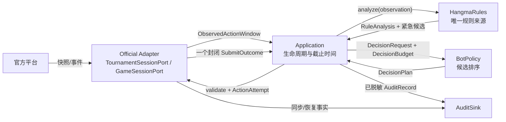

# 第一阶段接口协议

> 状态：接口基线 v1；实行受控变更  
> 日期：2026-09-03  
> 官方依据：指南/API v8（检查日期 2026-09-03）  
> 代码定义：`src/hangma_bot/**/interface.py` 与 `application/contracts.py`

## 1. 设计决策

第一阶段只保留四个需要替换或隔离副作用的接口：

| 接口 | 调用方 | 第一阶段真实实现 | 为什么需要接缝 |
| --- | --- | --- | --- |
| `TournamentSessionPort` | `application` | 官方赛事会话、保存响应驱动的 Fake | 不连平台也能确定性测试多阶段生命周期 |
| `GameSessionPort` | `application` | 官方场次会话、保存响应驱动的 Fake | 隔离长轮询、序号恢复和动作提交 |
| `BotPolicy` | `application` | 加权启发式、紧急保底 | 两种真实策略必须可替换和故障降级 |
| `AuditSink` | `application` 与适配器 | JSONL、测试内存记录器 | 磁盘副作用不能进入动作闭环 |

`HangmaRules` 是唯一规则深模块，当前不定义可替换协议。传输、每 Token 调度器、限速器、状态投影、动作门均为官方适配器内部实现。第一阶段不设置模拟、模型、事件总线、数据库或工作流端口。

## 2. 运行数据流

箭头表示同步/异步调用方向；返回值反向返回，图中不另画。



官方适配器不得构造 `DecisionRequest`，因为合法候选、赛事上下文组装和截止时间属于应用层。官方适配器也不得接收 `DecisionPlan`，因为协议层只需要本次动作尝试。

## 3. 窗口、预算与重新规划

`WindowKey = game_id + round_no + trigger_seq + phase + seat`。同一次弃牌的碰和吃是两个窗口。`decision_id` 在同一窗口的所有明确拒绝后重新规划中保持不变；每次提交的 `attempt_no` 增加，`plan_revision` 标识重新排序版本。

收到窗口时，应用层只创建一次 `DecisionBudget`：

- `enhancement_deadline_monotonic`：取消模型或复杂分析；第一阶段通常只约束启发式扩展。
- `fallback_deadline_monotonic`：到点立即选择已经准备的紧急候选。
- `latest_send_at_monotonic`：到点后官方适配器不得发出 POST。

409 刷新仍复用原预算，不能因为拿到新快照获得新的完整 1 秒或 3 秒。

## 4. 规则和策略协议

应用层先调用 `HangmaRules.emergency_action()`，再调用 `analyze()`。规则实现可以在内部更高效地共享结果，但必须保证复杂动作族异常时紧急路径仍可用。

`RuleAnalysis` 必须满足：

- `legal_candidates` 只包含本地确认合法的动作，`action_key` 唯一；
- `emergency_candidate` 存在时也出现在合法候选中；
- 一个动作族异常不隐藏其他成功动作族；
- 任何不完整分析使用 `DEGRADED` 和 `RuleIssue` 明示；
- 无动作权或无法安全构造动作时允许紧急候选为空，不能伪造。

`DecisionPlan` 必须满足：

- 只引用 `RuleAnalysis` 的候选；
- 排除 `rejected_attempts` 中已明确未执行的动作；
- 不重复 `action_key`，排名连续并确定；
- 紧急候选未被拒绝时必须保留；
- 保存完整评分分解，不只返回首选动作。

评分分解使用不可变 `ScorePart` 元组而不是可变字典，保证同输入的计划可以稳定比较和序列化。

应用层不盲信策略结果。它校验 `decision_id/window_key/based_on_authoritative_seq`、候选成员关系和重复项，再对最终动作执行 `HangmaRules.validate()`。

## 5. 动作提交协议

安全不变量是“同一场任意时刻最多一个在途动作 POST”，不是“整个窗口永远只允许尝试一次”。

```text
ActionAttempt
  ├─ SubmitAccepted                 → 本窗口完成
  ├─ SubmitRejectedRetryable        → 排除该动作，原预算内重新规划
  ├─ SubmitRejectedClosed           → 原窗口完成，不追加动作
  ├─ SubmitAmbiguous                → 封锁原窗口，等待权威状态迁移
  ├─ SubmitNotSent                  → 未发 POST，停止沿用旧计划
  └─ SubmitFatal                    → 当前身份永久故障，安全退出
```

仅 `SubmitRejectedRetryable` 携带 `refreshed_window`。它表示官方已明确未执行该动作，适配器完成 `seq=0` 刷新，且确认仍是相同 `WindowKey`、仍需我方行动。

`SubmitAmbiguous` 永远不携带重试窗口。POST 超时、断连或无法确认是否执行的 5xx 进入该状态后，适配器不能再次为相同窗口接受提交。它只能等待权威事件或快照证明状态已经迁移。

候选有限、已拒绝动作不会重新加入、截止时间不延长，因此明确拒绝降级循环自然终止。不要硬编码“最多两次”；停止条件是成功、模糊、窗口关闭、未发送、截止时间或候选耗尽。

## 6. 赛事与参赛者终态

`TournamentSessionPort.initialize()` 只完成指南版本、身份、目标赛事、规则和初始状态发现，不自动报名、到位或启动场次。初始化、报名和到位都可以返回 `ParticipantTerminal` 形式的永久失败；何时 `register()`、`ready()`、打开/关闭场次由应用层决定。`ready()` 携带 `StageIdentity.observed_revision`，防止等待期间把旧阶段命令提交到新阶段。

必须区分：

- 赛事终态：官方 `finished/closed/void`；
- 参赛者终态：赛事终态，或当前身份被淘汰，或认证/版本/目标校验发生永久错误。

`stage_open + qualified=false` 或 `ready → NOT_QUALIFIED` 表示该身份正常结束。其他参赛者和赛事可能继续，不能把它记成平台故障。

`stage_attempt_id` 是应用层在每次阶段实际运行尝试开始时生成的审计标识，不是官方字段。`stage_crashed` 后的新运行必须获得新标识，旧标识下的成绩默认作废。

一个端口实例对应一个 Token。其所有场次共享同一个传输、连接池和限速器；不同 Token 完全隔离。`open_game()` 按 `active_games` 动态调用，`active_games=[]` 不是终态。所有等待方法和 `aclose()` 必须支持异步取消。

## 7. 审计协议

关联键统一为：

```text
run_id / tournament_id / participant_id / stage_attempt_id /
game_id / round_no / trigger_seq / decision_id / attempt_no
```

`SUBMISSION_INTENT` 在调用 `submit()` 前入队，`SUBMISSION_OUTCOME` 在返回后入队。`payload` 只允许 JSON 值；`emit()` 返回前取得内容快照，但不等待磁盘且不向动作路径抛异常。失败返回 `audit_degraded=true`。优先级由记录器按 `AuditKind` 固定，调用方不能把关键事件标成低优先级；只有冗余 `RAW_PROTOCOL_STATE` 可以在压力下计数丢弃。高优先级动作信封缺失后，该次运行不能宣称“完整可审计”。

四身份目录必须隔离：

```text
runs/{run_id}/
  manifest.json
  lifecycle.jsonl
  participants/{participant_id}/
    decisions.jsonl
    games/{game_id}.jsonl
    summary.json
  summary.json
```

适配器进入记录接口前先脱敏，记录器再做一次防御性脱敏。

## 8. 错误和取消契约

| 情况 | 所有者 | 契约结果 |
| --- | --- | --- |
| GET 超时、可恢复 5xx、429 | 官方适配器 | 在预算和限速约束内有界重试；持续失败转分类故障 |
| POST 明确 409 | 官方适配器 | 权威刷新后返回 retryable 或 closed |
| POST 结果不确定 | 官方适配器 | `SubmitAmbiguous`，同窗封锁 |
| 401、未知破坏性版本、目标不符 | 赛事会话/场次会话 | `ParticipantTerminal` 或 `SubmitFatal`，当前身份永久退出 |
| 策略超时、异常、空计划 | 应用层 | 使用已准备的紧急计划 |
| 规则局部分支异常 | 规则模块 | `DEGRADED`，保留其他候选和紧急路径 |
| 单场任务异常 | 应用层 | 隔离该场，必要时从赛事权威状态重新发现 |
| 磁盘或审计异常 | 记录器 | 不阻塞动作，标记审计降级 |
| 阶段切换或退出 | 应用层与适配器 | 取消旧场长轮询并关闭对应会话 |

## 9. 契约兼容规则

冻结后，新增可选审计种类或内部实现不算破坏性修改。下列变化属于破坏性修改，必须总体评审：删除/改名字段、改变时间单位或时钟、扩大 `PlayerObservation` 信息权限、改变提交结果的重试语义、改变关联键、让端口拥有新的副作用，或增加新顶层接缝，或改变下节所列 kernel 构造与异常契约。

## 10. kernel 值对象构造与异常契约（2026-09-03 code-review 裁定补记）

以下裁定由 kernel 代码审查（任务 `kernel-mvp-review`，三轮终裁 + 追加确认轮）确立，属 §9 受控面；修改任一项须同步本文件、`tests/contracts/` 与全部消费者：

- **未知动作类型异常是承重契约**：`action_key()` 对联合外类型抛 `TypeError`。`hangma` 验证（`HangmaRules.validate`）与 `policy` 候选过滤（`WeightedHeuristicPolicy`）依赖捕获 `TypeError` 把坏候选隔离为结构化结果；曾统一为 `ValueError` 的提案因击穿上述故障隔离被终裁推翻。回归见 `tests/contracts/test_exception_contracts.py`。
- **可变容器拒绝**：所有声明 `Tuple` 的 kernel 序列字段（含嵌套行与 `PublicMeld`/`PublicEvent`/`CompetitionContext.ranking`）在构造期拒绝 `list` 等可变容器（拒绝式而非拷贝规范化）；调用方须显式 `tuple(...)` 转换。理由：可变容器会使动作键、哈希与审计身份在构造后漂移。
- **整数不变量**：`WindowKey.round_no/trigger_seq`、`PlayerObservation.round_no/snapshot_seq` 为非负纯 `int`（排除 `bool`）；`trigger_seq=0` 合法（官方 seq=0 全量快照语义，API §2.3）；`round_no` 收紧为 ≥1 待官方样本证实。`scores`/`hand_counts` 元素必须为纯 `int`，积分允许负值。
- **标识与名次**：`game_id` 等标识字段拒绝空串与纯空白；`participant_rank`/`RankingEntry.rank` 从 1 起；`responding_seats` 拒绝重复座位。
- **序列化**：`kernel/serialization.py` 为带 `KERNEL_VALUE_SCHEMA_VERSION=1` 的稳定 JSON 转换（kernel 内部实现，供审计/回放使用）；顶层负载自带版本号，解码对未知新增键前向兼容。
