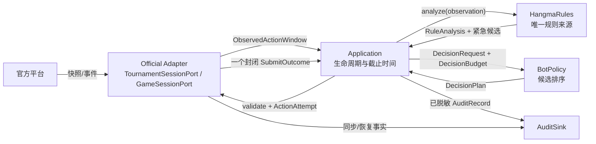

# 第一阶段接口协议

## 2026-10-08 T218：离线候选的动作预测可未知

**只澄清离线作者回复元数据；规则、观察、策略入口及线上包不变。** `vip-eoh-reply-format/3` 保留完整思想、机制、源码及有序父身份验证。`parent_differences.window_classes` 仍须非空；`action_keys` 可为 `[]`，表示作者尚未预测具体动作键。全局评分机制不需要编造某个首选。已声明元素仍须非空字符串，`status` 仍只能是 `expected`，不授实测行为信用。

规则、只读输入、全合法根有限评分、确定性、时限与效果门保持。G37原HTTP回复因空动作预测被旧解析器误拒；原回复、失败及费用保留，修订后只重放校验，未改候选源码或重发模型。相关生成、谱系重绑定及trace恢复163项回归通过；实际装载与后续评估见[本轮报告](../../review/vip-route-2026-09-30/evidence/t218-global-mechanism-format-1/REPORT.md)。

## 2026-10-07 T199：七对分支支付资格，已发布

**外部端口和`HangmaRules`公共签名不变；以下P0内部契约已在main和冻结自由赛根生效。** `WinSplit.seven_pairs_baotou: Optional[bool]`区分已核可付、已核不可付、缺摸前上下文。它不代替`RulePublicState.baotou`、合法胡门或静态任意听事实；最终14张缓存保留None。

内部`settle_win`新增keyword-only的`pre_draw_hand`（本人准确摸前暗牌，不含摸牌、他家暗手或未来墙）与`meld_set_count`（当时副露面子数）。七对且全局爆头true时，由唯一数学入口重新资格化；缺上下文且未核资格、错误长度、第五张同种牌或非bool资格显式抛错。`compute_fan`签名保持，仅消费已核资格。当前胡、后继摸牌、模拟结算、离线审计调用方和13现行官方金例已同步；13现行金例、32完整桌影响与首房工程已经验收。完整语义及收据见[P0契约](../../review/vip-route-2026-09-30/evidence/t199-four-step-execution-1/p0/RULE-CONTRACT.md)。

## 2026-10-06 T194：T110-S03-E2审计工程后继

**E2只减少审计同步重复编码，不改变S03公式、38核心、D1、原截止、QPS或十桌专属计算。** S03四scope v3；S02备用testroom_v12/free_v10/两赛事v4。八包绑定同183完整来源，全部旧包逐字保留并在新来源下明确拒装。正式／测试赛事只验基础接线及生命周期，实际工程房和自然切换由总筹执行；未授strict/OPERABILITY通过。

`JsonlAuditSink.emit`在返回前仍拥有新不可变字符串，结构快速编码复用原protect、最终字符串扫描、restore及JSON编码；敏感键下非JSON秘密先整值脱敏。非原生形态、typed键或坏context立即回旧路径，不能额外消费自定义容器。高优先级、队列容量、失败计数、后台写盘、关闭和快照所有权不变。公开`redact_json_line(str)`原语义保留；新增内部`redact_record_line(envelope)`同步返回完整字符串或None（需旧路径），不排队、不写盘、不修改输入。

3对真实1.55MB记录实省46.562–60.500ms，中位52.250ms；20ms计时器仍迟，不能冒称原477ms完全解释或漏吃已修。初次自定义dict红例保留，公共E1对照26+5同字节、相关175pass/1历史缺夹具skip。证据及候选边界见[本轮工程交付](../../review/vip-route-2026-09-30/evidence/t194-xuanwu-income-gap-1/engineering/AUDIT-READOUT.md)。

## 2026-10-06 T192：T110-S03-E1工程后继

**E1只接入已复核的适配器可靠性修复，不改S03公式、确认CID或算法强度范围。** S03四模式分别为`vip_s03_bounded_d1_testroom_v2`、`vip_s03_bounded_d1_free_v2`、`vip_s03_bounded_d1_test_tournament_v2`、`vip_s03_bounded_d1_official_tournament_v2`；S02备用为testroom_v11、free_v9及两赛事v3。八包绑定同183件完整运行来源；旧八包保存并在新来源下明确拒装。38件S03核心、编译公式／共享助手、C数学、D1、原截止／QPS和10个每桌专属进程不改。

`OfficialGameSession.aclose`只对尚未取消的本场owned任务发cancel，shield等待HTTP／SSE finally完成后才返回；重入不二次打断，调用者取消完成收尾后传播。永久不协作关闭并未被证明可回收。无兴趣响应单步只在新鲜snapshot-first、同单局／phase／弃牌周期、非本人下家、无抓打圈／保留墙／未决动作时暂缓一次GET；不推进last_seq、不猜timeout，原1.2秒探针与核验失败关闭过滤保持。下一未知帧照常读取。

正式／测试赛事只验基础接线、配置绑定和生命周期，按用户2026-10-06[现行口径](../research/materials/vip-route-2026-09-30/evidence/t192-targeted-followup-1/ACCEPTANCE-POLICY.md)执行；官方现场不是候选上线门。上线与真实必要测试房由总筹按已有授权在旧房自然边界接入，副本不启动网络玩家、迁移watchdog或触碰Token。旧S03实测与效果证据复用，不冒称新工程包已联网；两次真实worker故障仍未知。当前核验与模板见[工程后继交付](../../review/vip-route-2026-09-30/evidence/t192-targeted-followup-1/wiring/REPORT.md)。

## 2026-10-06 T191：S03编译公式和模式包

**四个外部端口、`choose(DecisionRequest, DecisionBudget)`、每桌计算生命周期和原截止不变。** 组合根新增`build_vip_s03_manifest(strategy, evidence_sha256)`：消费固定模式枚举及公共证据相对路径到完整SHA映射，返回`vip-route-bounded-release/3`清单，无写盘、联网、编译或评分副作用。缺本次实际确认、等价、截止、重型或原件恢复证据，或来源、公式、数学、参数、ABI漂移时明确抛错。

清单绑定183来源与编译原件，`strength_scope`仅`t191-frozen-local-mixed-pool-net-vs-s02`；工作工厂序列化仍仅`expected_id`、`strategy`，服务执行身份为模式包ID。测试房逐身份透传包ID与SSE，跨模式拒绝。S02另有当前来源备用包，锦标赛生命周期复用原契约。正式现场另核，取消的测试锦标赛不再是前置。见[接线原件](../../review/vip-route-2026-09-30/evidence/t191-four-day-execution-1/successor-wiring-1/README.md)。

## 2026-10-05 T191：S02模式与冻结身份接线

**四个外部端口和 `choose(DecisionRequest, DecisionBudget)` 签名保持原契约；新增的是组合根模式枚举及公开候选包生成函数。** `build_vip_testroom_successor_manifest`、`build_vip_free_successor_manifest`、`build_vip_test_tournament_manifest`、`build_vip_official_tournament_manifest` 各消费仓库公开证据相对路径到完整SHA-256的映射，返回独立模式的完整冻结清单。它们不写盘、不联网、不批准发布；路径越界、证据/源码/编译原件漂移或数学后端不符明确抛错。

`RuntimeConfig.expected_policy_release_id` 必须匹配该枚举的包ID；跨模式、Token类别错配、缺包ID/指南/SSE在HTTP会话或审计线程前拒绝。`build_runtime` 仅装配测试房及两类赛事身份；实验自由赛仍经 `build_auto_match_runtime`。工厂只携带公开包ID与策略枚举；规则从权威 `SessionBootstrap.config.rules` 核对，范围外配置或实际 `config.M>10` 在报名/到位前形成明确失败终态并回收全部资源。

原截止、合法紧急路径、409原窗口重试、模糊结果不重发及 `active_games` 编排契约不变。候选包范围与工程验收不等于官方测试赛事/正式发布资格；当前门禁和补丁使用边界见[T191接线报告](../../review/vip-route-2026-09-30/evidence/t191-four-day-execution-1/wiring/REPORT.md)。

测试房启动器的 `load_room_config` 复用新后继包核验；`child_config_mapping` 逐身份透传精确包ID与SSE，四份凭证仍只经隔离子进程环境注入。自由赛身份不能误接测试房；不启动子进程也能通过公开解析与派生接口检查。

明确拒绝后合法备用（`rejected_emergency_backup`，同一权威窗口中原规则紧急候选确认未执行且被拒后，准备同次合法集中未拒的动作）在主评分之前按动作键确定并审计。原规则无紧急候选或合法集全拒时仍为空；窗口变更与 `AMBIGUOUS` 不走追加提交。应用统一核对备用的合法键及动作，并在提交前调用唯一规则引擎复核。完整S02评分与排名优先，备用仅补缺，标记 `is_emergency=false`，不修改规则紧急身份、不重授原预算。它修复原紧急候选被拒后评分失败或增强截止已过时无可提交退路的缺口；SafeFallbackPolicy 的既有语义保持。

## 2026-10-04 T179：每桌专属计算生命周期与编译运行时身份

**保持BotPolicy.choose、官方端口、原三段单调截止和合法复核不变；以下新接线已验收并启用实验free_v6。** `DecisionComputeSettings.per_game_workers: bool=False` 默认保留原共享服务。VIP新包设True、workers=10、max_pending=0；后者表示不设跨桌等待队列，同桌仍可有至多一个替代请求等待自己的旧作业回收。最多十个活跃与十个同桌待回收替代请求；不能把这些等待记录误作跨桌计算排队。

`BoundedDecisionCompute.acquire_game(game_id)` / `release_game(game_id)` 是应用层异步资源方法，只接收官方场次键，返回None，不发HTTP。预热后取得专属计算进程和传输线程；容量超限立即明确拒绝，不等待其他桌。释放等待该桌已发送工作响应或故障回收；取消等待不丢失底层清理所有权，失败保留绑定由close最终回收。资源已彻底关闭的耗尽槽仍能绑定新桌，让choose明确不可用并触发原合法保底；不重置重启额度或借用其他桌。

`RuntimeServices` 尾部新增成对可空的 `compute_game_started` / `compute_game_finished` 回调（输入game_id、异步返回None；None表示无专属计算生命周期）及 `requires_conditional_roots: bool=False`（仅VIP明确依赖条件根时为True）。两个运行时核官方config.M不超过专属容量，并注入真实应用计算服务回调。GameTask正常/故障/取消均回收原桌；只读收尾不申请计算。已取得GameFinished后，清理阶段取消不得丢掉权威结果。

`snapshot()` 新增 `bound_games` / `releasing_games`，是当前绑定/回收中的桌数量，关闭后必须为0；历史计数不伪造为0。新冻结包格式为 `vip-s02-bounded-release/2`，必需 `compiled_runtime` 完整清单、清单字节SHA、ABI、原体源码/生成源/二进制身份；父校验与子工厂加载共用验证。新枚举只授测试房和实验自由赛，旧包原件保留而不能复用旧ID。验证及状态见[T179](../../review/vip-route-2026-09-30/evidence/t179-production-wiring-1/README.md)。下方为历史快照。

2026-10-04 T167：公共策略/规则/赛事端口签名未变；新增显式测试房对照枚举`r18_v2_current_rules_testroom_20261004`，仅test_room、SSE、当前指南及精确冻结ID，运行源码/规则/数学漂移在副作用前拒绝。房间各`identities`分别绑定该席`strategy`和`expected_policy_release_id`，两种算法不能共用一个ID；子配置完整透传。T110新testroom_v7/free_v5另冻身份，原算法、限深和截止不变。新对照不继承旧正式包权限、默认值或强度；旧正式R18摘要漂移继续拒绝。[混合房契约验证](../../review/vip-route-2026-09-30/evidence/t167-mixed-testroom-current-r18-wiring-1/REPORT.md)。下方为历史快照。

2026-10-04更新：新testroom_v6／free_v4已完成T161自由赛和T163四席M10/R8快速测试房的真实工程验收；对局摸切、429、计算故障/重启均0，原截止、限深1、公式和稳定默认版本不变。T163一只过评分超期及两只过零规划例外保留，严格零降级false；T161缓发虽开启但因快照时间依据不足全跳过，不能授缓发改善信用。T148强度false仍保留，正式/测试赛事发布门未授。详情见[验收报告](../../review/vip-route-2026-09-30/evidence/t163-received-fix-fast-four-seat-testroom-1/REPORT.md)。

## 2026-10-04 T159 完整回信后的计算回收

**仅内部任务回收状态改变，外部接口和三段原截止不变。** 子进程回信字节已全部收到后，父侧解码仍有槽及线程的唯一所有权，不能据解码迟到终止等待下一输入的健康子进程。结果照常核执行身份／请求摘要／合法键／原预算，迟到结果丢弃，下一任务不能提前复用该槽。未收齐回信的卡死、超额报文、错误身份和最大任务期限仍按原故障与回收路径处理。

新测试房v6／实验自由赛v4绑定179份源码及实际数学后端，旧包原件保留，当前源码拒绝旧包漂移。它们分别只接受`test_room`／显式实验`auto_match`，正式／测试赛事保持拒绝。[公开红／绿、预算诊断及冻结包](../../review/vip-route-2026-09-30/evidence/t159-received-reply-and-live-budget-diagnostic-1/REPORT.md)。下方为历史快照。

## 2026-10-04 T147 计算回收修复及当前实验包

**首个自由赛已自然完赛，明确生命周期缺陷已修复；当前包为测试房v4／自由赛v2，正式赛事尚未准入。** 未发送的过期请求保留编码所有权，不误杀等待输入的健康计算进程；已开始发送的卡死仍按原取消宽限回收。`choose/start/close/snapshot`公开签名和诊断计数语义未改，三段原截止、规则复核、409及动作门未改。

`vip_s02_bounded_d1_testroom_v4`仅`test_room`，`vip_s02_bounded_d1_free_v2`仅实验`auto_match`；新179件源码包与旧包分别保留，要求明确新摘要和SSE。主线127项相关回归通过，含两条真实规则／spawn S02／全合法评分／审计／提交Fake链；新包还未联网，不继承旧包准入。原v1自由赛十桌八单局：我方代弃/对局429均0，874提交200，2846完整计划/2848已规划，1故障/重启已回收；另2仅过零规划截止保留。总分+29为观察性成绩。公式、参数、规则及数学后端逐项未改；下一步新来源限深独立确认后再做官方复验，期间源码冻结。

[主线修复报告](../../review/vip-route-2026-09-30/evidence/t147-compute-lifecycle-main-fix-1/REPORT.md)，历史T138及以下段落是各批当时快照。

## 2026-10-04 T138 实验自由赛接线与完整房验收

**自由赛接线已实现，根许可一房实验取样；完整房的零超时门仍false。**
`vip_s02_bounded_d1_free_v1`只允许显式`auto_match`，`vip_s02_bounded_d1_testroom_v3`只允许`test_room`；均要求当前完整包ID、SSE及冻结规则范围。测试赛事/正式赛事保持拒绝。两个包共享原S02公式及补牌限深1，绑定实际179份源码/脚本和已完成证据；旧v2测试证据保留，不冒称新包已经联网验收。

`AutoMatchRuntime.route_limits`复用原`RuntimeServices`和唯一`HangmaRules`；正常清单增加`route_analysis_limits`（工作量次数，不是毫秒）。默认None保持旧调用，额度冲突在任何会话操作前拒绝；原截止、409、规则复核及动作门不变。自由赛组合根拥有独立计算服务，预热先于包含匹配的initialize，正常/异常/启动取消关闭计算资源。脚本终态显示计算计数；LLM不在线。

源码漂移、模式错配及非法URL端口在HTTP/审计线程创建前拒绝。自由赛策略不能从测试房或普通参赛入口启动。真实完整Fake链和131项集中回归通过，旧R18绑定一项显式排除；本地证据不替代完整联网门禁。[当前报告](../research/materials/vip-route-2026-09-30/T138-FREE-WIRING-AND-ENGINEERING-STATUS.md)。


## 2026-10-04 T133—T136 测试房专用候选接线

**当前新增的是工程测试入口，S02 限深版尚未取得正式赛事资格。**
`vip_s02_bounded_d1_testroom_v2` 必须绑定完整冻结包 ID，只接受 `test_room`、
SSE 接线、底分 1、关闭有财必拷以及冻结规则版本。包核验公式、实际
数学后端、源码与公开证据文件；任何漂移在记录线程和 HTTP 会话创建前拒绝。
每身份两个预热计算进程、八个待处理名额；计算工厂只有公开包 ID。
首个 v1 房因摸牌来源缺口和策略异常误触发重启而未通过，旧包与失败证据保留。
v2 将策略拒绝与进程故障分开记账；唯一规则模块只在权威零链或严格
前后快照证明下补足普通摸牌，来源冲突和本家杠中间态保持未知。
预热在初始化/报名/到位之前完成，正常、异常和预热取消出口均回收资源。

`ParticipantRuntime.route_limits` 经 `RuntimeServices` 传到唯一规则引擎，
只在原增强截止前启用；迟到及 409 不重新授预算，最终复核仍走普通规则。
两种紧急候选补齐用 `replace` 保留路线事实。完整 `DECISION_INPUT` 与
候选分数/解释可读回，manifest 明录路线限额及工程范围。`choose` 和
HTTP 提交端口签名不变；默认策略及 R18 仍保持原调用方式。

正式自由赛、测试赛事和正式赛事仍需独立绑定包与相应门禁。限深版不得
继承原完整展开 S02 的统计强度；T131 只对已有来源补齐保持性对照，不能
计作新的独立样本。实现、实际工具终态和官方验证见[T133记录](../research/materials/vip-route-2026-09-30/T133-TESTROOM-WIRING-AND-ACCEPTANCE.md)。


## 2026-10-04 T132主线计算服务接线准备

**有界计算服务已移到main，当前仍无VIP网络策略注册或上线资格。**
复用T86已验证的二进制可信请求、严格JSON计划、有限传输线程及迟到资源
回收，由组合根`build_isolated_decision_policy`显式创建并拥有start/close。
主线21项回归通过。当前S02实际22个计算请求全部满足原返回预算，
含十个普通并发请求和两重摸打夹两吃响应；110合法分值全量读回，
8串行全部分数、解释、操作同main，父循环最大滞后2.08毫秒，资源
归零。父侧规则输入预先准备；该计时不含线上规则分析、全审计及HTTP。
路线事实已增加`route-fact-codec/1`白名单有界JSON，25数据类/3枚举
全部字段及公开领取/终局事实完整往返；旧普通JSON六键及字节序不变，
缺扩展键还原None。74项相关回归通过。不重算历史事实、不按输入导入
类型、不接受外部pickle；可信进程内部二进制请求继续使用原T86私有
socket。新字段必须显式升版，完整审计消费方统一读取此codec。
上述是局部计算/编解码验收，不授SSE、正式赛事或十个重型同时响应。

## 2026-10-04 可选后继杠链限深

**参数已经实现，VIP尚未获得上线资格。**`VipRouteProjectionLimits.max_replacement_depth`为单次选择内嵌套补牌展开层数，严格正整数或`None`；布尔拒绝，默认`None`保持完整展开。配置1时，全部当前合法根及其第一层相容补牌仍完整保留；后继合法杠的更远补牌转为带明确预算原因的`unknown_draw`，不声称胡资格、条件支付或真实未来。真实下一权威窗口重新从零判断，不限制实际连续杠。

同名字段进入`VipRouteScoringView`、候选输入`limits`及外层评分轨迹；投影参数、源码/依赖摘要改变候选身份。未来完成子图缓存必须把剩余深度放入键，不能混用不同展开预算。`choose`和官方提交接口不变，线上默认策略不自动切换。规则数学仍由唯一`hangma`提供，预估的后继动作不可盲执行。

研究装配固定八选择首次满足原0.63／2.03秒返回预算，极端响应0.168秒；当前main普通Python装配也8／8通过，极端0.356秒，全分值/解释/操作一致；仍不授并发/SSE/官方门，新变体须另验证强度。完整证据见[成组优化及有限展开](../research/materials/vip-route-2026-09-30/T129-T130-GROUPED-OPTIMIZATION-AND-BOUNDED-CHAIN.md)。


## 2026-10-03 T86传输与退出补充（显式研究入口）

**`BotPolicy.choose(DecisionRequest, DecisionBudget)`和组合根生命周期契约保持。** `DecisionComputeSettings.resource_reap_seconds`为新增正有限真实秒持续时间，默认1.0；`startup_seconds`覆盖spawn与ready的同一次等待。服务先占有限槽/队列，派发才编码；独占至多`workers`个线程/未结束传输任务，取消保留原线程future。可信内部二进制pickle5同包传递任务号、完整请求及原预算，小头摘要/编号、整体字节上限和返回严格计划JSON检查均保留。

`close()`并发调用共享受取消保护的资源回收任务。单槽回收失败仍继续其他槽及线程池shutdown；迟到spawn有每槽唯一自动清理线程，在真实启动终态后关闭socket并终止/join进程。迟到编码终态回调安全移除future，线程池已停止纳入。超时或无法回收抛`DecisionComputeError`，引用保留，不宣称物理资源已退出。`snapshot()`新增传输未结束数、线程存活数及迟到清理数；没有无限请求历史或Token。

163项相关公开接口测试及18次实际请求读回已闭合。有限最终完成的迟到工作可自动回收；不能强推为永久卡死线程可强停、全局时延或线上准入。测试与细分分母见[T86](../research/materials/vip-route-2026-09-30/T86-BOUNDED-TRANSPORT-RESULT.md)。下方T85为历史快照，原预算JSON传输及同步缺口描述对应当时版本。

## 历史快照：2026-10-03 有界计算服务生命周期（T85显式研究入口）

**保持`BotPolicy.choose(DecisionRequest, DecisionBudget)`外部契约，新增组合根拥有的计算服务生命周期。** `build_isolated_decision_policy(worker_factory, execution_id, clock, settings)`返回`BoundedDecisionCompute`；所有者预热`start()`，消费相同choose接口，最终关闭`close()`。可序列化工厂在spawn子进程返回`PreparedDecisionPolicy(policy, execution_id)`，身份须按实际源码/依赖核验；不得包含凭证或隐藏世界。

`DecisionComputeSettings`规定工作进程、待处理数及消息字节上限，以及真实秒单位的启动、单任务和弃置宽限时间、每槽重启上限。排队使用原`fallback_deadline_monotonic`本机单调秒，不能重置。容量、期限、启动及计算失败抛`DecisionComputeError`交原应用紧急路径；外部取消仍传播取消，原计算资源继续回收。任务号、完整输入/预算摘要、执行身份及同场当前请求绑定结果；返回计划还验请求/窗口/权威序号和已拒候选。

请求的内部pickle5只用于可信父/子进程私有socket，完整保留研究条件根；禁止外部pickle、模型原答、跨机器时基混用。结果仍经现有严格计划JSON解码；官方JSON及审计拒绝研究根规则不放宽。关闭失败显式报错且保留未回收资源引用。`snapshot()`仅固定诊断计数及当前资源量，没有历史请求表。当前同步传输编解码和spawn仍有阻塞风险，不授完整事件循环隔离；公开测试和真实请求证据见[T85](../research/materials/vip-route-2026-09-30/T85-BOUNDED-REAL-COMPUTE-RESULT.md)。

## 2026-10-03 一摸成胡资格查询剪枝（隔离工程）

**完整路线、原未知标记及容量上限保持，旧冻结身份不自动兼容。** 同源手牌数学已给出逐码摸后向听；只在该码摸后为已胡−1时查询胡资格和结算。不能要求当前向听为0：自然虚牌四张配额受限时，东4/南3/西3/北3的向听为1，摸白却能成胡。此反例由独立复核发现并通过唯一规则源确认，已加入公开构图回归。

全部合法根、跟打、杠补、自然准备及普通/七对/综合进张码保留；`qualification_unknown_codes`和`qualification_math_closed_codes`使用旧划分，不改变非精确库存的未知标记。实际`waiting_draw_witness_count`减少，其他事实、全分值和解释须精确对照。源码/合同/依赖产生新工程身份，原T78失败和历史成绩不改写；实机时限、并发及官方门仍须另验。首版重分类未知和次版要求当前向听0均已否决，证据保留。

## 2026-10-02 构图内公开计数工程接缝

**新增`public_count_result_scope()`仅控制纯结果复用寿命；共享规则、图和评分语义不变。** 无输入，作为同步contextmanager使用且yield None；作用域内缓存完整公开视图八字段及`legacy_four_meld`对应的`PublicTileCounts`，最多2048结果／16384严格形状检查条目。全部字段按共享值对象注解确认exact类型，区分bool与int、固定四元组与变长元组；不支持注解或可变值原样回原函数，不新增计数拒绝、不吞原异常。

本人未见容量每次仍读取同态暗牌、单列摸牌、座位与飘白补记；未知、保守与精确证据不可互换。每个作用域独占缓存并强持有历史原件；嵌套、异常和正常退出通过token恢复外层并清空。ContextVar的对象引用显式继承时由RLock保护；关闭后旧上下文仅原算。规范冻结值不能通过__dict__/object.__setattr__主动改写。作用域只包同步全图构造，不含await、HTTP、模型、文件或时间。

`build_vip_route_scoring_view(request, config, *, limits=None)`公开参数、返回类型和完整事实不变；原函数体只移到内部实现。`HangmaRules.analyze`、`BotPolicy.choose`、执行器、视图／图v3及条件支付语义不升版。源码依赖摘要形成新工程身份；旧作者来源和历史效果只保留在原身份下，不凭等价性直接授新包发布。公共行为覆盖见[test_public_count_result_scope.py](../../tests/unit/hangma/test_public_count_result_scope.py)，完整输入与评分对账见[T54](../research/materials/vip-route-2026-09-30/T54-NATIVE-PUBLIC-COUNT-CACHE.md)。

## 2026-10-02 自然面子准备与共享条件图 v3

**当前研究候选使用[合同 v3](../research/materials/vip-route-2026-09-30/FIXED-FRAMEWORK-CONTRACT-V3-NATURAL-PREPARATION.md)，下面的 v2 为历史支付升版记录。**`RouteWaitingView.natural_preparation`必需且与同态`RouteStructureFacts`的真实自然手牌、白库存和副露组数一致。规则入口`analyze_natural_set_preparation(counts34, meld_set_count)`仅接收真实`13-3m`等待态，复用唯一标准型数学，返回不含将、不借白的自然面子缺张及弃牌下界、改善码；不授胡、爆头或未来白板资格。非法类型/数量显式抛错，无外部副作用。外层`natural_preparation_code_width`按同态公开容量保留相容码，非概率。新语义为`vip-natural-set-preparation/1`；视图和图为`/3`，原条件支付语义不变。

图可以共享完整冻结事实相同的节点；全合法根、边顺序、重复引用及条件码不删。节点键为引用身份，节点/边计数表示存储工作量。`ActionValueExecutor(..., max_local_collection_size=4096)`新增单实例容量参数，须为1—16384整数，布尔拒绝；默认仍4096，操作计费、源码和解释守卫不变。VIP由冻结`projection_limits.max_nodes`导出该参数，生成、装载、探针、修复、重绑定与完整策略一致；`freeze_vip_identity.params`及模型附录显式保存容量，源码/依赖/合同变化形成新身份。旧包不自动兼容或继承成绩。新增公开契约见[test_vip_natural_preparation_contract.py](../../tests/contracts/test_vip_natural_preparation_contract.py)与[test_vip_graph_capacity.py](../../tests/unit/policy/test_vip_graph_capacity.py)。

## 2026-10-01 显式公开来源与开发探针 /2

**仅改变离线研究接缝，线上动作和规则来源不变。** `read_public_input_source` 核原件、来源声明及历史生产快照；`build_public_input_panel` 按行动前公开信息分层并限制每母根窗口数。`run_public_input_probe` 按显式共同参照计划逐包真实评分，完整只读输入先保存，失败与未调用保留分母。`validate_public_input_panel`、`validate_public_input_probe` 只读校验实际原件，不补评分或世界推进。自然行动前来源只取原 A 路径；条件来源只取依法可见起手，隐藏教师信息不进策略。

开发批次 `vip-route-development-batch/2` 增加 `behavior_reference_policy`（真实生成父或显式本批参照）及 `behavior_exploration`。不改作者原父代；记录探索即使首选未变也最多 16 个完整桌实例，不授效果。真实 /2 批次拒绝旧 /1 探针冒充新来源，人工旧夹具只有明确假驱动才能豁免。捕获、费用、严格 C 零正常 R18 回退沿用当前合同；旧原件不迁移信用。实际任务与预算见[恢复计划](../research/materials/vip-route-2026-09-30/T10-RESUME-AND-CREDIT-DIAGNOSTIC-PLAN.md)。


## 2026-10-01 离线实际输入捕获契约

**本接缝只服务新开发评测。** 实际评分输入捕获（`ScoringInputCapture`，保存真正评分前同次完整公开DTO）由离线组合入口注入空、独占、可读写且可定位的二进制流。`store(dto)`返回每调用小收据，整图SHA引用去重压缩记录；普通编码/预算/I/O失败返回失败收据，通用中断保存失败后传播原异常。调用方仅在`saved_before_score=True`时进入真实评分。`finish()`关闭gzip并读回核有限JSON、SHA、长度、唯一性与调用分母，正常情况下底层流由调用者关闭。

`ScoringInputCaptureLimits`三个必需正整数为`max_view_json_bytes`（单个完整DTO的UTF-8规范JSON字节）、`max_total_json_bytes`（成功保存的去重DTO字节累计）、`max_unique_views`（不同整图SHA数）。包装与压缩字节另计。`None`、空和精确0无损保留，捕获器不取得`WorldState`权限。预算属于`vip-route-development-batch/2`；旧`/1`的历史读取不补预算，新运行拒绝`/1`。记录schema为`vip-scoring-input-view/1`，新manifest与result为`/2`。

逐调用收据保留实际score调用数、完成状态、操作数与`score_monotonic_seconds`（执行器入口到返回/抛错的单调持续秒；未调用为None）。未进入score时不能沿用上一窗操作数。`policy_compute_ms_observed`继续使用毫秒，但包含choose内捕获开销，scope显式为`policy_choose_with_input_capture_observed_not_official_runtime`。gzip是保存/关闭的子耗时，费用子项不能重复相加。任一记录/评分/收据/关闭失败否决整批，正常返回时各池积分估计为None；中断无完整summary。详细错误与副作用见[接口说明](../../review/vip-route-2026-09-30/evidence/t10-scoring-input-capture-preparation-1/INTERFACE-NOTES.md)，公开回归见[test_scoring_input_capture.py](../../tests/unit/offline/test_scoring_input_capture.py)与[test_vip_route_development.py](../../tests/unit/offline/test_vip_route_development.py)。

## 2026-10-01 条件胡支付合同 v2

**本节保存支付升版历史依据；当前新准备事实见顶部 v3，下方 v1 条款保存历史版本。**[完整合同 v2](../research/materials/vip-route-2026-09-30/FIXED-FRAMEWORK-CONTRACT-V2-CONDITIONAL-PAYMENT.md)将 `VipRouteScoringView` 与事实图升为 `/2`，新增支付语义 `vip-normal-draw-hu-payment/1`；候选类型仍为 `vip_route_heuristic_v1`，旧 `/4` 输入不变。

`RouteWaitingView.normal_draw_hu_payments: Optional[Tuple[RouteConditionalHuPayment, ...]]`是逐牌码、逐抓打假设的普通摸牌条件支付。字段含摸前／摸后墙余和精确容量、摸后爆头、已有链／飘白、本人／庄家座位、规则身份及同源 `Settlement`。四家积分按座位0—3，单位积分；两假设不能重复计算机会，公开未见容量含他家暗牌。未分析为None并给原因，已分析无胡为空元组，部分未知只交已有精确行并保留未知码。等待节点即时 `settlement` 仍为空。

`freeze_vip_identity`与生成附录绑定独立 v2 合同及版本、依赖闭包；候选映射和评分轨迹携带支付语义。旧包身份失配即拒绝，不能继承历史执行成功或成绩。新增事实复用原胡见证查询，无额外查询和规则逻辑。条件范围及构造校验见完整合同，当前策略异常仍使严格研究桌未完成。

离线解释格式修复（`trace_codec_repair`，保留原作者而仅修已知解释格式的工程身份）由 `repair_vip_trace_codec(batch_file, source_package, out_dir, execution_evidence_files=())` 创建；它接收原执行配置、已装载模型提案和显式公开附件，输出新身份记录并写必须不存在的新目录。仅确定性修改 `make_support_credits` 内唯一已知记录语句及其格式说明；源码不符、源漂移、其他执行参数变化拒绝。原作者记录、源码、费用和附件逐字保留；空附件列表不证明旧失败自动封齐，调用方须提供失败原件及核其封条。`load_vip_parents` 递归核验修复来源，只允许源码摘要和候选 ID 改变；重复来源字段采用类型保真 JSON 比较，布尔不能冒充数字。新包不算模型输出或调用，不授行为/准入；一般源码变换不保证数学等价，固定框架调用仍须绑定其完整政策、修后重新实测。原来源绝对路径当前仍须存在。公开回归见 [`test_vip_eoh_trace_repair.py`](../../tests/unit/offline/test_vip_eoh_trace_repair.py)；四端口、评分视图、规则及额度不变。

## 2026-09-30 VIP 固定框架新合同

**本节登记新研究接缝，不改四个外部端口与旧评分视图。**详细[实施合同](../research/materials/vip-route-2026-09-30/FIXED-FRAMEWORK-CONTRACT.md)是当前依据，旧 P1/P3 记录保留历史身份。

候选类型 `vip_route_heuristic_v1`；只读输入 `VipRouteScoringView` 的 `schema_version=vip-route-scoring-view/1`；输出沿用 `ScoreBatch` 与有界 `ActionScore`，全部同次合法动作键各一项，有限评分点仅用于排序。`ActionValueExecutor.score_vip_route` 接收该精确类型并复用原安全计费与共享状态守卫；`score(ScoringView)` 与 `sitin-scoring-view/4` 不变。结构内部入口 `analyze_route_structure(counts34, meld_set_count)` 仅接 `13-3m` 等待手牌；自然缺口和合法胡集合分开，资格由原条件规则源生成。

赛事阶段／排名／累计积分不进入首版新输入，仅由外层记录。当前源码／规则／配置／事实版本和工作量进入身份；具体冻结字段随实现与契约测试同步，不允许候选自造隐藏输入。新研究包装评分失败、弃权、超量、缺必需事实都显式停止；原离线 `strict_policy` 单独不能识别策略内部紧急降级，须配合该包装。正常评分首选同紧急键不是回退。

规则内局部等待见证明确 `local_witness_only`，不生成官方观察、序号或到达概率。条件状态新增他座已摸来源标记 `other_draw_replacement`，未摸吃碰暂态不能接受自摸终局；公开协议不变。完整机械、无损审计、实机截止及官方发布门均未因新评分合同自动通过。

仅胡资格的公开规则入口`analyze_waiting_hu_witness(state,tile,*,wall_remaining_before_draw,catch_restricted,config)`与完整局部入口使用相同前置；返回冻结`WaitingHuWitness`，只承诺给定普通摸的合法胡、四座即时结算、胡相关问题、墙余与该牌码精确容量变化。未成胡时结算为空；资格成立但结算证据缺失时保留真值及问题。它不返回完整后态、弃牌、向听或进张，不能作为后续事件推进输入；容量非精确、不可摸、结构未裁决等输入抛`ValueError`。纯函数，无网络或记录副作用。内部`HandWinEvidence`只承载同源成胡数学，不补造`HandSummary`。新入口与完整见证对照覆盖白板量、两种抓打限制、末墙、副露、链、分解故障及真实慢观察。

跨模块契约见 [`test_vip_route_scoring_contract.py`](../../tests/contracts/test_vip_route_scoring_contract.py)：精确新／旧类型互斥、全合法输出完整性及严格失败分类。候选身份由离线 `freeze_vip_identity` 绑定实际 `RuleConfig`、`ValueAnalysisLimits`、投影／评分额度和源码／数学后端内容；评估次数、作者与父代出处另记，不替代实际运行配置。

离线研究执行额度重绑定（`research_budget_rebind`，源码不变而操作计数上限提高的独立身份）由 `rebind_vip_research_budget` 消费源执行配置、已装载提案、目标执行配置和可选旧执行证据，写必须不存在的新包；错误、源漂移或其他配置变化拒绝。唯一可变执行字段为更大的整数 `max_operations`，另允许新的 `batch_id` 审计标签。`load_vip_parents` 对新角色递归核原生成记录、源码、两配置及费用证据；原作者账完整保留，新包不算一次作者调用，也不取得行为／准入信用。相同源码必须在新额度重新运行全窗口及完整桌。原绝对路径当前须在线；只携复制件移交尚未支持。公开行为回归见 [`test_vip_eoh_rebind.py`](../../tests/unit/offline/test_vip_eoh_rebind.py)；线上端口、新／旧评分视图和规则事实均不变。


> **2026-09-24 同步模式补充：**显式 `sse_enabled=true` 接通 SSE 通知水位，暂停该模式的增量长轮询与自动长轮询回退；未显式开启的历史配置仍沿用 `state`。旧段落中“组合根固定关闭 SSE”记录的是当时状态。具体边界见文末验证模式段与[架构 §7](../architecture.md#7-状态同步与请求资源)。

> **2026-09-17 状态（评审校正）**：坐隐 `action_value_v1` v4 工程骨架已按文末合同落地，但完成度评审（review/llm-guided-heuristic-route-2026-09-15/REVIEW-V4-COMPLETION-2026-09-17.md，9 项 P1 已复现）判定行为合同未闭合——本节接缝行以评审与 R0—R7 修复计划为准，勿据旧收口报告引用“已完成”。

2026-09-09 当前增补：指南 v27；v26 的公开圈主通过可选 `RulePublicState.catch_play_owner_seat` 接入，保持快照水位、旧 JSON 缺字段兼容和同一规则源。已替代下文历史 v8 跳窗兼容及旧 v24 限定审查，详见文末“官方圈主事实与v26响应修订”。新增字段不代表推进赛事目标或模型接口冻结。

大牌路线实验兼容增补：`CandidateFacts` 尾部增加 `standard_shanten_after: Optional[int] = None` 和 `seven_pairs_shanten_after: Optional[int] = None`。只允许 `HAND_PROGRESS` 携带至少 -1 的整数，来自同一动作后等待手牌的已有数学结果：吃碰采用既有 `best_followup_discard`，杠采用补牌前手牌。七对有副露时为空；缺旧字段、未分析或失败也为空，不以零替代。紧急候选不产生这些事实。`shanten_after`、合法动作与默认策略不变；不是对多个后续弃牌各取最小值。审计 codec v1 仅在非空时写新键，旧 JSON 缺键还原为 None，完整请求往返覆盖。独立早期候选只消费这些事实，范围与发布门槛见[计划](big-hand-policy-plan.md)。

2026-09-07 制品工具兼容性增补：线上冻结接口和原始审计 schema 不变。`offline.postgame.finalize_session` 消费关闭的 run 与官方原文，输出不可覆盖的独立分析 job；`offline.observation_audit.audit_observations` 仅做赛后复核，不改变玩家观察。统一牌谱既有 `rule_config`、`guide_version`、`guide_captured_at` 字段保留 source 中真实元数据；旧配置缺少本地规则版本时，正式行的 `rule_config` 保持为空，局部配置仍留在 source 中。分析实现单独记录在包内 `references/analysis-provenance.json`，不替换历史线上版本。诊断单局明确 `student_observation=false`。CLI 成功只表示制品生成成功，完整性、历史覆盖和规则检查分别表达，详见 [操作指引](../operations.md)。

> 状态：接口基线 v1.1（2026-09-04 集成阶段契约收口）；实行受控变更  
> 日期：2026-09-04  
> 官方依据：指南/API v8 快照（doc/official-platform-api-v2.md）+ 指南版本 v15 变更记录
>（`/portal/api/guide/version` 只读检查日期 2026-09-05；v10 跨局 `gap=true` 快照、
> v11 state 轮询 16/s 每用户聚合、v12 SSE 低层客户端已实现（2026-09-06 两个生产入口固定关闭，
> 见 doc/implementation/notes/sse-runtime-integration.md）、v13 在线分桌已审查放行、
> v14 guide 全文端点、v15 自动匹配默认房配置上调已审查。新增 /api/match 接入按 parallel-v1 待实施）。
> 适配器代码与 fixture 同步由 runtime_protocol 工作包负责）  
> 代码定义：`src/hangma_bot/**/interface.py` 与 `application/contracts.py`

## 1. 设计决策

2026-09-08 v24 测试房抓打开窗收口：外部接口与 codec 不变。模拟规则推进在弃牌完成后抓打标记仍为 true 时直接进入下一摸牌，圈主非白关圈后恢复响应；本地语义 `hangma-mvp-v8-catch-windows`、模拟证据指南版本 24。线上始终以实际 `phase/responding_seats` 为前提，圈主有牌形不等于有响应窗口。普通圈官方反例、财飘组合未覆盖和运行源码冻结范围见[实测报告](../../review/piao-window-alignment-2026-09-08/live-t_fee4ab73c089.md)。同次适配器仅定向豁免已审查的 v24 scoped 条目，通用 API 审查版本仍为 15。

2026-09-08 海选接口需求收敛（提案，未冻结）：[目标分值策略方案 §5.4](./qualifier-utility-v1.md#54-从实际决策反推的字段增量与数据来源)按实际消费者列出首批增量。A 固定目标实验拟增加 `RuleCandidate.value_facts`（内含 4 项，每条路线另有 6 项）、`HangmaRules.analyze` 的一个可选工作量参数，以及新策略的 3 项目标输入；离线驱动补分析选项和单局结算回调。`BotPolicy.choose`、`DecisionRequest`、`DecisionPlan`、模拟器公开接口、收益模型和官方 HTTP 端口均不扩展。B 榜单闭环再给 `CompetitionContext` 增加本人身份、可靠剩余单局数、榜单可用性这 3 项，给 `RuleAnalysis` 增加参考积分尺度，给离线驱动增加上下文工厂。现有榜单三项成绩继续复用，不创建大而全的赛事事实包，也不含晋级概率。

最后机会的记账对齐和相关结果封闭尚有外部数据缺口，正式运行诊断载荷与全榜/进度审计在接入时另行收口。具体 `competition` 由策略调用，规则模块不读取赛事榜单，不预建通用预测接口；`MatchResult` 仍表示桌赛结果。落码时同步本文件、codec、契约测试及全部调用方；本提案不表示现有冻结契约已修改，也不切换默认策略。

海选提案分阶段冻结：先以固定目标的离线样例验证并收口路线事实、目标意图与 policy 内部目标调整职责；路线条件的具体结构仍需真实样例验证，不能把上述数量视为已经完成设计。完整官方事实与运行审计扩展在真实接入前另行受控冻结。对外 choose 不变，现有策略参数迭代不必等待。旧名次风格只在新策略目标调整有效时被接管，增强关闭/未知恢复原基线；可选字段默认空不代表自动兼容，仍需旧记录往返、旧候选结果、源码冻结与性能验证。实现隔离及调用方影响见[方案 §8](./qualifier-utility-v1.md#8-实施顺序与工作包)，本段不改变当前执行契约。

2026-09-08 多线并行收口要求（提案）：收益模型、启发式、比赛策略与赛事评估共同使用的观察/动作、规则路线、模型结果、目标意图、计划与诊断语义须由同一契约提交统一维护，不能各线自行改公共类型。模型输出的期望值、结果分布与条件胡牌分值分型，明确预测终点、四家座位顺序、积分基准、续打条件及版本；不把启发式评分或已经包含赛事目标的价值重复当成积分输入。现有内部迭代不暂停，新接触面在样例与契约测试收口后并行实现。详见[方案 §8.5](./qualifier-utility-v1.md#85-多条工作线并行前的公共契约)；本段不表示尚未实现的模型/路线接口已经冻结，不预建模型框架。

公共流程接入与文件归属见[冻结清单及冲突图 §8.6](./qualifier-utility-v1.md#86-公共接入冻结清单与并行冲突图)：规则事实、赛事上下文、目标与基础评分职责、原窗口预算、编码解码和离线驱动分别列明接入时点。尤其要覆盖 application 重建 RuleAnalysis 时保留新事实、两个运行入口逐请求提供有效赛事上下文，以及离线规则分析纳入完整窗口耗时。共享文件由同一集成人落改动，普通类型目录不等于可执行契约已冻结；正式冻结需生产者、消费方、兼容读写和契约用例同批通过。

第一阶段只保留四个需要替换或隔离副作用的接口：

| 接口 | 调用方 | 第一阶段真实实现 | 为什么需要接缝 |
| --- | --- | --- | --- |
| `TournamentSessionPort` | `application` | 官方赛事会话、保存响应驱动的 Fake | 不连平台也能确定性测试多阶段生命周期 |
| `GameSessionPort` | `application` | 官方场次会话、保存响应驱动的 Fake | 隔离长轮询、序号恢复和动作提交 |
| `BotPolicy` | `application` | 加权启发式、紧急保底 | 两种真实策略必须可替换和故障降级 |
| `AuditSink` | `application` 与适配器 | JSONL、测试内存记录器 | 磁盘副作用不能进入动作闭环 |

`HangmaRules` 是唯一规则深模块，当前不定义可替换协议。传输、每Token控制调度与每场调度器、限速器、状态投影、动作门均为官方适配器内部实现。第一阶段不设置模拟、模型、事件总线、数据库或工作流端口。

## 2. 运行数据流

箭头表示同步/异步调用方向；返回值反向返回，图中不另画。



官方适配器不得构造 `DecisionRequest`，因为合法候选、赛事上下文组装和截止时间属于应用层。官方适配器也不得接收 `DecisionPlan`，因为协议层只需要本次动作尝试。

## 3. 窗口、预算与重新规划

`WindowKey = game_id + round_no + trigger_seq + phase + seat`。同一次弃牌的碰和吃是两个窗口。`decision_id` 在同一窗口的所有明确拒绝后重新规划中保持不变；每次提交的 `attempt_no` 增加，`plan_revision` 标识重新排序版本。

收到窗口时，应用层只创建一次 `DecisionBudget`：

- `enhancement_deadline_monotonic`：取消模型或复杂分析；第一阶段通常只约束启发式扩展。
- `fallback_deadline_monotonic`：到点立即选择已经准备的紧急候选。
- `latest_send_at_monotonic`：到点后官方适配器不得发出 POST。

409 刷新仍复用原预算，不能因为拿到新快照获得新的完整 1 秒或 3 秒。

2026-09-09固定网络预算修订：`application.contracts.DEFAULT_POST_NETWORK_RESERVE_SEC=0.10` 为应用预算和官方出口共享的默认网络余量（秒），依据v27测试房实际HTTP往返分布及动作机会筛查确定，非官方保证。先从有效窗口截止扣100毫秒，再把可计算时间按50%/70%分配给增强和保底；网络余量不再按剩余时间百分比缩小。余量不足时三期限置为接收时刻，规则、策略、保底均不能强发。`BudgetPolicy.post_reserve_seconds` 替代原 `latest_send_fraction`；四个端口、`DecisionBudget`与`ActionAttempt`字段不变。

官方出口取 `min(调用方最迟发送, 会话截止-100毫秒)`，不从已经扣过网络的调用方截止重复扣除。已知吃窗查询为完成后留50毫秒本地处理和100毫秒POST预算，GET自身仍留100毫秒。普通弃牌主动缓发保留更严格的300毫秒及唤醒保护。两端钟差仍由适配器截止映射负责，本轮没有用网络余量冒充时钟校正。细节、取舍和测试见[固定网络预算](../../review/fixed-network-budget-2026-09-09/README.md)。

新增审计元数据不改变原编码版本：`RUN_MANIFEST` 的 `budget_policy_version=fixed-post-reserve-v1`、`post_network_reserve_sec` 标注实际运行参数；`DECISION_INPUT.budget_policy` 保存 `version/post_reserve_seconds/enhancement_fraction/fallback_fraction`。持续时间单位为秒，比例只分配计算区间；旧日志缺这些字段时按原预算时间点解释，不重新套用当前默认值。

## 4. 规则和策略协议

应用层先调用 `HangmaRules.emergency_action()`，再调用 `analyze()`。规则实现可以在内部更高效地共享结果，但必须保证复杂动作族异常时紧急路径仍可用。

`RuleAnalysis` 必须满足：

- `legal_candidates` 只包含本地确认合法的动作，`action_key` 唯一；
- `emergency_candidate` 存在时也出现在合法候选中；
- 一个动作族异常不隐藏其他成功动作族；
- 任何不完整分析使用 `DEGRADED` 和 `RuleIssue` 明示；
- 无动作权或无法安全构造动作时允许紧急候选为空，不能伪造。

`DecisionPlan` 必须满足：

- 只引用 `RuleAnalysis` 的候选；
- 排除 `rejected_attempts` 中已明确未执行的动作；
- 不重复 `action_key`，排名连续并确定；
- 紧急候选未被拒绝时必须保留；
- 保存完整评分分解，不只返回首选动作。

评分分解使用不可变 `ScorePart` 元组而不是可变字典，保证同输入的计划可以稳定比较和序列化。

应用层不盲信策略结果。它校验 `decision_id/window_key/based_on_authoritative_seq`、候选成员关系和重复项，再对最终动作执行 `HangmaRules.validate()`。

2026-10-05增补：原紧急候选明确拒绝后、同窗刷新确认仍有动作权时，应用在主评分前调用纯函数 `rejected_emergency_backup(DecisionRequest)` 准备上述合法备用。该函数只返回同次规则候选或None，无副作用；缺原紧急候选、原紧急候选未拒及全拒时返回None。备用经相同键/动作与最终合法性复核后在计划末尾补缺；审计使用 `legal_retry_backup` 零分项和非规则紧急身份，不影响成功全根评分分解。

### 4.1 候选牌效事实（2026-09-04 集成阶段契约收口）

2026-09-09 兼容增补：分牌型距离之后进一步增加 `standard_useful_tiles`、`seven_pairs_useful_tiles` 两个可空有效牌元组及 `pattern_progress_note`。它们来自同一等待状态的已有进张循环；新增集合的局部计数未知不降低原事实完整性。None、空集合、公开耗尽0张、副露不适用与旧审计兼容的精确语义见[分牌型推进契约](pattern-progress-v2.md)。

向听与有效牌数学只允许存在于 `hangma`；`policy` 只消费规则生产的事实并加权，不得重新推演手牌合法性、向听或有效牌。为此 `RuleCandidate` 增加可空字段 `facts: Optional[CandidateFacts]`，随候选一起传递、与 `action_key` 一一对应：

- `fact_kind`：`HAND_PROGRESS`（动作后等待状态已估计）/ `WIN`（动作后即成牌，`shanten_after=-1`）/ `NOT_APPLICABLE`（该动作无动作后等待语义）/ `ANALYSIS_FAILED`（分析异常，数值字段不可信且全部为空）；
- `shanten_after`：动作后向听数；胡牌、不适用或分析失败时不得伪造数值；
- `useful_tiles`：最佳等待状态的有效牌种类及基于当前公开信息的估计剩余张数（`UsefulTileFact(code, remaining_estimate)`，0—4，按本人手牌与公开可见牌扣减，不含他家手牌推测）；
- `best_followup_discard`：吃/碰候选必须按合法的后续弃牌计算最佳等待状态，此字段即采用的弃牌牌值；
- `replacement_draw_unknown`：杠后补牌未知时为 `True`，此时 `shanten_after` 是补牌前余牌口径，不得假设具体未来摸牌；
- `completeness`/`note`：分析是否完整与降级原因或证据；`ANALYSIS_FAILED` 必须携带 `note`。

`facts=None` 表示未生产牌效事实——紧急路径按设计不运行复杂分析，或实现尚未覆盖该动作族；消费方必须按未知处理，不得据此推断数值。规则模块保留保守假设与 `DEGRADED` 语义（见 `hangma/RULES_EVIDENCE.md`）。

2026-09-09，`hangma-mvp-v10-public-counts` 修正公开牌计数：官方牌河保留被吃碰明杠的弃牌，因此牌河与副露必须按同一张物理牌去重。碰扣一次供牌重叠；吃用连续公开事件或上家完整牌河中的唯一交集确证；四张已公开即没有未见牌，补杠不重复扣供牌。缺少确证且存在多种重叠时，仅在规则模块内部使用可空计数；消费未知牌种的候选返回已有 `ANALYSIS_FAILED`，数值为空并附 `RuleIssue`，不得返回截断有效牌表或把未知当0。其他候选、合法 Hu 与独立紧急路径保留。`CandidateFacts/UsefulTileFact` 的公开类型与 JSON 形状未改变，历史标签仍按原规则版本保存；新分析须重算，不能混用。见[定向回归](../../tests/unit/hangma/test_public_tile_counts.py)及[修复记录](../../review/public-tile-counts-2026-09-09/README.md)。

**2026-09-18 口径修订**：平台自 2026-09-14 前后起**不再**把被吃/碰/明杠领走的弃牌留在快照牌河中（2026-09-10 之前的快照仍保留；官方指南更新日志 v1—v34 没有这条记录）。公开计数改为「逐副露实证 + 牌张守恒守卫」：只有供牌被证明仍在供牌者牌河中（官方 `chi` 的 `claimed_tile`，或「紧邻弃牌→鸣牌」的事件配对）才扣一次重叠；守恒等式 `Σ手牌+Σ牌河+Σ副露+牌墙−136` 判定为「已移除」时整批否决扣除；**无证据不再降级为未知，改为不扣重叠的保守数值**（公开可能多算 1、剩余少估 1）；仅输入自相矛盾时返回 `None` 并沿用 `ANALYSIS_FAILED`。`CandidateFacts/UsefulTileFact` 的公开类型与 JSON 形状不变；`ruleset_version` 字符串暂未变更（是否升号影响离线产物绑定，待定）。证据链见 [discard-river-accounting-evidence](../../review/test-tournament-20260917/probes/discard-river-accounting-evidence.md)。

#### 4.1.1 公开自摸后继批量分析（2026-09-21）

`HangmaRules.analyze_public_self_draw_successors(observation)` 是离线启发式搜索使用的规则拥有接口。它只接收当前 `PlayerObservation`，并在内部以同一观察重新生成 `RuleAnalysis`；不接收调用方传入的旧分析，避免同规则版本的其他窗口被静默复用。接口是纯计算，不访问时钟、GC、文件、网络或 `WorldState`。

首版只覆盖本人 `phase=draw` 的合法弃牌根。每个根完成后，按本人暗牌、牌河与副露计算 34 种规范牌码的公开剩余容量，枚举全部容量大于 0 的普通下一摸，包括非有效牌和退化牌。每条边同时返回两个条件包络：抓打受限时只允许摸切，不受限时允许全部合法弃牌；胡状态与杠叶单列，弃牌只保留综合向听、普通型向听、七对向听及公开支持上的确定性 Pareto 前沿。每个保留叶仍携带具体有效牌与各牌公开未见张数；内部可以在前沿确定前使用位图／紧凑元组，但不得删除有效牌身份。

下列边界属于承重契约：

- `remaining_estimate` 是公开容量，不是摸牌概率；接口不模拟对手、不读取未来牌墙顺序，也不构造未来 `PlayerObservation`。
- 响应窗口返回 `UNAVAILABLE + RuleIssue`，策略精确回退稳定 V2；首版不把吃碰响应扩展成自摸树。
- `RuleConfig.you_cai_bi_kao=true` 时，未来摸牌后的爆头资格缺少权威观察，整项 fail-closed 为 `UNAVAILABLE`；不得把 `HandSummary.is_win` 或胡动作族形状直接当作合法资格。
- 官方最后 20 张保留不摸。当前 `remaining_tile_count=20` 时，弃牌根是零容量完整空图；固定归约形成全零同层并保持 V2。当前为 21 时尚有一次普通摸牌，但未来 `>20` 不可能，不能生成杠叶；只有当前大于 21 时才可保留 `requires_future_wall_gt20=true` 的条件杠，仍不得把内部哨兵当作未来墙余事实。
- 任一公开牌容量或规则分支未知时，对应根为显式 `UNAVAILABLE`，不得静默删边、填零或只返回部分“好边”。局部缓存只存在于单次调用，返回后释放。

公开返回是有界图：根数不超过当前合法弃牌值数，每根最多 34 条正容量边，每包络只物化胡状态、条件杠和 Pareto 弃牌叶；完整被支配叶与逐边大图不得进入审计产物。正式准入同时要求 226 个冻结真实窗口与 raw 摘要逐字段等价、默认循环 GC 开启的六遍 `p99≤200ms/max≤500ms`、独立内存无增长检查以及确定性通过。未通过时不得生成搜索候选。

2026-09-21 最终生产准入已通过：加入完整容量承诺后的六遍 p99 为 186.14—199.26 ms，最大单窗 201.03 ms，摘要全同，规则／价值路径问题为 0；独立内存探针保留 664 B。根对象携带正容量掩码、每牌打包容量与容量总和，完整根的边必须逐项匹配，删边或改写容量会在构造期失败。该结论不代表强度候选或线上发布资格。证据见 [R17 P0B 准入报告](../../review/llm-guided-heuristic-route-2026-09-15/R17-P0B-PRODUCTION-INTERFACE-ADMISSION-RESULT-2026-09-21.md)。

#### 4.1.2 R17 单叶程序与固定归约（2026-09-21）

叶程序只接收 `r17-public-successor-leaf/1` 的一个后继弃牌／条件杠映射，返回 [-1,1] 有限数。候选不接收终局胡叶，不能修改搜索图、合法集或归约。机器合同、字段白名单、操作预算和全量退路见 [叶程序合同](../research/materials/llm-guided-heuristic-route-2026-09-15/contracts/r17-public-successor-leaf-v1.json)。

固定归约把未来墙余能否杠及未来抓打圈双包络分别保留成上下界，再在全部容量承诺边上计算容量重数支撑分；容量不解释为概率。根按条件胡净分支撑量、下界、上界的 Pareto 层排序，同层保持 V2 次序；墙余 20 的完整空图为全零同层。任一不完整、版本不符、路线缺失、候选异常或超预算，整窗精确回退 V2。受限执行复用 `action-value-executor/6`，每叶最多 2,048 个计数操作、每窗 500,000 个。叶评分结构上限为 17,136（14 个弃牌根 × 34 个摸牌码 × 2 个包络 × 每包络最多 18 个下一动作叶），不再用早期窗口分布的 4,096 充当正确性门；真实运行成本继续由计费操作、延迟和发布门控制。重冻结原因与结果见 [首次开发批作废与重冻结](../../review/llm-guided-heuristic-route-2026-09-15/R17-GENERATION1-FIRST-RUN-ABORT-AND-REFREEZE-2026-09-21.md)。

### 4.2 V1 策略排序语义（2026-09-05）

新增可选策略 `weighted_heuristic_v1`，旧名 `weighted_heuristic` 与其评分/权重源码保留为 V0，默认不切换。V1 按“规则候选中的合法 Hu、可信事实候选、未知事实候选”分层；可信层按总分降序、同分按 action_key。未知层按 action_key；全部候选未知时优先尚可用的规则紧急候选。整体 RuleAnalysis 降级不抹去其他完整事实，杠的补牌未知标记也不等同事实分析失败。

`DecisionPlan.candidates` 已按连续 `rank` 排列，应用、审计和评估按此执行/展示；`total_score` 保持数值分项之和，跨层可以不单调，不能据此重新排序。每个候选 reasons 解释 V1 层级，全部未知的紧急优先原因进入 degraded_reasons。非有限评分失败由既有应用保底路径处理。类型、字段、序列化格式不变；新增 Pass 分析见 §4.3。契约覆盖见 `tests/contracts/test_policy_v1_rank.py`，实际应用消费见 `tests/unit/application/test_decision_loop.py`。

### 4.3 响应过牌的等待事实与冻结策略兼容（2026-09-06）

本地分析语义版本为 `hangma-mvp-v2-pass-progress`，不是官方规则或 API 版本变更。响应过牌复用现有 `CandidateFacts` 返回 `HAND_PROGRESS`：向听和有效牌来自当前未改变的本人暗牌，副露按摊计；`best_followup_discard=None`、`replacement_draw_unknown=False`。响应阶段、响应身份、无单列摸牌和 `13−3×副露数` 的暗牌形状均须吻合；失败使用已有 `ANALYSIS_FAILED + RuleIssue`，合法动作和紧急动作不变。

有效牌剩余估计沿用四家牌河与副露的公开计数，不再次扣减 `last_discard`，不领取触发牌、不增加假设弃牌。若上游触发牌与牌河不一致，继续作为观察可靠性问题处理，本分析不猜测修复。字段与编解码版本不扩展，旧 `NOT_APPLICABLE` 历史请求仍可读取。

V0 与依赖 V0 的 `claim_if_legal` 在线上组合根和已有离线入口通过 `policy/legacy_pass.py` 装配：仅将完整可信、非负整数向听且没有后续弃牌/补牌未知标记的新增 Pass 事实投影回旧中性视图。原始请求、规则问题和历史记录不改写；计划注明 `legacy-pass-neutral-v1`。V1 源码保持冻结，完整新 Pass 仍中性；失败事实继续按各版本既有语义处理，不能洗成可信事实。直接使用冻结 V0 原类只用于历史输入复现。

行为契约覆盖：`tests/unit/hangma/test_pass_progress.py`、`tests/contracts/test_legacy_pass_view.py`。新规则重算实验与历史原请求实验继续分开记录。

### 4.4 V2 可比等待评分（2026-09-06）

可选策略 `weighted_heuristic_v2`（`ComparableHeuristicPolicyV2`）通过原 `choose()` 装配。V2 复用冻结 V1 的非 Pass 评分函数及不可变 `HeuristicWeightsV1`，不调整默认权重；过牌增加与吃碰相同的向听、有效牌分项，保留共同财神项、碰惩罚 6 与吃惩罚 10。它只比较规则给出的等待代理，不估计未来摸牌概率或完整续打价值。

过牌基线可信条件与 §4.3 完整等待事实一致。存在未拒合法 Pass 但基线缺失、旧版或失败时，排序为未拒合法 Hu → Pass → 其余候选按 V1 层级；计划明确说明“缺可比等待基线”。Pass 不存在或已拒绝时不补造，按 V1 的可信/未知与紧急候选路径排序。候选过滤在退路选择之前执行。数值溢出明确失败，由应用原保底处理。

实现不增加协议字段、编码或结果类型；审计保持 `rank` 执行顺序，原始请求与实际评分理由同时保留。旧视图兼容说明记录在计划中，不代表动作失败。覆盖见 `tests/unit/policy/test_heuristic_v2.py`、正式工厂与启动器测试。

### 4.5 普通弃白保护与独立保底（2026-09-08）

这是本地选牌偏好，不是新增官方禁牌规则；`RuleAnalysis.legal_candidates`、`validate()`、`DecisionRequest` 和所有序列化字段保持原契约。新配置名 `weighted_heuristic_v2_white_guard` 由组合根装配 `WhiteDiscardGuardPolicy(ComparableHeuristicPolicyV2())`，后续策略可复用该包装器。

- 本人出牌、观察 `baotou=False`，且合法集内存在动作键一致、未拒绝的非财神弃牌时，包装器仅在输入副本中过滤财神弃牌。`Hu`、吃碰杠和其余事实不改写；原始请求保留作审计与应用复核依据。
- `baotou=True` 时不阻断弃白，不在策略层重算飘或声称飘值得做。没有未拒绝非财神弃牌时仍保留白板，覆盖强制摸切白和候选耗尽退路。预算、明确拒绝和取消语义不变。
- 当前共享紧急路径在普通窗口从右优先非财神，强制抓打仍打刚摸牌；不调用主分析或手牌搜索。全为财神或只有摸牌时仍提供弃牌。单列摸牌与已含摸牌的有效手牌形态采用等价口径。
- 旧请求若仍带合法未拒绝的白板紧急候选，正常委托计划完成后将它放在末位并标明兼容原因，不能先于非白候选；空计划和异常仍由应用原降级路径处理。计划保留连续 `rank`，不按总分重新排序。

共享保底改变使用本地版本 `hangma-mvp-v6-white-guard` 记录，并继承 v5 四白语义；官方指南版本没有因本次修改而改变。旧策略评分源码未改，但重算规则的保底行为已改变，历史复现应使用原提交或已记录请求。固定规则重算与原请求比较不得混为策略收益。检查见 `tests/contracts/test_white_discard_guard.py`、策略单测及组合根/启动器/离线装配测试。

### 4.6 抓打圈归属与接力（2026-09-08）

本地语义 `hangma-mvp-v7-catch-owner` 继承 v6 保财保护。官方 `god.catch_play` 原值继续保存在 `RulePublicState.catch_play`；`hangma.catch_play.analyze_catch_play()` 统一产生当前有效圈、圈主座位、最新开圈事件序号与证据来源。四个外部接口及观察编码不扩展。`WindowContext.catch_play` 仅表示本座是否受限，不再复制全局标记。

| 权威事件／状态 | 当前圈的转移 |
| --- | --- |
| 任意人弃白，含被迫摸切白、未构成财飘的弃白 | 以该座为当前圈主，以本事件 seq 为新起点；同座续白也更新起点 |
| 非当前圈主弃非白 | 保持当前圈；原圈主在换主后也属于其他家 |
| 当前圈主弃非白 | 该弃牌后结束；不在其摸牌时提前结束 |
| 普通摸牌、暗杠、杠补牌 | 不换主、不关圈；不以固定摸牌次数或墙上时间计寿命 |
| 圈主吃碰 | 动作本身不换主；是否获得窗口仍需官方对拍，后续弃牌按上两条处理 |
| 单局终态／新单局发牌 | 不沿用本单局的有效圈权限；原终态 god 值保留作审计 |

圈状态只使用已确认事件或可证明的当前快照，不因拟选动作、请求发出或网络结果不确定提前改变。财飘计番仍按本人弃牌前爆头和动作链独立计算；圈主接力不转移、清空或合并他人的飘杠链。

圈主证明先检查最新弃白至已消费水位的连续可见事件后缀。缺史时，只有当前快照水位等于已消费水位、四家已见弃牌分别兼容当前牌河顺序、每座全部白板弃牌数与历史事件逐张相等、最新弃白者牌河仍以白结尾且无后续关圈矛盾，才允许恢复。白板不能被吃碰，故该对账可排除漏记的新圈；重复／冲突／未来序号及跨单局、未知关键事件不能参与。该证明依赖适配器已有的“历史只属于当前单局”输入契约，不能把不同单局的牌河与事件混用。恢复不把 `history_complete=False` 改为 True。否则保持圈主未知并标记降级，不能猜当前行动者为圈主。

主规则、独立紧急路径和官方提交出口共享这一判定。已证明圈主可手切；非圈主或归属未知时保留摸切约束。圈主吃碰只在已有 `response_peng/response_chi` 且本人属于响应成员、牌形满足时生成，使用 `catch_play.owner_response` 明示仍待官方执行核验；测试须同时记录平台开窗与提交裁决。模拟暂保留已有响应时序，该时序属于待对拍假设，不能作为官方允许圈主吃碰的证据或已验证的策略收益依据。

模拟弃白原子替换唯一当前圈主，弃牌事件记录全局后态；四家投影相同全局标记。他家摸牌保留无牌值事件以维护序号连续，不能泄露牌墙或他家暗牌。证据分级、12 次异座接力与 4 次同座续白见 [交付记录](../../review/piao-window-alignment-2026-09-08/circle-ownership.md)。

### 4.7 抓打圈测试房探针（2026-09-08）

用户授权通过主动弃白提高规则覆盖，新增可选 `catch_play_probe`。组合根注入原 V2，包装器只重排已经生成的计划：本人出牌窗口优先合法弃白（含起手白板且可高于胡）；实际响应成员窗口优先吃、碰、明杠，其余保持 V2 原排名。它不包装普通弃白保护，不新建候选、不取消其他家的摸切限制，也不读取他家手牌。明确拒绝过滤、异常、取消和预算沿用底层与应用层。

运行配置强制 `mode=test_room`，正式赛事、测试赛事及自由赛均拒绝该策略名。允许四身份共同采用或按身份单独覆盖；默认策略名、V0/V1/V2 评分与本地规则版本保持。审计以 `catch-play-probe-v1` 标注定向重排，保留 V2 分数和有效权重；`rank` 才是执行顺序，这批记录属于规则诊断，不能并入策略强度评估或常规训练标签。

四身份配置模板与有界执行计划见 [测试方案](../../review/piao-window-alignment-2026-09-08/probe-plan.md)。现有决策、提交和原始报文记录足够核验，不扩展外部接口或审计编码。汇总按窗口与动作尝试去重，分开记录开窗、合法候选、提交接受／拒绝；没有捕获窗口不能直接写成规则禁止。

### 4.8 候选装载接缝与评分上下文规则状态（2026-09-15）

**背景**：`policy` 需要一个"离线生成的启发式候选可插拔、但绝不给线上自动上线通道"的接缝，
并需要让候选读到决定番数乘子的规则状态。两者都改变了策略内部与评估侧的接口形状，按根 `AGENTS.md` §8 在此登记。

**候选装载接缝**：候选是 `policy/heuristics/` 下的**独立模块**，经 `policy/heuristics/__init__.py` 的
**静态字面量注册表**（`CANDIDATE_FACTORIES` / `_MODULES`）装载——无自动扫描、无 `entry_points`、无动态导入、无网络。
它**不是插件系统，也不是给 LLM 的自动上线通道**：新增候选 = 新增一个模块 + 注册表一行 + 过契约测试 + 过三道门禁 + 人工审核。
适配器 `policy/heuristic_adapter.py` 在 `evaluation_v2.score_candidates` **之后**追加一个有界分项，
**不复制** V2 的过滤、可信层级、排序、紧急保底与截止时间检查（复制决策管线曾导致"把官方已拒绝的动作重新提交"）。
`adjustments=()` 时行为**逐字节等于基线**，是构造保证而非测试碰运气。

**参数命名**：候选参数复用 `PolicyDeclaration.weights`，但必须带前缀 `adj.`（例如 `{"adj.beta": 20.0, "shanten_step": 100.0}`）；
带前缀的键归候选、去掉前缀后传入，其余键仍是基础评分权重。**改这个前缀属接口变更。**

**身份与审计**：候选身份 = 模块名 + **拆分后的有效参数** + **源码指纹**，三者共同构成 `bound_identity`；
参数或源码一改，原门禁通过记录与预算台账条目自动失效。源码指纹**不在 `policy` 包内计算**
（该包禁止文件 IO，有静态扫描测试），由持有 IO 权限的装载方计算并传入。
实验产物同时记录完整候选身份、有效调整参数、有效基础权重与源码 sha256（`sitin-candidate-manifest/1`）。

**故障传播**：候选返回非数值 / 非有限值 / 越界时，适配器抛错或钳制并写审计说明，**不静默**；
异常与非有限结果向上传播，由应用层既有紧急保底接管。候选不得声明动作合法性、不得重排、不得读时间/随机/文件、不得做搜索。

**评分上下文规则状态**：`policy/evaluation_v1.py` 的 `EvaluationContext` 追加四个**带默认值**字段——
`chain_count`（官方 `god.chain_count`，本人动作链次数）、`baotou`（官方 `god.baotou`）、
`wealth_count`（动作前手留财神张数）、`chain_piao`（官方 `chain.piao`，**依据不足时为空，空不等于零**）。
全部来自观察层已有事实，**纯接入、无新增规则计算**。

理由是可表达性：官方总番 = `1 × 分支因子 × 2^动作链次数 ×（4 白板 ×2）×（爆头 ×2）`
（**官方指南 v34，2026-09-14 抓取**，原文快照见
[doc/references/official-guide-v34-content.txt](../references/official-guide-v34-content.txt) 第 29 行），
链与爆头都直接乘 2 的幂；候选要写出涉及它们的**状态势之差**，就必须先能读到它们。

**注意（理论边界，第三阶段规划复核更正）**：字段接线只扩展可表达的规则事实，不产生最优策略保证。[Ng、Harada、Russell 1999](https://ai.stanford.edu/~ang/papers/shaping-icml99.pdf) 讨论累计奖励变换；当前适配器直接改变单步启发式评分，没有求解变换后的累计回报，不能直接套用策略不变结论。势函数也不必包含全部价值量；漏掉某项表示未建模该项，不能据此判断定理条件失效。

本项目把势差用作候选声明的结构约定，明确适用域、门控、未知事实与终止例外；验收仍含效果和运行证据。第三阶段动作前后事实、阶段编排的增量尚属规划，须在实际实现时同步受控契约及调用方，见 [修订规划 §1—§3](../../review/llm-guided-heuristic-route-2026-09-15/PLAN-REVISION-2026-09-15.md)。

**冻结契约的处置**：该文件在 `tests/offline/evidence/v1-acceptance-2026-09-06/freeze.json` 的冻结清单内。
本次按用户裁定做**最小改动 + 补充说明**：只加带默认值字段、更新该文件 sha256，
并在同一 freeze.json 写入 `source_revision_notes`（改了什么、为什么、行为中性证据）；
**不**新建并行上下文类型，**不**为历史版本做兼容设计。行为中性有三条可复跑证据：
字段都有默认值且构造点只有 `build_context` 一处；全仓 `__eq__`/`__hash__` 使用点为 0；
V0/V1/V2 评分函数不读新字段（有逐字节回归 `tests/unit/policy/test_evaluation_context_rule_state.py`）。

**不变的部分**：四个外部端口（`TournamentSessionPort`、`GameSessionPort`、`BotPolicy`、`AuditSink`）与默认策略名不变；
V0/V1 评分源码的**行为**不变；线上不含任何 LLM 调用。相关测试见 `tests/unit/policy/test_heuristic_adapter.py`、
`tests/unit/policy/test_value_path_families.py` 与 `review/llm-guided-heuristic-route-2026-09-15/tools/test_sitin_gates.py`。

#### 4.8.1 R18 累计机会候选真实入口冻结包（2026-09-23）

**结论**：人工批准只把固定候选 `r18_integrated_positive_v1` 接入测试房、测试赛事和自由赛。
正式赛事与默认策略继续关闭，离线研究名 `action_value:r18_integrated_positive_v1` 继续被全部网络模式拒绝。

组合根装配 `R18IntegratedPositiveV1ReleasePolicy` 时重新计算内嵌候选源码 SHA-256；与
`0d3c094d9ee5f5fd0316d0c3db7563523ce1d8d2fafb0e64d3d9b93817909b2d` 不同即拒绝启动。
发布包另绑定候选 ID、默认 `ValueAnalysisLimits`、完整 `hangma` 规则源摘要及 P45—P48、P55 五份结果摘要，
规范化包 ID 为 `0b6c39204f0fcaf094b4ea3c5f9cceae2d97e50c62461107602817a3ff40bc1a`。规则源摘要为
`d8a6346c8303a891523952bff618989931beb62fa041a511805b807ee471a6ef`；策略名相同而其中任一内容变化时，
包 ID 必须变化并重新审核，不能沿用本次授权。

R18 的真实网络配置必须包含 `expected_policy_release_id`，值严格等于上述完整包 ID。该字段是公开制品身份，
不是 Token。`runtime_config_from_mapping` 在建立会话前拒绝缺失或不匹配；普通策略携带该字段同样拒绝。
测试房可在房间级配置填写单一发布包 ID，或由各 R18 身份分别填写 `expected_policy_release_id`；
`run_test_room.py` 仅向实际使用 R18 的身份派生配置透传，每个子进程再次通过组合根校验。
同房间混用 v1/v2 时必须按身份分别绑定对应包 ID。P59 的测试房与测试赛事专用冻结件分别绑定模板、入口脚本、组合根、当前发布包和
P57/P58 状态证据；离线装配通过不替代真实官方测试。

规则适用域固定为 `hangma-mvp-v10-public-counts`、底分 1、`YouCaiBiKao=false`，最低已适配官方指南为 v34。测试房、测试赛事和
自由赛都在官方初始化规则到达后核对；不符时在该候选动作前拒绝会话，不做未验证语义上的静默退化。
动作入口仍是唯一 `BotPolicy.choose(DecisionRequest, DecisionBudget)`，规则事实仍只由 `hangma` 生产。

`RUN_MANIFEST.policy_release` 是可空映射：普通策略为 `null`；R18 冻结包保存
`schema/strategy/candidate_name/candidate_id/candidate_source_sha256/ruleset_version/known_guide_version_min/base_score/you_cai_bi_kao/`
`value_analysis_sha256/rules_source_hash/value_analysis_limits/allowed_modes/evidence_sha256/human_approval_date/`
`official_tournament_allowed/production_default/release_package_id`。其中不含 Token、牌局动态状态或隐藏信息。
记录端只在 `policy_release` 子树保留严格 64 位小写十六进制身份摘要；敏感键仍优先整值脱敏，其他路径的同形长串仍按凭证处理。
P57 以 P47 冻结的 377 个正式请求核对发布包
与研究装配的完整 `DecisionPlan`，必须 377/377 相等且零 `action_value_failed`；结果见
`review/llm-guided-heuristic-route-2026-09-15/evidence/r10-supervised-evolution/`
`r18-p57-network-release-rebind-01-20260923/`。P54 的旧包 ID 仅保留为修复前历史证据。
模式专用冻结件见同目录下 `r18-p59-network-mode-freeze-01-20260923/`。

2026-09-23 补充：用户另行批准 `r18_integrated_positive_v2` 接入 `test_room`、`test_tournament`、
`auto_match` 和 `official_tournament`。它使用独立的 `R18IntegratedPositiveV2ReleasePolicy`，
冻结候选源码 `a2d9b8af93beabdba75716fccae56b0668a6fd84f0bdce558d2ff3e569443618`、
同一 v10 规则源与分值分析依赖摘要，以及 P45/P46/P55/P66B/P67/P69/P70/P71 结果摘要。
完整包 ID 为 `e82f904c2c1fb70beea3f195110c8b2db0648971ed3eaa9bfcbed1b6543de486`；
任何一种模式都必须用这个 ID 填写 `expected_policy_release_id`。测试房按身份绑定发布包 ID 时可以混用 v1/v2 两个冻结包。
离线名 `action_value:r18_integrated_positive_v2` 仍被全部网络入口拒绝，默认策略保持原值。
P73 使用四份模式配置、生产解析器和组合根完成无网络装配，并将 409 个正式策略计划与离线父代逐项对账；
真实赛事效果和运行可靠性仍以各模式实际审计为准，详见同目录 `r18-p73-v2-network-release-wiring-01-20260923/`。
P74 传输修复：当 `OfficialTransport` 的 `base_url` 主机命中配置的 `insecure_hosts`，
同一 HTTP 客户端同时关闭该主机的 TLS 证书校验和系统环境代理读取，直接连接已授权官方内网地址。
未命中主机的 TLS/环境代理语义不变。该边界用本地目标/假代理双端点回归与真实免认证指南端点验证；
旧测试房随后返回 `TOURNAMENT_NOT_FOUND`，详见 `r18-p74-v2-test-room-and-proxy-diagnosis-01-20260923/`。

2026-09-29 当前规则绑定：新增吃／碰后继逐分支规则事实后，完整 `hangma` 源码摘要变为 `14e670edd631cb91a2c4c31d8131e360e9ebfb2d82d7c9ac9425f01d099e678d`。上段 `e82f…de486` 是**原规则的历史 R18 v2 包 ID**，当前主线不会用旧 ID 装配。当前规则的独立 R18 v2 包 ID 为 `61cab4b539efb401f46aab2fd9f79cc85ce5653d64d1b9a72ffb3048eeb884c7`；`expected_policy_release_id` 必须填写该值，旧 ID 明确拒绝。两包都保留自身候选、规则及证据摘要，不在业务模块绕过绑定守卫。测试房脚本按当前策略映射新 ID；旧 v1 包仍拒绝当前规则。32 对完整桌行为兼容性与门禁边界见[G194](../../review/freematch-deep-dive-20260925/G194-R18-V2-RULE-BINDING-RESULT-2026-09-29.md)。

### 4.9 坐隐研究工具的产物 schema 与实验清单身份字段（2026-09-15）

**范围与边界（先读这一句）**：本节的 schema 全部属于**离线研究工具**（`review/llm-guided-heuristic-route-2026-09-15/`），
不进入线上动作闭环，不改变四个外部端口、动作窗口、网络请求与默认策略。登记它们的理由是根 `AGENTS.md` §8：
产物一旦被当作证据使用，其字段语义就必须有受控出处，而不是只写在某个工具文件的 docstring 里。

| schema | 生产者 | 用途 | 关键字段 |
| --- | --- | --- | --- |
| `sitin-gates/1` | `tools/sitin_gates.py` | 三道门禁的准入记录 | `bound_identity`（模块 + 有效参数 + 源码指纹）、`evidence_kind`（`admission`\|`trigger`）、`corpus`（含 **`sha256` 内容哈希**与 `constructed_trigger_set`）、`gate_level_admitted` 与 `admitted` **两个分开的布尔值** |
| `sitin-scheduler/2` | `tools/sitin_scheduler.py` | 预算台账与顺序淘汰报告 | `table_budget`/`spent_tables`、`rounds`、`root_sets`（`(轮次, 根组集合身份)` 判重）、`rerun` |
| `sitin-run-state/1` | `tools/sitin_scheduler.py` | 分级执行的持久化状态 | `levels[].spec/root_keys/root_specs/root_set_id/candidates/results/done/survivors`、`cursor_level`、`stop_reason` |
| `sitin-candidate-manifest/1` | `tools/sitin_scheduler.py` | 每个候选每级的产物身份 | `bound_identity`、`adjustment_identity`、`adjustment_spec`、`effective_adjustment_params`、`effective_base_weights`、`source_sha256`、`gate_binding`、`root_set_id`（**按 seed**，与台账同口径）、`cell_dir` |
| `sitin-round-failure/1` | `tools/sitin_scheduler.py` | 一轮评估未产出可用结果时的失败证据 | `reason`、`returncode`、`timeout_sec`、`stdout_tail`/`stderr_tail`、`supervision`（受监管执行的结局）、`problems`（计划核验发现的问题） |

**五条跨 schema 的语义约定**（来自复核 S7-2 / R7-1 / R7-2 与 REVIEW-8 S8-1·S8-2·R8-1·R8-3·R8-4，改动它们属受控变更）：

1. **身份 = 模块名 + 有效参数 + 执行依赖闭包摘要**。指纹取自**静态 import 图**的一级方传递闭包
   （`hangma_bot/offline/scoring_sources.py`），不是入口文件——候选之间会互相 import
   （`meld_waiting_conditional` 用 `meld_opportunity_cost.natural_draw_value`），
   只改被依赖文件、入口不变时必须让身份失效。该摘要**一处定义、四处引用**：
   准入身份（门禁 `bound_identity`）、调度身份、实验清单的 `scoring_source`、未提交时的 `code_snapshot/`。
   **身份里不含语料**，因此语料必须**单独**核验：准入记录写 `corpus.sha256`，调度器的
   `--admission-corpus` 为**必填**，逐字节比对；旧格式记录（无 `corpus.sha256`）一律拒绝。
2. **不可排序**：运行失败、零有效根组、样本不足分别是**不可排序状态**，不得补零参与排序（`rankable=false` + `rankable_reason`）；
   只有 `admissible`（无 FAIL 且无 INSUFFICIENT）的记录可以放开执行，构造触发集的记录**永不**产生准入资格。
   **候选执行异常不是"排除"**：解码失败 / 规则事实不可用 / 策略执行失败分开计数，
   执行失败优先于一切样本量判断，判 FAIL 并记录窗口与异常文本。
3. **可终止**：离线执行任意候选代码必须有墙钟上限与**进程组**终止，且**门禁与桌赛共用同一个受监管入口**
   （`tools/sitin_process.py`）：立刻记录组身份、到期对**整组**两段式终止
   （SIGTERM → 宽限 → **无条件 SIGKILL**，不以组长已退出作为全组结束的依据）、
   读者线程有界收输出。失败落 `sitin-round-failure/1`（含 `supervision`）并记为不可排序，其余候选照常推进。
4. **计划核验**：一轮桌赛的结果必须对照计划核验——行数 = 根 × 换座 × **双臂**、逐行 `complete`、
   每个（根, 换座）恰好"基线一臂 + 候选一臂"。不符即本轮**不可排序**，不得让"恰好在某些输入上
   成功的那些行"单独参与排名。**与候选无关的环境排除须预先登记**，不得靠删异常行了事。
5. **恢复对账**：恢复前必须核对**完整任务身份**——逐候选重算身份、重核**当前**准入，
   且第一级的持久化候选集合必须等于本次命令行的候选集合。不一致**拒绝恢复**
   （不静默执行另一份配置），而不是只验证命令行后再换回旧状态。

**`scripts/evaluate.py` 实验清单的身份字段（同批收口）**：`versions.scoring_policies` 的每条记录，除既有的
`effective_weights` 外新增 `effective_adjustment_params`、`candidate_identity`、`candidate_spec`、
`dependency_digest`（**与门禁 `bound_identity` 的 src 段同值**）与 `candidate_source`（路径 + sha256）；
`versions` 另增 `scoring_source`（评分源码 → sha256）与 `worktree`（`commit`/`dirty`/`dirty_paths`/`code_snapshot`）。
**`producer_commit + dirty=true` 只说得出“与父提交不一样”，说不出差在哪里**，因此未提交代码时另把实际装载的评分源码写入产物目录 `code_snapshot/`。
权重快照的解包改为按 `base_policy` **约定**递归（上限 8 层），新增装饰器不必再改该函数——初版只认 `WhiteDiscardGuardPolicy`，
候选适配器解不出来，产物里写成 `effective_weights=null`，而 **null 与“该策略确实没有权重”长得一样**。

### 4.10 R18 机会能力离线评测合同（2026-09-22）

`hangma_bot.offline.opportunity_capability` 只消费正式 `DecisionRequest`、`BotPolicy.choose` 的首选动作及题目生成器事先提供的全合法动作 oracle。它不调用候选内部 scorer，不产生合法动作、胡牌、爆头、链或结算，也不改变 `BotPolicy`、`DecisionRequest`、`DecisionPlan` 和四个外部端口。

题目身份至少绑定 `case_id/base_scenario_id/family/split/generator_seed/rules_hash/generator_sha256/oracle_version/request_sha256/reachability_witness_sha256`。全部合法动作须逐项提供同单位的 `value/error_bound/oracle_level/evidence`；动作缺值、策略异常、空计划或非法首选都保留为显式状态，不补零参与排序。regret 同时报点估计和由动作值误差推导的上下界；候选相对 V2 的配对增益按最坏方向组合区间。

条件代理需要未知牌容量时统一调用 `hangma.public_tile_counts.count_unseen_tiles`。该函数先复用当前平台牌河/副露去重，再兼容 `my_hand` 含或不含单列摸牌的两种实测形态；当前摸牌恰好扣一次。某牌码已知张数超过四张或公开计数矛盾时返回 `None`，题目生成器必须据此退出该动作或整题 oracle，不能截断成零。

同一基础状态展开的财神数、链深、horizon、座位或赛事处境共享 `base_scenario_id` 和数据分割。聚合先在基础场景内取变体均值，再对基础场景等权，逐家族输出；不得按展开题数混成总命中率。该离线向量可供 Pareto/Lexicase 保留专长，但不能代替完整桌赛非劣、独立确认、时限和官方发布门禁。机器合同见 [r18-opportunity-capability-v1.json](../research/materials/llm-guided-heuristic-route-2026-09-15/contracts/r18-opportunity-capability-v1.json)。

### 4.11 独立路线策略的 P1 研究接口（2026-09-30）

**当前只交付条件前沿的窄范围规则量具，不代表新算法已经覆盖正常动作。**`HangmaRules.analyze(observation, route_limits=ValueAnalysisLimits(...))` 在同一次合法候选分析内可选地产生 `RuleAnalysis.route_frontier`；默认 `None` 是未请求，不能解释为没有胡牌路线。它逐一保留每个合法 `action_key`，并仅对来源已证实的本人普通 `draw`、`YouCaiBiKao=false` 的合法弃牌，给出“当前弃牌已执行、单局未结束、期间没有改变相关规则状态、本人下一次普通摸牌”的全部正公开容量牌码条件边。合法胡根给当前四座结算；每条摸牌边即使不能立即胡也保留结构后继。公开未见容量是物理张数上限，**不是墙内张数或真实摸牌概率**。

规则侧分别记录结构与资格完整性；`COMPLETE` 只针对上述一次条件摸牌的已声明范围。普通摸牌来源、链内白板、公开计数或圈主证据不足记 `INPUT_EVIDENCE_GAP`；已知正常动作族未接通或两套同源事实冲突记 `MECHANICAL_GAP`；分析上限截断记 `SEARCH_TRUNCATED`。当前吃碰、过牌、三类杠及后续补牌等正常转移是 P2 工程待办，不能以此量具的 P1 成功率称独立 `C_alg` 已完成。所有根必须与本次 `RuleAnalysis.legal_candidates` 一一对应；规则分析降级时前沿不可当完整事实使用。P1 规则组合器在 `hangma/route_frontier.py` 复用现有条件胡和公开后继分析，不重实现番数、向听或合法动作。

离线 `MatchDriverConfig.route_limits` 才会请求该可选规则载荷，默认 `None` 不改变旧驱动；`strict_policy=True` 时策略异常、空计划或非法首选使整张桌赛未完成，不使用紧急动作填补新策略缺口。`C_proto` 只用于上述研究窗口；`C_alg` 必须先通过[机械完成门](../../review/NEXT-GENERATION-ROUTE-HEURISTIC-IMPLEMENTATION-ASTRA-2026-09-30.md#34-p1-研究矩阵机械完成门与覆盖分母)，再用自身策略完成全部正常窗口。目标规则配置先取当前实际验证的 `BaseScore=1, YouCaiBiKao=false`；新增配置需另过规则矩阵。赛事阶段身份与离线桌序按本协议既有勘误分开，P1 仍使用通用积分研究代理，不实施阶段压力排序。

### 4.12 P2 条件响应触发牌的内部契约（2026-09-30）

**条件根的下一事件与故障分开记录。**`ConditionalRoot.pending_condition: ConditionalPhase | None` 表示下一待给定的公开裁决、普通摸或杠补摸；这不是已发生事件，也不证明未来组合已闭合。`gap_kind`/`gap_kinds` 只记录当前已知动作或给定条件无法机械投影、输入证据缺失等实际故障。一个根可以有待给定条件且同时有独立输入缺口；只有持续转移和给定条件资格的 P2 矩阵验收，才能宣称该正常动作格完成。有限夹具审计把历史混算列命名为 `legacy_mechanical_or_future_placeholder`，新 `mechanical_gap` 不再把未来未知算入故障。

**同次合法胡根是终点。**有 `RuleCandidate.value_facts.immediate_settlement` 的根胡生成带 `progression.HandResult` 的 `TERMINAL` 条件分支，根胡和给定摸牌后胡共用转换；无结算事实则保留真实缺口，不填零。四座 `score_delta` 按座位 0—3，条件身份只用本地路径，不伪造官方 `seq`。`analyze_given_self_draw` 核状态本人座位与调用参数、庄家座位范围，`analyze_given_claim_action` 核本人座位；无座位的旧 `local_witness_only` 可作标记后的局部价值见证，不能直接成为有物理终点的续打状态。

合法胡根缺结算时须检查同次 `value_facts` 的原因：明确的 `value_analysis.missing_evidence` 归 `INPUT_EVIDENCE_GAP`，工作量 `PARTIAL` 归 `SEARCH_TRUNCATED`；完全未请求结算或其他计算冲突才归 `MECHANICAL_GAP`。不能把链内飘白证据缺失误报成规则实现故障。

**庄家与他座公开终局。**`ConditionalRouteState.dealer_seat` 来源为根 `PlayerObservation.dealer_seat`，含本人座位的物理条件状态必须携带它；给定本人摸牌后结算只接受与此字段相同的庄家参数，禁止在一条条件链中改算庄家支付。`finish_given_official_other_win(state, event, *, game_id, round_no)` 先核官方事件所属场与单局身份，再只接受当前已摸牌行动他座的完整、晚于根快照水位的官方 `round_ended`，且 `draw=false`；必须有 `fan`、`detail` 和按 0—3 座位顺序的 `scores`。它保留本座暗牌与根官方水位，只将已经公开的他座终局结果写入条件终点，不从本座观察复算他座暗牌、牌型或未来胡牌概率。调用方仍须通过官方事件流的连续序号校验；此条件入口只核本根水位之后，不代替适配器的 `seq` 缺口处理。

**规则版本身份。**`ConditionalIdentity.ruleset_version` 在 `project_legal_roots` 建根时取本次 `RuleConfig.ruleset_version`，本地 `step()` 沿用；`analyze_given_self_draw` 与 `analyze_given_claim_action` 拒绝不同版本。字段可空仅供旧手工公开前缀试验，不能凭空版本进行完整本人资格/结算。当前目标配置仍由各入口固定 `BaseScore=1`、`YouCaiBiKao=false`，规则版本字符串不是官方 `/rules` 响应凭据。

**旧一摸见证始终局部。**`given_next_normal_draw` 无法还原从当前弃牌到下一自摸间全部公开事件，调用方必须显式设置 `allow_local_witness=True`，输出永久为 `local_witness_only=True`；若未显式设置则拒绝。它不能根据本地分支路径里任意旧 `response:` 推断当前响应已裁决。完整路径只从已给定当前响应及期间公开事件后的 `NORMAL_DRAW` 状态调用 `apply_given_draw`，否则不能进入 P2 完成分子。

**给定未来弃牌只有座位和牌值，不得为调用生产合法动作族伪造官方事件序号。**`hangma.internal_types.WindowContext` 追加可空 `conditional_discard: tuple[int, Tile]`。它只在离线条件响应窗口使用：必须是 `response_peng` 或 `response_chi`，座位须等于当前 `turn_seat`，且不得同时填写官方 `last_discard: PublicDiscard`。两种来源经 `response_trigger()` 统一给出 `(seat, tile)`；无触发牌时继续保守降级并记录规则问题。`action_families` 的吃、碰、明杠与 `candidate_facts` 的吃后移牌共用此入口；官方观察经 `_build_context` 仍仅填写 `last_discard`，行为不变。

该内部字段不是 `PlayerObservation`、官方 `PublicEvent` 或 `seq` 的扩展。条件根的合法性只在给定公开弃牌、本人暗牌和窗口事实齐备时成立；他家隐藏手牌的动作仍须作为明示条件或未知裁决处理。P2 仍按[机械矩阵](../research/materials/vip-route-2026-09-30/P2-MECHANICAL-MATRIX.md)逐格验收，不能因触发牌入口补齐而认定响应后的全部公开事件闭合。`tests/unit/hangma/test_conditional_response_trigger.py` 将条件与官方同牌触发的三类合法动作全集对拍，并验证两种身份不得混填。

**同次合法候选与条件根必须共享可见事实富集。**`HangmaRules.analyze` 会先调用纯函数 `enrich_observation`，从已见连续事件推导能证实的 `chain_piao` 和 `gang_draw`；`project_legal_roots` 在消费原始观察时也执行同一富集，再投影根。它不得修改原始 `PlayerObservation`、补未来事件或改变官方 `seq`。v35 明杠补摸胡反例显示：旧入口若仅富集合法候选、条件根却吃原始 `chain_piao=None`，会列出合法胡但漏掉可计算的 2 番四座结算。现由[自然轨迹对拍](../research/materials/vip-route-2026-09-30/P2-V35-CONDITIONAL-PARITY.md)验证原始与预富集两种入口结果相同；仍要求调用方传同一次规则分析的候选，不接受来自其他观察或规则配置的候选。

**给定摸牌后的本人弃牌仍须属于同次合法动作全集。**内部 `apply_legal_draw_discard(GivenDrawAnalysis, action_key)` 只接收动作族列出的 `Discard`，与吃碰获裁决后的 `apply_legal_claim_discard` 共用暗牌移除、杠链清零/延续、爆头、抓打圈主、公开河、手牌数与未见容量转移。它不接收“胡”或杠动作，也不将条件路径步号写成官方 `seq`。v35 `1510` 补杠→给定补摸 `7t`→弃 `6t` 的同一路径已与 `1512/1514` 权威后态逐项对拍；该证据只覆盖这一给定轨迹，不表示所有未来摸牌与公开响应已经闭合。

**他座杠只消费已给定的公开事件。**`advance_given_response` 在他座明杠获裁决后保留领牌证据并要求该座杠补摸；`advance_given_other_gang` 仅在已裁决他座行动时接暗杠或补杠，检查非白、最后 20 张禁杠、精确公开容量与抓打圈限制。`advance_given_other_draw(..., replacement=True)` 必须匹配待摸来源，且只增公开手牌数、减墙余，不填他座暗牌值。本座既有暗牌与官方序号不随他座条件事件改变。三类他座杠均有构造场景；明/暗/补杠各有一条本座 v35 自然片段对拍公开机械，其他杠牌形、局末及更长事件链仍待验证。

**条件流局必须等完整响应结束。**`finish_given_exhaustive_draw` 只接受下一普通摸牌已裁决、公开视图与状态墙余精确同为保留区 20 张的条件状态；碰窗或吃窗仍待裁决、他座仍需弃牌、杠补待摸或墙余证据不足均拒绝。终点采用与模拟 `end_as_draw` 共用的 `progression.exhaustive_draw_result()`，四座净分为零，条件分支仅写本地终局路径，不改变官方事件水位。此入口通过构造边界样本及一条 v35 本座墙余 `21→20` 自然片段对拍；末墙其余响应和鸣牌组合仍待验证。

**给定本人摸牌后的合法胡只能携已证结算进终局。**`apply_legal_draw_hu` 同时要求本次 `GivenDrawAnalysis.legal_candidates` 含 `Hu`，且 `immediate_settlement` 非空；结果只把同源番数、明细及座位 `0—3` 净分写入条件 `HandResult`，不重新估番或伪造 `round_ended` 事件。v35 明杠补摸胡的条件终点已与官方 2 番、四座净分及生产规则对拍；缺结算和无胡候选均显式拒绝。

**P2 条件根的受控读取入口。**显式调用 `HangmaRules.analyze(observation, route_limits=...)` 时，`RuleAnalysis.conditional_roots` 与同次 `legal_candidates` 按 `action_key` 同序一一对应；默认 `None` 表示未请求。此研究入口当前只支持 `BaseScore=1`、`YouCaiBiKao=false`。`pending_condition` 是尚待给定的事件，不是失败；`gap_kind/gap_kinds` 才记录根投影或输入证据缺口。规则分析降级时逐根标输入缺口，投影异常不删除合法或紧急动作。离线驱动在内存中把该字段交给 `DecisionRequest.rules`，现行线上运行入口不请求它。生产 `audit_codec` 尚未提供条件状态的无损编码：对带 `route_frontier` 或 `conditional_roots` 的规则分析显式拒绝序列化，不能把普通审计 JSON 称作完整 VIP 决策输入或用于无损重放。正式接线前还需完成编解码、应用层重建保留或失效、工作量与截止时间验收。

## 5. 动作提交协议

2026-09-06 动作链修订使用 `hangma-mvp-v3-action-chain`，继承 §4.3 的过牌事实。外部四个端口与 `PlayerObservation` 编码保持兼容：官方 `rule_state` 原样传递；本地增量推进由 `hangma` 接收完整摸前暗牌、旧爆头和本次补牌来源。吃碰杠继承、补牌可新进入、弃牌先判本次飘再更新后态；四白例外已在 v23 修订中取消，链清零与退出爆头分开。来源未知且会改变结果时必须恢复权威快照，不补 False。完整语义和证据级别见[规则清单](../../src/hangma_bot/hangma/RULES_EVIDENCE.md)。模拟和牌谱读取使用同一实现，旧审计不按新版本覆盖。

2026-09-08 用户共享state调度：同一user_id的所有game_id共用滚动一秒最多16次的实际发送账及state 429冷却，撤销每场2/s或1/s静态份额。每场仍最多2个在途HTTP，其中state最多1个，动作POST另由ActionGate保证串行；各场和赛事控制通道的HTTP槽、OTHER冷却独立。state最早在新建用户账一秒后发起，以跨过旧进程计数窗口；控制请求与POST不等。重新打开场次不重置用户账或重启等待。连接池按Token共享，默认64连接、48保活连接；不同用户的账本和冷却隔离。依据为2026-09-08抓取的指南v25，服务器内部计次算法仍未公开。`RequestKind.STATE`包括正常轮询和恢复；OTHER不扣state额度，匹配另受10次/分钟限制。四个外部端口不变。

安全不变量是“同一场任意时刻最多一个在途动作 POST”，不是“整个窗口永远只允许尝试一次”。

```text
ActionAttempt
  ├─ SubmitAccepted                 → 本窗口完成
  ├─ SubmitRejectedRetryable        → 排除该动作，原预算内重新规划
  ├─ SubmitRejectedClosed           → 原窗口完成，不追加动作
  ├─ SubmitRejectedNoRefresh        → 原窗口完成，不追加动作（无权威刷新）
  ├─ SubmitAmbiguous                → 封锁原窗口，等待权威状态迁移
  ├─ SubmitNotSent                  → 未发 POST，停止沿用旧计划
  └─ SubmitFatal                    → 当前身份永久故障，安全退出
```

仅 `SubmitRejectedRetryable` 携带 `refreshed_window`。它表示官方已明确未执行该动作，适配器完成 `seq=0` 刷新，且确认仍是相同 `WindowKey`、仍需我方行动。

`SubmitRejectedNoRefresh`（2026-09-04 集成阶段裁定，批准 contract-change-request 方案 A）表示：动作 POST 已实际发出；官方已明确该动作未执行；但没有取得可用于重新规划的权威刷新。触发场景为 POST 429 与 POST 409 后权威刷新失败或响应不可用。该结果终结原窗口且不允许追加提交；审计中实际发送次数（`sent_attempts`）增加一次；它不得记作 `SubmitNotSent`（未发 POST）、`SubmitAmbiguous`（结果不确定）或"权威确认关闭"（`SubmitRejectedClosed` 语义）。字段：`official_code`、`rejected_action_key`、`latest_local_seq`（刷新失败时本地已确认的最后权威序号，不是刷新结果）、`reason`。

`SubmitAmbiguous` 永远不携带重试窗口。POST 超时、断连或无法确认是否执行的 5xx 进入该状态后，适配器不能再次为相同窗口接受提交。它只能等待权威事件或快照证明状态已经迁移。

候选有限、已拒绝动作不会重新加入、截止时间不延长，因此明确拒绝降级循环自然终止。不要硬编码“最多两次”；停止条件是成功、模糊、窗口关闭、未发送、截止时间或候选耗尽。

## 6. 赛事与参赛者终态

`TournamentSessionPort.initialize()` 只完成指南版本、身份、目标赛事、规则和初始状态发现，不自动报名、到位或启动场次。初始化、报名和到位都可以返回 `ParticipantTerminal` 形式的永久失败；何时 `register()`、`ready()`、打开/关闭场次由应用层决定。`ready()` 携带 `StageIdentity.observed_revision`，防止等待期间把旧阶段命令提交到新阶段。

**MVP 后 AUTO_MATCH 条件化例外（parallel-v1）**：仅新 OfficialAutoMatchSession 在显式 AUTO_MATCH、expected_tournament_id 为空且已排除现有自动房归属时，允许 initialize 完成一次 POST /api/match 入席操作。受控类型扩展（`RuntimeMode.AUTO_MATCH`、AUTO_MATCH 下空目标语义、`MATCHING_UNAVAILABLE`/`CAPACITY_LIMIT` 终态原因、SessionBootstrap 注释与模式契约测试）已由主审合入；OfficialAutoMatchSession/AutoMatchRuntime 具体实现随自由赛工作线交付。非空目标只恢复，不调用 match；旧三种模式的发现/作用域/报名流程不变。match 可创建房、占席并触发开赛，因此这个初始化不能作为只读幂等调用盲目重试。application 决定开始一次操作，适配器在该操作内按配置有界处理协议恢复；分类终态后不再自动 initialize。完整定义与受控类型扩展见[共同契约 §3.3](./parallel-contracts.md#33-本次批准的增量扩展)，必须同步 SessionBootstrap 注释、Fake、调用方和模式契约测试。

必须区分：

- 赛事终态：官方 `finished/closed/void`；
- 参赛者终态：赛事终态，或当前身份被淘汰，或认证/版本/目标校验发生永久错误；AUTO_MATCH 模式另增 `MATCHING_UNAVAILABLE`（暂不可匹配或入席结果不确定且恢复证据不足）与 `CAPACITY_LIMIT`（资源/声明上限不符），不误标淘汰、鉴权失败或正常完赛。

**状态终态判定唯一归应用层（2026-09-04 评审裁定，终版）**：官方适配器对 `finished/closed/void` 一律返回普通变化快照，不做任何状态终态化；认证/版本/目标/协议错误仍可返回 `ParticipantTerminal`。参赛者终态判定唯一存在于应用层 supervisor（`_TERMINAL_STATUS_REASON` + TEST_ROOM 复用分支：`RuntimeMode.TEST_ROOM ∧ finished ∧ 本进程未观察过 running` 时走幂等 register→ready 复用，打完一轮后的 finished 是正常终态）。测试房间跨轮复用是官方协议语义（指南 v4/v5/v8）。回归锚点：`test_terminal_statuses_are_plain_snapshots`、`test_change_then_finished_snapshot_in_test_room` 与 `tests/unit/application/test_test_room_reuse_wiring.py`（真实 `OfficialTournamentSession` × TEST_ROOM × finished 冷启动全链路）。

`stage_open + qualified=false` 或 `ready → NOT_QUALIFIED` 表示该身份正常结束。其他参赛者和赛事可能继续，不能把它记成平台故障。

`stage_attempt_id` 是应用层在每次阶段实际运行尝试开始时生成的审计标识，不是官方字段。`stage_crashed` 后的新运行必须获得新标识，旧标识下的成绩默认作废。

资源作用域沿用上述GameSession约束：同用户各场共享state发送账与state冷却，赛事控制和各场独立持有HTTP槽及OTHER冷却；连接池按Token共享。`open_game()`按active_games动态打开，同场复用，active_games为空不等于终态。

## 7. 审计协议

本节 §7.1 描述现行 v1。拟实施的 v2 变更登记见 §7.2；生产代码升级前不得把 v2 字段视为已经存在。

关联键统一为：

```text
run_id / tournament_id / participant_id / stage_attempt_id /
game_id / round_no / trigger_seq / decision_id / attempt_no
```

`SUBMISSION_INTENT` 在调用 `submit()` 前入队，`SUBMISSION_OUTCOME` 在返回后入队。`payload` 只允许 JSON 值；`emit()` 返回前取得内容快照，但不等待磁盘且不向动作路径抛异常。失败返回 `audit_degraded=true`。优先级由记录器按 `AuditKind` 固定，调用方不能把关键事件标成低优先级；只有冗余 `RAW_PROTOCOL_STATE` 可以在压力下计数丢弃。高优先级动作信封缺失后，该次运行不能宣称“完整可审计”。

四身份目录必须隔离：

```text
runs/{run_id}/
  manifest.json
  lifecycle.jsonl
  participants/{participant_id}/
    decisions.jsonl
    games/{game_id}.jsonl
    summary.json
  summary.json
```

适配器进入记录接口前先脱敏，记录器再做一次防御性脱敏。

### 7.1 审计种类与 payload 词表（2026-09-04 正式登记）

以下为 recording 当前实际使用的 payload 结构（字段名以生产方代码为准；均为 JSON 值，时间字段为 Unix 毫秒或单调时钟纳秒，见信封）。同一事实被应用层与适配器双层记录是正常现象（双层各自独立观察同一协议事实）；三条及以上**同层**重复才应被识别为异常。

| AuditKind | 记录层 | 关联键必填 | payload 要点 |
| --- | --- | --- | --- |
| `HTTP_REQUEST` | 官方适配器 | run_id；已知participant/game；payload.request_id | phase=started/finished、endpoint、params/body、request_timing、状态/失败/取消；与原始响应一一对应 |
| `RUN_MANIFEST` | 应用层（runtime） | run_id | `run_id`、`mode`、`expected_tournament_id`、`known_guide_version`、（正常路径）`guide_version`/`guide_updated_at`/`participant_id`/`ruleset_version`/`max_games`/`rounds_per_game`/`timing{peng,chi,discard_timeout_sec}`；`policy_release` 对普通策略为 `null`，人工批准冻结包按 §4.8.1 保存完整发布身份；早退路径带 `early_exit=true` |
| `LIFECYCLE_CHANGED` | 应用层（supervisor） | run_id | `event` ∈ {`status_changed`(from/to), `registered`(status/official_code), `ready`(status/stage_no/stage_observed_revision/official_code), `stage_attempt_started`(stage_attempt_id/stage_no/stage_observed_revision), `stage_attempt_voided`(…作废标记)} |
| `AUTHORITATIVE_STATE` | 应用层（supervisor 赛事快照）+ 适配器（指南版本、场次窗口投递）双层 | run_id | 应用层：`status`/`stage_no`/`stage_observed_revision`/`stage_role`/`stage_total`/`stage_crashed`/`qualified`/`qualify_role`/`active_games`/`my_games`/`observed_at_unix_ms`；适配器赛事层：`guide_version`/`guide_updated_at`/`guide_changes[]`/`checked_at`(initialize/stage_boundary)；适配器场次层：`seq`/`phase`/`turn`/`window{game_id,round_no,trigger_seq,phase,seat}` |
| `DECISION_PLANNED` | 应用层（decision loop） | decision_id | `plan_revision`/`based_on_authoritative_seq`/`trigger_seq`/`window`/`candidates[{action_key,is_emergency}]`/`degraded_reasons[]`/`rule_completeness` |
| `SUBMISSION_INTENT` | 应用层（decision loop） | decision_id + attempt_no | `action_key`/`is_emergency`/`based_on_authoritative_seq`/`plan_revision`/`latest_send_at_monotonic`/`window`；在调用 `submit()` 前入队 |
| `SUBMISSION_OUTCOME` | 应用层（decision loop）+ 适配器（恢复事实细节）双层 | decision_id + attempt_no | 应用层：`outcome`（规范结果词表：accepted/rejected_retryable/rejected_closed/rejected_no_refresh/ambiguous/not_sent/fatal，见 `recording/schema.py`）/`window`/`official_code`/`reason`/`rejected_action_key`/`latest_authoritative_seq`/`latest_local_seq`/`authoritative_seq`；适配器在 PROTOCOL_RECOVERED 中补充恢复事实 |
| `PROTOCOL_RECOVERED` | 应用层（supervisor/game_task/decision loop）+ 适配器（game）双层 | 视上下文 | `trigger` ∈ {`pending_gap`, `incremental`(reasons/streak), `conflict_refresh_cancelled`, `conflict_refresh_unavailable`, `rebuild_snapshot_gap`（v10 跨局 gap 快照权威吸收）, `rebuild_snapshot_apply_failed`（刷新快照不可用）, 其他 `rebuild_*`}、`area`/`reason`（应用层恢复与监督异常） |
| `GAME_FINISHED` | 应用层（game task） | game_id | `final_scores`（固定按座位 0—3）、`authoritative_seq` |
| `PARTICIPANT_FINISHED` | 应用层（runtime 出口，覆盖取消/异常/早退） | run_id | `reason`（ParticipantTerminalReason 值或 `cancelled`）、`detail` |

`RAW_PROTOCOL_STATE` 为唯一低优先级种类（可计数丢弃），不进入本表——其规范权威信息必须以 `AUTHORITATIVE_STATE` 高优先级另存。双层终局分数一致性检查由 recording 汇总/验证器负责（应用层 `GAME_FINISHED` 与适配器快照终局对照）。

2026-09-07验证报告口径修订：`submissions.counting_basis=attempt-v2`。`outcome_histogram`及拒绝、模糊结果统计按`run_id/tournament_id/participant_id/game_id/decision_id/attempt_no`归并；原始条数保留为`intents/outcomes`及`outcome_record_histogram`。适配器缺省的`stage_attempt_id`不能拆开同次尝试，真实阶段混用仍另报违规。双层结果矛盾单列`conflicting_attempts`，不择一算成功。`coverage.rule_degradations`按决策输入`request.rules.completeness`计数，缺输入或无效输入标未知，计划自由文本只作为提示另列。外部`AuditSink`及原始信封不变，旧报告无需原地改写；完整字段见[记录模块](./modules/recording.md#2026-09-07-汇总口径修正)。

所有生产HTTP调用均记录HTTP_REQUEST开始/终结元数据，以request_id关联原始响应；成功、拒绝、超时、取消、赛事发现/报名/到位、自动匹配和SSE连接均覆盖。短元数据走高优先级，正文仍走RAW_PROTOCOL_STATE。state/action原来源兼容保留，新增http_response及notify_response；取消无响应时raw为空并记录outcome=cancelled。仅保存Date、Retry-After、Content-Type和请求/限流诊断白名单头，Token及Authorization不落盘。验证器逐请求核对开始、终结和正文，即使旧成功计数连续也能查出取消漏记或正文丢失。赛后公共下载另写http-requests.jsonl并保留非200正文为*.http-error。 旧运行缺少HTTP_REQUEST时只执行原覆盖检查，不追认旧日志覆盖所有API。

验证器裁定补充（2026-09-04 集成阶段登记）：

- **stage_attempt 混用判定**：同一 `game_id` 出现两个及以上**不同非空** `stage_attempt_id` 才算违规；「缺失与非空共存」是应用层/适配器双层记录的合法形态（官方适配器按契约不生产该标识，按旧口径真实运行必误报）。
- **coverage 的 `final_scores_by_game`**：双层终局分数一致性检查结果；不一致只报 warning（应用层与适配器观察时点不同可能造成合法差异），进入验证报告供人工裁决。
- **`rejected_no_refresh` 计入 rejected_total** 统计（提交结果分布七分类）。

### 7.2 审计增强 audit-plus-v1 变更登记（2026-09-05，待实施）

字段和验收的详细定义见[审计增强实施方案](./audit-enhancement.md)，数据交换见[parallel-v1](./parallel-contracts.md)。本次在已合入的原文留存上增补真实决策证据，取代旧文档拟议的信封 v2，不改变动作提交语义。

| 项目 | 拟实施变更 |
| --- | --- |
| 接口 | AuditSink/AuditRecord/AuditReceipt/AuditSummary 签名不变；动作和策略接口不变。自动匹配初始化例外单独按 §6 登记 |
| 信封 | 审计 schema_version=1、raw payload_schema_version=1；增强 payload 声明 capture_profile=audit-plus-v1，生产方字段用 audit_producer，不与 raw.source 冲突 |
| 种类 | 新增 DECISION_INPUT、CANDIDATE_VALIDATED、DECISION_ENDED；现有计划保存完整原计划、有效候选及评分，不新增 PROTOCOL_MESSAGE |
| 优先级 | 独有原文继续 RAW_PROTOCOL_STATE 低优先级，背压丢失计数；权威状态和决策高优先级。缺失不能宣称完整 |
| 关联 | 规划按 run_id/decision_id/plan_revision；提交加 attempt_no/audit_producer；迁移引用用相对文件/行号，跨进程单局按稳定 hand_id/index 映射 |
| 信息权限 | 决策输入只保留当时 `PlayerObservation` 和赛事上下文；赛后全信息独立归档，仅离线转换可读取 |
| 兼容 | 旧 v1 保持可读；缺输入的记录不可完整重算。新校验以 profile 开启，生产方/codec/Fake/测试一起更新，不收紧旧日志 |
| 结果 | accepted 与权威执行确认分开；最后观测排名不等于最终排名；作废/未知结果显式保留 |
| 失败 | codec 构造失败以最小失败记录及 producer_summary 持久化，并合并关闭报告；无闭合证明不能判断尾部完整 |
| 时间 | 新增同步审计之后仍须检查原发送截止时间；超时返回 SubmitNotSent，HTTP 调用为 0 |

影响文件与测试列于方案 §7；现有 §7.1 的兼容读取继续保留，新 profile 按 audit_producer 和实际事件角色验证，不因三条以下重复便自动放行。模拟具体方法、历史 check_hand、统一牌谱和评估结果由[并行契约](./parallel-contracts.md)冻结；共享变更按[施工导航](./parallel-workstreams.md)集中集成。

## 8. 错误和取消契约

| 情况 | 所有者 | 契约结果 |
| --- | --- | --- |
| GET 超时、可恢复 5xx、429 | 官方适配器 | 在预算和限速约束内有界重试；持续失败转分类故障 |
| POST 明确 409 | 官方适配器 | 权威刷新后返回 retryable 或 closed |
| POST 结果不确定 | 官方适配器 | `SubmitAmbiguous`，同窗封锁 |
| 401、未知破坏性版本、目标不符 | 赛事会话/场次会话 | `ParticipantTerminal` 或 `SubmitFatal`，当前身份永久退出 |
| 策略超时、异常、空计划 | 应用层 | 使用已准备的紧急计划 |
| 规则局部分支异常 | 规则模块 | `DEGRADED`，保留其他候选和紧急路径 |
| 单场任务异常 | 应用层 | 隔离该场，必要时从赛事权威状态重新发现 |
| 磁盘或审计异常 | 记录器 | 不阻塞动作，标记审计降级 |
| 阶段切换或退出 | 应用层与适配器 | 取消旧场长轮询并关闭对应会话 |

## 9. 契约兼容规则

冻结后，新增可选审计种类或内部实现不算破坏性修改。下列变化属于破坏性修改，必须总体评审：删除/改名字段、改变时间单位或时钟、扩大 `PlayerObservation` 信息权限、改变提交结果的重试语义、改变关联键、让端口拥有新的副作用，或增加新顶层接缝，或改变下节所列 kernel 构造与异常契约。

## 10. kernel 值对象构造与异常契约（2026-09-03 code-review 裁定补记）

以下裁定由 kernel 代码审查（任务 `kernel-mvp-review`，三轮终裁 + 追加确认轮）确立，属 §9 受控面；修改任一项须同步本文件、`tests/contracts/` 与全部消费者：

- **未知动作类型异常是承重契约**：`action_key()` 对联合外类型抛 `TypeError`。`hangma` 验证（`HangmaRules.validate`）与 `policy` 候选过滤（`WeightedHeuristicPolicy`）依赖捕获 `TypeError` 把坏候选隔离为结构化结果；曾统一为 `ValueError` 的提案因击穿上述故障隔离被终裁推翻。回归见 `tests/contracts/test_exception_contracts.py`。
- **可变容器拒绝**：所有声明 `Tuple` 的 kernel 序列字段（含嵌套行与 `PublicMeld`/`PublicEvent`/`CompetitionContext.ranking`）在构造期拒绝 `list` 等可变容器（拒绝式而非拷贝规范化）；调用方须显式 `tuple(...)` 转换。理由：可变容器会使动作键、哈希与审计身份在构造后漂移。
- **整数不变量**：`WindowKey.round_no/trigger_seq`、`PlayerObservation.round_no/snapshot_seq` 为非负纯 `int`（排除 `bool`）；`trigger_seq=0` 合法（官方 seq=0 全量快照语义，API §2.3）；`round_no` 收紧为 ≥1 待官方样本证实。`scores`/`hand_counts` 元素必须为纯 `int`，积分允许负值。
- **标识与名次**：`game_id` 等标识字段拒绝空串与纯空白；`participant_rank`/`RankingEntry.rank` 从 1 起；`responding_seats` 拒绝重复座位。
- **序列化**：`kernel/serialization.py` 为带 `KERNEL_VALUE_SCHEMA_VERSION=1` 的稳定 JSON 转换（kernel 内部实现，供审计/回放使用）；顶层负载自带版本号，解码对未知新增键前向兼容。

### 10.1 集成阶段 kernel 裁决（2026-09-04）

以下遗留争议按集成阶段结论关闭：

- `PlayerObservation.phase` 保持**开放字符串**，用于兼容官方新增非动作阶段；需要我方限时行动的阶段由 `WindowKey.phase` 单独表达。
- `WindowKey.phase` 继续使用**封闭的 `WindowPhase` 枚举**（draw/response_peng/response_chi）；裸字符串在构造期拒绝。
- **不把官方任意 `data` 字典加入 `PublicEvent`**；原始数据留在协议审计（`RAW_PROTOCOL_STATE`/`PROTOCOL_RECOVERED`）。规则确实需要新事实时，先增加明确的规范字段并走契约变更。
- `round_no` 不得假设每次运行都从 1 开始，只作为官方关联标识使用（非负整数校验不变）。
- 内部统一语义（2026-09-05 修订，F-11）：官方快照实测形态（`my_hand` 含刚摸牌）与契约形态（不含）并存，适配器投影保留官方原样（紧急"最右一张"依赖官方顺序）；双计归一化由 hangma 引擎（`engine._concealed_without_drawn`，长度判据 14−3×副露数）与 policy 评分上下文（`evaluation._hand_codes_without_double_count`）按同口径防御性执行；适配器侧统一规范化列为后续工作线（rules-hu-gate-and-win-detection.md §6.1）。
- **吃牌组合规范牌序**：`Chi.tiles` 必须严格按 `CANONICAL_TILE_ORDER` 升序，构造边界拒绝非规范顺序；相同吃牌组合必须产生相同 `action_key`，不得在 `action_key()` 中静默制造另一套排序规则。
- **规范牌序唯一权威**：`kernel.actions.CANONICAL_TILE_ORDER`（含 `CANONICAL_TILE_INDEX`）是全仓唯一定义；`hangma` 等业务模块只允许引用，不得维护平行常量。

## 观察完整性与截止契约增补（2026-09-06）

本次受控增补保持四个外部接缝与旧字段语义。官方依据为 v15 指南（2026-09-05 保存原文），设计及交叉评审见 [修复策略](../../review/official-adapter/repair-plan-2026-09-06.md)。以下可空项的空值均表示未知，不等于零或 False。

| 类型.字段 | 用途与语义 | 兼容性 |
| --- | --- | --- |
| `PublicEvent.detail_kind` | 官方公开 `gang/timeout` 的 `data.kind`；未提供为空 | 旧事件默认空；吃组合完整保存在 `tiles`，不与顶层单牌重复拼接 |
| `PlayerObservation.consumed_seq` | 本场已处理事件水位，非负整数；`snapshot_seq` 仍是快照基线 | 旧记录为空，不能默认断言与快照后事件对齐 |
| `PlayerObservation.history_complete` | 本地事件记录是否从单局起点完整保存，兼容旧字段名 | 默认 False；仅描述记录覆盖，不是官方状态完整性或模型准入条件；正常快照可以没有此前原事件 |
| `PlayerObservation.chain_piao` | 本人当前动作链内飘白次数；非负且不超过 `rule_state.chain_count` | 默认空；不能把普通弃白/旧链弃白计入 |
| `PlayerObservation.gang_draw` | 当前本人摸牌是否为杠后补牌 | 默认空；证据不足不能伪装普通摸牌 |
| `PlayerObservation.observation_issues` | 可见观察缺失、协议异常或 god 核对差异的稳定原因元组 | 默认空；不保存隐藏牌和原始协议字典 |
| `ObservedActionWindow.expires_at_monotonic` | 本机单调时钟秒表示的截止；可为明确标注的估计，旧调用为空 | `timeout_seconds` 仍为官方配置总时长 |
| `ObservedActionWindow.deadline_is_estimated` | True 表示缺乏可对齐官方截止；False 必须同时有截止值 | 默认 True；不得把新摸牌套用旧碰阶段截止 |

kernel JSON 编码保留 schema_version=1 的可选字段增补；新编码完整保存字段，旧记录缺字段解码为上述默认未知值。接收端忽略兼容新增字段不代表它能够证明观察完整。规则和策略仍支持既有“手牌含摸牌/摸牌单列”表示，保留官方顺序；本次不迁移手牌语义。

应用层先取得紧急动作，再用同一 `PlayerObservation` 调用规则分析并组装 `DecisionRequest`。规则纯函数 `enrich_observation` 补充有依据的链内飘数和摸牌来源；适配器在投递前调用，使策略也获得同样事实。`HangmaRules.score()` 对非零链但无法确认飘数的输入抛 `ValueError`，含义是无法精确核验，不能把猜测分数当作结果。规则分析的完整性与历史完整性分别表达，不相互替代。

2026-09-07完赛修订：适配器在同一观察入口调用纯函数 `reconcile_observation(before, after, confirmed_action=...)`，将明确成功的本人动作与新快照核对后补足上述可空事实。规则模块验证场次、座位、单局、水位和本人牌面/链变化；适配器只管理确认的寿命。拒绝或模糊结果不能传入 `confirmed_action`。没有成功确认时，只允许按未改变的本人链状态保留已知事实；本次杠补来源还须证明仍为同次摸牌。官方 `rule_state`、事件、水位及 `history_complete` 均不改写，四个外部端口与数据字段不变。依据v20及2026-09-07实际响应，详见[规则回归来源](../../tests/fixtures/official/v20/README.md)。

`BudgetPolicy.build(received_at_monotonic, timeout_seconds, expires_at_monotonic=None)` 在配置时长和实际剩余时间中取更短值，扣固定100毫秒网络余量后分配计算区间；过期或不足网络余量时预算为零（详见§3）。`tighten` 将409新边界与原预算逐项取最小值，同截止不重复扣费、更晚截止不延期；提交出口再用会话截止减固定网络余量约束过宽调用方。官方Unix截止转换后的单调值按同一窗口缓存且只收紧，时间准确性仍受主机与服务端时钟偏差约束。

离线观察核对使用 `compare_observations(actual, reference, boundary_verified=True)`，调用方须先凭独立取证确认边界；同 seq/phase 不是充分依据。结果含 `status/state_status/history_status`、字段路径差异和未检查项，分别使用 `passed/failed/not_checked`。未知字段或缺史不能因两边都为空而通过。本工具不进入线上路径，不使用隐藏牌重写策略输入。

## 实测事件与恢复契约增补（2026-09-06）

依据为当日保存的官方 v17 指南及测试房实测；两者的证据性质分开记录于[实测报告](../../review/official-adapter/live-validation-2026-09-06.md)。本次保持四个外部接口，补充以下可选公开事实；所有 `None` 表示未提供，显式 `False` 和零不得丢失。

| `PublicEvent` 字段 | 来源与含义 |
| --- | --- |
| `catch_play` | 该次 `tile_discarded.data.catch_play`；不自动解释为本座位当前 `god.catch_play` |
| `gang_replenish` | 该次 `tile_drawn.data.gang_replenish`；用于确认对应本人摸牌来源 |
| `response_window` | `timeout.data.window`；公开的超时阶段，开放字符串 |
| `result_draw` / `result_fan` | `round_ended.data.draw/fan`；已结束单局的流局标记与官方番值 |
| `result_details` | `round_ended.data.detail` 的不可变字符串元组；官方公开结算明细 |
| `result_scores` | `round_ended.data.scores`；座位 0、1、2、3 顺序的本单局积分变化 |
| `final_scores` | `game_ended.data.final_scores`；同座位顺序的场次最终积分 |

赛后统一单局行的`scores_before/scores_after`均为累计积分，不能将`result_scores`直接写入`scores_after`。2026-09-07修正了该映射：以明确的场次最终积分和连续尾事件还原各单局前后累计积分；无法确认时为null。字段形态不变，见[统一牌谱契约](parallel-contracts.md#52-单局行)及[原文积分审计](../../review/official-deep-diagnosis-2026-09-07/score-source-audit.json)。

这些字段经 DTO、事件投影、`PlayerObservation.public_history` 和审计 JSON 编解码传递。schema_version 仍为 1，旧记录缺字段解码为 `None`。不透传任意 `data`，不扩大隐藏牌权限。他家无牌值 `tile_drawn` 是合法可见事件，必须保留；收到他家私有牌值须隔离并标记异常。

2026-09-30 模拟公开投影对齐：`SimulationEngine` 已产生含 `draw/fan/detail/scores` 的 `round_ended` 和含 `final_scores` 的 `game_ended`；`simulation.projection.public_history_for` 现将这些已公开字段写入同一 `PublicEvent` 可选字段。仅修复模拟器原先丢失的公开结算，仍不投影他座摸牌值。模拟器的完整世界和牌墙顺序不进入条件策略输入；[信息权限回归](../../tests/simulation/test_info_permission.py)核对终局公开字段。

2026-09-14 吃供牌契约增补：`PublicEvent` 末尾新增 `claimed_tile: Optional[Tile] = None`，表示该次吃明确领取的上家弃牌。官方来源为 `chi.tile`，与完整组合 `chi.data.tiles` 分开保存；v18 玩家原文（2026-09-06 抓取）见[动作链金例](../../tests/fixtures/official/v18/action-chain/chi-gang-draw.json)。适配器解析类型同步增加 `Optional[str]` 字段。值对象只允许有座位的 `chi` 事件携带此事实，且牌码必须出现在 `tiles` 中；不在 kernel 校验顺子规则。字段缺失、空牌值或审计空值均为未知，不能按组合位置猜供牌。

公开牌计数优先使用明确供牌，缺字段时退回连续公开事件或上家牌河唯一交集。 **2026-09-18 修订**：上条已过期——平台自 2026-09-14 前后起不再把被鸣弃牌留在快照牌河（2026-09-10 前仍保留，指南更新日志 v1—v34 无此记录），因此不再用「上家牌河唯一交集」猜测；改为逐副露实证（官方吃事件原文，或紧邻弃牌配对）+ 牌张守恒守卫，无证据不扣、不降级。证据见 review/test-tournament-20260917/probes/discard-river-accounting-evidence.md。明确供牌不要求更早历史完整，但仍须通过当前单局、水位、重复冲突、同形副露实例、源牌河及供牌张数校验；与连续弃牌冲突时不选择任意一份历史。存在歧义仍按逐候选 `ANALYSIS_FAILED` 降级。官方投影、模拟公开投影、离线牌谱转换、观察和单局封存的审计编解码均保留此字段；JSON 使用牌码字符串或 null，旧记录缺键读为 `None`，schema_version 保持 1。历史审计不回写，新字段不自动填入原决策或改变学习特征宽度。四个外部端口、动作窗口、网络请求和同步水位语义不变。跨模块回归见[吃供牌契约测试](../../tests/contracts/test_chi_claimed_tile.py)。

2026-09-14修订：完整快照立即建立当前状态基线，`consumed_seq` 随快照和已验证的新事件前进；历史查询游标独立跟踪当前单局尚缺的原事件。下一次正常轮询可使用最早可补缺口之前的非零序号，先用 `merge_history` 归档不晚于快照的事件，再核对已消费增量的重复，只将晚于当前状态水位的新事件交给正常同步。快照吸收不等于原事件已收到，补史不能重复更新牌河、手牌或动作窗口。当前动作仍先交付，不追加100ms串行补领或独立补史循环；边界刷新与409仍用 `seq=0`，共享额度、取消和原始截止保持。缺口、未知前缀与无法补领事实保留在历史完整性和单局封存中，不猜供牌。

普通他家摸牌、明确catch_play=false的弃牌及pass，在连续后缀且本人手牌/god未变化时直接投影碰窗口；抓打标记不明、本人改牌、副露、超时和跨单局等不可完整推导的情况继续查询权威快照。peng→chi无事件切换仍按边界查快照；若剩余时间不足以安排增量和边界两次额度，则只在边界查一次，避免先发注定取消的长轮询。增量截止使用事件整秒时间与上次已知水位查询开始时刻提供的保守下界，并保持同窗截止只收紧。

碰阶段选择 `Pass` 返回 `SubmitNotSent("pass_deferred_until_chi")`，不发送 POST，不标记本人已表态。应用层结束本次计划，等待权威状态提供真实吃窗口；吃窗口独立建立预算。该做法避免显式碰阶段 pass 提前关闭后续吃资格，是否能在官方超时后完整获得吃机会仍需下一批实测。409 刷新若同时获得更晚事件，则返回 `SubmitRejectedNoRefresh`，原因 `newer_events_pending`；先同步后重新取得窗口，不在旧快照上重试。

赛后单局结果取对应事件块的 `round_ended`；顶层 `rounds` 作为独立摘要保存，差异只报告诊断，不按数组位置将其绑定单局或阻止导入。单局终结事件自身矛盾时仍拒绝转换并报告 `official_result_conflict`，不足以核验的字段列为 `not_checked`，不得静默替换官方原文。

新增量返回gap=true必须进入正常权威恢复；跨单局附带事件只按可证明的终局边界归属，不明归属保留原始审计。

## 延后补史与单局收尾契约（2026-09-06）

四个外部端口不变。consumed_seq表示已经吸收的状态水位；历史另有history_floor_seq、history_origin_known与缺失闭区间。未知前缀不能伪造为已知区间，缺史不阻挡完整快照的当前动作。

2026-09-07移除了串行补领和三次延后补史；2026-09-14改为下一次正常查询顺带补领当前单局缺口。单局切换和结束仍独立封存已知历史、未知前缀、缺失区间及终局事件是否实际收到；不为补历史再发请求，也不伪造终局事件或重新打开已结束场次。赛后完整下载是独立证据，不回写当时策略观察。

仅实际收到的事件能补齐原事件证据；附带历史整批校验并保留，不重放牌面。未知关键事件、冲突重复或私有他家摸牌仍按既有协议恢复约束处理。

单局切换成功、场次结束和会话关闭会经现有高优先级 `AUTHORITATIVE_STATE` 保存一次 `history_closure`，无需另建策略窗口。记录包含：`round_no`、`state_seq`（末次牌面吸收水位）、`snapshot_seq`、`history_through_seq`（已归属本手的历史检查上界，可晚于末次牌面）、`snapshot_phase`、座位0—3的`scores`、起点元信息、缺口闭区间、`public_history`、重试原因及可空`observation`。官方终态无法构造合法玩家观察时，`observation=null`，不伪造行动座位；历史和公开结算仍单独保存。未知前缀或未确认终局不能因封存自动变成完整。新快照校验失败不封存旧手；跨手混包尾事件仅在能证明归属时并入旧手封存。

`kernel.serialization.public_event_to_json(PublicEvent)` 公开复用既有事件JSON编码，供无策略窗口的终局审计使用，字段与玩家观察内事件编码相同；没有新增信息权限或schema版本。


### 单局封存完整性补充（2026-09-06）

`history_closure.closure_issues` 记录附带旧尾中的未知事件、关键字段缺失、违规他家摸牌，以及未收到 `round_ended` / 场次终态未收到 `game_ended` 的原因。封存 `history_complete=true` 除要求起点、序号及原有观察完整外，还要求这些原因为空。`missing_ranges` 仅覆盖已知 `history_through_seq`，缺少更晚的尾事件不能只靠此区间表判断；不从积分或新快照捏造终局事件。该检查只影响赛后封存，不重新推进牌面、创建动作窗口或改变策略输入。

## M=4 调度与审计兼容增补（2026-09-07）

所有生产HTTP调用均记录HTTP_REQUEST开始/终结元数据，以request_id关联原始响应；成功、拒绝、超时、取消、赛事发现/报名/到位、自动匹配和SSE连接均覆盖。短元数据走高优先级，正文仍走RAW_PROTOCOL_STATE。state/action原来源兼容保留，新增http_response及notify_response；取消无响应时raw为空并记录outcome=cancelled。仅保存Date、Retry-After、Content-Type和请求/限流诊断白名单头，Token及Authorization不落盘。验证器逐请求核对开始、终结和正文，即使旧成功计数连续也能查出取消漏记或正文丢失。赛后公共下载另写http-requests.jsonl并保留非200正文为*.http-error。

`RAW_PROTOCOL_STATE` payload可选增加 `request_timing`，旧日志没有此字段时表示未记录，不是耗时为零：

| 字段 | 语义 |
| --- | --- |
| queued_at_monotonic | 本进程单调时钟秒，开始申请调度许可 |
| granted_at_monotonic | 本进程单调时钟秒，已经获得许可 |
| transport_started_at_monotonic | 本进程单调时钟秒，调用传输层之前；包含后续连接池等待，不能当作服务端收包时间 |
| completed_at_monotonic | 本进程单调时钟秒，处理成功响应或异常并写审计时；失败不保证有响应体 |
| retry_after_seconds | 仅state 429记录的有效有限非负秒数；缺失或无效为null，不保存完整响应头 |

这些时间点只能在同进程内相减，不得跨Token进程相减；传输开始不等于服务器收包。未获许可不产生HTTP_REQUEST开始记录，提交路径仍以SubmitNotSent记录调度超时。

## 2026-09-07 规则资格与计分边界澄清

公共类型与签名不变。`HangmaRules.analyze/validate` 根据实例绑定的 `RuleConfig.you_cai_bi_kao` 判断提交资格：开关开启且手留白板时必须爆头，杠补不可豁免。确定规则过滤不是计算失败，原因写入保留候选的 `evidence`，不产生降级 `RuleIssue`；缺事实或异常继续降级。

`score(WinDescription)` 仍接收已确认胡牌事实，仅计算倍率和座位0—3积分，不借赛事资格过滤将成牌变成流局。计番、静态爆头对拍和行动资格分别验证；线上 `rule_state.baotou` 是权威持续状态，不能无条件换成静态重算值。v23 起，已成立的四白爆头在资格和计分中均保留；无爆头的四白仍受赛事开关限制。


## 2026-09-07 分组手牌数学与可选 C 扩展

标准型缺牌数在 `hangma` 内按万、筒、条、字牌分组，局部完整枚举财神与自然虚牌分配，再合成面子、将和财神资源。修复旧搜索过早消耗财神而高估向听的反例；每种自然牌的进张配额从 `4−初始持有数` 连续扣减，零配额不恢复。七对、成牌证据和特殊胡牌资格继续通过原规则入口处理。

`HangmaRules`、玩家观察、候选事实和策略接口不变。数学语义标签为 `hangma-standard-grouped-v1`，现有有财胡牌/动作链规则版本继续保留；此次是数学实现修复，不是官方指南变更。规则源哈希增加 `.c/.h`，实际实现和二进制摘要另记在启动审计及评估清单的 `hand_math`，历史基线不重写。

Hatch 在安装期构建可选 CPython 扩展，wheel 标明平台和 Python 二进制接口（Application Binary Interface，ABI，决定解释器能否加载扩展）；源码可编辑安装将扩展放在同一 `hangma` 包中。模块导入时校验数学语义，加载失败使用修正后的 Python 分组实现，动作窗口不编译。组合根启动时生成实现元数据，读文件仅发生在已有产物工具层。C 缓存固定约5.25 MiB，由每个模块/解释器独立拥有并随其销毁，调用保持解释器锁；Python 缓存同样有上限。独立紧急动作不依赖这两套数学实现。

实现和本地验收结果见[分组数学集成记录](../../review/grouped-dp-integration-2026-09-07/README.md)。正式策略仍按独立效果与发布门禁晋级，不因本次加速自动切换。

## 终局收集与关闭契约（2026-09-07）

GameSessionPort 的签名不变。next_item 的取消完成后，在 aclose 前可由一个新消费者继续串行读取；同一时间不能有两个 next_item 消费者。aclose 仅关闭资源，不承诺取得终局。应用层在普通退场/finished/淘汰/进程取消时先停止原消费者，再通过 GameTask 的只读模式忽略所有 ObservedActionWindow，只等待 GameFinished 或分类故障；不得重新提交动作、续期动作窗口或创建新场次会话。

SupervisionPolicy.game_finalization_timeout_seconds 默认为5秒，0表示不额外等待；截止从停止动作时的单调时钟计算。不同场次并行收集，赛事总终态不重置已开始的等待。可恢复读取失败只在原截止和有限退避次数内重试；阶段作废、鉴权或永久错误、赛事 closed/void 终止相关收尾。原在途提交取消仍产生 SubmitAmbiguous，不盲目重发。迟到成绩沿用开场时的 stage_attempt_id。

沿用 LIFECYCLE_CHANGED 增加 event=game_finalization_started，timeout_seconds 是剩余单调时钟秒数；game_closed 在实际资源关闭完成后记录，携带 terminal_status（finished/missing/skipped）和 terminal_detail。只有 GameFinished 可以提供 final_scores（座位0—3顺序），missing 不填零分。关闭失败另记 PROTOCOL_RECOVERED。这些是已有 v1 信封的兼容载荷增补，没有新增 AuditKind。

验证器 coverage.terminal_coverage 返回 games_opened、missing_final_scores、explained_exits、pending_games 与 all_opened_games_have_scores。普通退场或完赛而没有有效最终成绩，及显式收尾超时/失败，产生 missing_game_final_scores 违规并使 audit_complete=false；作废、取消、永久失败等已解释退出单独列出，不能据此宣称最终成绩齐全。旧日志重新验证会暴露当时真实缺失，不修改旧日志或回填当时未收到的终局。


## 2026-09-08 四白规则对齐（官方 v23）

当前默认本地规则版本为 `hangma-mvp-v5-four-white`。官方指南 v23 §1.2 与本日 `fan-calc` 实测允许四白任意听计爆头，并与四白加番叠加；七对中的四白只有未补落单、其余牌全为自然对子时另计一组豪华。文档计番表尚留“四白除外”旧字样，本次以实际接口返回为准；[固定输入、原始响应与版本信息](../../tests/fixtures/official/v23/fan-calc/README.md)保留可核对证据。

修正统一落在 `hangma` 的手牌分解、爆头状态推进、配置资格与结算中。`YouCaiBiKao` 仍按实际赛事绑定；有财无爆头仍受开关限制，有效四白爆头可通过。线上权威 `god.baotou` 保持原值，来源未知且会影响继承时仍恢复快照。外部接口、观察编码、策略配置与标准型 `c_grouped` 数学语义不变；本地规则语义版本和源码摘要区分新产物，模拟产物的规则依据版本同步记录为 v23、采集日期 2026-09-08；这不改变官方适配器对未知 API 破坏性变更的审查门槛。新进程加载修复，既有进程内代码不会自动替换，历史审计和官方结算不重写。

[修复与验证记录](../../review/four-white-rule-fix-2026-09-08/README.md)分别记录静态官方对拍、合成状态转移和运行回归，合成链参数不等于真实可达动作轨迹。

## 用户共享查询与原始截止契约（2026-09-08）

**四个外部端口、`ObservedActionWindow` 和 `ActionAttempt` 字段不变。**共享账本、排队目的及未来边界提示均属于官方适配器内部；应用层继续提供原始动作预算，策略不读取频率额度。有明确窗口的查询按最迟安全发起时刻排序，未知现状及新事件发现按场公平处理，不再以恢复类型固定压过其他已知窗口。

| 适配器内部约束 | 时间、取消与副作用语义 |
| --- | --- |
| `RequestScheduler.acquire.deadline_monotonic` | 本机单调时钟秒，表示最迟发起查询的时刻，到点不再授予；为 `None` 时没有已知发起期限。它不是HTTP响应完成期限。 |
| `not_before_monotonic` | 本机单调时钟秒，表示最早允许发起；为 `None` 时可立即参与排序，不因存在空闲额度提前查询未来阶段。 |
| `protect_state_query` | 以单调时钟秒登记 `ready_at_monotonic` 与 `latest_start_at_monotonic`，返回可取消的本场提示。后续 `acquire(..., reservation=提示)` 消费该需求，提示本身不发GET、不构成第二份实际计次。 |
| `reserve_only=True` | 先预占额度与本场HTTP槽，防止多个协程同时领取最后名额；尚未进入传输时取消可通过 `release()` 退预占。 |
| `mark_sent()` / `release()` | 前者在真正进入传输前以当前单调时刻记录发送；后者幂等释放HTTP槽，已经发送的成功、失败、超时与取消均不退次数。 |

状态GET的响应完成预算由会话独立计算，409恢复仍不得超过 `ActionAttempt.latest_send_at_monotonic`，不得把临近的查询发起截止错误转换为极短读取超时。等待和恢复都不能使同一窗口重新获得完整时长；POST始终通过现有动作门及最迟发送检查。

同场保持一个有效待查询目的和最多一个在途state。peng→chi边界到点时取消并等待旧长轮询回收，再取得本场state槽；同时完成的权威结果先消费。旧窗口目的过期时撤销并写审计，只保留必要的当前状态或下阶段确认；不伪造原事件、不回退水位，也不把已发GET从账上扣除。自己弃牌回显按水位正常消费，不创造本人的吃碰窗口。

2026-09-09已接入普通弃牌缓发（`DiscardPacing`，在查询繁忙时利用我方宽裕弃牌时间短暂等待）。默认对正常摸牌增量生效：同用户滚动state用量达到10次，且本机保守起点后1秒尚未到达、原预算仍有余量时，补足剩余时间；策略计算时间已经计入。快照恢复、重试、白板及特殊动作链跳过。等待不占HTTP槽或state额度，醒后复核窗口和收紧的发送截止。时间依据来自前次已确认状态的查询发起时刻，不要求快照有毫秒截止，也不依赖服务端钟差。当时 SSE 保持关闭；当前验证模式见下段。实现、取消契约及32个新模型场景见[缓发验证](../../review/adapter-rate-identity-2026-09-08/discard-pacing-2026-09-09/README.md)；本地结果不等于实网收益。

2026-09-24 验证模式：显式 `sse_enabled=true` 时两组合根使用 `/notify` 水位驱动短 `/state`，该模式不挂增量长轮询；流失效返回可恢复故障，不自动切回长轮询。已接收水位与已消费序号分离；普通弃牌后的固定碰窗走满组、已接受的本人普通弃牌回显及确定的他家摸牌可暂缓读取。需读取的帧及本人动作自唤醒直接取得 `seq=0` 权威快照；`seq +2` 等歧义帧也取快照。快照用于当前动作，不常规补领历史；仅在快照附带对应事件时，才能逐条核对先前跳过的帧，否则审计为不可核对。四个冻结外部端口、动作预算、共享状态额度与权威快照恢复不变；完整 M=10 实网门禁尚待验证。

2026-09-24 测试房配置可设 `discard_pacing_enabled=false`，并以 `ordinary_long_poll_min_interval_ms=50` 对同一场连续的普通增量长轮询加最短重挂间隔（从上一响应完成到下一 GET 发起，单调时钟毫秒）。新查询立即入队，通过调度器 `not_before_monotonic` 与排队重叠；不作用于 `seq=0`、已知期限、高优先级摸牌预警或恢复查询。默认 0 毫秒，非测试房模式禁止实验值。运行清单与请求时序审计都能对账；四个外部端口不变，见[试验记录](../../review/r18-four-arm-evaluation-2026-09-23/LIVE-R7-LONGPOLL-50MS-2026-09-24.md)。

2026-09-24 后续测试房实验：`discard_pacing_profile=quota_half_200_500` 只用于正常首答弃牌。目标提交时刻为首次观察动作窗后 200 毫秒；提交决策时，同身份状态调度器近 1.05 秒实际发起账达到 8/16，则改为 500 毫秒。它不读取排队时长，也不占用状态请求额度；原动作截止余量不足时立即提交。`ordinary_long_poll_min_interval_ms=60` 只约束连续普通增量长轮询；含 `timeout/pass` 的响应和动作提交打断连续性，下一次查询不加底档。三个参数及跳过原因进入运行清单或请求/动作审计。实验档只允许测试房，四个外部端口不变；验收见[综合房计划](../../review/r18-four-arm-evaluation-2026-09-23/LIVE-R9-COMBINED-60-200-500-2026-09-24.md)。


## 提交前取消的受控扩展（2026-09-09）

**取消仍向外传播；明确尚未发送时必须诚实记录为未发送。**四个外部端口的方法和字段不变，新增取消子类型 `SubmissionCancelledBeforeSend(asyncio.CancelledError)`：会话只能在能证明本次尚未进入HTTP传输时抛出。应用层捕获后写 `SubmitNotSent / cancelled_before_send`，再传播取消，不能自动重试。普通 `CancelledError` 继续按 `SubmitAmbiguous / cancelled_in_flight` 处理。

本次调用方为普通弃牌缓发等待；它发生在HTTP槽申请与POST intent之前。场次关闭取消等待后返回 `SubmitNotSent(session_closed)`。外部任务取消则抛上述子类型。实际POST已经进入传输时仍沿用原模糊提交封锁和审计常量。契约回归见[异常契约](../../tests/contracts/test_exception_contracts.py)，运行取消与终局收尾见[应用回归](../../tests/unit/application/test_graceful_finalization.py)。本次不把缓发状态暴露给策略，也不改变官方动作JSON。


## 官方圈主事实与v26响应修订（2026-09-09）

**官方v26已修复圈主响应，最新抓取指南为v27；恢复快照可以直接识别圈主。**受控增加 `RulePublicState.catch_play_owner_seat: Optional[int] = None`，仅保存玩家依法可见的圈主座位0—3，不携带任何暗牌；官方 `god.god_discarder_seat=-1`（无圈）或旧报文缺字段映射为空。该事实以 `snapshot_seq` 为锚点，后续圈主变化由规则模块核验连续公开后缀；缺口不能继续使用旧圈主权限。

同样，快照的 `catch_play=false` 只证明快照水位时无圈；`consumed_seq` 更晚时须推进后缀中的新弃白与关圈。后缀缺口或冲突不能继续断言无圈，而是限制权限并标记归属未知；连续新弃白可以重新建立归属。回归见[圈主契约](../../tests/contracts/test_catch_owner_v26.py)。

规则模块优先消费官方圈主字段；旧牌谱无字段时仍保留连续弃白后缀及快照白板对账。官方适配器负责解析/投影，模拟器投影当前唯一圈主，kernel序列化增加可选键且继续读取旧记录。离线牌谱核验从公开弃牌投影全局圈与唯一圈主，仅在连续历史能证明时填入身份；按牌谱源指南版本区分 v26 响应人数与旧平台直接摸牌兼容，不重写原始事件。四个外部端口、动作结构和策略choose接口不变；此次字段是已有公开状态的兼容扩展，kernel JSON版本保持1。

圈内非白弃牌只向当前圈主开放响应，吃仍须来自上家且本人已有吃摊少于2组。其他家弃白立即换主；白板本身不允许吃碰杠。圈主吃碰明杠/补杠及任意出牌不受圈限制；非圈主只摸切、暗杠与自摸胡。圈主弃非白结束当前圈；弃白重开。弃白是否计飘仍须满足原爆头条件，不把普通弃白自动当作财飘。依据[官方v27全文](../references/official-guide-v27-content.txt)与[变更日志](../references/official-guide-version-v27.json)，采集日期2026-09-09。

2026-09-09内部HTTP时序审计增加`started_wall_unix_ms`、`completed_wall_unix_ms`（本机Unix毫秒，非服务端时间）及`started_clock_sample_end_monotonic`、`completed_clock_sample_end_monotonic`（单调秒，分别与原开始/完成时刻包住墙钟采样）。仅state/action当前提供，旧记录及其他端点允许缺失。发送账与HTTP开始审计共用一次单调采样；运行清单增加`state_scheduler_version`与`state_arrival_guard_sec`（秒）。2026-09-23 的 M=10 平滑调度试验再增加 `state_min_spacing_sec`（同一身份的状态查询最小许可间距，单调秒；旧运行清单缺失表示当时未记录，不能倒推为零）。四个外部端口及动作预算类型不变。

## 2026-09-09 期限映射运行事实（无外部端口变更）

四个冻结端口、`ActionAttempt` 和 `ObservedActionWindow` 字段不变。适配器内部的期限映射区间只用于收紧交付/提交期限及安排阶段查询；策略不读取用户额度或时钟样本。运行清单新增 `deadline_clock_version=snapshot-interval-v1`，权威状态审计可带 `deadline_clock`（版本、样本数、是否可用、区间宽度秒、冲突重置次数）。`deadline_is_estimated=false`仅说明官方提供期限，不能理解为零时钟误差。赛后规则诊断沿用来源的 `guide_version`，不把历史未知版本补成当前版本。

## 2026-09-09 已实现的可选分值与自由赛等胡契约

本次只落实显式等胡实验所需字段，不扩大策略信息权限。此前提案的一次摸牌部分已实现，其他目标/榜单接口仍保留原提案状态。

- `RuleCandidate.value_facts` 默认None，包含当前结算、条件路线、完整性及原因；条件保存摸前本人暗牌、面子数、摸牌来源、链与爆头。互斥弃牌不能合计，四家分差按座位0—3排列。
- `HangmaRules.analyze(observation, *, value_limits=None)` 接受固定展开/分组限额，不访问时钟；失败仅降级可选事实，合法候选及独立紧急动作保留。
- `audit_codec`可选读写分值，旧记录缺字段仍还原为None，不补算。`BotPolicy.choose`、`DecisionRequest`、`DecisionPlan`及四个外部端口不变。
- `ParticipantRuntime`/`RuntimeServices`增加可选 `value_limits`。`AutoMatchRuntime`另接受可选 `value_rules_scope: RuleConfig`，真实配置不匹配时传None并审计，不在应用层实现牌型或风险算法。
- 决策循环先取得紧急动作，只在原增强截止前请求分值；409恢复不重置预算，超过提交截止不发送。自由赛manifest记录实际规则、有效分值限额及禁用原因，配置的策略名不表示每次增强都生效。

字段语义、构造校验、两个入口差异及契约测试见[受控接入说明](v2-hu-upgrade-experimental.md)。

## 2026-09-11 模型与赛事目标契约 outcome-v1（已实现）

两线以 [model-competition-contract-v1.md](./model-competition-contract-v1.md) 为本批冻结依据。已交付 `OutcomeQuery`、异步结果生产函数、均值/联合分布、完整版本条件、单局结果目标、经验表生产器和 `OutcomePolicy` 消费；不是只写类型目录。

`BotPolicy.choose`、`DecisionRequest`、规则接口与模拟器公开接口不变；`DecisionPlan.outcome_trace` 新增为可选字段，旧策略保持 None，旧 JSON 不输出该键，旧记录读取为 None。结果载荷单独使用 `schema_version=1`，生产 `DECISION_CODEC_VERSION` 不变。字段、错误、预算、工作量上限和全部调用方以契约文档及 `tests/contracts/test_outcome_integration.py` 为准。

自动晋级压力、真实剩余机会、参考积分尺度和离线驱动增量仍需后续受控提交。本批单局门槛目标不能被解释为已确认赛事最后机会；新模型和新目标实现分别验收后仍须验证固定组合的完整桌赛/赛事效果。


## 正常轮询补领历史（2026-09-14）

四个外部端口和玩家观察字段保持不变；本次修改官方适配器内部同步与查询语义。当前状态先用于合法动作，下一次正常查询才补领历史。官方指南v34（2026-09-14抓取）下，同一玩家取得水位376的 `seq=0` 快照后，用旧游标372仍收到373—376；真实响应及文件/行号/SHA256见[金例](../../tests/fixtures/official/v34/history-cursor-recovery.json)，实测范围见[修复报告](../../review/history-cursor-2026-09-14/README.md)。

`ProtocolSyncState.history_query_seq()` 以 `history_missing_ranges()` 和已放弃补领的范围计算正常查询序号。未知前缀不猜起点，`seq=0` 不作为补史请求；按官方v14已有的256条范围限制旧游标，超范围缺口保留。返回pending、空事件或快照时停止追逐本次覆盖的旧范围；gap仍按正常流程重建。后续新缺口可再补，失败不能清除缺口或把历史改成完整。

`recover_snapshot_history(events, after_seq, round_no)` 要求序号从请求游标之后连续，允许完全一致的重复；先核对已消费事件冲突，再整批验证并合入同单局、快照水位以内的历史。已消费的快照后增量只核对，不再触发刷新或事件时钟；真正的新事件仍由原增量同步校验和推进。未知旧事件、冲突重复、私有他家摸牌或跨单局矛盾拒绝合入并触发一次权威重建；不修改已交付窗口的身份，不重复应用牌面。新单局重置历史查询范围，已结束场次不为补史重新打开。

原始响应在筛除旧事件前完整审计。查询时序可带 `history_after_seq` 和 `state_consumed_seq`，都是官方序号；`AUTHORITATIVE_STATE.history_recovery` 为 `merged/unavailable/rejected`，分别记录补领范围、剩余缺口或放弃范围。时间仍复用原请求单调时钟；不更改动作截止、429冷却、每场state槽和POST串行纪律。回归见[正式会话及实测样本测试](../../tests/adapters/official/test_history_cursor_recovery.py)、[取消测试](../../tests/adapters/official/test_deferred_history_runtime.py)。

## 官方快照输入与序列模型准入（2026-09-14）

官方指南v34（2026-09-14抓取）§2.1是状态正确性的依据：权威快照加其后连续增量组成当前玩家状态。首次接入、跨单局和正常恢复得到的快照可以不含此前原事件；该输入不能被本地“全单局事件收齐”条件拒绝。

`history_complete`保留旧字段名及JSON兼容，只记录本地事件覆盖。它不参与模型准入、当前窗口标签或协议异常判定；适配器不再登记`history_gap_snapshot`观察异常。归档范围仍可独立统计，原事件及该标志均不伪造。

序列模型输入准入版本为`official-snapshot-events-v1`，随每个模型候选的`reasons`记录。编码接受快照前已收事件片段；全部记录须严格递增且不超出已消费水位，快照后的增量须从`S+1`连续覆盖至当前水位。观察矛盾、真实未恢复的增量断序、容量/候选/模型错误仍按原保底路径处理；前者使用`sequence_model:observation_issues`，不再混称`incomplete_history`。

共享334维观察摘要、14维事件行、184维候选、特征数值和网络定义不变；`history_complete`对应数值仍如实保留，不写成true来迁就权重。三个部署包原字节保持，准入版本与模型身份分别审计。关键窗口标签仅依赖当前可见事实，不要求旧事件归档。

离线观察核对将未归档的快照前事件列为记录未核对，不判协议失败；共同已收事件内容冲突、声称归档完整却缺记录及快照后缺少增量仍能检出。已经收到却未归档的情况由原始响应到封存的`received_missing`核验负责。

四个外部端口、当前状态水位、窗口键、动作原始截止和共享限频不变。回归见[真实跨单局模型契约](../../tests/contracts/test_snapshot_sequence_model.py)、[输入边界测试](../../tests/unit/learning/test_snapshot_sequence_encoding.py)和[修复验证](../../review/model-fallback-2026-09-14/README.md)。

## 记录层链内飘出归因与门控字段接线（2026-09-16，坐隐 3.6d）

**背景（记录缺口的事实，可复跑）**：官方 `god` 只给 `baotou` / `chain_count` / `catch_play` /
`discarder_seat`，**不提供 `chain.piao`**（链内飘出白板数）；它只能由本人动作史推导。
`datasets/derived/auto-match-2026-09-06/decisions.jsonl` 的 3343 行 `public_history` 全为空、
observation 里**没有** `chain_piao` 键，于是 `hangma/engine.py` 对唯一 `chain_count=1` 的窗口
判 `DEGRADED` 并排除——链类场景在真实语料上**一个可用窗口都没有**（§F.3 D2）。
2026-09-10 语料（3201 行）里还有 1 行是 `chain_count=1` 记 0、而规则单一来源重推为 `None`
（消费水位 1316、历史只到 1314）：记录里出现了**不可归因的值**。

**变更 1：审计记录（`DECISION_INPUT` payload）新增可归因推导**
`adapters/recording/chain_piao.py` 在**落盘前**用规则单一来源重推链内飘出，并写两处：

- `payload.request.observation.chain_piao` 归一到**可归因**推导值；不可归因写 `null`（未知 ≠ 零）；
- `payload.chain_piao_attribution`（schema `chain-piao-attribution-v1`，与 observation **同级**）：
  `status`（`attributed`/`unknown`/`error`/`not_applicable`）、`piao`、`chain_count`、`rungs` 与
  `rung_basis`、`witness_seqs`（归因命中的本人链动作官方事件序号）、`own_river_whites`、`whites_held`、
  `live_value`（归一化**前**的原值，可追溯）、`changed`、`invariants`（含依据）、`reason`、`units`。

推导档位（每档都有规则依据，多档同时成立必须一致，冲突记 unknown）：
① `chain_count == 0` ⇒ 0；② 本人牌河白板数 == 0 ⇒ 0（飘 = 爆头态打出白板，白板不可被吃碰杠、
弃出后必留本人牌河）；③ 手留白板 4 张 ⇒ 0（白板共 4 张）；④ 杠上补牌且链长 1 ⇒ 0
（`chain_after_gang` + `gang_replenish`）；⑤ 连续历史后缀定位到每个 +1（`settlement.infer_piao_count`
给值，本地只做见证定位，两者等价性由测试钉死）。不变量：`piao ≤ chain_count`、
`piao ≤ 本人牌河白板数`、`手留白 + piao ≤ 4`、`每个 +1 可归因`。

**边界（必须与结论一起引用）**：该补全**只在记录器写入 `DECISION_INPUT` 时运行**，
在应用层完成决策之后；**不参与**决策、重试、退出或晋级判定，不读时钟/文件/网络。
补全失败原样落盘并记 `status=error`——**审计不因补全失败丢记录**。
记录里的 `chain_piao` 是**本地派生字段**（平台从不提供该字段），把归一化前的 live 值保留在
`live_value` 使记录仍可完整追溯；平台 `god` 字段、规则候选与计划均**不改动**。
单位：`chain_count` 单位「次」，`piao` / `own_river_whites` / `whites_held` 单位「张」，
本块不产生番值、倍率或积分。未变化的 payload 字段、路径与 `AuditKind` 词表见 §7。

**变更 2：评分上下文追加三个门控字段**
`policy/evaluation_v1.py` 的 `EvaluationContext` 追加**带默认值**的
`you_cai_bi_kao`（本场规则开关「有财必拷响」；`None` = 未知，**不等于 False**）、
`remaining_tile_count`（牌墙剩余张数，张）、`catch_play_owner_seat`（抓打圈圈主座位 0—3）。
`build_context` 新增**仅关键字**参数 `you_cai_bi_kao`（默认 `None`），后两项直接取自
`PlayerObservation` 的可见事实。为什么必须接（3.0 场景类账 §6.1）：`gate.you_cai_bi_kao` /
`gate.wall_end_gang_ban` / `gate.catch_play_owner` 是"别的分量是否可达"的前置条件，
此前在评分上下文里根本读不到，逐类覆盖恒报 `unknown`。**它们不是价值分量，不配权重、不进分项。**

**证据边界（含 2026-09-16 实测缺口）**：`you_cai_bi_kao` 是规则配置，`PlayerObservation` 与
`DecisionRequest` 都不携带 `RuleConfig`，因此本文件把它做成**显式可注入参数**、缺省未知**不猜**；
线上路径不传即为未知。**实测三字段的记录在场情况**（105 份 derived 语料 / 359,262 行，0 桌）：

| 字段 | 记录路径 | 在场 |
| --- | --- | --- |
| `remaining_tile_count` | `request.observation.remaining_tile_count` | 359,262 / 359,262（非空） |
| `catch_play_owner_seat` | `request.observation.rule_state.catch_play_owner_seat` | 592 行（有圈主时；`catch_play=true` 另 228 行为归属未知的缺键形态） |
| `you_cai_bi_kao` | **运行级** `runs/{run_id}/manifest.json` → `payload.you_cai_bi_kao` | 决策行 0；运行清单 98/100 在场（值全 `False`，无真实 `true` 样本） |

因此：**derived 语料上该开关只能按 `run_id` 连接运行清单**（读取入口
`adapters/recording/run_facts.py`，缺失一律 `None`，不得用默认 `False` 顶替）；
让每条决策记录直接携带它需要改 `DecisionRequest`/`audit_codec` 或 `offline/replay.py`，**不在本次改动内**。
门控类 `gate.you_cai_bi_kao` 在未连接的窗口上必须保持 `unknown`。

**行为与冻结契约**：四个外部端口、默认策略名、V0/V1/V2 评分分项、排序与计划**全部不变**
（`tests/unit/policy` 534 项通过，含逐字节行为中性回归）。该文件在 V1 冻结清单内，
按 2026-09-15 同款处置：只加带默认值字段 + 更新 `freeze.json` 的 sha256 与
`source_revision_notes`（该文件不在本包可写范围，**由 Lead 落盘**：现 sha256 已对齐
`b3198fcfc030a235873f67051bdf859f04a97b3290c4bd6783e870b7d7330fe0`，
`tests/contracts/test_heuristic_sources_frozen.py` **8 passed**）。

**相关测试与证据**：`tests/unit/adapters/recording/test_chain_piao.py`（**28 项**：**六级档位**、
档位冲突、不可归因记 unknown、与规则函数等价性（含 timeout 三态）、落盘只改两处、记录器接线、
未知副露种类 fail-closed）与 `tests/unit/adapters/recording/test_run_facts.py`（6 项）；
`tests/adapters`（**924 passed / 1 skipped**，记录器不因补全失败丢记录）；
语料前后对比见 [evidence/3.6d-corpus](../../review/llm-guided-heuristic-route-2026-09-15/evidence/3.6d-corpus/README.md)。
**第⑥档 `own_melds_without_gang` 是 canonical 面板上唯一产生非零归因的档位**（非零 20 行全部来自它）；
第⑤档（逐事件见证）与 `settlement.infer_piao_count` 逐行同宽——非被动 `timeout`（自动动作，含缺
`detail_kind`）一律不跨过；**本座**存在未知牌自动动作时第④⑥档让位为未知（返工 blocker-1）。


## 坐隐完整动作评分与研究合同 v4（2026-09-16 立项，2026-09-17 实施完成）

**新框架是独立策略接缝，不扩展旧 delta 的含义。** 规范细则与验收以[实施合同 §4—14](../research/materials/llm-guided-heuristic-route-2026-09-15/SEARCH-SPACE-REDESIGN-2026-09-16.md)为准；本节登记跨模块变更责任，当前生产签名和产物版本不因文档自动改变。

| 接缝 | 拟实施合同 | 生产者/消费者及兼容责任 |
| --- | --- | --- |
| 线上策略 | `BotPolicy.choose(DecisionRequest, DecisionBudget)` 不变；内部唯一 `score_actions(ScoringView) -> ScoreBatch`，一次给全部合法动作完整评分 | policy 内部；新策略不调用 V2 底分，不以增加 delta.bound 取得新语义 |
| 规则事实 | 保留动作后合法弃牌分支、分牌型进展、路线证据/截断、确定条件结算 | hangma/interface、规则实现、application 构建/修复请求、offline 驱动与审计 codec 同步；旧最佳牌效字段保留 |
| 信息权限 | ScoringView 为玩家观察/有效赛事上下文白名单投影；去掉研究种子/标签/结果与运行身份 | 投影不读 WorldState；规则配置、Rounds 等缺现有载荷的已知事实由组合根/驱动显式注入，不从历史猜补 |
| 输出 | SCORED 必须每动作一项有限评分；ABSTAIN 或非法返回使整批降级；trace 有界，非线性分项不强求求和 | 固定骨架排序/去重/拒绝过滤/紧急动作保留；记录器落盘，policy 无 IO |
| 分值分析接线 | 同一 AnalysisProfile 显式传入生产与普通/阶段模拟的规则 analyze | drive_match 与所有调用方补配置；未开启增强不得伪装有路线事实 |
| 条件续打 | 通过公开 start/frame/advance 合法前缀重建到不透明世界；共享完整桌赛驱动循环 | simulation 继续独占 WorldState；offline 持有阶段已完成结果、当前桌累计与剩余赛程 |
| 离线单局结算 | `SimulationEngine.export_hand_settlement(world, round_no)` 仅在指定单局已完成时返回 `coverage=settlement_only`、四座起止积分/分差、赢家、番数和结算说明；不返回牌墙、暗手、事件或 `full_world` | simulation 从自身完成记录投影并验积分守恒；offline 可消费非历史一致隐藏样本的结算，但策略输入与正式 `export_hand` 的历史一致校验不变；契约测试覆盖两种世界与未完局拒绝 |
| 阶段目标 | 新 group-only 入口、group_advance_v1、未知排名上下界 | 四人档位默认决赛不能冒用；旧 stage_advance_score 保持旧代理含义 |
| 候选身份 | 新 action_value_v1 种类绑定源码/参数/骨架/特征/工具/执行器/依赖闭包 | scoring_sources、装载、门禁、普通/阶段槽、缓存、恢复一致；旧 manifest 不直接放行 |
| 研究资格 | sitin-action-value-admission/1 区分执行安全、覆盖、研究范围与发布资格 | 旧 admitted 与 trigger/research 记录不重解释；自然均分显著为正不再是新阶段入口的前置 |
| 审计 | DecisionPlan/codec 增加可选版本化完整评分 trace 与事实身份 | 缺旧字段仍可解码；不覆盖旧原始观察；候选哈希由有 IO 权限的装配方生成 |
| 时限 | 受限且有工作量计数的候选执行器；规则/特征/评分/计划整链计时 | asyncio timeout 不负责抢占同步无限计算；保留原网络余量与同窗不延长契约 |

**VIP 独立算法离线门（2026-09-30）：**`MatchDriverConfig.strict_policy=True` 用于新算法 `C_alg` 完整续打。策略异常、空计划或非法首选属于能力/实现缺口，应中止该桌赛并记录失败，不能用规则紧急候选或旧策略续打后再把成绩记给 `C_alg`。默认 `False` 维持历史驱动的原有保底语义；此门只约束离线归因，不改变线上应用层的合法动作与截止时间保底。

实现上述变更时必须同批更新本协议的具体类型定义、全部调用方、旧记录往返与契约测试；当前不预建空端口，不改变 HTTP 协议或默认上线策略。

**2026-09-28 吃碰后继分支事实补充**：`FollowupBranchFacts` 的每个合法后继弃牌分支增加可选的 `baotou_after`、`chain_count_after`、`chain_piao_after` 与 `four_white_qualified_after`。它们分别表示该次后继弃牌**完成后**的爆头、连续飘/杠次数、链内飘白数，以及当时手留白加链内飘白是否恰为四；最后一项只描述当前资格，不保证将来能胡。`hangma` 先依弃后暗牌重新判爆头，再以吃碰前状态和吃碰后的暂态爆头计算下一弃牌的链；`policy` 只能读取，不能自行推断。候选级 `baotou_after` 仍表示吃碰**刚完成**的暂态，不得代替各分支。旧审计记录没有这些键时解码为 `None`，新审计只写入已知值，不用 `False` 或零填未知；四个外部端口、候选评分源码和默认上线版本不变。依据为[官方指南 v34 §1.2/§1.3](../references/official-guide-v34-content.txt)及 2026-09-28 [G184 复盘对照](../../review/freematch-deep-dive-20260925/G184-CLASSIC-HIGHHAND-OPPORTUNITY-AUDIT-2026-09-28.md)。

**2026-09-16 A 包合同冻结 → 2026-09-17 实施完成**：机器合同 [contracts/action-value-v1.json](../research/materials/llm-guided-heuristic-route-2026-09-15/contracts/action-value-v1.json)（score_actions 接口、受限子集、限额与白名单、身份与门禁 schema）与 [contracts/group-dev-v1.json](../research/materials/llm-guided-heuristic-route-2026-09-15/contracts/group-dev-v1.json)（group_advance_v1 目标 + group_dev_v1 赛制，group-only 单组阶段合同）已冻结并实施：B1 进展载荷（FollowupBranchFacts/FamilyProgress）、B2 受限执行器与三种子、B3 codec 升级与 ActionValuePolicy 装配、C1 legal-prefix-v1 与中途续打、C2 根级统计与八席档案、D 生成门禁与七命令、E 最小真实闭环（I1/M1 血缘完整）全部落地。本节上表接缝行随之从拟实施转为已实施（审计 trace 与决策路径接线除外——决策记录仍按原 codec）。效果结论见 evidence/v4-impl/batch8/CLOSURE.md 四态报告：框架完成、开发候选完成、no_positive_candidate（未选出整体优胜，如实未进入确认）。

### 显式离线执行配置（2026-09-20）

**研究配置只提高单次评分的操作计数上限，不修改规则、输出合同、内存边界或真实动作时限。** 默认机器合同仍为100,000；`research-200k-v1` 是单独登记的有界研究配置，不能改写历史准入结论。

| 公开接缝 | 语义与调用责任 |
| --- | --- |
| `ActionValueScorer(name, source, *, max_operations=100000)` | `max_operations` 必须为正整数，拒绝bool/浮点强转；构造与每次评分使用同一额度。种子工厂与线上组合根保持默认 |
| `ActionValueScorer.max_operations` | 只读实际生效的单窗口计数上限，不是毫秒或已用次数 |
| `ActionValueScorer.last_operation_count` | 最近一次评分的实际计数，失败时含触发超额的操作；不等于整个公式执行完需要的总数 |
| `ActionValueScorer.candidate_identity(...)` | 非默认额度进入身份参数；拒绝与实际额度不符的参数或配置声明。默认参数形状保持兼容，但实现依赖更新仍改变新运行身份 |
| `ActionValuePolicy.max_operations` | 向离线审计只读暴露评分器实际额度；未声明额度的测试评分器返回None，不猜测默认值；`choose`签名及排序不变 |
| `sitin_execution_profile.resolve` | 白名单配置解析，只有`default-100k-v1`和`research-200k-v1`；拒绝任意翻倍或类型冒充 |
| 研究准入与自然评价 | 准入、监管子进程及计时显式用相同额度；自然入口要求授权声明和同源码同额度的准入记录，执行前拒绝缺失或漂移 |
| 条件续打与独立核验 | 当前桌只记截取后窗口，剩余桌记完整窗口；按物理座位0至3绑定策略、额度和摘要。缺历史审计为未知，不能补零 |
| 反馈与恢复 | 不同额度不得按同源码合并反馈；独立读取器核验自然换座后的实际额度。自动档案状态机仍只支持默认配置，研究配置在花费前拒绝 |

本次公开属性与构造参数由策略契约测试覆盖，受监督离线入口另覆盖默认失败/研究成功、持久化及错额度拒绝。逐窗口操作数全量落盘和自动研究档案恢复不在当前实现范围。研究结果永不直接签发发布资格。

### 冻结活动研究父代接缝（2026-09-22，R18 P37）

**双财神保爆头候选只接入离线研究组合根，真实网络入口仍封闭。** `policy.research_candidates` 保存规范化源码、机制四字段和冻结 SHA-256；构建时先复核内容摘要，再交给既有 `ActionValueExecutor` 静态检查、插桩和 100,000 次单窗口工作量上限。组合根以 `action_value:r18_two_wealth_baotou_v1` 暴露给 `build_research_policy`，该名字不进入 `AVAILABLE_STRATEGIES`，`RuntimeConfig` 继续拒绝全部 `action_value:*`。

候选只在精确公开谓词成立时把唯一 `discard:<wealth>` 提升到 P5 胡分数之上：P5 首选胡、手牌恰有两张财神、胡与弃财神动作各唯一、规则事实 `baotou_after is True`。任一条件缺失、为假或未知都完整保持 P5。评估源码 `b59146…` 经仅删除死赋值的规范化得到包内源码 `38cc7e…`；255 个当前评分视图的完整 `ScoreBatch` 逐项相等。隐藏机会与完整桌结果见 [P37 活动研究父代报告](../../review/llm-guided-heuristic-route-2026-09-15/R18-P37-TWO-WEALTH-ACTIVE-PARENT-RESULT-2026-09-22.md)。该接缝只解决可重复装配，不改变 T20 人工发布门、线上时限或默认策略。

### 门线 / 位次势差语义（2026-09-17，R7 P10，对应复审 §5 M4）

**结论：「门线」只有两个名字，名字必须与升序下标一致。** R6 试跑候选把「晋级门线（第 3 名分数线）」贴到升序 `sorted(scores)[2]`（实为**第 2 名**）：对四座 `(100, 80, 20, 0)`、焦点座位 2 得到 −60，而所称「第 3 名距离」应为 0。本节固定候选面向口径；作者提示词由 [`tools/sitin_generate.py`](../../tools/offline/sitin/sitin_generate.py) 的 `gate_line_semantics_block()` 渲染（同源，不手抄第二套），口径块进合同身份——改口径即改提示词哈希。

| 名字 | 别名 | 公式 | 含义 |
| --- | --- | --- | --- |
| `inside_line` | 追第二名 | 升序下标 2 的分数（= 第 2 名分数）；`Φ_in = s[seat] − inside_line` | 与**晋级区末位**的分差；`Φ_in ≥ 0` 表示积分不低于第 2 名（并列计入） |
| `outside_line` | 领先第三名 | 升序下标 1 的分数（= 第 3 名分数）；`Φ_out = s[seat] − outside_line` | 相对**区外头名**的领先量；`Φ_out > 0` 表示严格领先 |

- **名次映射**：第 k 名分数 = 升序下标 4−k（下标 0/1/2/3 = 第 4/3/2/1 名）。晋级区大小取目标合同 [group-dev-v1.json](../research/materials/llm-guided-heuristic-route-2026-09-15/contracts/group-dev-v1.json) 的 `objective.advance_count`（当前为 2）。禁止把下标 2 叫「第 3 名门线」，也不得用未注明第几名的「门线」同时指代两者。
- **三份账、各自命名（2026-09-17 R8 E3/M1 修正）**：`competition.stage_scores` = **已完成账**（本阶段已完成各桌的积分和；不含当前桌、不含名次分、不含未来桌赛结果）；`competition.table_scores` = **当前桌账**（本桌进行中积分；与 `visible_state.table_scores` 是**同一事实的两个基准名**）；`competition.current_stage_scores` = **当前阶段合计** = 已完成账 + 当前桌账（逐座位相加 `stage_scores[i] + table_scores[i]`）。两项互不重叠（一项只含已完成桌、一项只含本桌进行中），因此相加是重建完整当前阶段分数，**不是**重复累计：算当前阶段名次与门线必须用合计（或经核验同座位、同单位、互不重叠的两账相加并显式命名来源）。只加已完成账会把当前领先者当落后者。**唯一被禁止的重复累计**是 `table_scores` 与同一份 `visible_state.table_scores` 相加；一个缺失不得用另一个顶替（`stage_scores` 为空时 `current_stage_scores` 同时为空）。
- **动作后势差只有两种模式**：`recompute`（**完整结算向量重算**：动作后四座积分全部已知，如 `immediate_settlement.score_delta` 是四座齐全的增量向量；`ΔΦ = Φ(s′) − Φ(s)`，任一座未知即未知）；`frozen_line`（**近似启发式**：只把本人增量 δ 加到本座位、门线数值固定为动作前取值，`ΔΦ = δ` 对本座位**每一个**动作逐动作恒成立，适用域仅限同一窗口内比较本座位各合法动作；δ 逐动作取值，不是公共平移——不同动作的 δ 可以分别为 +5 与 +15，只有全部动作共享同一常数平移时排序才不变）。只加本人增量、固定他家门线的写法**不得**称重算，也不得据此声称门线会移动或晋级概率已计入——`recompute` 下 `ΔΦ` **一般不等于** δ（**有时**成立的反例：门线数值本动作后未变时 `ΔΦ` 恰等于本人增量，见金例本人增量 +60 的一行）。`Φ(s) = s[seat] − 门线分数` 是**连续**的分段线性函数：跨过名次门线时改变的是**斜率**（拐点），不是势值不连续；不连续只属于离散名次与晋级指示（2026-09-17 R8 E3/M2 修正）。
- **未知与同分**：基准缺失/陈旧、长度不是 4、含 None/布尔/非有限数 → 势差为**未知**（不得当 0）；同分不改变门线数值，但改变「谁是第 k 名」，`Φ = 0` 时是否在晋级区内按**识别区间**给（`low = 严格更高者数 + 1`、`high = 严格更高者数 + 同块人数`；`high ≤ 晋级区 → IN`；`low > 晋级区 → OUT`；其余 `UNRESOLVED`），次级键（place_points/god_count）未知时保留区间。
- **平移不变**：四座同加任意常数时两条势差不变；绝对积分水平不是门线势差。
- **单调性适用域**：门线数值固定时 `Φ` 关于本座位积分单调不减；「向听更低更好」只对同一动作族、同一合法性集合、其余事实相同的比较成立（大牌路线可能牺牲向听换番），不得写成任何局面都成立。
- **金例**：[`tools/test_sitin_generate_gate_line.py`](../../tools/offline/sitin/test_sitin_generate_gate_line.py)（14 项，纯计算；每条期望值在测试注释里给出推导算式），覆盖领先 / 临界 / 落后 / 同分 / 四换座 / 结算后门线变动 / 平移不变性 / 未知不伪装零 / 单调性适用域；提示词里渲染的金例数字与该测试同源。本包只改口径与金例，不改统计、门禁与调度。

### ScoringView 赛事基准投影（2026-09-17，R7 P11/P11b，对应复审 §5 M1 的视图层缺口）

**结构版本：`sitin-scoring-view/4`（2026-09-22 R18 升位；`/3` 为 R8 E3，`/2` 为 R7 P11b，`/1` 为阶段账未进入候选视图的冻结版）。** `/1` = `competition` 只有一句「无权获知或陈旧为空」、无 `competition_bases`；`/2` = `competition_bases` 口径；`/3` = 追加第三概念 `current_stage_scores`（= 已完成账 + 当前桌账）与 `residual_gaps`（剩余赛程未投影的显式登记）；`/4` = 在每个动作上增加 `baotou_after`。该字段由 `hangma.progression.baotou_after_action` 经 `CandidateFacts` 产生：弃牌按弃后暗牌重算，吃、碰、杠、过继承，胡为终局返回 `None`；`policy` 只投影，规则分析未运行或转移未知也保持 `None`。合同内容与版本串必须同步升级，否则属**静默漂移**——守卫见 `tests/unit/policy/test_action_value_policy.py::TestScoringViewVersionGuard` 以及公开接口逐字段测试。运行期同样拒绝旧版本；候选身份绑定合同摘要，因此旧候选不得无重验收迁移到 `/4`。

**2026-09-30 语义勘误（不改变旧候选身份）：**历史冻结机器合同 `review/llm-guided-heuristic-route-2026-09-15/contracts/action-value-v1.json` 的 `residual_gaps` 把 `CompetitionContext.stage_no/stage_total` 误写成「当前桌序/阶段总桌数」，并写出错误等式 `stage_total − stage_no = 剩余桌数`。真实官方字段分别是 `stage.no`（阶段号）与动态 `stage.total`（推断阶段总数），不是桌序与桌数。旧 JSON 保留原始字节和 SHA256 供历史候选复算；其这条说明不能作为新算法的赛程事实。若新候选要消费剩余完整桌赛数，须在独立合同中注明来源、单位、未知条件与版本，且重新验证候选，不得从这两个官方字段相减。旧离线证据中若 `CompetitionContext.stage_no/stage_total` 源自 `StageSituationProjection`，只按旧模拟格式解读；不能把它反向当成官方阶段身份。新离线产物使用 `offline-stage-situation/2` 并明确 `source_kind=offline_simulation`；原始桌序与阶段桌数保留在其 `stage_table_no/tables_in_stage`，不再挤入 `CompetitionContext`。

**结论：候选评分器读到的 `ScoringView.competition` 不再是恒空视图。** R6 冻结版 `_competition_view()` 直接 `return CompetitionView()`，面板侧（P2）已注入到公开策略输入 `DecisionRequest.competition` 的阶段账对**真实候选臂不可见**——门线/追分逻辑只能退回桌内积分。本节固定投影契约（实现见 [`src/hangma_bot/policy/action_value_policy.py`](../../src/hangma_bot/policy/action_value_policy.py) 的 `_stage_account_vector` / `_competition_view`，机器合同见 [action-value-v1.json](../research/materials/llm-guided-heuristic-route-2026-09-15/contracts/action-value-v1.json) 的 `scoring_view.competition_bases`）。

- **三份账、各自命名**：`competition.stage_scores` = 本阶段**已完成各完整桌赛**的积分和（单位：积分点，整数、允许负分；不含当前桌进行中积分、不含名次分、不含未来桌赛结果）；`competition.table_scores` = 本桌**进行中**积分，与 `visible_state.scores`（候选可见名 `visible_state.table_scores`）是同一事实的另一个基准名；`competition.current_stage_scores` = **当前阶段合计** = 前者 + 后者（逐座位），两项互不重叠故可相加，`stage_scores` 为空时它同时为空（未知不得当 0）。一致性是机器不变量：`CompetitionView` 构造期校验 `current_stage_scores == stage_scores + table_scores`；唯一被禁止的重复累计是 `table_scores` 与同一份 `visible_state.table_scores` 相加。门线一节「三份账」口径与本条同源。
- **顺序语义 = 物理座位 0—3**，与本桌可见观察同序；下标 `i` 是**坐在 i 号位的身份**的账，**不是名次序**。投影只承认这一种口径（「桌内座位序账」）：`ranking[i]` 由离线驱动 `StageSituationProjection.competition_context()` 逐位置构造，位置 `i` 与 `participant_ids_by_seat[i]` 一一对应；面板侧映射由 `plan.seats()` 生成，换座后身份随座位搬移。
- **我方身份锚点**：`DecisionRequest` 不含我方 `participant_id`（kernel 契约不改），唯一锚点是我方名次 `CompetitionContext.participant_rank`（由驱动/适配器按请求座位发布）。准入必要条件（全部满足才投影，逐条实现在代码里）：`ranking` 恰 4 条；四个 `participant_id` 互不相同；`ranking[我方座位].rank == participant_rank`；四条 `games_played` 相同；名次与已知键 `(total_score, place_points)` 降序不矛盾。
- **可空条件与未知≠零**：`ranking` 为空 ⇒ `stage_scores = None` + `stage_account:absent`；有排名事实但不满足任一准入条件 ⇒ `stage_scores = None` + `stage_account:unmappable`。**两种情形都不得补零、不得当成「四家同分」、不得用另一基准顶替**。反之，驱动在尚无已完成桌（第 1 桌）时注入的**四座全 0 账是已知的零**，按 `stage_account:complete` 投影——「已知的零」与「无账」由掩码区分。
- **掩码词表**（`freshness_masks`，固定两元组，位置序 `[stage_scores, table_scores]`，闭集）：`stage_account:complete` / `stage_account:absent` / `stage_account:unmappable` / `table_account:live`（后两者分别描述阶段基准缺失原因与本桌基准恒可用）。词表以代码常量为准，机器合同 `scoring_view.competition_bases.freshness_masks.values` 逐字对账（见 `tests/unit/policy/test_action_value_policy.py`）。
- **陈旧边界**：策略不读时钟，投影不判陈旧；上游判定排名陈旧时应注入空 `ranking`/空名次（→ `absent`），不得注入陈旧数值冒充可用。
- **剩余缺口（显式登记，不得默认已可见）**：当前候选视图没有「本阶段剩余完整桌赛数」。离线模拟的 `StageSituationProjection.stage_table_no/tables_in_stage` 可以在该模拟计划已冻结且两值可比时，计算「当前桌之后的模拟剩余桌数」；这与 `CompetitionContext.stage_no/stage_total` 无关。真实赛事要从已确认的场次安排及阶段进度单独构造带来源的赛程事实；官方阶段号、榜单 `games_played`、积分和名次均不能独自反推出剩余桌数。真实安排未知时留空，不能填 0；未来若投影到候选动作，须新合同版本及独立验收。历史机器合同中不一致的文字仅保留给旧候选按摘要复算，以上述勘误为现行语义。
- **残留风险**：平台级 4 人榜单恰好在请求座位携带我方名次、且四条 `games_played` 一致时，与座位序账结构上不可区分。当前该通道唯一生产者是离线驱动的桌内投影；在线路径若要用该字段，须先给 `CompetitionContext` 增加显式座位序声明（kernel 契约变更）。
- **金例与验收**：`tests/unit/policy/test_action_value_policy.py`（投影契约：座位序、不可映射形态、掩码对齐、词表对账）与 `tests/unit/policy/test_action_value_projection_facts.py`（同一第 2 桌观察下领先/落后注入改变候选选择、四换座不串位、缺账为未知、第 1 桌已知零账）；证据见 [P11 FIX-REPORT](../../review/llm-guided-heuristic-route-2026-09-15/evidence/v4-impl/r7-fixes/P11-scoringview-stage-account/FIX-REPORT.md)。本包不改统计、门禁、调度与作者提示词模板（后者属 P10）。

### 结构工作量口径与执行器版本（2026-09-17，R9 P1/S1，对应复审 S1）

**结论：受限执行器的结构遍历按「展开节点」计费与限额——容器节点与标量叶同口径各计 1 个单元，共享引用按出现次数累积。** 修复前只给容器节点与长字符串计数：`row=(1,)*1024`、`key=(row,)*256`、`lookup={key:1}` 展开 262144 个标量叶、远超 MAX_DATA_CELLS=131072，却只计 262 operations 正常返回，而 CPython 的原生元组哈希仍逐项访问这些叶。

- **执行器版本**：`EXECUTOR_VERSION` 由 `action-value-executor/4` 升为 `action-value-executor/5`（R1/R6/R8 之后的第 4 次计费语义变更）。理由：语义可观察地变化（原放行输入改为拒绝）且标量叶计费改变既有候选的 operations 计数，执行器版本进入 `candidate_id` 与 `deps_digest`。连带影响：既有 candidate_id、准入记录、面板身份与旧冻结清单一律失效，旧目录不得续跑（R9 §2：新身份重开）。
- **口径（机器合同 `limits.candidate` 逐键登记 + `limits.metering_rules` 逐条登记）**：每个被展开的节点各计 1 个单元（容器与标量叶同口径）；字符串按 64 字符一段、至少 1 段；共享引用按出现次数累积（不做 id 记忆化——原生哈希不缓存子对象哈希、比较也不去重）；嵌套深度 > MAX_DATA_DEPTH=12 或单元数 > MAX_DATA_CELLS=131072 即在**进入原生哈希/比较之前**抛 WorkloadExceeded（候选不可捕获）；顶层标量与短字符串走常数快路径，普通标量比较与短键查询的计费量级不变。
- **位置不变量（可观察）**：字典/集合字面量与推导式、`set()/frozenset()/dict()` 构造、`.add`（含绑定方法别名）、下标与 `.get` 查询、比较/成员/格式化/排序，都在 C 层哈希或比较**之前**做有界结构检查；键含不可哈希元素时观察到的仍是结构超限（若守卫后置，观察到的会是 `TypeError: unhashable type` 通道）。
- **金例与验收**：`tests/unit/policy/test_action_value_executor_r9_bounds.py`（21 项：宽浅共享结构在哈希前拒绝、限额外 1 个单元即拒、共享按出现次数计费、三个规模点的单元计费、既有反例保留、热路径上界）与既有 `test_action_value_executor_r8_bounds.py` / `test_action_value_executor_workload_bounds.py`（合计 155 项绿）；合同对账见 `tests/contracts/test_action_value_contract.py`。证据与旧/新数字见 [P1 EXEC FIX-REPORT](../../review/llm-guided-heuristic-route-2026-09-15/evidence/v4-impl/r9-fixes/P1-exec/FIX-REPORT.md)。本包不改 `ScoringView` 结构版本（仍 `sitin-scoring-view/3`），不改统计、门禁与调度。

#### S1b 补正：视图分派、返回值与字符串产出（2026-09-17，R9 P1/S1b，独立对抗性验证收口）

**结论：类型分派不再默认放行——集合式字典视图按底层键值展开，未知类型保守兜底，候选返回值（含 trace）与字符串产出都进入同一计费口径。** 独立验证者复现了第三种绕过形状：`dict_keys` / `dict_items` 不是 `dict/tuple/list/set/frozenset` 实例，白名单分派把它们判 0 单元，而 CPython 的 `dict_items` 相等比较是**集合式语义**（逐项哈希键并逐值比较）：128 键 × 每值 4096 叶的候选实测 37,541 / 100,000 operations **正常返回**、墙钟 1.672 s（超 1 秒动作窗口），同一个 dict 本体会被 131072 单元上限拒绝。

- **执行器版本**：`EXECUTOR_VERSION` 由 `action-value-executor/5` 升为 `action-value-executor/6`（第 5 次计费语义变更）。连带影响同上一小节：旧 candidate_id、准入记录、面板身份与冻结清单失效，旧目录不得续跑；自然面板产物金例按既有设计**显式 skip**（executor_version 与合同 sha256 同时漂移）。
- **视图分派**：`dict_keys/dict_items/dict_values` 分别按「键」「键+值」「值」逐项展开，计入同一 MAX_DATA_CELLS 上限（ItemsView 的每对键值展平为两个节点，故 `structure_cost(d.items()) == structure_cost(d)`）。比较、成员查询、字典键/集合元素、`sorted/min/max/sum` 元素、f-string 与 `%` 格式化、`.get` 与下标等**既有全部入口**自动继承该展开；视图本身不可哈希，超限时观察到的是结构拒绝而不是原生 `TypeError`。只读遍历 `for k, v in table.items()` 不受影响（迭代逐项计费的既有量级）。
- **未知类型兜底（不再「未知 ⇒ 0」）**：有 `len()` 的对象（如 `range`）按 `max(1, len)` 计费且不展开；可调用对象（函数、绑定方法、白名单内建）计 1；其余未知形状按 `max_data_cells + 1` 计费——所有调用点都会把结构代价计入计数器，默认预算 100,000 下**必然整批拒绝**，同时 `structure_cost` 保持全函数（不抛异常），直接度量仍可读。
- **候选返回值计费**：`ActionValueExecutor.score` 在骨架做任何递归校验/序列化之前，对候选**返回值**按同一套有界结构遍历逐节点计费（共享引用按出现次数展开）。trace 通道实测由「24 operations → 201,524,908 字节序列化 / 406 MB 峰值」变为提前拒绝（峰值 ≤ 数万字节）。正常批的返回值只有几十到几百个单元，量级不变。
- **trace 合同层预判**（`action_value.py`，不改变正常评分行为）：`ActionScore` 与 `ScoreBatch` 的构造期在 `_validate_trace_value` 与 `json.dumps` **之前**用显式栈做有界遍历，给出序列化字节下界；节点数或字节下界超过 `MAX_TRACE_BYTES=32768` 立即 `ValueError`。原有的「序列化后逐字节比较」保留为最终口径，因此只提前拒绝「无论如何都会超限」的输入。
- **字符串产出速率**：拼接、重复、f-string 与 `%` 格式化的结果按 **64 字符一段**计费（与字符串哈希/比较同口径）；短结果（< 64 字符）仍计 0，热路径量级不变。修复前 `"x"*32768 + "y"*32768` 每次拷贝 64 KiB 只计 1 个单元，15,000 轮（90,005 ops）可搬 983 MB；现在上界是 64 字节/单元（≈6 MB/预算）。
- **金例与验收**：`tests/unit/policy/test_action_value_executor_r9b_views_trace.py`（18 项：视图三形状计费与哈希前拒绝、限额内视图比较按元素计费、`.items()` 热路径上界、未知形状按上限+1 计费与执行器通道拒绝、trace 提前拒绝与峰值上界、字符串产出速率与热路径）；独立验证者的 87 项对抗探针一条命令复算见 [P1-exec-verify](../../review/llm-guided-heuristic-route-2026-09-15/evidence/v4-impl/r9-fixes/P1-exec-verify/VERIFY-REPORT.md)（修复后 `run_all.sh` 退出码 0：0 项绕过、0 项未计费批量工作）。证据与数字见 [P1 EXEC FIX-REPORT](../../review/llm-guided-heuristic-route-2026-09-15/evidence/v4-impl/r9-fixes/P1-exec/FIX-REPORT.md) §S1b。


### R9 P2/ROOT：家族根身份与真实执行种子（2026-09-17，对应复审 A1/A2/A3）

**结论：家族通道的根身份统一为唯一根描述符（生成器版本 × 子场景 × 对手情景 × 实际种子 × 根索引），身份字符串与执行种子由同五个维度派生；家族首次建立按冻结核心清单逐格验收配额，且入席候选必须对全部核心根取得合格评价后，才一起提交面板版本与实际席位。** 本章范围仍限于离线研究工具（`review/llm-guided-heuristic-route-2026-09-15/`），不改变四个外部端口、动作窗口与默认策略。

- **schema**：`sitin-root-identity/2`（身份字符串 `av-eval-{谓词}:{谓词}:{生成器}:{情景}:s{实际种子}:root{NNN}`）、`sitin-root-descriptor/2`（身份 + 执行种子 + 复现参数 + 派生记号）；根内容摘要升为 `sitin-av-family-root-digest/2`；家族根台账与 epoch 表升为 `sitin-av-family-roots/2`、`sitin-av-family-epochs/2`。
- **唯一实现点**：`tools/sitin_stage.py` 的 `root_identity` / `root_seed` / `root_descriptor` / `parse_root_identity` / `legacy_prefix_root_seed`。普通条件生成（`tools/sitin_opportunities.generate_opportunity`）与指定根单根面板（`tools/sitin_search._av_conditional_root_panel`）共用它；生成快照落 `root_descriptor`，样本与补根工作项逐字沿用同一种子。
- **权威与冲突**：根身份是权威——台账行/声明字段与身份不符即记问题并**不启用**该根（不静默覆盖）；候选身份不进共享来源根身份（候选属于评价实例 `av_instance_identity_key` 的 candidate 维，同根对不同候选共享同一根描述符、各有独立实例键）。
- **核心矩阵与建立条件**：`AV_FAMILY_CORE_ROOTS_PER_CELL = 2`（每（子场景侧 × 对手情景）格 2 根，合计 8，对应 SEARCH-SPACE-REDESIGN §7.3）。建立顺序为：冲突声明与历史身份 → 未物化声明 → 逐格配额 → 入席候选对全部核心根的合格评价与非空席位 → 原子提交 epoch 与实际席位；缺格保持 pending，新增停因 `family_refresh_identity_conflict_old_seats_kept`。
- **旧数据策略（显式，不含自动迁移）**：v1 根身份（`av-eval-{谓词}:{谓词}:rootNNN`，不含情景与实际种子）与旧 schema 台账/epoch 表一律**拒绝继承**；带 `seed_derivation=prefix-v1` 与记录的真实执行种子的历史行按**原生成器**式子 `derive_seed(panel_seed, "prefix", 旧身份)` 还原并逐字核对，缺真实种子或版本即停止并说明原因（不静默赋新种子）。
- **验收与证据**：`tools/test_sitin_search_r9_root_matrix_identity.py`（16 项：对角两格/少一根/单格不合格/冲突声明不得建立、补齐后恰好建立一次且恢复不重复、8 根 H/M 各半、新种子同索引新增、同根恢复零新增、三处种子逐字一致、历史根拒绝与还原）；控制流探针 `evidence/v4-impl/r9-fixes/P2-root/probes/p2_root_probe.py` 与 6 个定向变异；报告见 [P2 ROOT FIX-REPORT](../../review/llm-guided-heuristic-route-2026-09-15/evidence/v4-impl/r9-fixes/P2-root/FIX-REPORT.md)。


## 研究原件定位

`adapters.recording.project_storage.project_file(root, source)` 只定位共享合同、工具或本机研究原件，不下载、不修改记录、不调用官方平台。共享迁移索引优先定位代码与合同；正常进化读取本机数据，缺失保持显式错误。测试可明确启用精选夹具。此整理不改变策略、赛事端口或动作提交接口。
