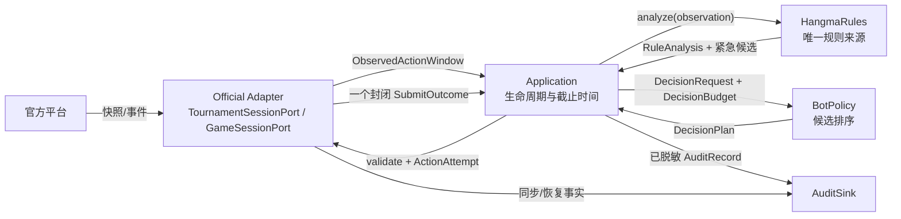

# 第一阶段接口协议

2026-09-07 制品工具兼容性增补：线上冻结接口和原始审计 schema 不变。`offline.postgame.finalize_session` 消费关闭的 run 与官方原文，输出不可覆盖的独立分析 job；`offline.observation_audit.audit_observations` 仅做赛后复核，不改变玩家观察。统一牌谱既有 `rule_config`、`guide_version`、`guide_captured_at` 字段保留 source 中真实元数据；旧配置缺少本地规则版本时，正式行的 `rule_config` 保持为空，局部配置仍留在 source 中。分析实现单独记录在包内 `references/analysis-provenance.json`，不替换历史线上版本。诊断单局明确 `student_observation=false`。CLI 成功只表示制品生成成功，完整性、历史覆盖和规则检查分别表达，详见 [操作指引](../operations.md)。

> 状态：接口基线 v1.1（2026-09-04 集成阶段契约收口）；实行受控变更  
> 日期：2026-09-04  
> 官方依据：指南/API v8 快照（doc/official-platform-api-v2.md）+ 指南版本 v15 变更记录
>（`/portal/api/guide/version` 只读检查日期 2026-09-05；v10 跨局 `gap=true` 快照、
> v11 state 轮询 16/s 每用户聚合、v12 SSE 低层客户端已实现（2026-09-06 两个生产入口固定关闭，
> 见 doc/implementation/notes/sse-runtime-integration.md）、v13 在线分桌已审查放行、
> v14 guide 全文端点、v15 自动匹配默认房配置上调已审查。新增 /api/match 接入按 parallel-v1 待实施）。
> 适配器代码与 fixture 同步由 runtime_protocol 工作包负责）  
> 代码定义：`src/hangma_bot/**/interface.py` 与 `application/contracts.py`

## 1. 设计决策

2026-09-07 海选接口需求修订（提案，未冻结）：[目标分值策略方案 §4—5](./qualifier-utility-v1.md#4-模块结构与依赖需求)拟保留 `BotPolicy.choose(DecisionRequest, DecisionBudget)`，扩展现有载荷：`CompetitionContext` 的可选赛事事实包、`RuleCandidate` 的立即结算与有界路线事实、`RuleAnalysis` 的可选结算尺度，以及 `DecisionPlan` 的可选赛事诊断。事实包不含晋级概率，规则模块不读取赛事榜单；具体 `competition` 由策略调用，不预建通用预测接口。另补全榜/进度审计和离线可更新情景输入，`MatchResult` 仍表示桌赛结果。落码时同步本文件、codec、契约测试及全部调用方；本提案不表示现有冻结契约已修改，也不切换默认策略。

海选提案分阶段冻结：先以固定目标的离线样例验证并收口路线事实、目标意图与 policy 内部目标调整职责；完整官方事实包和运行审计扩展在真实接入前另行受控冻结。对外 choose 不变，现有策略参数迭代不必等待。旧名次风格只在新策略目标调整有效时被接管，增强关闭/未知恢复原基线；可选字段默认空不代表自动兼容，仍需旧记录往返、旧候选结果、源码冻结与性能验证。实现隔离及调用方影响见[方案 §8](./qualifier-utility-v1.md#8-实施顺序与工作包)，本段不改变当前执行契约。

第一阶段只保留四个需要替换或隔离副作用的接口：

| 接口 | 调用方 | 第一阶段真实实现 | 为什么需要接缝 |
| --- | --- | --- | --- |
| `TournamentSessionPort` | `application` | 官方赛事会话、保存响应驱动的 Fake | 不连平台也能确定性测试多阶段生命周期 |
| `GameSessionPort` | `application` | 官方场次会话、保存响应驱动的 Fake | 隔离长轮询、序号恢复和动作提交 |
| `BotPolicy` | `application` | 加权启发式、紧急保底 | 两种真实策略必须可替换和故障降级 |
| `AuditSink` | `application` 与适配器 | JSONL、测试内存记录器 | 磁盘副作用不能进入动作闭环 |

`HangmaRules` 是唯一规则深模块，当前不定义可替换协议。传输、每Token控制调度与每场调度器、限速器、状态投影、动作门均为官方适配器内部实现。第一阶段不设置模拟、模型、事件总线、数据库或工作流端口。

## 2. 运行数据流

箭头表示同步/异步调用方向；返回值反向返回，图中不另画。



官方适配器不得构造 `DecisionRequest`，因为合法候选、赛事上下文组装和截止时间属于应用层。官方适配器也不得接收 `DecisionPlan`，因为协议层只需要本次动作尝试。

## 3. 窗口、预算与重新规划

`WindowKey = game_id + round_no + trigger_seq + phase + seat`。同一次弃牌的碰和吃是两个窗口。`decision_id` 在同一窗口的所有明确拒绝后重新规划中保持不变；每次提交的 `attempt_no` 增加，`plan_revision` 标识重新排序版本。

收到窗口时，应用层只创建一次 `DecisionBudget`：

- `enhancement_deadline_monotonic`：取消模型或复杂分析；第一阶段通常只约束启发式扩展。
- `fallback_deadline_monotonic`：到点立即选择已经准备的紧急候选。
- `latest_send_at_monotonic`：到点后官方适配器不得发出 POST。

409 刷新仍复用原预算，不能因为拿到新快照获得新的完整 1 秒或 3 秒。

## 4. 规则和策略协议

应用层先调用 `HangmaRules.emergency_action()`，再调用 `analyze()`。规则实现可以在内部更高效地共享结果，但必须保证复杂动作族异常时紧急路径仍可用。

`RuleAnalysis` 必须满足：

- `legal_candidates` 只包含本地确认合法的动作，`action_key` 唯一；
- `emergency_candidate` 存在时也出现在合法候选中；
- 一个动作族异常不隐藏其他成功动作族；
- 任何不完整分析使用 `DEGRADED` 和 `RuleIssue` 明示；
- 无动作权或无法安全构造动作时允许紧急候选为空，不能伪造。

`DecisionPlan` 必须满足：

- 只引用 `RuleAnalysis` 的候选；
- 排除 `rejected_attempts` 中已明确未执行的动作；
- 不重复 `action_key`，排名连续并确定；
- 紧急候选未被拒绝时必须保留；
- 保存完整评分分解，不只返回首选动作。

评分分解使用不可变 `ScorePart` 元组而不是可变字典，保证同输入的计划可以稳定比较和序列化。

应用层不盲信策略结果。它校验 `decision_id/window_key/based_on_authoritative_seq`、候选成员关系和重复项，再对最终动作执行 `HangmaRules.validate()`。

### 4.1 候选牌效事实（2026-09-04 集成阶段契约收口）

向听与有效牌数学只允许存在于 `hangma`；`policy` 只消费规则生产的事实并加权，不得重新推演手牌合法性、向听或有效牌。为此 `RuleCandidate` 增加可空字段 `facts: Optional[CandidateFacts]`，随候选一起传递、与 `action_key` 一一对应：

- `fact_kind`：`HAND_PROGRESS`（动作后等待状态已估计）/ `WIN`（动作后即成牌，`shanten_after=-1`）/ `NOT_APPLICABLE`（该动作无动作后等待语义）/ `ANALYSIS_FAILED`（分析异常，数值字段不可信且全部为空）；
- `shanten_after`：动作后向听数；胡牌、不适用或分析失败时不得伪造数值；
- `useful_tiles`：最佳等待状态的有效牌种类及基于当前公开信息的估计剩余张数（`UsefulTileFact(code, remaining_estimate)`，0—4，按本人手牌与公开可见牌扣减，不含他家手牌推测）；
- `best_followup_discard`：吃/碰候选必须按合法的后续弃牌计算最佳等待状态，此字段即采用的弃牌牌值；
- `replacement_draw_unknown`：杠后补牌未知时为 `True`，此时 `shanten_after` 是补牌前余牌口径，不得假设具体未来摸牌；
- `completeness`/`note`：分析是否完整与降级原因或证据；`ANALYSIS_FAILED` 必须携带 `note`。

`facts=None` 表示未生产牌效事实——紧急路径按设计不运行复杂分析，或实现尚未覆盖该动作族；消费方必须按未知处理，不得据此推断数值。规则模块保留保守假设与 `DEGRADED` 语义（见 `hangma/RULES_EVIDENCE.md`）。

### 4.2 V1 策略排序语义（2026-09-05）

新增可选策略 `weighted_heuristic_v1`，旧名 `weighted_heuristic` 与其评分/权重源码保留为 V0，默认不切换。V1 按“规则候选中的合法 Hu、可信事实候选、未知事实候选”分层；可信层按总分降序、同分按 action_key。未知层按 action_key；全部候选未知时优先尚可用的规则紧急候选。整体 RuleAnalysis 降级不抹去其他完整事实，杠的补牌未知标记也不等同事实分析失败。

`DecisionPlan.candidates` 已按连续 `rank` 排列，应用、审计和评估按此执行/展示；`total_score` 保持数值分项之和，跨层可以不单调，不能据此重新排序。每个候选 reasons 解释 V1 层级，全部未知的紧急优先原因进入 degraded_reasons。非有限评分失败由既有应用保底路径处理。类型、字段、序列化格式不变；新增 Pass 分析见 §4.3。契约覆盖见 `tests/contracts/test_policy_v1_rank.py`，实际应用消费见 `tests/unit/application/test_decision_loop.py`。

### 4.3 响应过牌的等待事实与冻结策略兼容（2026-09-06）

本地分析语义版本为 `hangma-mvp-v2-pass-progress`，不是官方规则或 API 版本变更。响应过牌复用现有 `CandidateFacts` 返回 `HAND_PROGRESS`：向听和有效牌来自当前未改变的本人暗牌，副露按摊计；`best_followup_discard=None`、`replacement_draw_unknown=False`。响应阶段、响应身份、无单列摸牌和 `13−3×副露数` 的暗牌形状均须吻合；失败使用已有 `ANALYSIS_FAILED + RuleIssue`，合法动作和紧急动作不变。

有效牌剩余估计沿用四家牌河与副露的公开计数，不再次扣减 `last_discard`，不领取触发牌、不增加假设弃牌。若上游触发牌与牌河不一致，继续作为观察可靠性问题处理，本分析不猜测修复。字段与编解码版本不扩展，旧 `NOT_APPLICABLE` 历史请求仍可读取。

V0 与依赖 V0 的 `claim_if_legal` 在线上组合根和已有离线入口通过 `policy/legacy_pass.py` 装配：仅将完整可信、非负整数向听且没有后续弃牌/补牌未知标记的新增 Pass 事实投影回旧中性视图。原始请求、规则问题和历史记录不改写；计划注明 `legacy-pass-neutral-v1`。V1 源码保持冻结，完整新 Pass 仍中性；失败事实继续按各版本既有语义处理，不能洗成可信事实。直接使用冻结 V0 原类只用于历史输入复现。

行为契约覆盖：`tests/unit/hangma/test_pass_progress.py`、`tests/contracts/test_legacy_pass_view.py`。新规则重算实验与历史原请求实验继续分开记录。

### 4.4 V2 可比等待评分（2026-09-06）

可选策略 `weighted_heuristic_v2`（`ComparableHeuristicPolicyV2`）通过原 `choose()` 装配。V2 复用冻结 V1 的非 Pass 评分函数及不可变 `HeuristicWeightsV1`，不调整默认权重；过牌增加与吃碰相同的向听、有效牌分项，保留共同财神项、碰惩罚 6 与吃惩罚 10。它只比较规则给出的等待代理，不估计未来摸牌概率或完整续打价值。

过牌基线可信条件与 §4.3 完整等待事实一致。存在未拒合法 Pass 但基线缺失、旧版或失败时，排序为未拒合法 Hu → Pass → 其余候选按 V1 层级；计划明确说明“缺可比等待基线”。Pass 不存在或已拒绝时不补造，按 V1 的可信/未知与紧急候选路径排序。候选过滤在退路选择之前执行。数值溢出明确失败，由应用原保底处理。

实现不增加协议字段、编码或结果类型；审计保持 `rank` 执行顺序，原始请求与实际评分理由同时保留。旧视图兼容说明记录在计划中，不代表动作失败。覆盖见 `tests/unit/policy/test_heuristic_v2.py`、正式工厂与启动器测试。

## 5. 动作提交协议

2026-09-06 动作链修订使用 `hangma-mvp-v3-action-chain`，继承 §4.3 的过牌事实。外部四个端口与 `PlayerObservation` 编码保持兼容：官方 `rule_state` 原样传递；本地增量推进由 `hangma` 接收完整摸前暗牌、旧爆头和本次补牌来源。吃碰杠继承、补牌可新进入、弃牌先判本次飘再更新后态；四白例外已在 v23 修订中取消，链清零与退出爆头分开。来源未知且会改变结果时必须恢复权威快照，不补 False。完整语义和证据级别见[规则清单](../../src/hangma_bot/hangma/RULES_EVIDENCE.md)。模拟和牌谱读取使用同一实现，旧审计不按新版本覆盖。

2026-09-07 生产配置按场隔离：每个 game_id 独立持有请求队列、频率额度、并发计数和429冷却，赛事查询另用独立调度。每场最多2个在途HTTP，其中state最多1个；动作POST另由ActionGate保证串行。M≤7时每场state为2/s、burst=1；M=8—16时为1/s，以静态分配满足指南v18每用户16/s上限，不靠场间共享队列争抢额度。重新打开同一game_id沿用原额度，不重置冷却。仅连接池按Token共享，默认64连接、48保活连接，覆盖16场请求、SSE与赛事查询。state 429只冷却本场state；其他端点429只冷却所属场或赛事控制通道。 `RequestKind.STATE`包括正常轮询和恢复；OTHER不扣state额度，匹配另受10次/分钟限制。四个外部端口不变。

安全不变量是“同一场任意时刻最多一个在途动作 POST”，不是“整个窗口永远只允许尝试一次”。

```text
ActionAttempt
  ├─ SubmitAccepted                 → 本窗口完成
  ├─ SubmitRejectedRetryable        → 排除该动作，原预算内重新规划
  ├─ SubmitRejectedClosed           → 原窗口完成，不追加动作
  ├─ SubmitRejectedNoRefresh        → 原窗口完成，不追加动作（无权威刷新）
  ├─ SubmitAmbiguous                → 封锁原窗口，等待权威状态迁移
  ├─ SubmitNotSent                  → 未发 POST，停止沿用旧计划
  └─ SubmitFatal                    → 当前身份永久故障，安全退出
```

仅 `SubmitRejectedRetryable` 携带 `refreshed_window`。它表示官方已明确未执行该动作，适配器完成 `seq=0` 刷新，且确认仍是相同 `WindowKey`、仍需我方行动。

`SubmitRejectedNoRefresh`（2026-09-04 集成阶段裁定，批准 contract-change-request 方案 A）表示：动作 POST 已实际发出；官方已明确该动作未执行；但没有取得可用于重新规划的权威刷新。触发场景为 POST 429 与 POST 409 后权威刷新失败或响应不可用。该结果终结原窗口且不允许追加提交；审计中实际发送次数（`sent_attempts`）增加一次；它不得记作 `SubmitNotSent`（未发 POST）、`SubmitAmbiguous`（结果不确定）或"权威确认关闭"（`SubmitRejectedClosed` 语义）。字段：`official_code`、`rejected_action_key`、`latest_local_seq`（刷新失败时本地已确认的最后权威序号，不是刷新结果）、`reason`。

`SubmitAmbiguous` 永远不携带重试窗口。POST 超时、断连或无法确认是否执行的 5xx 进入该状态后，适配器不能再次为相同窗口接受提交。它只能等待权威事件或快照证明状态已经迁移。

候选有限、已拒绝动作不会重新加入、截止时间不延长，因此明确拒绝降级循环自然终止。不要硬编码“最多两次”；停止条件是成功、模糊、窗口关闭、未发送、截止时间或候选耗尽。

## 6. 赛事与参赛者终态

`TournamentSessionPort.initialize()` 只完成指南版本、身份、目标赛事、规则和初始状态发现，不自动报名、到位或启动场次。初始化、报名和到位都可以返回 `ParticipantTerminal` 形式的永久失败；何时 `register()`、`ready()`、打开/关闭场次由应用层决定。`ready()` 携带 `StageIdentity.observed_revision`，防止等待期间把旧阶段命令提交到新阶段。

**MVP 后 AUTO_MATCH 条件化例外（parallel-v1）**：仅新 OfficialAutoMatchSession 在显式 AUTO_MATCH、expected_tournament_id 为空且已排除现有自动房归属时，允许 initialize 完成一次 POST /api/match 入席操作。受控类型扩展（`RuntimeMode.AUTO_MATCH`、AUTO_MATCH 下空目标语义、`MATCHING_UNAVAILABLE`/`CAPACITY_LIMIT` 终态原因、SessionBootstrap 注释与模式契约测试）已由主审合入；OfficialAutoMatchSession/AutoMatchRuntime 具体实现随自由赛工作线交付。非空目标只恢复，不调用 match；旧三种模式的发现/作用域/报名流程不变。match 可创建房、占席并触发开赛，因此这个初始化不能作为只读幂等调用盲目重试。application 决定开始一次操作，适配器在该操作内按配置有界处理协议恢复；分类终态后不再自动 initialize。完整定义与受控类型扩展见[共同契约 §3.3](./parallel-contracts.md#33-本次批准的增量扩展)，必须同步 SessionBootstrap 注释、Fake、调用方和模式契约测试。

必须区分：

- 赛事终态：官方 `finished/closed/void`；
- 参赛者终态：赛事终态，或当前身份被淘汰，或认证/版本/目标校验发生永久错误；AUTO_MATCH 模式另增 `MATCHING_UNAVAILABLE`（暂不可匹配或入席结果不确定且恢复证据不足）与 `CAPACITY_LIMIT`（资源/声明上限不符），不误标淘汰、鉴权失败或正常完赛。

**状态终态判定唯一归应用层（2026-09-04 评审裁定，终版）**：官方适配器对 `finished/closed/void` 一律返回普通变化快照，不做任何状态终态化；认证/版本/目标/协议错误仍可返回 `ParticipantTerminal`。参赛者终态判定唯一存在于应用层 supervisor（`_TERMINAL_STATUS_REASON` + TEST_ROOM 复用分支：`RuntimeMode.TEST_ROOM ∧ finished ∧ 本进程未观察过 running` 时走幂等 register→ready 复用，打完一轮后的 finished 是正常终态）。测试房间跨轮复用是官方协议语义（指南 v4/v5/v8）。回归锚点：`test_terminal_statuses_are_plain_snapshots`、`test_change_then_finished_snapshot_in_test_room` 与 `tests/unit/application/test_test_room_reuse_wiring.py`（真实 `OfficialTournamentSession` × TEST_ROOM × finished 冷启动全链路）。

`stage_open + qualified=false` 或 `ready → NOT_QUALIFIED` 表示该身份正常结束。其他参赛者和赛事可能继续，不能把它记成平台故障。

`stage_attempt_id` 是应用层在每次阶段实际运行尝试开始时生成的审计标识，不是官方字段。`stage_crashed` 后的新运行必须获得新标识，旧标识下的成绩默认作废。

资源作用域沿用上述GameSession约束：赛事控制和各场独立调度，同Token仅共享连接池。 `open_game()`按active_games动态打开，同场复用，active_games为空不等于终态。

## 7. 审计协议

本节 §7.1 描述现行 v1。拟实施的 v2 变更登记见 §7.2；生产代码升级前不得把 v2 字段视为已经存在。

关联键统一为：

```text
run_id / tournament_id / participant_id / stage_attempt_id /
game_id / round_no / trigger_seq / decision_id / attempt_no
```

`SUBMISSION_INTENT` 在调用 `submit()` 前入队，`SUBMISSION_OUTCOME` 在返回后入队。`payload` 只允许 JSON 值；`emit()` 返回前取得内容快照，但不等待磁盘且不向动作路径抛异常。失败返回 `audit_degraded=true`。优先级由记录器按 `AuditKind` 固定，调用方不能把关键事件标成低优先级；只有冗余 `RAW_PROTOCOL_STATE` 可以在压力下计数丢弃。高优先级动作信封缺失后，该次运行不能宣称“完整可审计”。

四身份目录必须隔离：

```text
runs/{run_id}/
  manifest.json
  lifecycle.jsonl
  participants/{participant_id}/
    decisions.jsonl
    games/{game_id}.jsonl
    summary.json
  summary.json
```

适配器进入记录接口前先脱敏，记录器再做一次防御性脱敏。

### 7.1 审计种类与 payload 词表（2026-09-04 正式登记）

以下为 recording 当前实际使用的 payload 结构（字段名以生产方代码为准；均为 JSON 值，时间字段为 Unix 毫秒或单调时钟纳秒，见信封）。同一事实被应用层与适配器双层记录是正常现象（双层各自独立观察同一协议事实）；三条及以上**同层**重复才应被识别为异常。

| AuditKind | 记录层 | 关联键必填 | payload 要点 |
| --- | --- | --- | --- |
| `HTTP_REQUEST` | 官方适配器 | run_id；已知participant/game；payload.request_id | phase=started/finished、endpoint、params/body、request_timing、状态/失败/取消；与原始响应一一对应 |
| `RUN_MANIFEST` | 应用层（runtime） | run_id | `run_id`、`mode`、`expected_tournament_id`、`known_guide_version`、（正常路径）`guide_version`/`guide_updated_at`/`participant_id`/`ruleset_version`/`max_games`/`rounds_per_game`/`timing{peng,chi,discard_timeout_sec}`；早退路径带 `early_exit=true` |
| `LIFECYCLE_CHANGED` | 应用层（supervisor） | run_id | `event` ∈ {`status_changed`(from/to), `registered`(status/official_code), `ready`(status/stage_no/stage_observed_revision/official_code), `stage_attempt_started`(stage_attempt_id/stage_no/stage_observed_revision), `stage_attempt_voided`(…作废标记)} |
| `AUTHORITATIVE_STATE` | 应用层（supervisor 赛事快照）+ 适配器（指南版本、场次窗口投递）双层 | run_id | 应用层：`status`/`stage_no`/`stage_observed_revision`/`stage_role`/`stage_total`/`stage_crashed`/`qualified`/`qualify_role`/`active_games`/`my_games`/`observed_at_unix_ms`；适配器赛事层：`guide_version`/`guide_updated_at`/`guide_changes[]`/`checked_at`(initialize/stage_boundary)；适配器场次层：`seq`/`phase`/`turn`/`window{game_id,round_no,trigger_seq,phase,seat}` |
| `DECISION_PLANNED` | 应用层（decision loop） | decision_id | `plan_revision`/`based_on_authoritative_seq`/`trigger_seq`/`window`/`candidates[{action_key,is_emergency}]`/`degraded_reasons[]`/`rule_completeness` |
| `SUBMISSION_INTENT` | 应用层（decision loop） | decision_id + attempt_no | `action_key`/`is_emergency`/`based_on_authoritative_seq`/`plan_revision`/`latest_send_at_monotonic`/`window`；在调用 `submit()` 前入队 |
| `SUBMISSION_OUTCOME` | 应用层（decision loop）+ 适配器（恢复事实细节）双层 | decision_id + attempt_no | 应用层：`outcome`（规范结果词表：accepted/rejected_retryable/rejected_closed/rejected_no_refresh/ambiguous/not_sent/fatal，见 `recording/schema.py`）/`window`/`official_code`/`reason`/`rejected_action_key`/`latest_authoritative_seq`/`latest_local_seq`/`authoritative_seq`；适配器在 PROTOCOL_RECOVERED 中补充恢复事实 |
| `PROTOCOL_RECOVERED` | 应用层（supervisor/game_task/decision loop）+ 适配器（game）双层 | 视上下文 | `trigger` ∈ {`pending_gap`, `incremental`(reasons/streak), `conflict_refresh_cancelled`, `conflict_refresh_unavailable`, `rebuild_snapshot_gap`（v10 跨局 gap 快照权威吸收）, `rebuild_snapshot_apply_failed`（刷新快照不可用）, 其他 `rebuild_*`}、`area`/`reason`（应用层恢复与监督异常） |
| `GAME_FINISHED` | 应用层（game task） | game_id | `final_scores`（固定按座位 0—3）、`authoritative_seq` |
| `PARTICIPANT_FINISHED` | 应用层（runtime 出口，覆盖取消/异常/早退） | run_id | `reason`（ParticipantTerminalReason 值或 `cancelled`）、`detail` |

`RAW_PROTOCOL_STATE` 为唯一低优先级种类（可计数丢弃），不进入本表——其规范权威信息必须以 `AUTHORITATIVE_STATE` 高优先级另存。双层终局分数一致性检查由 recording 汇总/验证器负责（应用层 `GAME_FINISHED` 与适配器快照终局对照）。

2026-09-07验证报告口径修订：`submissions.counting_basis=attempt-v2`。`outcome_histogram`及拒绝、模糊结果统计按`run_id/tournament_id/participant_id/game_id/decision_id/attempt_no`归并；原始条数保留为`intents/outcomes`及`outcome_record_histogram`。适配器缺省的`stage_attempt_id`不能拆开同次尝试，真实阶段混用仍另报违规。双层结果矛盾单列`conflicting_attempts`，不择一算成功。`coverage.rule_degradations`按决策输入`request.rules.completeness`计数，缺输入或无效输入标未知，计划自由文本只作为提示另列。外部`AuditSink`及原始信封不变，旧报告无需原地改写；完整字段见[记录模块](./modules/recording.md#2026-09-07-汇总口径修正)。

所有生产HTTP调用均记录HTTP_REQUEST开始/终结元数据，以request_id关联原始响应；成功、拒绝、超时、取消、赛事发现/报名/到位、自动匹配和SSE连接均覆盖。短元数据走高优先级，正文仍走RAW_PROTOCOL_STATE。state/action原来源兼容保留，新增http_response及notify_response；取消无响应时raw为空并记录outcome=cancelled。仅保存Date、Retry-After、Content-Type和请求/限流诊断白名单头，Token及Authorization不落盘。验证器逐请求核对开始、终结和正文，即使旧成功计数连续也能查出取消漏记或正文丢失。赛后公共下载另写http-requests.jsonl并保留非200正文为*.http-error。 旧运行缺少HTTP_REQUEST时只执行原覆盖检查，不追认旧日志覆盖所有API。

验证器裁定补充（2026-09-04 集成阶段登记）：

- **stage_attempt 混用判定**：同一 `game_id` 出现两个及以上**不同非空** `stage_attempt_id` 才算违规；「缺失与非空共存」是应用层/适配器双层记录的合法形态（官方适配器按契约不生产该标识，按旧口径真实运行必误报）。
- **coverage 的 `final_scores_by_game`**：双层终局分数一致性检查结果；不一致只报 warning（应用层与适配器观察时点不同可能造成合法差异），进入验证报告供人工裁决。
- **`rejected_no_refresh` 计入 rejected_total** 统计（提交结果分布七分类）。

### 7.2 审计增强 audit-plus-v1 变更登记（2026-09-05，待实施）

字段和验收的详细定义见[审计增强实施方案](./audit-enhancement.md)，数据交换见[parallel-v1](./parallel-contracts.md)。本次在已合入的原文留存上增补真实决策证据，取代旧文档拟议的信封 v2，不改变动作提交语义。

| 项目 | 拟实施变更 |
| --- | --- |
| 接口 | AuditSink/AuditRecord/AuditReceipt/AuditSummary 签名不变；动作和策略接口不变。自动匹配初始化例外单独按 §6 登记 |
| 信封 | 审计 schema_version=1、raw payload_schema_version=1；增强 payload 声明 capture_profile=audit-plus-v1，生产方字段用 audit_producer，不与 raw.source 冲突 |
| 种类 | 新增 DECISION_INPUT、CANDIDATE_VALIDATED、DECISION_ENDED；现有计划保存完整原计划、有效候选及评分，不新增 PROTOCOL_MESSAGE |
| 优先级 | 独有原文继续 RAW_PROTOCOL_STATE 低优先级，背压丢失计数；权威状态和决策高优先级。缺失不能宣称完整 |
| 关联 | 规划按 run_id/decision_id/plan_revision；提交加 attempt_no/audit_producer；迁移引用用相对文件/行号，跨进程单局按稳定 hand_id/index 映射 |
| 信息权限 | 决策输入只保留当时 `PlayerObservation` 和赛事上下文；赛后全信息独立归档，仅离线转换可读取 |
| 兼容 | 旧 v1 保持可读；缺输入的记录不可完整重算。新校验以 profile 开启，生产方/codec/Fake/测试一起更新，不收紧旧日志 |
| 结果 | accepted 与权威执行确认分开；最后观测排名不等于最终排名；作废/未知结果显式保留 |
| 失败 | codec 构造失败以最小失败记录及 producer_summary 持久化，并合并关闭报告；无闭合证明不能判断尾部完整 |
| 时间 | 新增同步审计之后仍须检查原发送截止时间；超时返回 SubmitNotSent，HTTP 调用为 0 |

影响文件与测试列于方案 §7；现有 §7.1 的兼容读取继续保留，新 profile 按 audit_producer 和实际事件角色验证，不因三条以下重复便自动放行。模拟具体方法、历史 check_hand、统一牌谱和评估结果由[并行契约](./parallel-contracts.md)冻结；共享变更按[施工导航](./parallel-workstreams.md)集中集成。

## 8. 错误和取消契约

| 情况 | 所有者 | 契约结果 |
| --- | --- | --- |
| GET 超时、可恢复 5xx、429 | 官方适配器 | 在预算和限速约束内有界重试；持续失败转分类故障 |
| POST 明确 409 | 官方适配器 | 权威刷新后返回 retryable 或 closed |
| POST 结果不确定 | 官方适配器 | `SubmitAmbiguous`，同窗封锁 |
| 401、未知破坏性版本、目标不符 | 赛事会话/场次会话 | `ParticipantTerminal` 或 `SubmitFatal`，当前身份永久退出 |
| 策略超时、异常、空计划 | 应用层 | 使用已准备的紧急计划 |
| 规则局部分支异常 | 规则模块 | `DEGRADED`，保留其他候选和紧急路径 |
| 单场任务异常 | 应用层 | 隔离该场，必要时从赛事权威状态重新发现 |
| 磁盘或审计异常 | 记录器 | 不阻塞动作，标记审计降级 |
| 阶段切换或退出 | 应用层与适配器 | 取消旧场长轮询并关闭对应会话 |

## 9. 契约兼容规则

冻结后，新增可选审计种类或内部实现不算破坏性修改。下列变化属于破坏性修改，必须总体评审：删除/改名字段、改变时间单位或时钟、扩大 `PlayerObservation` 信息权限、改变提交结果的重试语义、改变关联键、让端口拥有新的副作用，或增加新顶层接缝，或改变下节所列 kernel 构造与异常契约。

## 10. kernel 值对象构造与异常契约（2026-09-03 code-review 裁定补记）

以下裁定由 kernel 代码审查（任务 `kernel-mvp-review`，三轮终裁 + 追加确认轮）确立，属 §9 受控面；修改任一项须同步本文件、`tests/contracts/` 与全部消费者：

- **未知动作类型异常是承重契约**：`action_key()` 对联合外类型抛 `TypeError`。`hangma` 验证（`HangmaRules.validate`）与 `policy` 候选过滤（`WeightedHeuristicPolicy`）依赖捕获 `TypeError` 把坏候选隔离为结构化结果；曾统一为 `ValueError` 的提案因击穿上述故障隔离被终裁推翻。回归见 `tests/contracts/test_exception_contracts.py`。
- **可变容器拒绝**：所有声明 `Tuple` 的 kernel 序列字段（含嵌套行与 `PublicMeld`/`PublicEvent`/`CompetitionContext.ranking`）在构造期拒绝 `list` 等可变容器（拒绝式而非拷贝规范化）；调用方须显式 `tuple(...)` 转换。理由：可变容器会使动作键、哈希与审计身份在构造后漂移。
- **整数不变量**：`WindowKey.round_no/trigger_seq`、`PlayerObservation.round_no/snapshot_seq` 为非负纯 `int`（排除 `bool`）；`trigger_seq=0` 合法（官方 seq=0 全量快照语义，API §2.3）；`round_no` 收紧为 ≥1 待官方样本证实。`scores`/`hand_counts` 元素必须为纯 `int`，积分允许负值。
- **标识与名次**：`game_id` 等标识字段拒绝空串与纯空白；`participant_rank`/`RankingEntry.rank` 从 1 起；`responding_seats` 拒绝重复座位。
- **序列化**：`kernel/serialization.py` 为带 `KERNEL_VALUE_SCHEMA_VERSION=1` 的稳定 JSON 转换（kernel 内部实现，供审计/回放使用）；顶层负载自带版本号，解码对未知新增键前向兼容。

### 10.1 集成阶段 kernel 裁决（2026-09-04）

以下遗留争议按集成阶段结论关闭：

- `PlayerObservation.phase` 保持**开放字符串**，用于兼容官方新增非动作阶段；需要我方限时行动的阶段由 `WindowKey.phase` 单独表达。
- `WindowKey.phase` 继续使用**封闭的 `WindowPhase` 枚举**（draw/response_peng/response_chi）；裸字符串在构造期拒绝。
- **不把官方任意 `data` 字典加入 `PublicEvent`**；原始数据留在协议审计（`RAW_PROTOCOL_STATE`/`PROTOCOL_RECOVERED`）。规则确实需要新事实时，先增加明确的规范字段并走契约变更。
- `round_no` 不得假设每次运行都从 1 开始，只作为官方关联标识使用（非负整数校验不变）。
- 内部统一语义（2026-09-05 修订，F-11）：官方快照实测形态（`my_hand` 含刚摸牌）与契约形态（不含）并存，适配器投影保留官方原样（紧急"最右一张"依赖官方顺序）；双计归一化由 hangma 引擎（`engine._concealed_without_drawn`，长度判据 14−3×副露数）与 policy 评分上下文（`evaluation._hand_codes_without_double_count`）按同口径防御性执行；适配器侧统一规范化列为后续工作线（rules-hu-gate-and-win-detection.md §6.1）。
- **吃牌组合规范牌序**：`Chi.tiles` 必须严格按 `CANONICAL_TILE_ORDER` 升序，构造边界拒绝非规范顺序；相同吃牌组合必须产生相同 `action_key`，不得在 `action_key()` 中静默制造另一套排序规则。
- **规范牌序唯一权威**：`kernel.actions.CANONICAL_TILE_ORDER`（含 `CANONICAL_TILE_INDEX`）是全仓唯一定义；`hangma` 等业务模块只允许引用，不得维护平行常量。

## 观察完整性与截止契约增补（2026-09-06）

本次受控增补保持四个外部接缝与旧字段语义。官方依据为 v15 指南（2026-09-05 保存原文），设计及交叉评审见 [修复策略](../../review/official-adapter/repair-plan-2026-09-06.md)。以下可空项的空值均表示未知，不等于零或 False。

| 类型.字段 | 用途与语义 | 兼容性 |
| --- | --- | --- |
| `PublicEvent.detail_kind` | 官方公开 `gang/timeout` 的 `data.kind`；未提供为空 | 旧事件默认空；吃组合完整保存在 `tiles`，不与顶层单牌重复拼接 |
| `PlayerObservation.consumed_seq` | 本场已处理事件水位，非负整数；`snapshot_seq` 仍是快照基线 | 旧记录为空，不能默认断言与快照后事件对齐 |
| `PlayerObservation.history_complete` | 当前单局依法可见历史是否有完整起点且无缺口 | 默认 False；快照恢复不会凭空补齐历史 |
| `PlayerObservation.chain_piao` | 本人当前动作链内飘白次数；非负且不超过 `rule_state.chain_count` | 默认空；不能把普通弃白/旧链弃白计入 |
| `PlayerObservation.gang_draw` | 当前本人摸牌是否为杠后补牌 | 默认空；证据不足不能伪装普通摸牌 |
| `PlayerObservation.observation_issues` | 可见观察缺失、协议异常或 god 核对差异的稳定原因元组 | 默认空；不保存隐藏牌和原始协议字典 |
| `ObservedActionWindow.expires_at_monotonic` | 本机单调时钟秒表示的截止；可为明确标注的估计，旧调用为空 | `timeout_seconds` 仍为官方配置总时长 |
| `ObservedActionWindow.deadline_is_estimated` | True 表示缺乏可对齐官方截止；False 必须同时有截止值 | 默认 True；不得把新摸牌套用旧碰阶段截止 |

kernel JSON 编码保留 schema_version=1 的可选字段增补；新编码完整保存字段，旧记录缺字段解码为上述默认未知值。接收端忽略兼容新增字段不代表它能够证明观察完整。规则和策略仍支持既有“手牌含摸牌/摸牌单列”表示，保留官方顺序；本次不迁移手牌语义。

应用层先取得紧急动作，再用同一 `PlayerObservation` 调用规则分析并组装 `DecisionRequest`。规则纯函数 `enrich_observation` 补充有依据的链内飘数和摸牌来源；适配器在投递前调用，使策略也获得同样事实。`HangmaRules.score()` 对非零链但无法确认飘数的输入抛 `ValueError`，含义是无法精确核验，不能把猜测分数当作结果。规则分析的完整性与历史完整性分别表达，不相互替代。

2026-09-07完赛修订：适配器在同一观察入口调用纯函数 `reconcile_observation(before, after, confirmed_action=...)`，将明确成功的本人动作与新快照核对后补足上述可空事实。规则模块验证场次、座位、单局、水位和本人牌面/链变化；适配器只管理确认的寿命。拒绝或模糊结果不能传入 `confirmed_action`。没有成功确认时，只允许按未改变的本人链状态保留已知事实；本次杠补来源还须证明仍为同次摸牌。官方 `rule_state`、事件、水位及 `history_complete` 均不改写，四个外部端口与数据字段不变。依据v20及2026-09-07实际响应，详见[规则回归来源](../../tests/fixtures/official/v20/README.md)。

`BudgetPolicy.build(received_at_monotonic, timeout_seconds, expires_at_monotonic=None)` 在配置时长和实际剩余时间中取更短值分配三段预算；过期预算为零。`tighten` 将 409 新边界与原预算逐项取最小值。刷新即使更晚也不能延长；提交出口还检查会话已知截止。官方 Unix 截止转换后的单调值按同一窗口缓存且只收紧，时间准确性仍受主机与服务端时钟偏差约束。

离线观察核对使用 `compare_observations(actual, reference, boundary_verified=True)`，调用方须先凭独立取证确认边界；同 seq/phase 不是充分依据。结果含 `status/state_status/history_status`、字段路径差异和未检查项，分别使用 `passed/failed/not_checked`。未知字段或缺史不能因两边都为空而通过。本工具不进入线上路径，不使用隐藏牌重写策略输入。

## 实测事件与恢复契约增补（2026-09-06）

依据为当日保存的官方 v17 指南及测试房实测；两者的证据性质分开记录于[实测报告](../../review/official-adapter/live-validation-2026-09-06.md)。本次保持四个外部接口，补充以下可选公开事实；所有 `None` 表示未提供，显式 `False` 和零不得丢失。

| `PublicEvent` 字段 | 来源与含义 |
| --- | --- |
| `catch_play` | 该次 `tile_discarded.data.catch_play`；不自动解释为本座位当前 `god.catch_play` |
| `gang_replenish` | 该次 `tile_drawn.data.gang_replenish`；用于确认对应本人摸牌来源 |
| `response_window` | `timeout.data.window`；公开的超时阶段，开放字符串 |
| `result_draw` / `result_fan` | `round_ended.data.draw/fan`；已结束单局的流局标记与官方番值 |
| `result_details` | `round_ended.data.detail` 的不可变字符串元组；官方公开结算明细 |
| `result_scores` | `round_ended.data.scores`；座位 0、1、2、3 顺序的本单局积分变化 |
| `final_scores` | `game_ended.data.final_scores`；同座位顺序的场次最终积分 |

赛后统一单局行的`scores_before/scores_after`均为累计积分，不能将`result_scores`直接写入`scores_after`。2026-09-07修正了该映射：以明确的场次最终积分和连续尾事件还原各单局前后累计积分；无法确认时为null。字段形态不变，见[统一牌谱契约](parallel-contracts.md#52-单局行)及[原文积分审计](../../review/official-deep-diagnosis-2026-09-07/score-source-audit.json)。

这些字段经 DTO、事件投影、`PlayerObservation.public_history` 和审计 JSON 编解码传递。schema_version 仍为 1，旧记录缺字段解码为 `None`。不透传任意 `data`，不扩大隐藏牌权限。他家无牌值 `tile_drawn` 是合法可见事件，必须保留；收到他家私有牌值须隔离并标记异常。

完整快照直接建立当前状态基线，下一次增量查询使用该快照水位N，接收N之后的事件；seq=0返回水位1的快照同样有效。已收到的原事件仍保留且不重复应用到牌河或手牌。线上移除100ms串行补领与三次延后补史，不回退游标追逐已被快照覆盖的原事件；历史缺口单独进入history_complete和单局封存，不再仅因history_gap_snapshot将当前规则分析整体降级。新收到的增量有gap、序号缺口、冲突重复或未知关键事件时仍必须用seq=0恢复；409仍按原始截止刷新。

普通他家摸牌、明确catch_play=false的弃牌及pass，在连续后缀且本人手牌/god未变化时直接投影碰窗口；抓打标记不明、本人改牌、副露、超时和跨单局等不可完整推导的情况继续查询权威快照。peng→chi无事件切换仍按边界查快照；若剩余时间不足以安排增量和边界两次额度，则只在边界查一次，避免先发注定取消的长轮询。增量截止使用事件整秒时间与上次已知水位查询开始时刻提供的保守下界，并保持同窗截止只收紧。

碰阶段选择 `Pass` 返回 `SubmitNotSent("pass_deferred_until_chi")`，不发送 POST，不标记本人已表态。应用层结束本次计划，等待权威状态提供真实吃窗口；吃窗口独立建立预算。该做法避免显式碰阶段 pass 提前关闭后续吃资格，是否能在官方超时后完整获得吃机会仍需下一批实测。409 刷新若同时获得更晚事件，则返回 `SubmitRejectedNoRefresh`，原因 `newer_events_pending`；先同步后重新取得窗口，不在旧快照上重试。

赛后单局结果取对应事件块的 `round_ended`；顶层 `rounds` 作为独立摘要保存，差异只报告诊断，不按数组位置将其绑定单局或阻止导入。单局终结事件自身矛盾时仍拒绝转换并报告 `official_result_conflict`，不足以核验的字段列为 `not_checked`，不得静默替换官方原文。

新增量返回gap=true必须进入正常权威恢复；跨单局附带事件只按可证明的终局边界归属，不明归属保留原始审计。

## 延后补史与单局收尾契约（2026-09-06）

四个外部端口不变。consumed_seq表示已经吸收的状态水位；历史另有history_floor_seq、history_origin_known与缺失闭区间。未知前缀不能伪造为已知区间，缺史不阻挡完整快照的当前动作。

2026-09-07取消此历史方案：原动作路径和后续next_item均不再追加旧游标GET。单局切换和结束仍独立封存已知历史、未知前缀、缺失区间及终局事件是否实际收到；不为补历史再发请求，也不伪造终局事件或重新打开已结束场次。赛后完整下载是独立证据，不回写当时策略观察。

仅实际收到的事件能补齐原事件证据；附带历史整批校验并保留，不重放牌面。未知关键事件、冲突重复或私有他家摸牌仍按既有协议恢复约束处理。

单局切换成功、场次结束和会话关闭会经现有高优先级 `AUTHORITATIVE_STATE` 保存一次 `history_closure`，无需另建策略窗口。记录包含：`round_no`、`state_seq`（末次牌面吸收水位）、`snapshot_seq`、`history_through_seq`（已归属本手的历史检查上界，可晚于末次牌面）、`snapshot_phase`、座位0—3的`scores`、起点元信息、缺口闭区间、`public_history`、重试原因及可空`observation`。官方终态无法构造合法玩家观察时，`observation=null`，不伪造行动座位；历史和公开结算仍单独保存。未知前缀或未确认终局不能因封存自动变成完整。新快照校验失败不封存旧手；跨手混包尾事件仅在能证明归属时并入旧手封存。

`kernel.serialization.public_event_to_json(PublicEvent)` 公开复用既有事件JSON编码，供无策略窗口的终局审计使用，字段与玩家观察内事件编码相同；没有新增信息权限或schema版本。


### 单局封存完整性补充（2026-09-06）

`history_closure.closure_issues` 记录附带旧尾中的未知事件、关键字段缺失、违规他家摸牌，以及未收到 `round_ended` / 场次终态未收到 `game_ended` 的原因。封存 `history_complete=true` 除要求起点、序号及原有观察完整外，还要求这些原因为空。`missing_ranges` 仅覆盖已知 `history_through_seq`，缺少更晚的尾事件不能只靠此区间表判断；不从积分或新快照捏造终局事件。该检查只影响赛后封存，不重新推进牌面、创建动作窗口或改变策略输入。

## M=4 调度与审计兼容增补（2026-09-07）

所有生产HTTP调用均记录HTTP_REQUEST开始/终结元数据，以request_id关联原始响应；成功、拒绝、超时、取消、赛事发现/报名/到位、自动匹配和SSE连接均覆盖。短元数据走高优先级，正文仍走RAW_PROTOCOL_STATE。state/action原来源兼容保留，新增http_response及notify_response；取消无响应时raw为空并记录outcome=cancelled。仅保存Date、Retry-After、Content-Type和请求/限流诊断白名单头，Token及Authorization不落盘。验证器逐请求核对开始、终结和正文，即使旧成功计数连续也能查出取消漏记或正文丢失。赛后公共下载另写http-requests.jsonl并保留非200正文为*.http-error。

`RAW_PROTOCOL_STATE` payload可选增加 `request_timing`，旧日志没有此字段时表示未记录，不是耗时为零：

| 字段 | 语义 |
| --- | --- |
| queued_at_monotonic | 本进程单调时钟秒，开始申请调度许可 |
| granted_at_monotonic | 本进程单调时钟秒，已经获得许可 |
| transport_started_at_monotonic | 本进程单调时钟秒，调用传输层之前；包含后续连接池等待，不能当作服务端收包时间 |
| completed_at_monotonic | 本进程单调时钟秒，处理成功响应或异常并写审计时；失败不保证有响应体 |
| retry_after_seconds | 仅state 429记录的有效有限非负秒数；缺失或无效为null，不保存完整响应头 |

这些时间点只能在同进程内相减，不得跨Token进程相减；传输开始不等于服务器收包。未获许可不产生HTTP_REQUEST开始记录，提交路径仍以SubmitNotSent记录调度超时。

## 2026-09-07 规则资格与计分边界澄清

公共类型与签名不变。`HangmaRules.analyze/validate` 根据实例绑定的 `RuleConfig.you_cai_bi_kao` 判断提交资格：开关开启且手留白板时必须爆头，杠补不可豁免。确定规则过滤不是计算失败，原因写入保留候选的 `evidence`，不产生降级 `RuleIssue`；缺事实或异常继续降级。

`score(WinDescription)` 仍接收已确认胡牌事实，仅计算倍率和座位0—3积分，不借赛事资格过滤将成牌变成流局。计番、静态爆头对拍和行动资格分别验证；线上 `rule_state.baotou` 是权威持续状态，不能无条件换成静态重算值。v23 起，已成立的四白爆头在资格和计分中均保留；无爆头的四白仍受赛事开关限制。


## 2026-09-07 分组手牌数学与可选 C 扩展

标准型缺牌数在 `hangma` 内按万、筒、条、字牌分组，局部完整枚举财神与自然虚牌分配，再合成面子、将和财神资源。修复旧搜索过早消耗财神而高估向听的反例；每种自然牌的进张配额从 `4−初始持有数` 连续扣减，零配额不恢复。七对、成牌证据和特殊胡牌资格继续通过原规则入口处理。

`HangmaRules`、玩家观察、候选事实和策略接口不变。数学语义标签为 `hangma-standard-grouped-v1`，现有有财胡牌/动作链规则版本继续保留；此次是数学实现修复，不是官方指南变更。规则源哈希增加 `.c/.h`，实际实现和二进制摘要另记在启动审计及评估清单的 `hand_math`，历史基线不重写。

Hatch 在安装期构建可选 CPython 扩展，wheel 标明平台和 Python 二进制接口（Application Binary Interface，ABI，决定解释器能否加载扩展）；源码可编辑安装将扩展放在同一 `hangma` 包中。模块导入时校验数学语义，加载失败使用修正后的 Python 分组实现，动作窗口不编译。组合根启动时生成实现元数据，读文件仅发生在已有产物工具层。C 缓存固定约5.25 MiB，由每个模块/解释器独立拥有并随其销毁，调用保持解释器锁；Python 缓存同样有上限。独立紧急动作不依赖这两套数学实现。

实现和本地验收结果见[分组数学集成记录](../../review/grouped-dp-integration-2026-09-07/README.md)。正式策略仍按独立效果与发布门禁晋级，不因本次加速自动切换。

## 终局收集与关闭契约（2026-09-07）

GameSessionPort 的签名不变。next_item 的取消完成后，在 aclose 前可由一个新消费者继续串行读取；同一时间不能有两个 next_item 消费者。aclose 仅关闭资源，不承诺取得终局。应用层在普通退场/finished/淘汰/进程取消时先停止原消费者，再通过 GameTask 的只读模式忽略所有 ObservedActionWindow，只等待 GameFinished 或分类故障；不得重新提交动作、续期动作窗口或创建新场次会话。

SupervisionPolicy.game_finalization_timeout_seconds 默认为5秒，0表示不额外等待；截止从停止动作时的单调时钟计算。不同场次并行收集，赛事总终态不重置已开始的等待。可恢复读取失败只在原截止和有限退避次数内重试；阶段作废、鉴权或永久错误、赛事 closed/void 终止相关收尾。原在途提交取消仍产生 SubmitAmbiguous，不盲目重发。迟到成绩沿用开场时的 stage_attempt_id。

沿用 LIFECYCLE_CHANGED 增加 event=game_finalization_started，timeout_seconds 是剩余单调时钟秒数；game_closed 在实际资源关闭完成后记录，携带 terminal_status（finished/missing/skipped）和 terminal_detail。只有 GameFinished 可以提供 final_scores（座位0—3顺序），missing 不填零分。关闭失败另记 PROTOCOL_RECOVERED。这些是已有 v1 信封的兼容载荷增补，没有新增 AuditKind。

验证器 coverage.terminal_coverage 返回 games_opened、missing_final_scores、explained_exits、pending_games 与 all_opened_games_have_scores。普通退场或完赛而没有有效最终成绩，及显式收尾超时/失败，产生 missing_game_final_scores 违规并使 audit_complete=false；作废、取消、永久失败等已解释退出单独列出，不能据此宣称最终成绩齐全。旧日志重新验证会暴露当时真实缺失，不修改旧日志或回填当时未收到的终局。


## 2026-09-08 四白规则对齐（官方 v23）

当前默认本地规则版本为 `hangma-mvp-v5-four-white`。官方指南 v23 §1.2 与本日 `fan-calc` 实测允许四白任意听计爆头，并与四白加番叠加；七对中的四白只有未补落单、其余牌全为自然对子时另计一组豪华。文档计番表尚留“四白除外”旧字样，本次以实际接口返回为准；[固定输入、原始响应与版本信息](../../tests/fixtures/official/v23/fan-calc/README.md)保留可核对证据。

修正统一落在 `hangma` 的手牌分解、爆头状态推进、配置资格与结算中。`YouCaiBiKao` 仍按实际赛事绑定；有财无爆头仍受开关限制，有效四白爆头可通过。线上权威 `god.baotou` 保持原值，来源未知且会影响继承时仍恢复快照。外部接口、观察编码、策略配置与标准型 `c_grouped` 数学语义不变；本地规则语义版本和源码摘要区分新产物，模拟产物的规则依据版本同步记录为 v23、采集日期 2026-09-08；这不改变官方适配器对未知 API 破坏性变更的审查门槛。新进程加载修复，既有进程内代码不会自动替换，历史审计和官方结算不重写。

[修复与验证记录](../../review/four-white-rule-fix-2026-09-08/README.md)分别记录静态官方对拍、合成状态转移和运行回归，合成链参数不等于真实可达动作轨迹。
