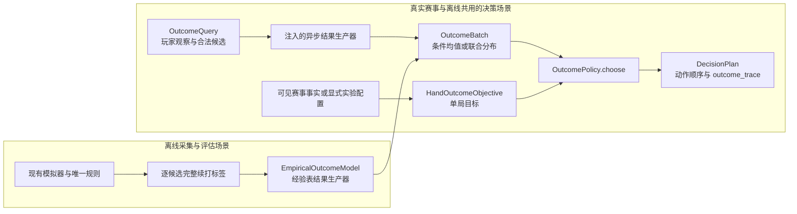

# 模型与赛事目标共享契约 outcome-v1

日期：2026-09-11。**本提交已实现最小生产类型、结果生产器、赛事目标消费、策略装配和审计往返。**这是两线独立开发的代码起点，不表示神经网络已训练、赛事目标已自动生成或策略强度通过验收。

## 1. 已冻结的调用关系

**`choose` 保持唯一线上入口，模型和赛事目标是它内部的两个独立输入。**新增调用通过 `bootstrap.build_outcome_policy` 显式装配，现有策略枚举和默认选择不变。

箭头表示数据传递；模拟世界与标签只存在于离线场景，真实赛事的模型只读取合法玩家观察。



经验表按完整观察摘要查找原始候选样本，真实计算均值或经验联合分布；只用于标签复核、离线结果重放和接入基线，不会向未见局面泛化。后续网络实现替换注入的 `OutcomePredictor` 函数，不改 `choose` 或复制审计格式。

## 2. 接口与语义

**所有结果预测当前单局剩余的四家积分，赛事效用只在消费时应用一次。**类型与每个字段的中文说明见 [kernel/outcomes.py](../../src/hangma_bot/kernel/outcomes.py)。

| 接触面 | 生产/消费入口 | 约束 |
| --- | --- | --- |
| 观察及候选 | [OutcomeQuery](../../src/hangma_bot/learning/outcome_model.py) | `PlayerObservation`、未拒绝的 `RuleCandidate` 元组及 `ruleset_version`；包含完整已有规则事实，不包含赛事目标、教师世界或结果标签 |
| 结果生产函数 | `OutcomePredictor = Callable[[OutcomeQuery], Awaitable[OutcomeBatch]]` | 整批调用；须合作取消，不得在事件循环里展开无界同步计算；部署前另测真实批量时限 |
| 观察身份 | [observation_key](../../src/hangma_bot/kernel/outcome_codec.py) | 对已有观察 codec 的完整 JSON 作规范 SHA-256，覆盖序号、牌河、副露和信息质量；只做绑定，不能作为学生特征 |
| 模型适用条件 | `OutcomeModelVersion` | 制品标识、规则上下文、特征/动作编码、数据、续打策略、对手、采样、校准、引擎提交及指南版本全部逐项匹配；续打标识包含其实际目标控制配置 |
| 条件均值 | `MeanOutcome` | 物理座位 0、1、2、3 的四家净增桌内积分；必须有限且零和，不携带尾部概率 |
| 联合分布 | `JointOutcome` / `OutcomeAtom` | 每项保存同一次四家变化及概率，保留相关性；单项概率在 `(0,1]`，总和为 1，不静默归一化 |
| 结果批次 | `OutcomeBatch` / `CandidateOutcome` | 观察身份和规范 `action_key` 绑定，顺序无关；重复键非法。缺覆盖不是零分，策略整批回退 |
| 目标 | `HandOutcomeObjective` | 本人期望净分、单局净增达到显式门槛的概率、或未知；门槛不是番数或晋级线，来源必填 |
| 目标计算 | [expected_utility](../../src/hangma_bot/competition/outcome_utility.py) | 均值只支持期望净分；门槛概率必须消费联合分布。结果不是另一个启发式奖金 |
| 装配和计划 | [build_outcome_policy](../../src/hangma_bot/bootstrap.py)、[OutcomePolicy](../../src/hangma_bot/policy/outcome_policy.py) | 组合根注入基线、保底、生产器、目标与时钟；仅通过原 `choose` 返回 `DecisionPlan` |

积分基准是应用候选首动作之前，到当前单局结束；必须包含本人未胡、他家胡和流局。后续单局与阶段排名不在该终点内。编码器可以在内部旋转座位，但输出必须还原物理座位顺序。零和数值容差为 `1e-7` 桌内积分，概率和容差为 `1e-9`。

`rules_hash` 使用纯函数 `rules_context_key(RuleConfig, rules_source_hash)` 生成，包含有效底分、开关及规则源码。组合根必须从实际运行规则传入配置/源码摘要，独立核对制品声明；不能让模型与“从同一模型复制的预期版本”自证兼容。有效规则配置改变后重新装配对应策略实例。

`outcome-v1` 每候选最多 256 项联合支持、每批最多 128 个候选，限制在线消费和审计工作量；超限拒绝，不静默删候选或截断分布。工作量上限不是毫秒时限保证。若未来分布表示需要改变，受控升级契约；不能只改制品让旧消费方猜测。

## 3. 预算、失败和审计

**先建立合法保底，再运行基线与可选增强；任何失败都不能延长原窗口。**

1. 预算已耗尽时直接返回已有紧急计划。基线异常、返回过期/非法/空计划时也回到紧急计划。
2. 可靠基线形成后，模型缺失、目标未知、规则版本不符、模型版本不符、观察过期或候选覆盖不全，恢复该基线候选顺序与原评分。
3. 模型之前、返回之后以及目标评分/计划构建之后都复核原增强截止时间。所有时间是单调时钟秒；外部取消向上传播，异步等待被取消，不转为正常成功。
4. 本版保留基线对立即胡牌的处理；没有新增为了赛事目标弃胡的分支。合法性仍由规则与应用层最终复核。
5. 模型生效时用结果效用替换评分，不与启发式分相加；目标未知恢复原基线全部风格。候选动作、紧急标记与明确拒绝过滤均保留。

`DecisionPlan.outcome_trace` 是新增可选字段。它保存 `applied/bypassed/fallback`、稳定原因、预期模型版本、实际目标以及已收到的合法结果批次。失败同时写入已有 `degraded_reasons`，不写异常原文。

[kernel/outcome_codec.py](../../src/hangma_bot/kernel/outcome_codec.py) 拥有版本 1 的嵌套结果格式；[application/audit_codec.py](../../src/hangma_bot/application/audit_codec.py) 把它接入生产计划格式。无增强时不输出新键，旧记录缺字段读为 `None`，原 codec 主版本不变；遇到不兼容的结果载荷版本仍明确拒绝。两个现有运行入口共享相同决策循环/codec，不另设私有审计格式。

## 4. 两线可以独立修改的位置

**模型线提供结果，赛事线提供目标，公共文件继续由集成人维护。**

| 工作线 | 独立开发范围 | 首个交付 |
| --- | --- | --- |
| 模型 | `learning` 内新的共享编码、网络、制品校验；`offline` 内标签/训练入口与数据 manifest | 新 `OutcomePredictor` 实现及未见牌山的预测/完整桌赛证据 |
| 赛事 | `competition` 内排名事实、来源适用性、自动目标；独立情景评测文件 | 从实际可见上下文生成目标，未知明确回退，并验证情景闭环 |
| 集成 | `kernel/outcomes.py`、结果 codec、`policy/interface.py`、共享策略、`bootstrap`、应用审计和公共驱动 | 收口跨线新增需求，避免两线各改一套类型 |

本版目标只覆盖单局积分终点。自动晋级压力、未来榜单截线、精确最后机会、跨场进度和阶段续局模型没有借此变成已实现事实。赛事线若需要这些能力，先用实际生产者/消费者提出后续增量；内部排名、情景与目标算法可以立即并行开发。

## 5. 验收证据

**契约用例使用人工积分情景，不是官方规则对拍，也不证明模型提高积分。**[跨线用例](../../tests/contracts/test_outcome_integration.py)直接运行经验表、目标计算、装配后的 `choose` 和生产审计，而不是仅检查类型字段。

关键情景：动作 A 各一半概率净增 `+12/-12`，动作 B 确定净增 `+3`。期望净分选择 B；单局净增至少 10 分的目标选择 A，概率为 0.5。均值版本不支持后一目标并恢复基线。这验证模型结果与目标分离、损失分支没有被忽略、目标只应用一次。

回归覆盖全部动作族、四座位顺序、候选顺序扰动、12 个版本字段逐项不兼容、实际运行底分/开关/源码错配、候选缺失/多余/重复、过期观察、未知目标、拒绝后重试、耗尽预算、超时/异常/外部取消、V0 冻结结果及新旧审计往返。源代码冻结与旧协议检查沿用原套件。

验证命令（在仓库根目录运行）：

```sh
PYTHONPATH=src .venv/bin/python -m pytest -q tests/contracts tests/unit/kernel tests/unit/policy tests/unit/application tests/integration/test_bootstrap_assembly.py tests/offline
```

2026-09-11 本机结果：**1,050 passed，2 subtests passed，16.88 秒**；其中新增跨线契约用例 56 项。`git diff --check` 与两份新文档的本地链接检查通过。验证未访问官方平台。

当前提交不需要官方测试房：规则和协议未修改，结果生产器不是正式在线模型。后续候选上线仍须验证真实 1 秒/3 秒预算、并发资源竞争和完整赛事指标，并由人审核发布。
