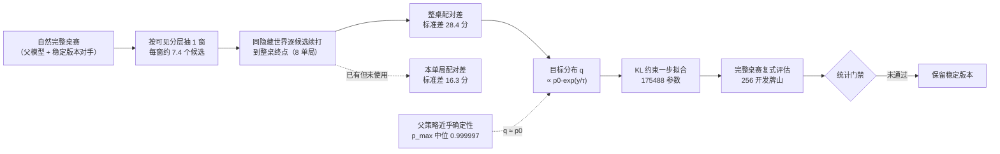

# 模型训练独立审计：outcome-v1 批次的方法、数据与评估

日期：2026-09-13。审计对象：分支 `codex/model-outcomes-v1`（工作区 `.team-work/model-outcomes-v1`）在 2026-09-12—09-13 的全部模型训练工作，以及正在运行的 `portable-label-scale-4352-v1` / `portable-policy-scale-4352-v1` 批次。

## 1. 结论

**工程实现是可信的；当前这一步训练在开跑之前就被决定了结果。** 三条彼此独立的证据指向同一处：训练信号在标定层面已接近零，标签方差约为必要信号的三倍，而评估设计的可检出下限高于历史效应量一个量级。因此本次全部"未证明改善"的结论都不能读作"模型路线无效"；同样，正在运行的 2048/4096 批次若不改口径，也预期得到第三个不可判定的结果。

| 编号 | 发现 | 证据强度 | 影响 |
| --- | --- | --- | --- |
| F-1 | 目标分布 q 几乎等于父分布 p0，训练信号在标定层面被压到零 | 强（项目自有产物 + 抽样复算） | 扩数据、放宽更新约束都不会改变结论 |
| F-2 | 标签用整桌配对差，方差是"本单局配对差"的 **3.03 倍** | 强（本审计独立复算） | 现成可修，零模拟成本 |
| F-3 | 正式评估的最小可检出效应（MDE）高于观测量级 | 强（对已封存 `report.json` 复算） | 128/256 根开发比较在事前不可判定 |
| F-4 | 冻结契约与训练实现存在三处漂移 | 强（契约文本 + 代码） | 结果模型主线实际未被验证过 |
| F-5 | 440 场官方赛后牌谱（含榜单玩家 37,402 次弃牌）未用于模仿学习 | 强（主仓实测计数） | 未使用的真实专家数据资产 |

以下每条都给出"当前观察"与"待确认假设"的分界，不把推断写成事实。

## 2. 审计范围、方法与证据分级

**本次审计全程只读**：未修改任何被封存产物，未启动新的模拟，未干预运行中的进程。唯一写入是本目录之外新增的复现脚本与本文档。

| 证据等级 | 含义 | 本文中的用法 |
| --- | --- | --- |
| A：项目自有产物 | 训练/评估流程自身写出的 JSON、字节封存记录 | F-1 的主证据、F-3 的全部数字 |
| B：本审计独立复算 | 直接读取已封存产物重算，未采信文档结论 | F-2 的全部数字、F-3 的区间与 MDE |
| C：抽样测量 | 在已冻结的公共包上重跑前向，样本量有限 | F-1 的 KL 分布（标注样本量） |
| D：推断 | 由以上事实得出的判断 | 第 10 节建议、第 11 节待确认假设 |

**时间基准**：本文所有 Unix 秒为 UTC 秒；本机时钟为 CST（UTC+8）。所有耗时字段为单调时钟秒。

## 3. 当前实际运行状态（截至 2026-09-13 23:54）

| 任务 | 进程 | 状态 | 证据 |
| --- | --- | --- | --- |
| 分布式反事实标签生成 | PID 92560 | **运行中**，68/272 片、1094 根 | 持有 `pipeline.lock`、status 秒级刷新、分片计数增长 |
| 固定数据训练消费者 | PID 92598 | **存活但空转**：`state=waiting_for_fixed_dataset`，68/144 片 | 持有 `process.lock`，无训练步骤执行 |

- 新片实测约 **2.35 分钟/片**；到 2048 规模点（144 片）约 3 小时，跑完 4096（272 片）连训练与评估约 9–10 小时。以上是外推，不是承诺。
- 前 68 片是 2026-09-13 因 `[Errno 32] Broken pipe` 失败后的复核复用，不是新生成量。
- **本批正式拟合尚未开始**；此前所有"模型终点"都来自更早批次。

**2026-09-14 更新（本文档写完后本批已完成）**：生成队列 272 片全部完成，消费者正常退出，2048 与 4096 两个规模点的训练与完整桌赛比较均已封存：

| 候选 | 三家 V2 池 | 同时 95% 区间 | 混合池 | 同时 95% 区间 |
| --- | ---: | --- | ---: | --- |
| 2048 投影方向 | **+3.330** | [−0.868, +8.052] | +1.275 | [−2.804, +5.649] |
| 2048 直接方向 | +2.633 | [−1.290, +7.099] | +1.780 | [−2.442, +6.442] |
| 4096 投影方向 | +2.367 | [−1.777, +6.774] | +2.859 | [−1.736, +7.607] |
| 4096 直接方向 | +2.346 | [−1.699, +6.861] | +2.628 | [−1.774, +7.315] |

八项主要比较的同时区间全部跨零，与本文档的核心判断一致。**但本文档第 4.3 节的两条具体预测有一条被否证，见该节更新。** 完整结果见 `.team-work/model-outcomes-v1/review/portable-policy-fit-2026-09-13/RESULTS-2048.md` 与 `RESULTS-4096.md`。

## 4. F-1：训练信号在标定层面被压到零

### 4.1 事实

当前目标分布为 `q ∝ p0 · exp(y / τ)`，其中 `p0` 是父模型在合法候选上的 softmax，`y` 是配对积分差除以 100，`τ = 0.39903145135754586`。损失为 `KL(q‖new) + 0.1·KL(p0‖new)`（projected 方向）或 `KL(new‖q) + 0.1·KL(p0‖new)`（direct 方向）。

**A 级证据（项目自有产物 `train-opportunity-1280.json`，1280 训练根、20900 窗）**：

| 字段 | 值 | 含义 |
| --- | ---: | --- |
| `oracle_changed_windows_at_current_penalty` | **198 / 20900** | 把**真标签**交给逐窗理想优化器，当前惩罚下也只能改变 0.95% 的窗口 |
| `actual_changed_windows` | 159 | 实际拟合改选数已接近这个上界 |
| `nearest_positive_prior_margin.weighted_mean` | 32.19 | 要让正标签候选反超，父 logit 间距的中位量级 |
| `beta_needed_for_any_positive.weighted_mean` | **412.24** | 让任一候选有机会反超所需的逆温度 |
| `beta`（实际） | **2.506** | 与实际需要的值相差约 **165 倍** |

**C 级证据（抽样复算 673 窗，覆盖 train/development 多分片）**：平均 `KL(q‖p0)` = 0.0096 nats（≈ 校准目标 0.01，说明标定被忠实执行）；中位数为 **0**；仅 **37.1%** 的窗口有非零梯度；**93% 的 KL 质量集中在前 5% 的窗口**；argmax 翻转率 **0.89%**。样本为单根抽样，非全量，但两组独立抽样（673 窗 / 183 窗）结论一致。

### 4.2 判断

根因不是数学错误（六个解析与数值断言都通过），而是**父策略已经熵坍塌**：父模型最大概率的中位数为 0.999997，候选间 logit 间距中位约 48 nats，而 τ 被标定为"根等权平均 KL(q‖p0) = 0.01"这一极小预算。一个几乎确定性的策略，加上一个极小信赖域，改进算子在结构上无路可走。

这一条同时解释了全部已观测现象：

- 训练牌山 320 → 640 → 1280，改选窗 47 → 82 → 159，桌赛点估计没有单调上升；
- 更新约束 0.01 → 0.04，改选 159 → 328，桌赛点估计反而为 −0.90 / −2.46（区间仍跨零）——**改动更多、损失更低，没有转成积分**；
- 训练侧静态标签 +0.2456 分/窗，开发侧仅 +0.00056 分/窗（相差 438 倍），说明拟合到的主要是单世界噪声。

### 4.3 对运行中批次的含义（D 级推断）

本批把可训练参数从 8320（动作头）扩大到 175488（全策略路径）、步数从 800 提高到 3072/6144，但**没有改变 q 的构造与 τ 的标定**。据此推断：改选窗会增加（与 0.04 实验同向），完整桌赛区间仍会跨零，且方向可能偏负，因为更大容量会把梯度集中拟合到那 5% 高方差窗口上。**该推断可由第 10 节 P0-4 的只读诊断在数分钟内证实或否证。**

**2026-09-14 结果核对（自我否证部分）**：本批完成后逐条核对本文档的预测——

| 预测 | 结果 | 判定 |
| --- | --- | --- |
| 完整桌赛同时区间仍会跨零 | 8/8 项同时区间跨零 | **成立** |
| 改选窗口会增加 | 改选率反而下降：1280 为 159/20900 = 0.76%，2048 为 188/33787 = 0.56%（直接）、166/33787 = 0.49%（投影），4096 为 354/67038 = 0.53%、378/67038 = 0.56% | **否证** |
| 点估计方向可能偏负 | 八项点估计全为正（+1.28 ～ +3.33） | **否证** |

因此 F-1 的**结构结论**（目标分布 q 几乎等于 p0，故不可能产生可测效应）在本批得到支持，但由它推出的**两条行为预测是错的**。需要特别记录一点：老 128 根开发集上，训练前父模型本身相对 V2 就有约 **+1.69** 分/桌（由 320/640/1280 三档的 `P−R − (P−I)` 一致反推），所以"训练候选对 V2 的点估计为正"并不需要任何训练增益就能出现。本批没有运行父模型对照，因此不能把正点估计归因于本次拟合——这一点项目文档已自行声明。

## 5. F-2：标签方差是必要信号的约 3 倍

### 5.1 事实（B 级，本审计独立复算）

`generate.py` 的 `target()` 同时保存了 `current_returns_by_seat`（到本单局结束）、`future_returns_by_seat`（后续单局）与 `paired_returns_by_seat`（整桌），并断言三者满足分解恒等式。但 `student_data.convert()` 抽取学生包时**只保留了整桌配对差**。

在 160 个原始根、2610 窗、19528 条分支上按同一恒等式分解（复现见第 12 节）：

| 分量 | 标准差（分） | 平均绝对值（分） |
| --- | ---: | ---: |
| 本单局配对差 | **16.30** | 8.37 |
| 后续单局配对差 | 23.34 | 9.58 |
| 整桌配对差（**当前训练使用**） | **28.36** | 13.85 |

- 方差份额：本单局 32.8%，后续单局 **67.2%**。
- 整桌方差 ÷ 本单局方差 = **3.03 倍**。
- 在 1088 个学生根、133534 条候选标签上：整桌配对差标准差 30.12 分，**51.87% 的标签恰好为零**，**18.10% 的窗口全部候选标签为零**（这些窗口对梯度贡献恒为零）。

### 5.2 判断

单局之间是重新发牌的，对"当前这一手该怎么打"的因果相关性主要落在本单局；后续 7 个单局贡献了约三分之二的标签方差。改用本单局配对差可把标签方差降到约三分之一，**且不需要任何新的模拟**——原始分支记录 `nodes/*/results/roots/*/cases.jsonl.gz` 仍在盘中。

需要同时指出两件事，避免过度承诺：

- **这只是降方差，不是无偏化。** 单世界标签仍然是"该隐藏世界下的确定反事实差"，不是可见信息条件下的期望遗憾值；跨单局的庄家归属耦合（本单局谁胡决定下一单局谁坐庄）也确实是真实效应，改用本单局口径会把它丢掉。
- **指数非线性仍然存在。** `q ∝ p0·exp(y/τ)` 用到的是 `exp` 的单样本估计，由 Jensen 不等式，`E[exp(y/τ)] ≥ exp(E[y]/τ)`，高方差候选被系统性高估；实测单窗最大倾斜达 `exp(y/τ) ≈ 6609` 倍。

### 5.3 与冻结契约不一致（当前观察）

`model-competition-contract-v1.md` §2 写明积分基准是"应用候选首动作之前，到当前单局结束"，并明确"不包含后续单局"。但训练实际使用的 `paired_returns_by_seat` 是整桌口径。二者不一致，而实现恰好选了方差更大的那个。

## 6. F-3：评估设计在事前不可判定

### 6.1 事实（B 级，对已封存 `report.json` 复算）

三次规模比较的实际结果（完整桌赛本人桌内积分差，同时 95% 区间按 12 项 Bonferroni 校正）：

| 比较 | 对手池 | 320 根 | 640 根 | 1280 根 |
| --- | --- | ---: | ---: | ---: |
| 候选 − 稳定版本 V2 | 三家 V2 | +0.86 [−4.68, +6.62] | +1.70 [−3.86, +7.82] | +1.56 [−3.76, +7.22] |
| 候选 − 稳定版本 V2 | 混合 | +2.46 [−4.20, +9.05] | +3.39 [−3.53, +10.11] | +3.08 [−3.60, +10.12] |
| 候选 − 训练前父模型 | 三家 V2 | −0.84 [−4.31, +2.92] | +0.00 [−3.41, +3.59] | −0.14 [−3.51, +3.19] |
| 候选 − 训练前父模型 | 混合 | −0.26 [−4.62, +3.96] | +0.67 [−2.98, +4.65] | +0.36 [−2.49, +3.18] |

**12/12 同时区间跨零，12/12 连未校正的边际区间也跨零。** 根级标准差实测为 21.4–23.2 分（三家 V2 池）与 26.6–27.4 分（混合池），约为规划值的 2 倍。

按 `MDE = (z_{α/2} + z_{功效}) × sd_根 / √N`（80% 功效）：

| 开发根数 | 三家 V2 池（边际 / Bonferroni-12） | 混合池 |
| --- | ---: | ---: |
| 128（本轮三次规模比较） | 5.5 / **7.2 分** | 6.8 / 9.0 分 |
| 256（**正在运行的批次**） | 3.9 / **5.1 分** | 4.8 / 6.4 分 |
| 512（预留确认牌山） | 2.7 / 3.6 分 | 3.4 / 4.5 分 |

而实测效应量级只有 +0.86 ～ +3.39 分。**检出 +2 分（三家 V2 池）约需 900 根（边际）到 1600 根（Bonferroni-12）。**

### 6.2 判断

- 这四次"未证明改善"**不能**读作"模型没有用"——设计本身测不出这个量级。
- 本轮的核心科学问题（"增加训练牌山到底有没有用"）**从未给出区间**：补算的配对对比为 640−320 = +0.84（三家 V2）/+0.93（混合），1280−640 = −0.14/−0.31，全部跨零。
- 同一个 128 根开发集 `264012000–264012127` 已被至少四个批次消费（`model-scale-curve-v1`、`constraint-budget-kl004-v1`、`representation-scope-evaluation-v1`、`weighted-projection-evaluation-v1`），累计 ≥24 项主要比较，而各批只按 4 或 12 做族校正，**campaign 级多重性未计**。目前尚无阳性结论，因此已发表结论未被污染；但在该机制下任何未来的阳性结论都不可信。
- 512 个确认牌山是"保留地"而非数据：它**不在本批配方内**（`recipe.json` 无 confirmation 段），从未生成；要真正独立确认需另发一份配方。
- 结果分布重尾：单桌配对差标准差 42–46 分、峰度 8–18，个别配对 |Δ| 超过 200 分。少数桌赛主导均值（0.04 实验中 74% 的均值来自 2/128 根），**任何"某档更高/更低"的解读都不可靠**。

### 6.3 与 AGENTS.md §7 门禁的对照

| 门禁项 | 判定 |
| --- | --- |
| 复式评估（同牌山 + 换座位） | 满足 |
| 完整桌赛（运行时 `config.Rounds`） | 形式满足，但评估代码写死 8，未读运行时配置 |
| 统计单位为完整桌赛 / 牌山 | 满足（以牌山为聚类单位） |
| 聚类 Bootstrap 置信区间 | 满足（24000 次，根聚类） |
| 先声明后检验 | 满足（`evaluation_precommit` 随提交 `c761925` 落地，早于首个候选评估） |
| 实际阶段格式 / 官方测试赛事门禁 | **未做** |
| 人审与发布 | **未做**，全部产物 `release_gate=false` |

## 7. F-4：冻结契约与训练实现的三处漂移

| 漂移 | 契约/方案怎么写 | 实际怎么做 |
| --- | --- | --- |
| 训练终点 | `model-competition-contract-v1.md`：预测到**当前单局**结束 | 使用**整桌**配对差（见 5.3） |
| 方法主线 | 启动计划：`CandidateOutcomeModel`（预测四家积分结果）+ `competition`（赛事效用）两层 | 实际做的是**一步式 KL 正则策略改进**；价值头被冻结且在损失中完全未使用（`fit_core.py` 只取 `logits, _`） |
| 结果模型是否有效 | 契约要求先验证预测与校准 | 上一轮 PPO 的实测是"价值头均方误差 0.0802，线性基线 0.0755，零预测 0.0779"——**价值头误差尚未优于零预测** |

第二条值得单独强调：**结果模型这条主线（也就是启动计划认定的主方向）到目前为止一次都没有被真正验证过**。当前所有算力都投在一层更激进、也更难成功的一步改进算子上。

## 8. F-5：未使用的真实专家数据资产

**当前观察（主仓实测计数）**：`datasets/leaderboard/game-annotations.jsonl` 与 `datasets/derived/auto-match-rooms-2026*/official/**/events.json.gz` 中存在：

| 项目 | 实测 |
| --- | ---: |
| 官方场次（含完整事件流） | 440 |
| 单局数 | 7,810 |
| 弃牌决策总数 | 131,673 |
| 其中由榜单标签玩家打出 | **37,402**（21 位不同玩家） |
| 至少含一名榜单标签玩家的场次 | 340 |

这些比赛含"总榜16强""总榜32强""胡大牌榜32强"等标签的对手，且事件流与 Bot 线上消费的是同一套官方协议。

**当前实际用法**：只用过**我们自己座位**在自由房的 13,916 条决策（`real-model-2026-09-11`），两轮结果 −28.3 / −14.8 分/桌，均未通过门禁。**对手（专家）的动作从未被用于模仿学习。**

方法学对照：Suphx（[arXiv:2003.13590](https://arxiv.org/abs/2003.13590)）与 Mortal（[Equim-chan/Mortal](https://github.com/Equim-chan/Mortal)）的第一阶段都是**从人类牌谱做大规模监督学习**，再叠加策略改进；本项目的模型线是从自己的启发式自举（父模型 = 自己上一轮终点，对手 = 稳定版本 V2）。这不是说照搬日麻流程就能提升杭麻，而是说**当前没有任何真实强者的先验进入训练**。

**真实环境的效应量参照**（项目自有复盘，同为我方实测）：

| 版本 | 对手环境 | 每完整桌赛净分 |
| --- | --- | ---: |
| 稳定版本 V2 | 冻结 40 房真实对手 | **+11.02**（聚类区间 [6.92, 14.82]） |
| v2_hu_upgrade_v1 | 夜间战役 47 房真实对手 | +3.43（区间 [−0.19, 6.95]） |
| 等胡实验（127 个弃胡窗口） | 真实对局 | **+4.1 分/场**（2,186 分立即胡反事实兑成 4,100 分实际） |

对比之下，模型线三天、四种方法、上百万次模拟动作的最大点估计是 +3.39 分且不显著。**等胡这一项针对性的启发式改动，在真实环境取得的可证实收益高于模型线至今的全部产出。**

## 9. 信号衰减链

下图说明的是本审计的核心机制：从自然桌赛到最终评估，信号在每一步被削弱，箭头表示数据流方向。子图分别标出"离线标签生成""离线拟合""离线评估"三个场所；真实赛事不在本图内，它只接收通过统计门禁的候选版本。

## 10. 改进建议

### P0：今天可做，分钟级，只读

1. **在每份训练/评估报告里补 MDE、符号检验 p 值与截尾均值**，并在文档口径上正式区分"未检出"与"无效果"。用已封存的 `root_values` 即可计算，无需重跑。
2. **补规模对比的区间**（640−320、1280−640），并把 3 个嵌套对比计入家族大小（12 → 15）。这是本轮的核心科学问题，目前报告里没有答案。
3. **建立 campaign 级多重比较记账**，任何阳性主张只在未消费的确认牌山上判定，并在看到结果前冻结"最小有意义积分差"（建议 2 分/桌，对应约 900 根边际）。
4. **在消费者真正开训前，先跑一次只读诊断**：对当前 2048 根数据计算 `KL(q‖p0)` 分布与"oracle 改选窗数"。若仍为 ~1%，则本批在结构上不会产生改变，可据此决定 4096 那一步是否值得再花 5 小时生成。

### P1：本周，不改模拟，成本极低

5. **用 `current_returns_by_seat` 重抽学生包，同配方重训一次**。零模拟成本（学生抽取本身就是秒级），标签方差降到约三分之一，等效于约三倍数据。
6. **重标定 τ，并抑制指数倾斜**。不要再用"根等权平均 KL = 0.01"（该口径是平均值，而中位数为 0，约束只在少数窗口生效）；改为按"能让 X% 的窗口改选、且这些窗口的标签可复现"标定，并对 `y` 做截断或按分组方差加权。
7. **正面处理父策略熵坍塌**。`p_max` 中位数 0.999997 意味着改进算子无路可走，任何 τ 调参都绕不过。可选：改用以行为初始化模型（交叉熵 0.163，分布明显更软）为锚，或在生成端用采样而非 argmax。
8. **把 `full_replay` 对照从 10 根扩到约 90 根分层根**（含白板 ≥3 与杠窗），成本约 75 CPU-分钟。当前 4342 个根没有"关闭自然参照复用"的对照，而复用在代码上等于移除了"参照分支必须复现自然轨迹"这条断言。
9. **多白与庄家覆盖**：实测白板 = 4 仅 10 窗 / 4 根 / 0.0447% 权重，**白板 = 4 且本人坐庄为 0 个窗口**。要么在策略层显式声明该分支走降级并记录，要么另建条件配方并把每层上限提高几个数量级——指望自然采样永远不会覆盖。

### P2：方向层面，需要人决策

10. **重新审视"启发式已到头"这一结论的适用范围。** 该结论在"无界搜索启发式参数"意义上成立，但等胡实验在真实环境取得的 +4.1 分/场大于模型线至今的全部产出。建议保留一条小规模、走统计门禁的启发式通道，而不是把全部算力押在模型线上。
11. **用 440 场官方赛后牌谱建立"强者模仿"数据集**，先做一次行为初始化 + 复式评估。它是当前唯一完全没用上的真实专家数据，同时能提供不依赖 128 根模拟桌赛的判别信号（与榜单玩家的动作一致率、分歧分布）。
12. **打通评估通道**：目前没有任何候选能走到人审或官方测试赛事，而本地 8 单局桌赛既非官方阶段格式、也没有判别力。项目已有盯盘工具与 40 + 47 房真实对局数据，建议把**真实环境受控 A/B** 正式接进门禁。

### 对已完成的扩量批次（2026-09-14 更新）

本批已全部完成，因此原"是否值得跑 4096"的建议不再适用。事后判断：

- 2048 规模点给出了比老 128 根更强的开发精度（256 根、5376 桌），有正面价值；
- 4096 相对 2048 的配对诊断四项区间均跨零（直接方向三家 V2 −0.29、混合 +0.85；投影方向三家 V2 −0.96、混合 +1.58），**没有支持继续机械倍增**，项目文档已自行声明不追加 8192；
- 下一步建议集中在 P1-5 至 P1-7（标签口径、τ 标定、父策略熵坍塌）与 P2-11（真实牌谱模仿），而不是继续扩大同一父模型的分支数据。

## 11. 待确认假设

以下均为 D 级推断，尚未验证，不应作为既定事实引用：

1. 正在运行的批次会再次得到跨零区间，且方向可能偏负。（可由 P0-4 的诊断与最终评估否证。）
2. 改用本单局配对差会改善开发侧标签收益，并最终改善完整桌赛积分。降方差是确定结论，**积分改善不是**。
3. 父策略熵坍塌是当前的主要瓶颈；重新标定 τ 或更换锚定分布能让改进算子重新获得移动能力。
4. 用 440 场官方赛后牌谱做行为初始化，能比从启发式自举得到更好的起点。该假设需要先验证观测可完整重建、超时记录占比可接受、以及榜单玩家决策量是否足以训练。
5. 真实环境受控 A/B 能在可接受的对手波动下分辨 1–2 分/桌的差异；这一点本身需要设计（现有复盘已显示同一策略跨池差异可达 10–54 分/场）。

## 12. 复现与产物位置

- 标签方差复现脚本与实测数值：`.team-work/model-outcomes-v1/review/independent-training-audit-2026-09-13/`（`label_variance.py`、`README.md`）。该目录不参与活动训练依赖，也不被冻结方法哈希引用。
- 本条结论依据的原始产物：`.team-work/model-outcomes-v1/artifacts/model-outcomes-v1/evaluations/` 下的 `portable-label-scale-4352-v1/`、`portable-policy-scale-4352-v1/`、`model-scale-curve-v1/`、`constraint-budget-kl004-v1/`。
- 本轮审计新增文件不改变任何封存哈希：`student_data.load` 比对的是 `src/**/*.py` 的源哈希，冻结方法引用的是逐个列名的依赖文件，均不扫描 `review/` 目录。

## 13. 与同期独立评审的关系

本文写作期间，主仓出现另一份独立评审 [`review/training-direction-deep-research-2026-09-13/REPORT.md`](../../../review/training-direction-deep-research-2026-09-13/REPORT.md)（非本次审计产出）。两份文档结论方向一致、重点不同，应合读。

**共同结论**（两份独立得出）：

| 结论 | 本文证据 | 该报告的独立证据 |
| --- | --- | --- |
| 策略网络已接近确定性，改进算子缺少移动空间 | `train-opportunity-1280.json`：oracle 改选上界 198/20900；β 需求与实际相差约 165 倍 | 在线记录 62218 个窗口最大动作概率 ≥ 0.999；价值解释方差约 −0.35 |
| 单世界标签不能当作精确动作价值 | 整桌配对差标准差 28.4 分、51.87% 恰好为零 | 单世界结果先指数化与先估条件均值的差异（给出可算反例）；积分目标方差 0.0898，其中后续单局部分 0.0681 |
| 采样重加权改变了被优化的观察分布 | 分层每层抽 1 窗 + 根内 0.5 自然 / 0.5 分层等权 | 对同一采样器的独立审计 |
| 1–2 分/桌量级的改进需要约 900–1000 个独立牌山 | 由已封存 `report.json` 复算的根级标准差与 MDE 表 | 按近似标准差 22 分的规划计算：检出 2 分约需 949 根 |
| 不能把工程进展与计算规模当成学习进展 | 第 6 节 MDE 表与规模对比的跨零区间 | 其"总体判断"表与第 10 节 |

**分工不同**：该报告是**方向评审**，主张聚焦机制假设与文献对照；本文是**独立审计**，逐条对已封存产物复算并给出可复现脚本，重点在 F-1 至 F-5 五项可验证事实。

**一处明确分歧**：该报告建议"已冻结的 2048／4096 根实验值得完成"，本文建议先做第 10 节 P0-4 的只读诊断再决定 4096 是否值得跑。分歧点是一个可检验的事实问题——当前 2048 根数据的目标分布 q 相对父分布 p0 究竟有多少窗口真正不同。该诊断只需数分钟、不改动冻结方法，建议以它的结果为准，而不是以任何一方的判断为准。
