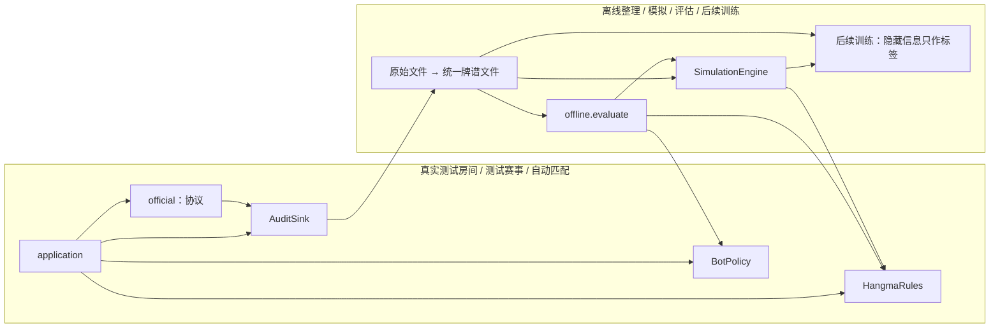

# 并行开发契约 parallel-v1

> 日期：2026-09-05。状态：本次约定的实施基线，运行代码尚未实现新增部分。
> 源码基线：`c17ce0618d17476526bfe8b2f69a19f11b19fb82`，已包含 `7768789` 规则/原文留存修复与 `631c85b` SSE/重复提交修复。
> 本文件定义各工作线共同消费的契约；模块内部结构由各负责人决定。版本清单见 [parallel-v1.json](./contracts/parallel-v1.json)，分工与委派文本见[并行施工导航](./parallel-workstreams.md)。

## 1. 已确认现状与契约范围

先复用现有能力，不重复建设。以下是本机证据，不推广为尚未测过的条件也已通过：

| 事实 | 依据与实际边界 |
| --- | --- |
| 规则及适配器问题已修复，测试房间通过 | [四线验收](./reviews/test-room-acceptance-result-2026-09-05.md)：M=2/Rounds=16、claim_if_legal；[后续验收](./reviews/adapter-wave-verification-2026-09-05.md)：SSE 开启的局中接管，重复 pass/hu 误报均为 0。不是新版 M=10 全程验收 |
| 原文与观察快照已经留存 | `recording/raw_events.py`、`decision_loop._observation_snapshot`；观察摘要没有完整牌河/公共历史，仍须补完整决策输入 |
| SSE 是水位通知 | [SSE 集成笔记](./notes/sse-runtime-integration.md)：收到通知再 GET /state；不是完整业务事件流；配置默认关闭 |
| 完整下载有真实样本 | [夹具说明](../../tests/fixtures/hangma/README.md)：v14、2026-09-05；三个 archived-rooms JSON。一个单局分多个 block，后续 block 的四家 start_hands 为 null；batch 会重号，game_id 不同 |
| 样本无完整未来牌墙 | 上述样本没有完整 wall；首块起手张数为 14/13/13/13，首事件已经是弃牌。不能凭空拆出庄家第 14 张的摸牌身份 |
| 自由赛即自动匹配池 | 用户本次确认 `/api/match`。依据[API §2.6](../official-platform-api-v2.md#26-自动匹配post-apimatchv12-起v13-全自动语义v15-默认配置上调)、v15/2026-09-05 快照；需全局 Token、默认 M=10/Rounds=8，不能调用 register/ready |

冻结四类接触面：现有线上类型、统一牌谱文件、模拟模块公开方法、评估结果文件。审计格式的私有原文、模拟世界内部字段、评估统计实现和自动匹配内部状态机不要求其他线理解。

## 2. 依赖方向和唯一所有者

箭头表示调用或数据消费方向；隐藏信息只能在离线边界内部存在。



- `kernel` 原有值对象与编解码不变；`PlayerObservation`、`Action`、`RuleAnalysis`、`DecisionRequest/DecisionBudget/DecisionPlan` 为唯一对应运行类型。
- 审计线拥有 `offline/replay.py` 和官方牌谱转换；对外通过本文件规定的 JSON 数据交付。模拟、评估不得导入转换器私有函数。
- 模拟线拥有 `WorldState` 和 `simulation/interface.py`；评估只调用下面的公开方法，不读 WorldState 字段。`WorldState` 不能传给策略。
- 评估线拥有 `offline/evaluate.py`；只读牌谱，通过公开规则、策略和模拟接口做实验，不成为新的规则来源。
- 自由赛线拥有新匹配协议和生命周期，不新增策略接口或牌谱格式；复用既有单场运行循环和审计。
- 组合根、已有共享类型与规则接口的改动由主审集成；文件认领见[施工导航](./parallel-workstreams.md#3-文件所有权)。

## 3. 现有类型口径：冻结语义，不复制同名模型

### 3.1 玩家观察与规则输入

`kernel.serialization.observation_to_json/from_json`、`action_to_json/from_json`、`competition_to_json/from_json` 是权威编解码。新增工具调用公开函数；不再手抄 PlayerObservation 字段，不使用 pickle。

当前存在两种已兼容的手牌形态，见[接口协议 F-11](./interface-contracts.md)：官方 my_hand 可能已包含 drawn_tile，历史内部输入也可能不含；hangma 和 policy 已做防双计。审计保存实际输入原样；本次不顺手改线上形态。模拟模块生成的新观察固定使用“my_hand 不含独立 drawn_tile”的既有内部形态，并保持手牌顺序；对比官方观察时只通过现有语义归一化比较牌张，不能直接追加 drawn_tile 两次。

模拟全信息只用于构造指定座位观察与标签。相同玩家观察下，替换未公开手牌/未来牌墙不能改变交给策略的 request。规则收到的本人规则状态由唯一规则实现推进，不能从未来结果反推。

### 3.2 策略与预算

`await BotPolicy.choose(DecisionRequest, DecisionBudget) -> DecisionPlan` 保持不变。策略永远只排序规则候选。线上由 application、离线由评估器组装请求；两个调用方都先准备紧急动作，再运行增强。

2026-09-05 增量：可选 `weighted_heuristic_v1` 已实现可靠分层排序，旧 `weighted_heuristic` 保留。消费方按计划 rank 执行/展示，不能自行按 total_score 重排；数值总分仍等于评分分项之和。详见[接口协议 §4.2](./interface-contracts.md#42-v1-策略排序语义2026-09-05)。这是策略选择语义登记，函数签名、JSON 格式及规则事实不变。

离线行为实验使用注入时钟和确定的预算平移，不把不同机器的单调时钟直接相减；硬件耗时基准另跑实时时钟。每项实验标注 `clock_mode=logical/real`。逻辑时钟实验不能证明 1 秒窗口性能。

候选牌效事实类型保持不变。2026-09-06 已登记本地分析语义 `hangma-mvp-v2-pass-progress`：响应 Pass 携带当前等待 `HAND_PROGRESS`，冻结策略适配与回归见接口协议 §4.3。policy 仍只消费事实；规则不含策略评分，审计保持原始事实与实际计划理由。

V2 可选预设 `weighted_heuristic_v2` 已按接口协议 §4.4 实现，复用原 `BotPolicy`、权重字段和审计/模拟/评估格式；线上默认不切换。V2 的正式效果评估需独立冻结样本；实现冒烟不构成发布资格。

### 3.3 本次批准的增量扩展

四个外部接口的函数签名保持不变，以下词表扩展由指定线提出、主审集中集成，不能遗漏 Fake 与旧调用方：

- 审计：新增 DECISION_INPUT、CANDIDATE_VALIDATED、DECISION_ENDED；原信封/raw 主版本不变，以 capture_profile=audit-plus-v1 开启新校验。新增字段用 audit_producer，不能覆盖 raw 的 source。详见[审计 §3](./audit-enhancement.md#3-记录接口与字段)。
- 自动匹配：新增 RuntimeMode.AUTO_MATCH；仅该模式允许 RuntimeTarget.expected_tournament_id 为空表示尚未发现房间，非空表示恢复指定房。成功后的 SessionBootstrap 必须有已核实的真实 room_id。增加 MATCHING_UNAVAILABLE、CAPACITY_LIMIT 两个终态原因，旧模式仍不接受全局 Token。详见[自由赛 §2](./free-match-start.md#2-最小实现与接缝)。
- **受控语义例外**：仅 OfficialAutoMatchSession.initialize 在显式 AUTO_MATCH 模式且目标为空、确认无已有自动房归属时，允许一次 match 入席操作；旧 initialize 仍为无报名/到位副作用的发现。自动房不通过 register/ready。这是已登记的接口语义扩展，不能仅按“签名没变”当成兼容性自动成立，必须升级模式契约测试和 SessionBootstrap 注释。
- 原文来源新增 match_response，采用现有 payload_schema_version=1；完整 builder 与 validator 同提交，不能只放宽验证不记录内容。

新增 codec、模拟具体类及文件规范是本批实际任务的产物；不增加泛化 Registry、ReplayPort、SimulationPort 或训练空目录。

## 4. 数据身份、来源及版本

### 4.1 统一单局键

本地阶段尝试 UUID 不用于跨进程身份。冻结：

```python
def hand_id(source_namespace: str, tournament_id: str,
            game_id: str, round_no: int) -> str:
    """从权威场次身份生成跨机器稳定单局标识，不包含本地 run/attempt。

    将四项按给定顺序编码为 JSON 数组：ensure_ascii=False、
    separators=(',', ':')、allow_nan=False，再取 UTF-8 SHA-256 全长十六进制，
    前缀 hand-。前三项是非空字符串且不做 strip/大小写改写；
    round_no 是排除 bool 的正整数，牌谱缺失时不得猜测；错误输入抛 ValueError。
    """
    ...
```

`source_namespace` 是部署配置中的逻辑平台实例名，同一官方平台跨地址/节点保持相同，例如 `hangma-official`；模拟使用单独名称。不是 Token、主机名或 Git 分支。`tournament_id` 对测试房间取响应 room_id。直接使用返回的完整 game_id，不解析其命名规律；batch 只作下载定位，不能当场次身份。

模拟导出固定 `source_namespace=hangma-simulation`、`tournament_id=MatchSpec.scenario_id`、`game_id=MatchSpec.match_id`；同牌山候选/换座变体使用不同 match_id、相同 scenario_id 和 split_group_id。模拟内部单局号仍是正整数。单局重导入保留源 hand_id，新的策略分叉实验生成新 match_id 并保留 parent_hand_id，不能覆盖原结果。

若观察到平台在相同 namespace 下复用完全相同 game_id/round_no，却有冲突的起手/结果，导入报告身份冲突，不按最后一份覆盖；经证实是平台实例重置后由运行配置切换 namespace。

映射文件 `index.jsonl` 每行固定：

| 字段 | 类型和含义 |
| --- | --- |
| `hand_id` | 上述算法生成的字符串 |
| `source_namespace/tournament_id/game_id/round_no` | 权威原始键；round_no 为单局号 |
| `views` | `{run_id, participant_id, seat, local_stage_attempt_id}` 数组；seat 按观察/官方座位表确认，为 0—3；attempt 可空 |
| `official_refs` | `{file_sha256, json_pointer, room_id, batch}` 数组；不依赖原机器绝对路径，batch 可空 |
| `attempt_status` | `valid/void/unknown`；依据权威阶段结束/作废事件或测试房间结束响应，缺证据为 unknown |
| `status_refs` | 支撑 attempt_status 的原始引用；unknown 时可为空 |
| `split_group_id` | 官方取 `split-` 加同一编码/哈希算法处理 `[source_namespace,tournament_id]`；模拟取 `[source_namespace,scenario_id]`。整个赛事/反复使用的测试房间或同牌山组不跨训练划分，键不包含策略版本 |

`views` 中四个不同 attempt UUID 映射到一个 hand_id；重启新增 view，不覆盖旧 view。阶段尝试未知不阻断已确认场次的身份合并，但 `attempt_status=unknown` 的结果默认不作为有效训练标签。

### 4.2 版本与兼容

- `contract_id=parallel-v1` 是本次共享契约。字节协议为 `replay_schema_version=1`、`evaluation_schema_version=1`；现有审计信封保持 1，审计增强 profile 另行声明。
- 每个产物 manifest 带 `contract_id`、schema 版本、输入文件 SHA-256、producer commit、规则内容哈希、指南版本/来源日期、配置及已知缺失。含评分者另带 policy_id 和完整权重。
- 可选字段增加不改既有含义；删除、改类型、单位、信息权限或标识算法属于破坏性变更，必须升级版本并提供迁移说明。未知扩展字段容忍，未知主版本拒绝转换且保留原文。
- 产物只用相对路径、UTF-8 JSON/JSONL、有限数值。`null` 表示未知，不等于 0/空手牌。座位向量固定 0—3；持续时间明确毫秒或秒，时间戳区分 Unix 与进程单调时钟。
- 共享契约改动由主审统一批准并出一个所有工作线共同采用的提交；模块可以继续内部工作，不各自改同一类型。

派生 manifest 的固定字段为 `manifest_schema_version=1, contract_id, replay_schema_version, dataset_id, created_at_unix_ms, source_namespace, producer_commit, dirty, inputs, rules_hash, guide_version, guide_captured_at, config, missing_fields`；评估产物把 replay_schema_version 换成 evaluation_schema_version。inputs 每项 `{path,sha256}` 的 path 为相对输入包根路径，多个包另记录 bundle_id；其他版本统一放 versions。guide_version 是官方指南整数，guide_captured_at 是来源采集日期 YYYY-MM-DD；created_at_unix_ms 是生成节点墙上时钟 Unix 毫秒。未知指南/配置/代码 hash 可空并说明，不能满足相关实验门禁。dataset_id 是创建时的 UUID；封存后不可变，重生成用新 ID。source_namespace/config 等在一个数据集中存在多值时，该汇总字段为 null，并以每行及 inputs 事实为准，不能任取第一份配置。

rules_hash 为规则源文件清单的稳定哈希：src/hangma_bot/hangma 下全部 `.py` 文件按仓库相对 POSIX 路径排序，将 `[path,文件字节SHA-256]` 数组按 §4.1 编码再哈希；规则配置另存，不混入源文件 hash。跨机器复制不受 mtime 影响。训练时更细的特征/动作/网络版本在相应模块实际开发时加入 versions，不提前发明格式。

## 5. 统一牌谱文件 v1

目录为 `manifest.json + index.jsonl + decisions.jsonl + hands.jsonl + validation.json`。这是稳定交换格式，不要求所有模块共用离线 dataclass。审计线负责完整读写器；其他线只实现本模块入口需要的字段检查，不另建转换算法。

### 5.1 决策行

| 字段 | 类型及语义 |
| --- | --- |
| `replay_schema_version` | 整数 1 |
| `hand_id` / `split_group_id` | 与 index 一致，不以 run_id 分训练集 |
| `run_id/participant_id/decision_id/plan_revision` | 实际本地身份及规划版本；修订不覆盖 |
| `request` | application 审计 codec 的完整 DecisionRequest JSON：观察、赛事上下文、RuleAnalysis、窗口、已拒绝动作；只含当时可见信息 |
| `budget` / `budget_origin_monotonic` | audit codec 的原 DecisionBudget JSON / 窗口接收单调秒值；离线以该基准平移全部截止时间 |
| `returned_plan` / `effective_candidates` | 原计划可空、实际采用候选数组；含完整动作、评分分项和原因，不重算后覆盖 |
| `validations` | `{action_key, legal: bool或null, reason, elapsed_ms}` 数组；按本地发生顺序 |
| `attempts` | `{attempt_no, action, outcome, execution_status, source_refs}` 数组；outcome 沿用七类，execution_status 为 confirmed/unresolved/not_executed |
| `end_reason` | submitted/exhausted/deadline/cancelled/error/unknown；无完整结束证据为 unknown |
| `decision_complete` | bool；完整输入与明确结束证据均存在才可为 true，零提交正常结束也有 end_reason |
| `source_refs` | `{run_id, file, line_no}` 数组，file 为包内相对路径、line_no 从 1 开始；不以行号作跨进程时序 |

缺完整 request 的旧记录只进入 validation 的缺失列表，不伪造可训练决策；inspect 仍能查看。200 接受不自动等同于动作已权威执行。自动代打不标成策略动作。最终结果通过 hand_id 关联，不能写入 request。

### 5.2 单局行

| 字段 | 类型及语义 |
| --- | --- |
| `replay_schema_version/hand_id/split_group_id` | 同上 |
| `origin` / `parent_hand_id` | official/simulated / 父单局标识或 null；采样补全、另存的分叉实验必须为 simulated 并保留父 hand_id |
| `coverage` | observed/full_history/full_world：分别为玩家观察、完整已发生轨迹、具备可初始化完整世界的事实 |
| `game_key` / `round_no` | game_key 为 namespace/tournament_id/game_id 对象；round_no 为单局号 |
| `rule_config` / `rules_hash` / `guide_version` | 复用 RuleConfig 编码语义；无法取得时可空，规则校验与完整世界导入不能通过 |
| `initial` | 初始事实对象，定义见下文；不完整时部分字段可空 |
| `events` | 全部按来源序号有序的事件对象；`seq,type,seat,tile,data,ts` 保留官方字段语义及未知字段，另加 source_refs；不把 PublicEvent 当完整牌谱载体 |
| `scores_before/scores_after/score_delta` | 各为座位 0—3 的整数向量或 null；score_delta 只有两端已知才计算 |
| `winner_seat` / `is_draw` | 0—3 或 null / bool或null；官方 -1 规范为无获胜者，并保留原响应 |
| `attempt_status/result_confirmed/missing_fields/source_refs` | 与 index 状态及证据一致；结果未知或作废仍归档 |

`initial` 的冻结字段：

- `dealer_seat: int|null`、`hands: array[4] of array[tile]|null`：首个玩家动作前的实际起手，完整包含当时已持有的牌；真实样本为 14/13/13/13，保持顺序，不强制拆出额外牌。
- `drawn_tile: str|null`、`drawn_seat: int|null`、`draw_identity_known: bool`：只有来源明确时标出初始额外牌，hands 中仍只计一次；null 不意味着没有额外牌。
- `wall: array[tile]|null`、`world_schema: str|null`、`world_payload: object|null`：起点尚未消耗的完整牌墙及模拟线拥有的版本化世界初始序列化。wall 数组按世界约定的物理牌墙顺序保存，起点游标/补牌端等必需语义在 world_payload 中明确，消费方不能自行假定按数组队首依次摸牌。真实样本无未来牌墙则全为空。full_world 必须由模拟线公开导出，from_replay 验证冗余起手/积分/牌墙字段与 world_payload 一致；审计转换器不能猜 WorldState 字段。
- `source_refs`：起点依据。后续 block 的 `[null,null,null,null]` 表示“不重复起点”，不是四家手牌变空。

同一 round_no 的 blocks 按 seq 范围拼接；`truncated=true`、缺块、冲突重叠或未知关键事件均降低完整性。兼容重复事件去重前必须比较内容和可见视角；已发生的自动动作与 timeout 通知不重复执行。官方牌墙缺失时可生成 full_history，绝不自动生成 full_world。

完整历史轨迹允许按记录的摸牌重建已发生路径；不能用该路径替代任意动作分叉后的牌墙。后续模拟线若提供“约束采样”作为单独实验，必须生成 simulated 产物并记录采样版本和种子，不改原资料 coverage。

### 5.3 训练与校验口径

validation 分开报告文件完整性、决策完整性、历史覆盖、世界可导入性、规则一致性，各为 passed/failed/not_checked，不用一个 ok 代替。没有观测到胡牌不能当作“官方不可胡”的负标签；弃胡可能是合法选择。

模拟推进尚未验证前，审计只可报告数据/结构检查通过。规则一致性仅由官方金例、真实执行/结算证据与 HangmaRules 对拍支持。学生样本只由 PlayerObservation 编码；full_history/full_world 的隐藏信息只允许离线标签。

## 6. 模拟模块接口 simulation-v1

这是模拟线实现后向评估线提供的唯一调用表面；具体类，不新增 SimulationPort 或让模拟器冒充 HTTP 会话。定义归 `simulation/interface.py`，实现归 `simulation/engine.py`；WorldState 由模拟线拥有，调用方视为不可变不透明对象。

```python
@dataclass(frozen=True)
class MatchSpec:
    """一场完整桌赛的可重复输入；不包含策略、网络或真实时钟。"""
    match_id: str  # 本地实验唯一标识，非官方 game_id
    scenario_id: str  # 同牌山比较组标识，不包含策略版本
    config: TournamentConfig  # rounds_per_game 规定完整单局数；max_games 不控制单个模拟世界
    seed: int  # 发牌随机源种子；与策略随机源分离
    initial_dealer: int  # 座位 0—3，换座实验同步映射
    initial_scores: tuple[int, int, int, int]  # 座位 0—3，单位为桌内积分

@dataclass(frozen=True)
class SimulationDecision:
    """同一个模拟状态下该座位可见的决策机会，不含绝对时钟。"""
    window_key: WindowKey
    observation: PlayerObservation
    timeout_seconds: float  # 对应动作窗口秒数；评估器建立本地预算

@dataclass(frozen=True)
class SimulationFrame:
    """一次稳定决策边界；自动摸牌等已推进到下一次需要选择的位置。"""
    revision: int  # 世界内单调递增，旧状态的选择不能用于新状态
    decisions: tuple[SimulationDecision, ...]  # 同期响应者从同一状态取观察
    completed_hands: int
    final_scores: tuple[int, int, int, int] | None  # 完整桌赛结束才有值
    blocked_reason: str | None  # 不支持的规则/输入时给原因；不能默认为流局

@dataclass(frozen=True)
class SimulationChoice:
    """评估器为一个窗口选出的动作；座位由 window_key 表达。"""
    window_key: WindowKey
    action: Action
```

```python
class SimulationEngine:
    """完整世界推进；不执行策略、网络、文件、系统时钟或评估统计。"""
    def __init__(self, rules: HangmaRules) -> None:
        """由组合根注入唯一规则实现；各世界随机源只来自 MatchSpec。"""
        ...
    def start(self, spec: MatchSpec) -> WorldState:
        """创建新世界；固定 spec/规则与发牌版本可复现，不影响其他世界。"""
        ...
    def frame(self, world: WorldState) -> SimulationFrame:
        """返回独立可见观察；终态 decisions 为空，阻塞须提供原因。"""
        ...
    def advance(self, world: WorldState, revision: int,
                choices: tuple[SimulationChoice, ...]) -> WorldState:
        """完整收集本帧所需选择后推进，返回新世界，原世界保持不变。

        旧 revision、缺少/重复/多余窗口或非法动作抛 ValueError 且不修改原世界。
        同期响应全部来自推进前观察；choices 的数组排列不改变规则裁决。
        """
        ...
    def export_hand(self, world: WorldState, round_no: int, *,
                    match_id: str | None = None) -> dict[str, object]:
        """导出单局行和可导入 world_payload；未完成结果明确为空。

        match_id 缺省沿用世界身份；另存反事实轨迹时由实验方提供独立非空 ID，
        导出器同步更换游戏键及世界元数据，保留 parent_hand_id/scenario_id。
        不修改原世界，不因新身份改变牌墙或随机状态。
        """
        ...
    def from_replay(self, hand: Mapping[str, object]) -> WorldState:
        """只导入匹配 world_schema 的 full_world 起点；资料不足或版本不兼容抛 ValueError。

        起点为该单局而非原完整赛事；导入后的目标为完成这一单局。
        full_history 的历史路径核对另由 replay-check 命令执行，不冒充完整世界导入。
        """
        ...
```

`frame()` 中所有同期响应一次性收集，不能让第二名响应者看见第一名刚作出的隐藏响应。`advance` 用同一 HangmaRules 复核并执行官方优先级；不凭 choices 排序抢碰。当前 HangmaRules 只有静态分析/验证/计分，规则状态推进能力需由模拟线在 hangma 内补齐，具体内部接口不对评估线冻结；规则不明则 blocked，不能写第二套规则到 simulation。

frame 必须恰属三类之一：decisions 非空且两个终结字段均为 null；final_scores 非空且 decisions 为空、blocked_reason=null；或 blocked_reason 非空且 decisions 为空、final_scores=null。禁止空决策非终态导致评估器忙循环。模拟初版世界导出版本名为 `simulation-world/1`，内容由模拟线维护；其他线只检查版本并交给 from_replay，不解剖内部字段。

历史核对公开入口归模拟线 `offline/replay_check.py`：`check_hand(hand, rules) -> dict`，输入为单局行及 HangmaRules，输出 hand_id/status/checked_events/issues；status 为 passed/failed/not_checked，每个 issue 含 seq（可空）、code/detail/source_refs。纯函数，无文件副作用；缺必要事实为 not_checked、真实规则冲突为 failed。详细语义见[模拟指南](./simulation-start.md)。

`advance` 不可变语义使同一 world 可被不同候选分叉，无需公开内部 clone/序列化格式。发牌按 scenario_id/seed/round_no 独立生成，策略调用次数和吃碰次数不能消耗后续单局发牌随机源。算法及完整牌序哈希入产物；不能仅说“同一个 seed”却使用不同版本洗牌。

## 7. 评估结果 evaluation-v1

评估线先实现固定决策集比较和结果汇总，模拟器完成后接入完整桌赛比较。其他线只需产出下面的结果文档或其来源，不实现统计函数。

`MatchResult` 每行：

| 字段 | 类型和含义 |
| --- | --- |
| `evaluation_schema_version` / `result_id` | 1 / 唯一结果标识 |
| `source_kind` | simulation/test_room/auto_match/test_tournament/mock；mock 永不进入强度结论 |
| `scenario_id` / `pair_id` | 同牌山根组/成对比较组；官方无法控制牌山时为空，不伪称复式实验 |
| `game_key` / `config` | 来源身份和实际配置；合成实验以模拟 namespace 标识 |
| `policy_ids_by_seat` | 四座位策略版本，未知外部对手为空；用户身份不冒充策略版本 |
| `seat_permutation` | 长度 4 的 0—3 排列，记录逻辑身份到实际座位映射 |
| `expected_hands/completed_hands` | 计划与已完成单局数；不足不可当作完整桌赛 |
| `scores_before/scores_after` | 座位 0—3 整数向量；未确认结果可空 |
| `official_ranks` | 官方排名向量或 null；本地分数排序作为分析指标另标方法，不能生成官方名次分 |
| `status` / `invalid_reasons` | complete/partial/void/error；不可用原因数组 |
| `runtime_counts` | 超时、非法选择、保底、自动动作及审计缺失计数；缺失指标为 null |
| `versions/source_refs` | 契约、规则、策略、模拟器、对手池、发牌/采样版本及原始引用 |

完整比较的统计单位至少为整个桌赛；同牌山换座位变体按 scenario_id 聚类，不把数千次动作当独立样本。赛事晋级指标只有完整阶段/赛事样本或经确认的阶段模拟才输出；M>1 并发本身不等于赛事格式模拟。

首版输出 `results.jsonl + report.json + report.md`。报告预先声明主指标、样本数/排除数、置信区间、对手池和比较方式；不自动发布候选。数据不足写“未证明改进”，不把无显著差异写成等效。

## 8. 自由赛与审计的接触面

自由赛线只依赖既有 AuditSink/原文 builder，沿用审计信封 1 和 raw payload 1；不得等待增强后的新枚举才可编译。新增匹配请求、响应、退避和房间结束事实先使用 `LIFECYCLE_CHANGED`/`PROTOCOL_RECOVERED` 的 `area=auto_match` 词表；完整匹配响应通过 raw 的新增来源 `match_response` 记录，来源扩展登记由主审合入。

自动匹配需要新的全局身份入口与 application 生命周期。application 决定何时执行初始化/入席、运行房间、收集完赛结果及是否开启下一次会话；官方适配器只对这一次匹配操作执行配置内的有界协议重试与归属核实，失败返回分类终态。application 不在终态后盲目再 initialize，HTTP 适配器也不自循环参加下一房。门户排行榜是 session 认证，不能用玩家 Token 假定可读；首版不接门户认证。

## 9. 契约变更与交付门禁

每线提交 `doc/implementation/handoffs/<line>.md`：基线/提交、改动文件、公开导出、测试命令结果、未验证事项、产物路径与哈希、所需组合根改动。共享契约变更用该文件中的独立小节说明触发案例、字段/语义差异、兼容和受影响调用方；只冻结消费者确实需要的部分。

共同验收向量见[contract-vectors.json](./contracts/contract-vectors.json)。身份哈希、四进程重启合并、真实分块形态、缺牌墙分级必须一致。每条线在自己的测试目录实现这些向量的消费测试；不互相改其他线测试。

开工前把本批文档和向量合为一个真实契约提交；各机器从该提交建分支并保存 SHA。本文不会预填尚不存在的提交号。依赖未完成时使用固定文件或小型测试 Fake，不创建生产空实现，不宣称集成门禁已通过。
