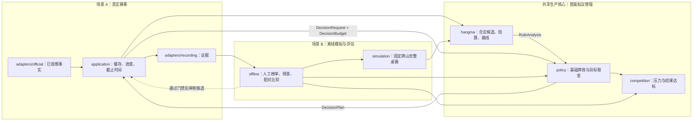
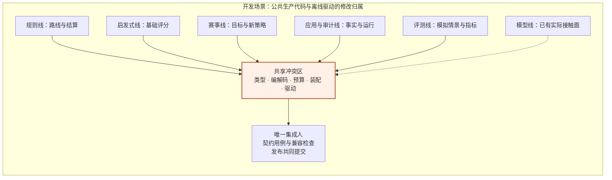

# 海选晋级压力与目标分值策略首版方案

> 日期：2026-09-07。状态：重新设计的实施提案；尚未实现，拟议类型和参数未冻结，线上策略未切换。
> 2026-09-08 并行协作修订：收益模型、比赛策略、启发式与赛事评估持续并行时，先交付一版共享契约及契约用例，再分头实现新增接触面。§8.5 补充跨工作线职责、收益口径和版本约束；现有内部迭代不需要停工，海选首版仍不依赖模型训练。
> 本次修订取代此前以桌赛轨迹抽样估计海选晋级概率的首版方案。首版改为：**根据榜单与剩余机会判断追分压力，利用规则提供的成胡路线调整启发式选择。**不训练海选概率模型，不把经验轨迹拼接作为前置工程。
> 数据约束：完整官方测试赛事依赖赛事方组织，样本有限且不可控；可持续取得的是自建测试房间和自由赛。自由赛简单摸打程序较多、也有高质量 Bot，属于用户历史观察，不能据此确定正式海选对手比例。
> 官方依据：2026-09-07 核对指南 v18（更新于 2026-09-06）及门户 2026-09-03 版赛事流程。[官方指南](https://10.240.169.190:18080/portal/api/guide?format=text)、[赛事流程](https://10.240.169.190:18080/portal/#flow-stage)、[当日正文快照](../../review/official-deep-diagnosis-2026-09-07/guide-current.json)、[抓取信息](../../review/official-deep-diagnosis-2026-09-07/guide-fetch.json)。下文分别说明官方事实、当前实现、工程建议及未确认条件。

## 1. 首版交付什么

**交付一个能够改变动作选择、可解释、可降级的候选策略。**它与冻结的启发式基线接受相同的线上决策调用；旁路观察只是接入步骤，不是最终交付。

拟议实现命名为目标分值启发式策略（`TargetAwareHeuristicPolicy`，根据赛事目标调整基础启发式对路线的取舍），在新候选版本中实现。

海选直接晋级（`DirectQualification`，海选终榜进入当前计划名额，不含后续候补递补）是首版赛事目标。晋级压力（`QualificationPressure`，根据积分缺口和剩余机会生成的追分强度）是启发式控制量，**不是晋级概率**。目标胡牌分值（`TargetWinScore`，当前希望一次成胡取得的我方净增积分）用于比较成胡路线，不等于番数，也不总能独立表达晋级条件。

- 没有明确追分要求时，沿用基础牌效取舍；当前在名额内不等于已经晋级。
- 缺口较大、剩余机会较少时，愿意为有依据的高分路线承担受限的牌效损失。
- 有几条路线足以达到目标时，比较牌效、必要条件和有效牌；达标后停止仅因番数更高继续加分。
- 在确知的最后得分机会，按完整结算后的全场排名筛选路线；不达标的小胡不再无条件压过仍可能达标的路线。
- 榜单、进度、路线或预算不可靠时，退回冻结基线，并记录原因。

首版包括确定性排名、追分控制、规则路线事实、策略接入、离线情景评测与在线可靠性验证。不包括海选概率训练、全场对手建模、在线隐藏世界抽样、任意深度搜索、16 强以后的排序概率模型。后者另行设计，可复用本版记账与审计基础。

## 2. 官方规则和必须保留的未知

**官方排序可以固定计算；未来结果、最终晋级线和路线成功率不能靠固定计算得到。**首版通过明确的追分偏好处理未知，不伪造概率。

| 项目 | 已核对口径 | 对本版的影响 |
| --- | --- | --- |
| 晋级名额 | 实际到位人数决定海选取前 16/8/4；4 人直接决赛，阶段可降档 | 结合实际阶段事实与已审查流程派生，不能固定写前 16 |
| 全场排序 | 总得分 `total_score`、名次分 `place_points`、白板获取数 `god_count` 依次降序，完全同键按官方身份顺序兜底 | 三键不相加；既有权威排名优先，假定结果按同一规则重算 |
| 名次分 | 每个完整桌赛按 +3/+1/−1/−3 分配，并列取所占区间平均 | 仅在桌赛结束时计入一次，不能按单局重复发放 |
| 白板获取数 | 配牌、庄家直抽、墙摸及杠补获取均累计；打出不扣获取数 | 当前手留白板不能替代 `god_count`；不为追第三键盲目留白板 |
| 轮空与进度 | 轮空不增加三键成绩，但参与进度加一；正常完成一单局也加一 | `games_played` 不能直接当统一的剩余单局计数器 |
| 阶段记账 | 每阶段独立计分；作废阶段尝试不进入新尝试 | 缓存绑定阶段尝试，重赛清除旧目标 |
| `M` 与赛程 | 当前应用把 `config.M` 用作并发上限；总场数需结合实际赛程核对 | 不用 `M × Rounds - games_played` 无条件断言剩余机会；本桌最后单局不等于海选最后机会 |
| 榜单时点 | 有本地接收时间，未确认有可对齐每场单局的服务端记账水位 | 不把桌内累计分再次加到阶段榜单；刚收到也不等于已经记全 |

还需核对：榜单完整性、实际赛程和轮空、座位与参赛身份映射、已入账单局边界、其他相关选手的未结成绩。增加本地字段只能保存证据，不能使平台未公开的信息变成已知。

## 3. 核心算法与动作逻辑

### 3.1 先判断输入能支持什么

**适用状态先于压力和动作调整。**状态与缺失原因写入同一次决策证据。

| 状态 | 必要信息 | 可以做什么 |
| --- | --- | --- |
| 正常 | 可信阶段与榜单，没有明确追分要求 | 使用基线，不能声称已安全晋级 |
| 参考追分 | 能定位本人、晋级名额与当前比较线；进度有可信范围 | 生成参考目标与有上限的追分调整 |
| 最后机会硬目标 | 相关剩余结果已封闭，当前单局是最后可改变目标的机会，记账与并列条件可核对 | 按四家结算判断终榜是否过线，允许受控改变立即胡牌优先级 |
| 信息不足 | 阶段不适用、本人/身份不明、榜单过旧或矛盾等 | 不启用赛事调整，规则和基础策略继续运行 |

其他选手仍有未结成绩时，本人的最后单局通常也只能使用参考追分。缺记账水位阻止硬目标；若榜单与进度仍可信，并不必然阻止参考追分。只有部分进度时进一步限制调整幅度。

### 3.2 参考目标与追分压力

**用“需要怎样的追分节奏”代替“还有多少晋级概率”。**以下是待通过对照试验选择参数的工程启发式。

设当前榜单中除本人外第 `G` 名的总得分为 `C`，本人总得分为 `S`，显式预留积分余量为 `m`，本人尚未结束的单局机会数为 `H`：

```text
tie_step = 0 或 1                       # 当前次要键能支持同分过线取 0，否则参考目标严格多 1 个积分单位
D = max(0, max(C + m, C + tie_step) - S) # 缺口，单位为当前房规下的实际积分；m 非负
pace = D / H                           # 每个剩余单局需要补足的净积分；仅在 H > 0 且口径可信时计算
pressure = clip(pace / reference, 0, 1) # 追分强度，无量纲，不是概率
```

`reference` 是版本化参考积分尺度，由规则模块按当前底分、庄闲条件提供标准结算尺度，不冒充“平均胡牌收益”，也不证明当前手牌能做成该结算。`m` 是工程余量，不是预测的晋级线上涨幅度。三键同分仍须完整比较，上式只用于参考追分。如果次要键不能支持同总得分过线，参考总分目标至少严格超过 `C` 一个实际积分单位，不能因总分相等就认为无需追分。

参考胡牌目标先取 `max(reference, pace)`，再与规则路线的实际分值档位比较；有满足该数值的路线时取其中最低的达标档位。没有路线达到时保留原目标与未达标标记，不把目标偷降成当前最大可见分值，也不宣称其他未展开路线不存在。这里的目标只是控制参数，最后机会仍走 §3.5 完整排名判断。

`H` 包含当前单局及本人其他已知未完场次，不包含已经结束或轮空的机会。多场并发共享同一份进度事实；不让每场都把全部缺口当成自己一次必须补足的分数。`D/H` 只描述追分节奏，没有假设每单局都胡，也没有预测未来向其他赢家支付的积分，不能据此证明目标容易或可达。

1. 将压力映射为少数冻结档位，输出参考目标分值、额外向听上限和最高调整幅度。
2. 其他条件与信息质量相同时，缺口增大或机会减少，不降低档位。
3. `H` 只有上下界时分别计算，结论不一致则限制到温和档位；完全没有可靠进度时，不输出最后机会，最多按差距温和调整。
4. 对余量用预登记的少数取值作敏感性检查。小幅改变余量就反转动作时记录目标敏感，不称为高置信选择。
5. `H=0` 单独判终态；负数、不同阶段混账或矛盾计数进入信息不足，不能夹成 1 继续算。

参考目标不是每个动作的硬分数门槛。没有达标路线时可以保留有依据的升值条件；不能只因差距大就奖励任意高番标签。

### 3.3 规则模块需要给出的路线事实

**成胡路线（`WinRoute`，动作后通向某种合法成胡结果的条件与牌效描述）由 `hangma` 提供。**`competition` 和 `policy` 不复制麻将算法。

每个合法候选可附两类事实：立即胡牌结算，以及未来成胡路线摘要。前者复用 `HangmaRules.score`，包含番数、明细和座位 0—3 的四家积分变化；后者包含条件成立时的结算、路线牌效、必要后续弃牌和尚未发生的摸牌/链条件。条件结算正确不代表条件一定发生。

首批覆盖平胡、七对及豪华分支、爆头、当前已有飘/杠链，以及能在小规模展开内核验的延续路线。规则修复与房规指纹是前置要求，尤其不能忽略有财必拷响、断链与持续爆头状态。

| 证据层次 | 含义 | 使用范围 |
| --- | --- | --- |
| 有合法路径证据 | 在明确未来条件下有合法动作/成胡见证，未被已见牌排除 | 可比较目标达标；仍不保证实际未来走到该路径 |
| 结构提示 | 可算牌型距离或潜在计分条件，未验证完整动作链 | 只支持封顶的软调整，不用于放弃立即可胡 |
| 未知或已排除 | 未展开、超上限、缺信息，或有明确规则反证 | 未知不加虚构高分；只有反证才能称路线不可行 |

吃碰后保留不同计分路线所需的后续弃牌。现有 `best_followup_discard` 只代表牌效最优分支，不能先丢掉追分路线，再期望改权重把它找回来。路线集合可去除同时在牌效和分值上更差的冗余项；截断必须标记，“没搜到”不等于“绝对做不到”。

向听只描述相应牌型结构距离；下界或未包含胡牌资格条件时应标注，飘/杠必要动作另记。有效牌剩余估计仍包含可能在他家手里的牌，不能直接换算成摸到概率。杠补、未来白板和未来链倍率均不得当作已经到手。

### 3.4 如何结合启发式

**一个策略完成最终排序：基础牌效加有界的目标路线调整，不相乘两套独立评分。**新增具体候选策略，复用冻结基线的公开能力；不原地改变 V0/V1/V2 默认行为及正在进行的权重实验。

参考追分的首轮候选形式：

```text
路线价值 = clip(分值达标程度 - 牌效代价 - 未完成条件代价, 0, 1)
候选调整 = 当前档位的最大调整幅度 × 最好的可信路线价值
层内评分 = 基础战术评分（赛事调整生效时不含旧名次风格项）+ 候选调整
```

分值达标程度以目标封顶，达标后不因更高番继续奖励。牌效代价使用路线相对基线的额外向听、有效牌损失；条件代价反映必要后续动作与证据层次。它们都是版本化启发式分项，不是概率或期望积分。额外向听另设硬上限，避免大额番数奖励吞掉所有牌效约束。

参考追分保留合法胡牌优先级，合法性、可信层与数值评分分开，`DecisionPlan.candidates[].rank` 仍是执行顺序。当前 `win_potential` 只是留财代理分，`gang_bonus` 也是固定加分，不能改名冒充胡牌分值。不同步重调所有基础权重。

2026-09-07 代码核对：V0/V1 的名次风格只看桌内名次；默认第一给熟张弃牌加 4，第四给向听最优弃牌加 2，均为启发式分，默认一档向听权重为 100。V2 复用这一逻辑。它不使用分差、剩余机会或全场榜单，落后时更偏向快胡，不能视为本版已有实现。

新策略的赛事调整有效时，由一个目标调整环节接管取舍，避免与旧名次风格重复计权。当前可通过给复用评分函数传入不可变的 `style_adjust=0` 权重副本实现，不修改冻结源码，也不解析中文分项名称作减法。其他基础权重保持所选基线值；增强关闭、目标不足或没有可信路线时直接返回原基线计划，连旧名次风格也恢复。开发阶段单列“只关闭旧风格”的消融对照，辨别改善是否来自新目标。桌内积分仍用于结算与排名，不从观察里删除。

只比较“关闭、弱追分、强追分”少数组合。压力阈值、余量、牌效上限和调整幅度经开发集选择后冻结，用独立确认集验证。线上不学习权重，每次请求使用不可变参数，避免多场并发改写共同配置。

### 3.5 最后机会：将硬目标变成路线条件

**最后机会优化“完整结算后是否晋级”，不必追求最大牌型。**按 `hangma` 提供的四家积分变化逐个查询终榜，赛事模块不复制番数转积分的算法。

必须从有对齐依据的阶段账本开始，仅补未入账变化；四家支付映射到正确参赛身份，同桌竞争者的变化也影响截线；若本次结束桌赛，再计算尚未入账的名次分。最后按三键比较全场排名。白板或身份兜底未知且影响结论时返回未定；能证明未知不影响结果时才返回确定结论。

硬目标首先是排名条件，只在当前条件允许时才简化成“我方至少净增多少分”。不能把当前第 G 名与我方的总分差无条件当成精确胡牌门槛。

改变立即胡牌优先级必须同时满足：当前胡牌的完整终局结果确定不达标；确为最后相关得分机会；有合法继续动作及尚未被排除的达标路线见证；例外分支已通过独立验证。此时先比较可达标路线，再比较代价，而非永远选最大番。

立即胡已确定达标就直接胡。没有达标路线见证、目标未定、分析失败或预算不足时使用基线，不能开启无限追番。立即胡仍保留在合法候选与独立降级路径中；该例外单独开关、单独报告，不混入原基线。

### 3.6 时限与并发

**先有紧急合法候选与基础计划，再计算增强。**赛事评估不访问网络，不等待其他场次完成。

- 应用层提供本次榜单/进度快照与新鲜度，阶段切换使旧目标失效。
- 路线分析使用固定工作量上限，`hangma` 不读系统时钟；只有实测能放进预算的有限分析进入动作窗口。
- 1 秒响应窗只消费与当前观察匹配的预计算事实或已验证足够快的直接规则计算，不现场启动多步搜索；缺事实的吃碰候选沿用基线。
- 3 秒窗可启用通过性能门禁的小规模分析，耗尽上限返回未知，不阻塞保底。
- 缓存绑定规则版本、本人观察及特殊状态，目标还绑定榜单/进度版本；不跨新牌面使用旧路线。
- 明确拒绝后的重规划仍沿用原截止时间并排除已拒绝动作；增强不改变提交与恢复机制。

## 4. 模块结构与依赖需求

**最大算法工作在 `hangma` 的分值路线事实，其次是 `policy` 的取舍；`competition` 保持较小的确定性模块。**不创建训练服务、通用预测接口或第二个动作选择入口。

图中实线表示拟议调用或数据提供方向，虚线表示评测证据进入发布审核；真实与模拟共用规则和策略。本版没有训练场景。



| 模块 | 已有能力（2026-09-07 代码核对） | 首版需求与真实缺口 |
| --- | --- | --- |
| `kernel` | `CompetitionContext` 有阶段、榜单、名次、接收时间；观察有桌分、局号、庄家和规则状态 | 榜单闭环先补本人身份、可靠剩余单局数、榜单可用性 3 项；阶段尝试等复用现有应用关联，精确记账事实后续按样例收口；不放晋级概率 |
| `adapters/official` | projector 已投影解析到的 ranking；运行端有配置和场次清单 | 核实赛程、轮空、座位映射和记账信息；未提供明确缺失，不增加每次动作 HTTP 查询 |
| `application` | 有阶段尝试、活跃/历史场次、缓存与预算 | 汇总跨场进度、事实版本与新鲜度；不能由单个 GameTask 断言海选最后机会 |
| `hangma` | 有 `score(WinDescription)`；CandidateFacts 有向听、有效牌、一个最佳弃牌 | 胡候选挂立即结算，RuleAnalysis 补参考结算尺度；补路线分值、专属牌效、条件和覆盖状态；保留吃碰的不同路线 |
| `competition` | 尚无可用具体海选目标实现 | 实现排名、压力/参考目标和给定联合结算的终榜达标；纯计算，不读手牌、网络或磁盘 |
| `policy` | choose 已收到 competition，但 V1/V2 不消费；有分层排序、分项与 Hu 优先 | 新增具体候选策略，有界调整及最后机会例外；唯一输出仍是完整 DecisionPlan |
| `adapters/recording` | 决策能存赛事上下文；生命周期快照载荷目前省略 ranking | 无动作时也记录变化全榜和终榜；增加目标、路线、例外与降级的结构化证据 |
| `simulation` | 固定 seed、初始分、座位和房规，推进完整桌赛，可导出完整世界起点 | 优先从公开能力生成末段局面；确需中途续打再补受控起点，不读改私有 WorldState |
| `offline` | 有桌赛驱动、配对比较和赛后产物；当前注入空 CompetitionContext | 补随结算更新的人工赛事事实与情景结果；统计目标达成，不训练全场概率 |
| `bootstrap.py` | 唯一组合根 | 装配具体 competition 与新策略，显式配置版本和开关，发布门禁不变 |
| `learning` | 后续模型职责 | 本版无依赖，不预建训练接口 |

与[启发式基线专项](./heuristic-baseline-campaign.md)共享经过验收的冻结基线和公开工具，不拿其独立确认集来调本方案，不改变其候选菜单、预算和“Hu 优先”的实验范围。

## 5. 拟议接口契约

**保留 `BotPolicy.choose(DecisionRequest, DecisionBudget)`，扩展它已经携带的事实。**以下是实施时需受控冻结的提案，当前代码尚不能调用。

### 5.1 完整赛事事实目录

2026-09-08 收敛：以下是完整接入的数据目录，不是首批需要添加的字段清单。暂不创建大而全的 `qualifier_facts` 包；首批增量以 §5.4 为准。原有 ranking 和观察内 scores 继续分别是榜单与桌分的唯一事实位置，阶段尝试和版本证据优先复用现有审计关联。

| 字段组 | 含义、单位与来源 | 缺失行为 |
| --- | --- | --- |
| 本人身份、阶段尝试、流程版本及名额依据 | 身份不是 Token；阶段尝试为本地审计身份；名额由观察事实加已审查流程派生 | 无法匹配本人/尝试或派生名额时不调整 |
| 进度 | 区分计划总场、已完、活跃、未开和轮空；场次数与单局数分别标单位，允许范围 | 未知不填 0，不从并发上限冒充总场数，限制档位或降级 |
| 事实版本与质量 | 原始观察引用、全榜完整性、本地接收 Unix 毫秒、应用计算的年龄毫秒；可选服务端时间/水位 | 本地新鲜不替代服务端对齐，过旧按冻结阈值禁用 |
| 结算对齐 | 每个 game_id 已入账单局/分数边界、未入账名次分、座位 0—3 到身份映射 | 无证据不精确合账，硬目标不可用 |
| 剩余结果封闭依据 | 官方结束事实，或其他相关未结成绩不再改变结论的证据 | 没有证据不宣称确定的最后机会晋级结果 |

真实事实不装人工假设。离线可构造同形模拟输入，必须在来源和情景标记 synthetic；线上不能把实验参数回填成官方字段。

### 5.2 候选路线事实

在 `RuleCandidate` 增加一个可选 `value_facts`，封装立即结算、路线摘要及覆盖情况，具体字段见 §5.4；保留 `CandidateFacts` 既有含义。已确认胡牌继续用 WinDescription；未来假定成胡使用明确条件并复用同一套规则结算，不伪造已确认观察来计分。

| 内容 | 契约要求 |
| --- | --- |
| 候选与路线身份 | 绑定 action_key、规则版本、观察和特殊状态，防止动作后用旧事实 |
| 条件结算 | 座位 0—3 实际积分变化、番数和明细；随未来条件返回，不同条件分项保留，不只给最好上界 |
| 路线牌效 | 路线自己的向听、有效牌、后续弃牌，标精确/结构下界/未知；不借用基础最优分支冒充 |
| 证据与条件 | 已确认条件、需要的牌/合法动作、未知补牌/白板/链条件、可选合法路径见证 |
| 覆盖与失败 | 检查了哪些路线族、是否截断、缺失原因；空集合区分未分析与有证明排除 |

`HangmaRules.analyze` 可增加默认关闭、固定工作量上限的路线分析选项，旧调用不承担新计算。路线与晋级目标无关，hangma 不读榜单，competition 不解析手牌；1 秒窗不启动多步分析。

`RuleAnalysis` 在榜单闭环阶段拟增加可选参考结算尺度，单位为当前房规、本人庄闲条件下的净增积分，由同源结算数学生成。策略将该积分尺度连同赛事上下文交给 competition；精确结果判断后续另传四家积分向量与已证实的记账依据，competition 不依赖或解析麻将内部牌型。尺度缺失时不套用历史房规数值。`RankingEntry.games_played` 现有“已完成单局数”注释也需在实施契约变更时补充轮空语义，并增加对应测试。

### 5.3 赛事评估及策略证据

具体 competition 提供两项行为：从事实生成目标意图；对传入的四家假定结算判断达标。均无副作用，预期缺数据返回原因与未知，结构矛盾返回可分类输入错误；只有一个实现时不增加 Protocol。

目标意图（拟议 `QualificationIntent`）归 competition，由策略内部计算；首轮操作输入仅为模式、目标净增积分和压力档位这 3 项。缺口等推导证据保存在评估产物，未知原因复用既有降级记录；后续精确最后机会的条件与证据需另行设计，不能由 3 个操作字段自行证明。application 只提供事实，不先算策略权重。

正式运行接入时可增加 DecisionPlan 的可选赛事诊断载荷，类型归 policy，包含目标、路线、例外与版本；首轮不改 DecisionPlan，复用现有分项/原因并在离线产物记录目标和路线输入。记录器序列化返回值，策略不写文件。本人明确胡牌可算四家支付，不代表已经有四家未来结果分布。

可选扩展同时更新 `kernel.serialization`、`application.audit_codec`、记录器、赛后转换、离线驱动、测试构造器和契约测试。旧审计缺字段按“未提供”读，不当成零压力或已使用该能力。MatchResult 仍代表桌赛结果，另建有版本的情景评估产物。

### 5.4 从实际决策反推的字段增量与数据来源

**先分别回答“需要多少分”“哪个动作保留够分的路线”“实验最后发生了什么”，再要求生产者提供字段。**以下数量是当前最小提案，不是已落码的冻结契约；按新增顶层参数/字段计数，嵌套字段另列，不把一个大包冒充一个简单参数。

#### A：固定目标实验的必需增量

| 位置 | 首轮增加多少 | 具体内容与来源 |
| --- | --- | --- |
| PlayerObservation、DecisionRequest、DecisionBudget、BotPolicy.choose | 0 | 现有手牌、公开牌、桌分、座位/庄家、合法候选、窗口与预算足够；不向规则传全榜 |
| RuleCandidate | 1 个可选字段 | `value_facts=None`；由 hangma 生成，内部 4 项见下表 |
| HangmaRules.analyze | 1 个可选关键字参数 | `value_limits=None`；None 保持旧行为，启用时指定工作量限制 |
| ValueAnalysisLimits（新增分析选项） | 2 个整数控制字段 | `max_expansions` 为整次请求允许的展开节点上限，`max_routes_per_candidate` 为每候选返回路线数上限；均由实验配置提供，不是外部数据 |
| 新策略的目标输入 QualificationIntent | 3 个操作字段 | `mode`、`target_win_score`、`pressure_level`；A 由实验配置指定，B 由 competition 生成，原启发式权重类型不增加字段 |
| MatchDriverConfig | 1 个可选字段 | `value_limits=None`，离线驱动据窗口类型决定是否调用增强分析，1 秒窗不展开多步路线 |
| offline.drive_match | 1 个可选回调参数 | `on_hand_completed=None`；仅开启统计时调用模拟器公开导出并报告单局结算，缺省保持旧行为 |
| 单局结算回调记录（新增） | 4 个结果字段 | `round_no`、`winner_seat`、`fan`、`score_delta`；都来自现有 export_hand 的已完成记录，score_delta 按座位 0—3，流局 winner_seat 为空 |
| simulation 公开接口 | 0 | 已有 export_hand 提供所需结算，frame 提供进度，final_scores 提供桌赛终点；调用方不读 WorldState 字段 |
| 收益模型、官方 HTTP 端口、正式运行装配 | 0 | 本轮不消费模型，不增加平台请求，不改变默认策略 |
| DecisionPlan、MatchResult | 0 | 原计划分项/原因与原桌赛结果保留；目标、路线输入和单局统计另存离线实验产物 |

mode 区分关闭、参考追分和有终局依据的最后机会；target_win_score 是我方净增实际积分，pressure_level 是有限枚举的追分档位。固定压力本身不能产生最后机会证明，A 的一般实验只使用前两种模式；最后机会例外需要明确封闭情景，经 B 或独立终局夹具验证后才开启。错误/未知原因可复用既有降级记录，不要求原策略新增一组同名参数。

`value_facts` 的 4 个字段：

| 字段 | 用途 | 数据目前能否取得 |
| --- | --- | --- |
| `immediate_settlement` | 本人现在合法胡牌的 Settlement；未知为空 | **已有算法可算**。来源是本人手牌、庄家、底分、爆头/链状态；必要链信息缺失或计分失败时不能填确定值 |
| `routes` | 条件成胡路线列表 | **可用可见数据推演，但尚未实现**。不是把现有留财分改名即可获得 |
| `coverage` | 声明路线族内是否完成、部分完成或不可用 | hangma 记录实际检查和截断情况；完整仅相对本版声明的有限范围，不是证明所有麻将路线穷尽 |
| `issues` | 缺信息、超限或失败原因 | 分析过程直接生成；空路线不等于全局不可行 |

每条路线最少 6 个字段：

| 字段 | 用途及数据来源 | 当前缺口 |
| --- | --- | --- |
| `conditional_settlement` | 条件成立时的 Settlement，复用番数/明细/四家积分类型；由同源结算生成，不能确定时为空 | 需要明确的未来成胡条件描述，不能伪造已确认 WinDescription |
| `shanten` | 该路线的结构向听，未知为空，不借用普通最优路线的向听 | 需实现针对路线的分析；结构距离与合法胡牌资格仍分开 |
| `useful_tiles` | 该路线有效牌及公开可见剩余估计，复用 UsefulTileFact | 计数基础已存在，目标路线对应的有效牌集合需新增计算 |
| `followup_discard` | 吃碰后沿该路线需要弃的牌，其他情形允许为空 | 当前只保留基础牌效最优弃牌，需要保留其他有效路线 |
| `conditions` | 尚需的摸牌、合法动作与特殊状态条件；应使用机器可读的条件，附可复核见证 | 需由规则分析生成；具体条件结构随第一条真实路线样例收口，不预设任何未来牌已经到手 |
| `support` | 有合法路径见证、仅结构提示或未知 | 由验证过程生成；结构提示不能用来触发弃胡 |

这 6 项不要求他家手牌或未来牌墙，也不输出成胡概率。最难的是限定条件下的路线牌效与见证，属于**算法能力缺口**，不属于等待官方多办比赛的数据缺口。conditions 的具体子字段和最坏计算量需先用一条可运行样例验证，尚不能据此宣称完整路线协议已冻结。

离线驱动还有一处必要流程修正：当前 rules.analyze 在构造预算前执行，耗时统计主要包围 policy.choose。新增路线分析后必须计入规则与策略的总处理时间，先准备紧急候选并固定原始预算；不能把新计算排除在时限报告之外。该修正不是给模型追加参数。

#### B：自动根据榜单生成参考追分目标

**在 A 之上，CompetitionContext 暂只增加 3 个可选字段。**其他赛事业务量优先复用或本地计算，不重复传递。

| 新字段 | 生产模块与来源 | 当前可用性与缺失处理 |
| --- | --- | --- |
| `participant_id: str 或 None` | application/官方投影，已有 SessionBootstrap.participant_id 和 TournamentSnapshot.participant_id | 已取得但没传到 CompetitionContext；补透传即可，不通过名次反查身份 |
| `remaining_hands: int 或 None` | application 统计本阶段本人所有未结束单局，含当前单局与其他已确认计划场次；offline 情景可给出确切值 | **真实场景尚不能普遍确定**。本桌进度和 Rounds 有，但 my_games 跨阶段累计、M 是并发配置，轮空计数特殊；计划不明填 None，不能用 M×Rounds 硬算 |
| `ranking_usable: bool`，默认 False | application 在每次组装请求时根据来源完整性、既有接收时间、新鲜度及阶段归属生成 | 可编程核对，但不是官方原字段；证据不足 False。不得在缓存生成时算一次后永久视为新鲜 |

G（晋级名额）由 competition 根据现有 stage_no/role/total 与已审查流程派生，不能派生则不可用；不要求官方适配器新增同名字段。当前分差从已有 ranking 计算，三项成绩已齐；不再传一个重复的 gap。阶段尝试与来源版本由应用已有监督和审计关联维护，纯计算模块不另存可跨尝试残留的缓存。

B 另需 `RuleAnalysis.reference_win_score` 这 **1 个可选积分字段**，由 hangma 使用已有 RuleConfig.base_score 和观察中的庄闲条件计算；它是标准计分尺度，不代表当前手牌必能做成。A 目标固定，不要求该字段。具体 competition 可接受“扩展后的 CompetitionContext、该积分尺度”两项输入并输出目标意图，不读取手牌、不请求模型。

离线 drive_match 在 A 之上再增加 **1 个可选 `competition_context_factory` 参数**，依据当前 PlayerObservation 与外层声明的公开情景状态生成上下文；不传仍生成原空 CompetitionContext。生产选择入口无需增加参数。来源不完整或 remaining_hands 为空时，仅使用已声明的受限参考模式或基线，不能输出精确进度或最后机会。

#### C：精确最后机会尚有外部数据缺口

3 个参考追分字段不足以证明真实最后机会。还需要至少四类事实：当前桌四座位与参赛身份映射；本次榜单已包含哪些积分/名次分/白板获取数；其他相关选手及本人并发场次的未结结果是否封闭；影响同分的最终次要键或足以证明其不影响结论的界限。

这些事实在本地封闭情景能由评测者提供，但实时官方接口能否充分提供尚未证实，不能承诺靠增加四个参数就解决。现在不冻结一个全可填写的硬目标包，也不以预测冒充记账事实。取得实际响应样例后再设计 C 的载荷；缺证据时真实运行禁用该例外，A/B 继续推进。

本表是从海选首版消费者反推的要求，对收益模型的追加字段数为 **0**。模型线自身预测语义的契约仍需由其真实生产者与消费者收口，不能由本方案替它臆定实现；后续接模型时再按照 §8.5 校验结果类型和续打条件。

## 6. 数据需求与缺口

**本版需要规则样例、可控策略比较和赛事事实，不需要海选训练标签。**最大的外部缺口是硬目标要求的进度与记账可见性。

| 数据 | 当前情况 | 补齐方式 | 是否阻塞首版 |
| --- | --- | --- | --- |
| 全榜、本人身份、阶段与名额依据 | 已有快照和排名投影，缺完整适用证据 | 扩展既有缓存与留档，先用保存响应核对 | 真实调整必需；本地开发可用人工事实 |
| 剩余赛程、轮空、跨场进度 | 有 M、Rounds、active_games/my_games、单局号，未形成可靠剩余机会 | 应用汇总事实，核对赛程，未知保留范围 | 精确压力依赖；缺失时受限参考追分 |
| 记账水位、相关未结成绩、座位身份 | 部分赛后有身份，实时对齐未确认 | 已有响应/审计核对，再核实平台实际能力 | 硬目标依赖；缺失则禁用真实硬目标 |
| 路线分值与胡牌资格金例 | 已有结算和特殊规则金例，缺目标路线集 | 从规则测试和真实观察构造正反例；验证动态资格，不能只查静态 fan-calc | 必需，可控，无需训练 |
| 相同手牌、不同目标的决策组 | 历史只有实际动作，未形成成组测试 | 固定 PlayerObservation，改变人工榜单/进度 | 必需，完全本地构造 |
| 策略效果样本 | 有桌赛驱动，缺赛事输入与追分指标 | 固定牌山、换座位、冻结对手、完成桌赛，独立种子确认 | 必需，可控补齐 |
| 线上规则/时间/对手变化样本 | 测试房间、自由赛可持续取得 | 测试房间验接入与并发，自由赛分层检验 | 必需，不要求组织完整官方赛事 |
| 官方海选连续全榜与结果 | 稀少；已确认的 205 人赛事摘要仅存前 20 行 | 机会性保存全榜与终榜，做外部验证 | 不阻塞本地首版；不能据此承诺真实晋级率 |
| 16 强以后排序标签 | 尚未按统一条件组织 | 后续从固定四人阶段模拟及对应真实桌赛提取 | 本版不需要，不启动训练 |

现有文件数不等于有效样本量：[测试房间清单](../../datasets/official-test-room/t_64201ecc3ab3/manifest.json)有 4 场、32 单局、6690 次决策，但 `formal_hands=1`、`training_eligible=false`；[自由赛清单](../../datasets/official-auto-match/manifest.json)有 2 个房间、20 份场次事件文件。用途不同须重新审核质量，诊断记录不能自动升级成可信效果样本。

- **测试房间**：4 个隔离进程，固定各策略版本，检查特殊规则、M 场并发及 1/3 秒窗口。平台不能控制牌墙时，不称同牌山配对；注入人工海选目标必须显式标实验来源，不污染官方记录。
- **自由赛**：保存所有完赛和失败记录，按房规、时间、已知身份、可复核打法分层。简单、较强和未知对手分别报告，不凭本次低分/掉线判断强弱，也不把匹配频率当正式比例。
- **本地模拟**：承担同牌山、同对手与座位条件的策略对照。规则变化后重验或隔离受影响数据。官方完整历史不含未摸牌墙，不能据此声称还原改变动作后的真实未来。

实验记录来源、规则/config 指纹、基线与增强参数、对手版本、榜单/进度情景、种子、座位、质量与拆分组。同牌山、多视角、重导出和分叉保持同组，不跨开发/确认集；作废阶段默认只作诊断。

## 7. 如何验证这套策略

**先验证该追、追得对、该停、能降级，再用完整桌赛判断效果。**首版不输出概率，不需要用 Brier 分数评价不存在的概率预测。

### 7.1 必须通过的行为与规则用例

| 情景 | 必须验证的行为 |
| --- | --- |
| 同手牌缺口更大或机会更少 | 压力不反向降低，仍遵守代价与证据上限 |
| 较低番和困难大牌都够分 | 不只因分值更高就继续加码 |
| 最后机会小胡不够，继续有达标见证 | 新策略能继续，基线仍可独立对照和降级 |
| 立即胡已确定达标 | 立即胡，不为多余番数延迟结束 |
| 同桌竞争者支付后跌出线、桌赛名次变化 | 四家一起更新，名次分只记一次 |
| 白板/身份兜底影响同分 | 不确定则未定，不用手留白板或哈希顺序替代 |
| 本桌最后单局但仍有其他场次 | 不触发海选最后机会，各场不重复使用进度 |
| 榜单迟到、重复入账、轮空、重赛 | 正确降级/去重，旧尝试目标失效 |
| 吃碰最优牌效弃牌毁掉高分路线 | 保留目标路线自己的后续弃牌，未覆盖则未知 |
| 有财胡资格、飘/杠链、补牌未知 | 同源规则，条件分值不冒充真实结算，非法动作不进入计划 |
| 没搜到路线、上限耗尽、明确断链 | 区分未知与不可行，不盲目奖励高番标签 |
| 关闭/缺字段、分析异常、预算紧张 | 回到冻结基线，1/3 秒及拒绝重规划复用原预算 |

通过公开接口测试。中途观察可以作静态选择测试；完整效果比较从受支持的模拟起点推进，不偷读 WorldState 给策略，也不把单局重启冒充完整桌赛。

### 7.2 完整效果评测

先做有限显式情景：参考线不变、外部线按预登记结果变化、最后机会封闭、同分边界、本人多场未完。离线每次单局/桌赛结束后更新榜单，不能整场使用不变的过期输入；复杂全场模拟不是前置工程。

比较冻结基线和新策略，使用同牌山、换座位、相同对手，按 `config.Rounds` 完成桌赛。末段情景也必须完成其声明的全部剩余机会。固定外部结果是受控假设；研究全场相互作用需另用完整牌级阶段模拟，不声称固定路径已覆盖。

主要报告：

1. 指定情景下目标达成率，封闭海选情景下直接晋级率，附定义与配对置信区间；不称真实海选晋级概率。
2. 改变多少次选择，成胡分值、单局胡牌率、整桌累计积分怎样变化；不能只报平均胡牌番数上升。
3. 正常/领先情景损失、已经足够分仍冒险的次数、弃胡例外的单独效果。
4. 合法性、超时/自动动作、增强耗时分位数及最大值、降级率和事实缺失率，覆盖实际并发负载。

统计单位是完整桌赛或完成剩余机会的情景根种子，分支和换座位保持配对关系，不以单个决策当独立样本。先用小批开发数据测效应、方差和成本，再冻结参数、主要指标、可容许退化及确认预算；独立确认时不边看结果边改门槛。

预登记目标情景达到改进门禁，正常情景退化在容许范围内且可靠性通过，才进入发布审核；证据不足保留基线。官方测试赛事作有限外部核验，本方案不取消已有赛事生命周期与人工发布门禁。

## 8. 实施顺序与工作包

**按能验证动作改变的纵向切片实施，先解决明确的最后机会案例，再扩大参考追分覆盖。**不让各模块先建空框架。

| 顺序 | 具体交付 | 依赖与退出条件 |
| --- | --- | --- |
| Q0：事实与样例 | 核对全榜、M/轮空/记账，整理正常/追分/最后机会正反例，冻结基线引用 | 列清真实有/未知/仅模拟，不等待官方再办赛事 |
| Q1：确定性目标 | 最小人工事实、立即胡结算、三键/四家支付/名次分/记账测试 | 人工封闭场景能判断每个明确胡牌是否达标，不要求先接完整官方事实包 |
| Q2：首条高分路线 | 有界路线事实，打通“小胡不够、继续能争取够分”的完整案例，新策略产生可审计差异 | 含已达标/未知/预算反例，路线条件与模拟结算一致 |
| Q3：参考追分与覆盖 | 压力、余量、牌效上限；扩展平胡/七对/爆头/已有链及吃碰后续弃牌 | 关闭/弱/强有限参数组，明确触发范围与工作量 |
| Q4：独立评估 | 可更新的人工赛事情景、配对桌赛、进度/记账/信息权限验证 | 可重跑产物，通过效果和可靠性门禁 |
| Q5：运行接入 | 先旁路记录，再测试房间运行候选，自由赛分层检验；齐备开关、诊断和降级 | 按原门禁审核发布；无真实硬目标证据只启用参考追分 |

Q0 核对与 Q1/Q2 人工样例开发可并行安排。工程主链是“规则路线事实 → 策略改变 → 可控完整比较”，官方全场样本数量不在主链上。硬目标在线启用有独立的外部事实依赖，拿不到时交付说明必须明确不可用，不能以模拟通过冒充真实接入完成。

Q2 先测最坏耗时和实现成本，Q4 先测效应与方差，再确定有限确认预算；不直接承诺训练规模、大量采集或日程，不挪用启发式基线专项的确认集和资源额度。

### 8.1 最小评测先分两层，不等待线上赛事适配

**先验证目标能否改变战术取舍，再验证赛事事实能否生成正确目标。**Q0 的官方事实核对不阻塞第一层实验；§5 的完整线上事实包不是第一层的开工条件。

| 层次 | 输入与依赖 | 可以证明什么 |
| --- | --- | --- |
| A：固定目标的战术实验 | 薄 offline 驱动、simulation、hangma、policy 及已有 kernel；由实验配置显式给定压力档位和目标分值 | 在指定手牌/对手分布下，目标控制能否得到有价值的胡牌与积分取舍；不证明压力公式正确 |
| B：事实到决策的离线闭环 | A 加具体 competition；人工阶段榜单、剩余机会、结算记账随模拟更新 | 已声明情景下，事实→压力→动作→终点目标是否正确并有效；不证明正式海选晋级率 |

A 的固定目标作为不可变实验配置装配并留档，不从隐藏完整世界推导，更不把赛后答案放进策略输入。B 使用拟议生产类型与同一核心算法。只有少量直接排名/压力边界测试时，competition 自身无需模拟器即可测试。

现有离线驱动给策略注入空 CompetitionContext，需要补一个默认保持旧行为的可选情景输入路径；模拟器本身不用承担排行榜。优先从已有公开起点运行到目标单局，再比较决策；完整桌赛主评测用实际 Rounds。人为缩短单局数可以作诊断，但不能代替正式长度的策略验证。中途完整世界续打仅使用受支持的公开入口，不能编辑私有状态。

每个相同目标/压力情景内配对比较原基线与候选，固定发牌根种子、其他三家策略、座位和房规，再跨压力情景观察趋势；不能只把高压力组与零压力组直接比较而归因于算法改进。第一批只改变本人策略，其他三家冻结；全部玩家都响应新目标的相互作用后测。

最小指标必须包含：

- 本人单局胡牌频率、他家胡牌及流局频率，说明分母；胡牌番数分布标明是否以本人胡牌为条件。
- **本人胡牌且净增积分达到目标的无条件频率**；未胡不能从分母删除，避免低胡牌率下的高番幸存者偏差。
- 全部结果下的本人及四家积分变化分布，包含对手胡牌导致的支付；不只看我方赢时的得分。
- 完成声明的剩余机会后的目标达成率与累计积分；普通/领先情景退化、异常、超时、降级和实际耗时另报。

单局统计用于解释机制，效果置信区间仍按完整桌赛或完整情景根组计算。预期高压力可能降低单局胡牌率、提高达标结果的比例；不要求所有指标随压力单调改善，更不能仅以番数提高作为成功条件。

### 8.2 先冻结最小契约，不让基础策略停工

**基础策略可以继续内部迭代；涉及相互消费的新功能，先以少量样例收口共享契约，再分头实现。**“冻结”约束字段语义和兼容行为，不要求算法与权重永远不变。收益模型也在并行开发时，按 §8.5 一起登记其真实接触面，不能让各线自行定义同名但不同含义的收益。

无模型最小实验需要先冻结三处：规则路线与立即结算事实（单位、条件、未知、截断、观察绑定）；目标意图（目标、压力、适用性及缺失）；策略的目标调整职责（基础战术、旧名次风格与赛事目标不得重复计权）。最后一项是 policy 内部接缝，对外仍只有 choose，不增加基础评分服务接口。完整官方进度字段等尚无实际消费者的扩展可以后收口；已被并行工作线共同消费的载荷、审计及错误行为必须一并冻结。

现在可复用 V2 在 policy 内部公开的评分函数和不可变权重；无需先抽取、改写冻结 V0/V1。路线事实由 hangma 产生。将来基础策略增加新的结构特征，需要通过同一受控事实协议；只调现有权重则不需要等待本项目完成。

每轮实验固定“规则与模拟器版本、基础策略及完整权重、路线算法、目标参数、对手与情景”组合。基础策略更新不自动流入正在跑的实验；下一次升级须重做增强关闭等价性、目标调整和配对效果检查。规则修复由规则线交付，在统一新版本上重跑受影响对照；不能将不同规则批次拼成一个效果结论。

### 8.3 独立分支与工作区隔离

**实现时使用独立工作区（`git worktree`，同仓库的独立检出目录）和独立分支。**仅在当前目录切换分支不能隔离同时进行的修复。2026-09-07 核对时这里只有 main 工作区，且规则、模拟器与运行适配器有未提交修复；本次设计不创建分支、不搬运或提交这些改动。

建议从已提交并通过相关验证的规则/模拟器检查点创建 `codex/qualifier-pressure`。尚未提交的修复不会自动出现在新工作区，需由修复线提交必要依赖后纳入；不将全部未提交工作一起复制、暂存或带入实验分支。已有可用检查点可以支持接口与人工样例开发，正式效果批次必须绑定经过核验的依赖版本。

实验工作区使用独立虚拟环境、运行配置和输出目录，防止共享可编辑安装意外导入另一分支；原始只读数据可以复用。工作区隔离不能隔离 CPU、内存、磁盘与网络资源，离线负载需服从正在运行的官方任务，真实时限验证要覆盖实际并发 M。不能以逻辑时钟实验的零超时替代运行门禁。

共享文件按受控提交集成：`hangma/interface.py`、`hangma/engine.py`、kernel 类型/序列化、`application/audit_codec.py`、`offline/evaluate.py`、bootstrap 由明确负责的一方收口，不让两条工作线同时改同一契约。新增路线和目标策略尽量放独立文件；只合入已验证的小批提交，不覆盖主线修复。

### 8.4 对当前运行与策略的影响界限

| 扩展 | 对原策略/运行应有的行为 | 合入前必须验证 |
| --- | --- | --- |
| competition 新模块与新候选策略 | 未装配时不执行，默认策略不切换 | 旧入口和配置仍运行；增强关闭输出原基线计划 |
| 路线/结算可选事实 | 旧字段语义不变，默认不启用额外展开 | 旧候选、紧急动作、评分结果与耗时无实质回归；补齐 codec 兼容 |
| 固定目标/人工榜单评测路径 | 只在离线显式实验开启 | 无输入仍使用旧驱动行为，实验不污染原确认集和结果目录 |
| 官方进度、榜单及诊断接入 | 推迟到核心实验有效之后 | 阶段/重赛/多场/记账/旧记录兼容及真实截止时间 |
| 已确认最后机会的弃胡例外 | 只属于新策略的独立分支 | 原 V1/V2 的 Hu 优先与源码冻结测试仍成立；新策略额外验证 |

可选字段也可能影响构造器、序列化、断言和性能，不能仅因默认 None 就宣称零影响。兼容提交先验证旧用法和新用法，再进入主线；无关适配器、网络恢复与主程序修复不属于首轮实验修改范围。新策略的动作影响可以显著，尤其追分与弃胡；隔离的是对原策略的影响，不是承诺新策略行为变化很小。

### 8.5 多条工作线并行前的公共契约

**先提交共享契约与可执行用例，再让各线基于同一提交实现新增能力。**本节是契约收口清单，尚未宣称模型与路线接口已经实现或正式冻结；不得因此预建没有实际生产者/消费者的模型框架。

这里将用户所说的收益模型按候选结果模型（`CandidateOutcomeModel`，预测动作之后会出现什么积分结果）理解；比赛策略指 policy 中汇总规则、启发式、可选模型和赛事目标的决策编排。若模型线实际交付的是期望值或已含赛事目标的价值，先根据真实样例单独定义输出类型，不能强行解释成积分结果分布。

| 接触面 | 必须共同固定的语义 | 可以继续独立迭代的内容 |
| --- | --- | --- |
| 观察与候选 → 各消费方 | 玩家可见信息权限、action_key、观察/规则版本、座位顺序、候选合法来源、缺失和过期条件 | 模块内部计算与缓存实现；不新增隐藏信息 |
| hangma → 策略 | 立即结算与条件路线分开；实际积分单位、路线自身牌效、条件、未知、截断和绑定观察 | 路线覆盖、计算速度、算法实现；语义改变则升级契约 |
| 收益模型 → 决策编排 | 预测终点及积分基准；期望值/结果分布/条件分值明确分型；按座位 0—3 的结果、可用状态、产物与特征版本 | 网络结构、训练方法、参数；编码变化使用相应版本，不要求旧消费者猜新格式 |
| competition → 决策编排 | 参考目标与硬排名条件、压力含义、数据适用性、未知与降级；不直接提交动作 | 压力算法、目标参数、后续阶段算法；不重复计入已含赛事目标的模型值 |
| 启发式 → 决策编排（policy 内部） | 基础战术与名次/赛事目标调整的职责、评分单位和可信层、可选能力；启发式分不能冒充积分期望 | 权重、战术特征和排序实现；分项含义/尺度变化须标版本并验证组合 |
| policy → 应用/评测 | 唯一 choose 入口、rank 执行顺序、合法保底、预算和降级、版本与诊断记录 | 最终融合算法及候选策略版本；不改变提交安全规则 |

模型预测若以单局结束为终点，需明确积分相对决策时刻还是单局开始计算，并包括我方未胡、他家胡及流局的结果；不能只给“我方胡时平均分”而称为无条件积分期望。仅输出均值时声明均值能力，不补造概率分布；海选最小实验不等待分布模型完成。提供分布时还要固定概率类别/支持集、归一化、未知与数值校验规则。

候选结果预测也依赖后续怎样打。训练/评测产物记录续打策略、对手及目标控制条件；若预测随目标意图改变，必须显式表达该条件。否则消费方只能将其视为针对固定续打策略的估计，不能在比赛策略大幅改变后继续宣称预测无条件适用。

冻结分为两层：跨线长期维护的是契约版本；每批实验固定的是实现组合（规则、基础策略、模型、目标参数、对手、数据与种子）。契约相同只说明能够正确接入，不说明新组合的效果已验证。模型权重、基础评分或目标算法升级时重新做组合验证，不让正在运行的实验自动追随最新产物。

契约负责人统一修改共享类型、codec 和协议；各线提交真实输入输出样例及所需能力，不能各自修改同一公共文件。收口交付至少包含：字段/单位/权限/错误表、最小生产类型或现有类型复用、对应序列化、公共契约测试，以及旧能力关闭时的兼容样例。普通合法决策、立即胡、路线未知、模型缺失/超时、错误版本和预算耗尽应有可执行用例；实际模型生产者未提供的部分先标提案，不伪装成已冻结实现。

工作顺序修订为：确认起点和文件归属 → 用实际样例完成公共契约小提交 → 各线从同一提交并行开发与运行契约测试 → 在固定实现组合上集成评测。算法探索可同步进行，正式跨线接入等契约收口；现有内部工作无需暂停。

### 8.6 公共接入冻结清单与并行冲突图

**先固定公共输入输出、兼容行为、预算和共享文件的集成人，各线再实现自己的算法。**2026-09-08 核对后的范围如下；这是待落码的冻结清单，没有生成新的契约提交，也不宣称路线算法或公共契约测试已完成。固定目标实验先交付 A 所需实际能力，榜单闭环 B 再增加有生产者与消费者的字段，不为后续阶段预建空类型。

| 公共接触面 | 要固定的接口及能力 | 必须共同遵守的行为 | 接入时点 |
| --- | --- | --- | --- |
| hangma → 规则候选消费方 | RuleCandidate.value_facts，内部 4 项及路线 6 项见 §5.4；analyze 的可选 value_limits，内部为 2 项工作量上限 | 原 CandidateFacts 含义和合法候选不变；条件分值不是概率；覆盖只针对声明范围；未分析、截断与已证实排除分开；关闭增强不展开路线 | A；规则线起草，共享类型和入口由集成人落改动 |
| application → 赛事上下文；hangma → 参考积分尺度 | CompetitionContext 增加 participant_id、remaining_hands、ranking_usable；RuleAnalysis 增加 reference_win_score | 本人身份透传；剩余单局含当前、限定本阶段；未知不是 0；榜单可用性逐请求检查；原 ranking 不复制；参考积分尺度由唯一规则来源生成 | B；应用与规则线分别生产，集成人统一类型和调用方 |
| competition／基础启发式 → 比赛策略 | 目标意图（QualificationIntent，向策略说明目标积分及追分强度）首批 3 项；复用 policy 内部 build_context、score_candidates 与不可变权重，不新增第二个线上入口 | 首批模式覆盖关闭/参考追分；精确最后机会另收口。基础评分不是积分期望；目标调整生效时接管旧名次风格，关闭或无可信事实时恢复完整基线计划；分值尺度、可信层和版本一起维护 | A 固定目标，B 自动目标；赛事线与策略线共同确认 |
| application → 规则与策略的执行顺序 | 复用原 DecisionBudget；先建立原窗口预算和合法保底，再按上限运行增强；choose 签名和动作提交结果不扩展 | 规则与策略共用原预算，拒绝重规划不延长；1 秒窗口不展开多步路线；不能靠 asyncio 超时抢占同步规则计算，规则工作量必须实际受限；补候选/降级时保留仍有效的新事实 | A 先修正离线计时和保底顺序；真实接入前统一线上调用 |
| 公共类型 → 审计与历史消费方 | kernel.serialization、application.audit_codec、决策输入记录和全部重建调用点 | 新字段完成编码解码，旧记录缺字段按未提供读取；条件、实际积分单位、四座位顺序与来源版本一致；同一观察下修复候选不能静默丢掉新字段，观察变化则重算；失效或错误版本显式处理 | 与对应 A/B 类型同批合入，不能留给其他线猜格式 |
| offline → 公开模拟器与策略 | MatchDriverConfig 的可选分析配置；drive_match 的结算回调和 B 的上下文工厂；4 项单局结算摘要 | 只报告已完成单局，按单局编号避免重复统计；新摘要按座位 0—3；人工情景明示来源；策略只接 PlayerObservation 和公开赛事事实；不改模拟器公开协议，不改变既有 choose 和 MatchResult | A/B 分批；仅离线，不让线上导入评测任务 |

收益模型对本版的新增字段需求仍为 0。模型线和比赛策略线若正在新建实际接触面，应共同固定输入的观察/动作身份、结果类型、预测终点、积分基准、座位顺序、续打条件和失败语义；它的具体输出类型不能由本清单代为冻结，也不成为 A 的依赖。

公共能力不等于所有策略默认启用。立即结算、参考积分尺度和路线是规则公共能力；进度与榜单质量是应用公共事实；追分目标与动作调整是可选候选策略能力；情景生成与效果统计只属于离线评测。HTTP 限流、ActionGate 和提交恢复流程沿用现有契约。

#### 共享文件的修改归属

**每个共享文件只指定一个最终落改动的人；提出需求的工作线可以不同。**沿用[并行施工导航](./parallel-workstreams.md#3-文件所有权)已有分工，当前批次再明确共享文件的最终集成人。下表是所需角色，不自动替用户分派现有任务或创建工作区。

| 文件组（相对 src/hangma_bot） | 提供实现或补丁的工作线 | 并行约束 |
| --- | --- | --- |
| kernel/observation.py、kernel/serialization.py；hangma/interface.py；公共导出和契约文档 | 规则、应用、赛事分别提供实际用例；同一集成人维护 | 各线不得各自增加同义字段或复制一份公共类型 |
| hangma/engine.py、candidate_facts.py 等既有构造规则候选的位置 | 规则线起草，集成人协调既有规则修复后合入 | 路线算法放本线新增实现文件；新增能力不得覆盖同期规则修复 |
| application/audit_codec.py、decision_loop.py；adapters/official/projector.py；tournament_supervisor.py、auto_match_runtime.py、game_task.py | 审计/应用线按原归属起草，共享补丁统一集成 | 更新所有编码、重建和真实运行调用方；两个运行入口均需处理，不能只在赛事入口支持新字段 |
| policy 内既有共享评分文件及 policy/interface.py；bootstrap.py | 策略线与集成人 | 旧评分文件由基础策略线维护，新目标策略用独立文件；choose 不改。装配由一人负责，各线不分别编辑组合根 |
| offline/evaluate.py、既有评测结果与共享契约测试 | 评测线起草，公共改动统一集成 | 新情景和指标可放本线独立文件；集中修改驱动，避免策略线复制第二套完整桌赛循环 |

以上应用文件均位于 application/，仅 projector.py 位于 adapters/official/。冻结 V0/V1 源码继续按既有规则保护；“允许基础策略迭代”指独立候选实现与参数实验，不授权改写冻结对照。

下图箭头表示开发工作线向公共位置提交修改需求，再由集成人发布共同提交，不表示线上调用。开发场景中的公共修改同时覆盖真实赛事与模拟所复用的代码；模型框的虚线只表示存在实际接触面时才参与本批协调。独立算法文件不经过这个共享修改区。



#### 正式冻结的完成条件

完成条件是一个可验证的共同提交：最小实际生产类型与调用方、编码解码、契约用例以及版本说明一起交付。字段目录和示意图本身不算代码契约已经冻结。

首批用例至少包含立即胡牌、弃牌路线、吃碰后续弃牌、未知/截断、旧记录读取、新记录往返、增强关闭时原基线等价、候选重建保留事实以及预算不足时合法保底。B 再补身份匹配、跨场进度未知、榜单过期和阶段切换；接模型时才增加实际模型版本/结果错误用例。性能验收包含规则分析耗时，不把逻辑时钟结果当成真实时限证据。

路线 conditions 的具体机器结构、可验证路线见证，以及共享评分分项若改变尺度时的版本策略，还需通过真实生产者与消费方样例收口；精确最后机会的外部记账事实继续待证实。它们不阻塞已有模块内部迭代，但不能在未收口时由不同工作线各定义一套。

## 9. 完成定义

**完成是候选策略与证据闭环稳定工作，不是保证海选晋级。**交付列明真实支持范围：

- competition、路线事实与新策略接通，没有等待未来模型才能生效的空接口。
- 压力增大时适度追分，足够分时优先更易达成路线，有行为测试和完整效果报告。
- 最后机会例外在封闭样例可工作；真实能否启用由赛程、记账与身份事实决定并报告。
- 旧数据/旧策略兼容，关闭、未知、异常与超时均回到合法基线。
- 官方证据与合成情景分开，发布候选可重跑、可审计、有回退开关。
- 实施同步架构、主技术方案、接口协议、codec、契约测试和调用方；本次文档设计不表示代码已经完成。

## 10. 算法依据与证据边界

**能证明的是给定结果怎样计分排名；追分强度与路线取舍的有效性必须实验验证。**没有论文能替本项目保证这一组启发式参数可靠。

相关结果封闭的最后机会，直接晋级效用是终榜进入名额的 0/1 指示量。立即胡的确定结果为 0 时，仍有达标可能的合法路线应进入比较，不能被“有胡必胡”无条件屏蔽。这不能推出真实隐藏牌下的成功概率，也不能推出永远选择最大番。参考追分是对这种目标意识的有界推广，参数由可控对照试验选择。

| 依据 | 能支持什么 | 不能支持什么 |
| --- | --- | --- |
| 官方指南 v18、门户与本仓库规则金例 | 合法性、结算、三键排序、名次分和阶段语义 | 未公开实时水位、最终线、路线成功率 |
| [Suphx，Li 等，2020](https://arxiv.org/html/2003.13590v2)，§3.2、§4.2 | 麻将要考虑跨单局最终目标；其全局回报预测与实验提供研究背景 | 其规则和训练数据不验证本项目压力公式、参数或杭麻路线算法 |
| [Sargent，2004：模拟模型验证](https://informs-sim.org/wsc04papers/004.pdf) | 区分程序正确、模型/数据适用性与特定用途验证，支持分层证据 | 模拟胜出不自动外推为正式海选表现 |

原方案的桌赛重采样、海选条件概率和后缀迁移退出首版。未来确有数据与决策价值时再立研究任务。16 强以后可优先研究固定四人、明确进度下的排序分布，但仍按房规、对手和策略版本验证迁移，不与本版混为一个训练问题。

## 2026-09-11 两线共享接入的实际交付

[模型与赛事目标契约 outcome-v1](./model-competition-contract-v1.md) 已实现结果生产、单局目标消费、唯一策略入口和生产审计往返。这完成两线最小接触面的代码收口，不代表海选方案中所有自动赛事事实、目标路线和离线驱动需求已经实现。

本批 `HandOutcomeObjective` 表达单局期望净分、单局净增达到显式门槛的概率或未知；它不是上文拟议的自动 `QualificationIntent`。赛事线可先独立实现排名、事实质量和人工情景目标，再将真实必要的公共增量交由集成人处理。阶段终局名次、海选晋级概率和精确最后机会不得从单局均值推测。
